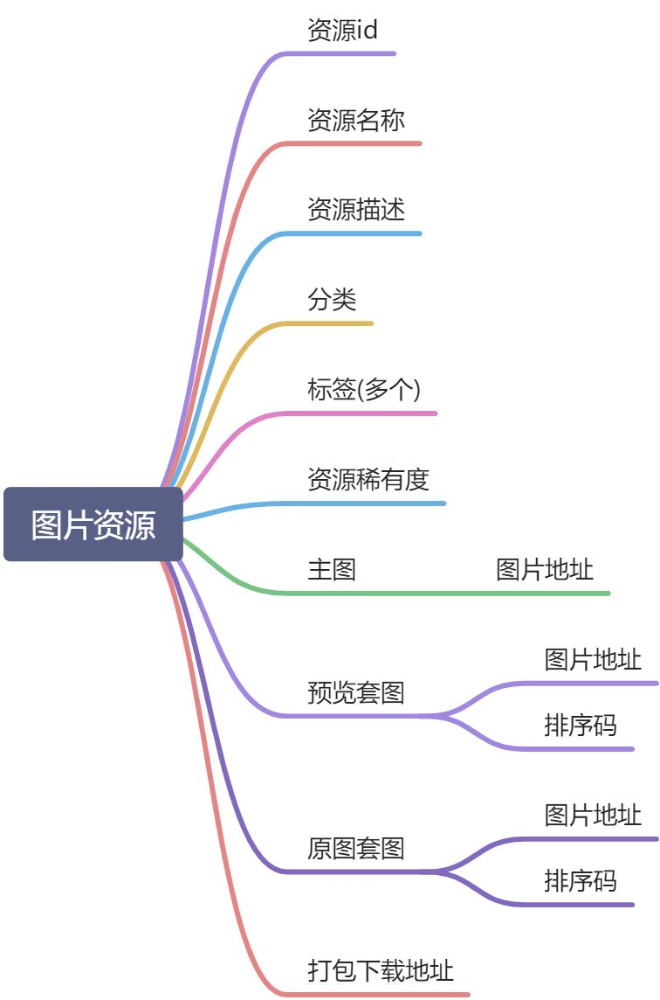
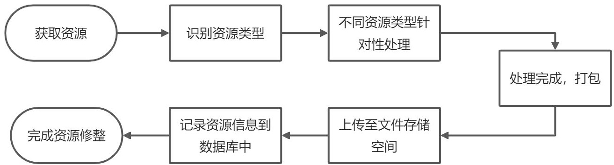
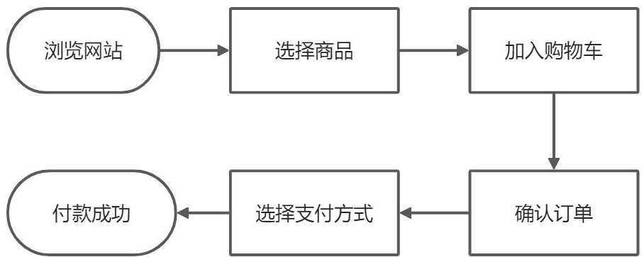

# yupan架构

## 1. 整体设计

## 2. 技术调研及储备
|  | Go | Java |
| --- | --- | --- |
| 爬虫框架 | Colly | WebMagic |
| 资源自动下载 | os/exec + aria2 | aria2-shell |
| 文件上传 | minio-go | minio Java SDK |
| 文件压缩打包 | archive/zip | hutool ZipUtil |
| 文件压缩打包加密 |  | zip4j |
| 图片去水印 |  | JavaCV |
| 图片加水印 |  | Hutool ImgUtil |
| 视频去广告 |  | JavaCV |
| 视频插入广告 |  | JavaCV |
| 电子书排版优化 |  | epublib(epub)
iText(pdf) |
| 电子书植入广告 |  | epublib(epub)
iText(pdf) |
| 支付 |  | IJPay |

文件存储服务：minio
数据存储：sqlite3，mysql，mongodb

由于Java强大的生态压制，最终还是选择Java作为开发语言。。。
## 3. 项目
项目地址：[https://github.com/yupaits/yupan](https://github.com/yupaits/yupan)
项目模块说明：

- crawler - 爬虫
- data - 数据存储
- storage - 文件存储
- cleaner - 数据清洗
- search - 资源搜索
- watcher - 敏感信息过滤
- jobs - 任务调度
- bbs - 论坛
- shop - 商城
- user - 用户体系
- vip - 会员体系
- pay - 支付
- business - 商务（广告，赞助商）

模块依赖关系：

[yupan模块依赖关系.xmind](https://www.yuque.com/attachments/yuque/0/2020/xmind/763022/1594656272428-ee2ef787-7e1b-47bc-a02a-fc394017d6c9.xmind)

## 4. 资源站点
| 站点名 | 资源类别 | 运营注意事项 |
| --- | --- | --- |
|  | 图片 |  |
|  | 小说 |  |
|  | 电影 |  |
|  | 动漫 |  |
|  | 音乐 |  |
|  | 你懂的。。。 |  |

## 5. 爬虫资源
### 5.1 图片
图片资源信息结构：

图片资源站点收集：

- [https://www.meizitu.com](https://www.meizitu.com/)
- [https://www.ugirls.fm](https://www.ugirls.fm/)
### 5.2 小说
### 5.3 电影
### 5.4 动漫
### 5.5 音乐
## 6. 数据清洗流程

不同类型资源针对性处理方式：

| 资源类型 | 处理方式 |
| --- | --- |
| 图片 | 套图分组->去水印->图片打水印（保留无水印）->广告图片植入（保留无广告） |
| 小说 | 排版优化->敏感词替换（保留未替换）->广告植入（保留无广告） |
| 电影 | 去水印广告处理->打水印（保留无水印）->广告植入（保留无广告） |
| 动漫 | 去水印->图片打水印（保留无水印）->广告页植入（保留无广告） |
| 音乐 | 音乐分组->无损音乐压缩打包 |

## 7. 敏感词收集

- [https://github.com/importcjj/sensitive](https://github.com/importcjj/sensitive)
- [https://github.com/elulis/sensitive-words](https://github.com/elulis/sensitive-words)
- [https://github.com/andyzty/sensitivewd-filter](https://github.com/andyzty/sensitivewd-filter)

## 8. 下单及支付流程

*虚拟商品无退款及售后流程。
*考虑到监管风险，需要思考如何安全地收取用户通过支付宝和微信支付方式支付的款项。

## 9. 付费模式和资源定价规则*
| 付费模式 | 适用资源稀有度 | 图片 | 小说 | 电影 | 动漫 | 音乐 |
| --- | --- | --- | --- | --- | --- | --- |
| 免费部分 | 非典藏 | 套图，5张以内免费可以看一张，超过5张可看10%；免费图片会按50%-80%压缩分辨率。 | 前n(1~3)章内容免费阅读，继续阅读需要付费。 | 前5分钟可免费观看，免费观看时会限制视频清晰度。 | 前n(1~3)集/章内容免费浏览，继续浏览需要付费。 | 截取10-30秒高潮部分免费收听，免费收听时会限制音质。 |
| 单资源单次价格 | 普通，稀有 | 基础定价规则：图片数量，图片清晰度，资源稀有度。 可以手动修改基于基础定价规则计算出的价格。 | 基础定价规则：小说字数，资源稀有度。 可以手动修改基于基础定价规则计算出的价格。 | 基础定价规则：资源稀有度。 可以手动修改基于基础定价规则计算出的价格。 | 基础定价规则：章节数量，资源稀有度。 可以手动修改基于基础定价规则计算出的价格。 | 基础定价规则：音质，资源稀有度。 可以手动修改基于基础定价规则计算出的价格。 |
| 多资源打包单次价格 | 普通，稀有 | 打包价 | 打包价 | 打包价 | 打包价 | 打包价 |
| 会员免费浏览 | 普通 | 会员免费 | 会员免费 | 会员免费 | 会员免费 | 会员免费 |
| 会员折扣价 | 稀有 | 按会员等级的折扣比率计算价格。 | 按会员等级的折扣比率计算价格。 | 按会员等级的折扣比率计算价格。 | 按会员等级的折扣比率计算价格。 | 按会员等级的折扣比率计算价格。 |
| 仅限单次查看，单次付费 | 典藏 | 一口价 | 一口价 | 一口价 | 一口价 | 一口价 |

## 10. 资源加密及二次处理设计*
资源加密：使用普通的zip/rar文件加密方式
图片资源自动打水印。
