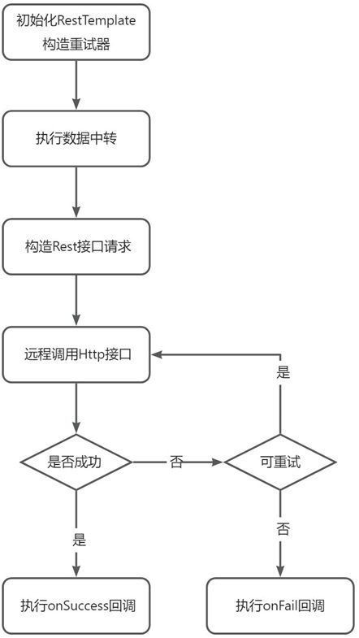
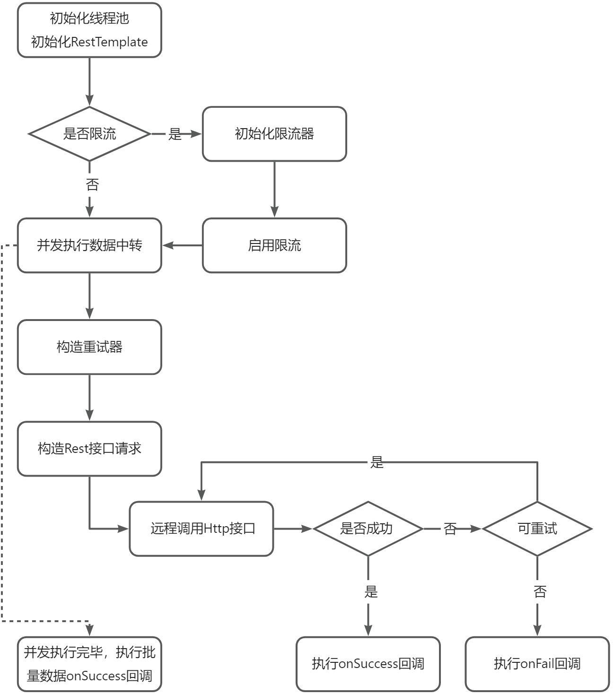

# yutool-exchange 数据中转

当业务的规模不断扩大，系统的边界也会随之扩大，久而久之，就需要与各种上下游系统、第三方系统进行对接。接收和下发数据的需求也会不断增多，当数量多到一定程度时，定制化的开发已经无法满足数据的对接效率要求，此时可以通过将常见的数据对接方式抽象为通用的业务组件，仅通过简单的配置和适配开发即可快速上线。
业务开发常见的数据对接方式有RESTful接口调用，消息队列两种。
下面整理出不同的对接方式需要提供的一些信息和配置。
## RESTful接口调用
### 共用配置

- http请求
   - 请求方式
   - 请求地址
   - query参数
   - body参数
   - header参数
   - 授权信息
      - Basic Auth
      - Bearer Token
   - cookies参数
- 并发
   - 线程池
      - corePoolSize 核心数
      - maxPoolSize 最大线程数
      - queueSize 阻塞队列大小
      - keepAliveTime 多余空闲线程存活时长
      - blockingQueueType 阻塞队列类型
      - rejectedPolicy 拒绝策略
   - 限流
      - 限流速率
- 重试
   - 重试触发条件
   - 停止重试策略
   - 等待时长策略
   - 执行时长限制
- 记录
   - 配置修改记录
   - 请求日志（通过关联接口表或日志表记录业务数据）
   - 接口调用统计监控
### 接收数据

- 调用接口获取数据
- 数据存储至接口表
- 执行后续业务逻辑
### 发送数据

- 构建发送数据
- 调用接口发送数据
- 数据存储至日志表
- 执行后续业务逻辑
## 消息队列
### 共用配置

- 消息队列服务端配置
### 消费数据
##### 相关配置

- 消息消费者配置
- 并发数
- 批量消费
   - 是否启用
   - 单批数量
##### 消费流程

- 消息监听器接收消息
- 消息存储至接口表
- 执行后续业务逻辑
### 生产数据
##### 相关配置

- 消息生产者配置
- 消息发送重试
   - 重试次数
   - 重试等待时长
##### 生产流程

- 构建消息内容
- 发送消息
- 消息存储至日志表
- 执行后续业务逻辑
## 实体定义
### RESTful数据中转配置 RestApiExchange
| **字段名** | **字段说明** |
| --- | --- |
| id |  |
| name | 接口标识 |
| label | 接口标签 |
| exchangeType | 中转类型：   - 接收   - 发送 |
| groupId | 数据中转分组ID |
| httpUrl | Http请求地址 |
| httpMothod | Http请求方式 |
| httpReqParams | Http请求参数信息（包括headers、cookies） |
| reqConnectTimeout | 请求连接超时时长（单位毫秒） |
| reqReadTimeout | 请求处理超时时长（单位毫秒） |
| reqCorePoolSize | 请求线程池核心数 |
| reqMaxPoolSize | 请求线程池最大线程数 |
| reqQueueSize | 请求线程池阻塞队列大小 |
| reqKeepAliveTime | 请求线程池多余线程存活时长（单位毫秒） |
| reqBlockingQueueType | 请求线程池阻塞队列类型：   - ArrayBlockingQueue   - LinkedBlockingQueue   - PriorityBlockingQueue   - DelayQueue   - SynchronousQueue   - LinkedTransferQueue   - LinkedBlockingDeque    |
| reqRejectedPolicy | 请求线程池拒绝策略：   - AbortPolicy   - DiscardPolicy   - DiscardOldestPolicy   - CallerRunsPolicy    |
| reqRateLimit | 请求限流速率（设置为负数或者0，不限流） |
| retryIfExp | 请求抛出异常是否触发重试 |
| retryExpType | 可触发重试的异常类型，（配合retryIfExp使用）：   - Exception（默认）   - RuntimeException   - 其它异常类型（类路径，用于Class.forName）    |
| retryCustomTrigger | 使用自定义触发条件 |
| retryStopStrategy | 重试停止策略：   - neverStop（不停止）   - stopAfterAttempt（超过最大尝试次数停止）   - stopAfterDelay（第一次尝试开始超过时长后停止）    |
| retryAttemptTimes | 重试最大次数（配合retryStopStrategy=stopAfterAttempt使用） |
| retryAttemptDelay | 延迟时长（配合retryStopStrategy=stopAfterDelay使用，单位毫秒） |
| retryWaitStrategy | 重试等待策略：   - noWait（不等待）   - fixedWait（固定等待时长）   - randomWait（随机等待时长）   - incrementingWait（递增等待时长）   - exponentialWait（指数等待时长）   - fibonacciWait（斐波那契数列等待时长）   - ~~exceptionWait（按异常类型设置等待时长）~~    |
| retryWaitFixedTime | 固定等待时长（配合retryWaitStrategy=fixedWait使用，单位毫秒） |
| retryWaitRandomMinTime | 随机等待时长下限（配合retryWaitStrategy=randomWait使用，单位毫秒，默认0） |
| retryWaitRandomMaxTime | 随机等待时长上限（配合retryWaitStrategy=randomWait使用，单位毫秒） |
| retryWaitInitialSleepTime | 递增初始等待时长（配合retryWaitStrategy=incrementingWait使用，单位毫秒） |
| retryWaitIncrementTime | 递增时长（配合retryWaitStrategy=incrementingWait使用，单位毫秒） |
| retryWaitExponentialMultiplier | 指数等待初始乘数（配合retryWaitStrategy=exponentialWait使用） |
| retryWaitExponentialMaxTime | 指数等待最大等待时长（配合retryWaitStrategy=exponentialWait使用） |
| retryWaitExponentialTimeUnit | 指数等待时间单位（配合retryWaitStrategy=exponentialWait使用） |
| retryWaitFibonacciWaitMultiplier | 斐波那契初始等待时长（配合retryWaitStrategy=fibonacciWait使用，单位毫秒） |
| retryWaitFibonacciMaxTime | 斐波那契等待最大等待时长（配合retryWaitStrategy=fibonacciWait使用，单位毫秒） |
| retryTimeLimitEnabled | 启用执行时长限制 |
| retryFixedTimeLimit | 限制最大执行时长为固定值（配合retryTimeLimitEnabled=true使用，单位毫秒） |
| retryLoggable | 是否记录重试日志（用于监控） |

### 消息队列数据中转配置 MqExchange
| **字段名** | **字段说明** |
| --- | --- |
| id |  |
| name | 消息队列标识 |
| label | 消息队列标签 |
| exchangeType | 中转类型：   - 接收   - 发送    |
| groupId | 数据中转分组ID |
| serverProps | 消息队列服务端配置 |
| producerProps | 生产者配置 |
| produceRetryEnabled | 消息发送启用重试 |
| produceRetryAttemptTimes | 消息发送重试最大次数 |
| produceRetryWaitFixedTime | 消息发送重试固定等待时长（单位毫秒） |
| produceRetryLoggable | 消息发送是否记录重试日志 |
| consumerProps | 消费者配置 |
| consumeThreadCount | 消费并发数 |
| consumeBatchEnabled | 是否启用批量消费 |
| consumeBatchSize | 消费单批数量 |

### 数据中转分组 ExchangeGroup
| **字段名** | **字段说明** |
| --- | --- |
| id |  |
| name | 分组标识 |
| label | 分组标签 |
| description | 分组描述 |
| remark | 分组备注 |

### 实体外键

`ExchangeGroup.id` 1---N `RestApiProps.groupId`

`ExchangeGroup.id` 1---N `MqProps.groupId`

## 数据中转流程
### Rest接口

**扩展点：**

- 初始化RestTemplate
- 构造重试器
- 自定义重试断言
- 数据中转过程
- 构造Rest接口请求
- 回调
   - onSuccess回调
      - 中转数据记录
      - 中转完成后续处理
   - onFail回调
### Rest接口批量

**扩展点：**

- 初始化线程池
- 初始化RestTemplate
- 初始化限流器
- 构造重试器
- 自定义重试断言
- 数据中转过程
- 构造Rest接口请求
- 回调
   - onSuccess回调
      - 中转数据记录
      - 中转完成后续处理
   - onFail回调
   - 执行完毕，批量数据onSuccess回调
### 消息队列
**扩展点：**

- 发送/接收，消息处理
- 回调
   - onSuccess回调
      - 中转数据记录
      - 中转完成后续处理
   - onFail回调
### 消息队列批量消费
**扩展点：**

- 初始化线程池
- 消费批量消息
- 回调
   - 批量消息onSuccess
      - 中转数据记录
      - 中转完成后续处理
   - 批量消息onFail
   - 单条消息onSucess
      - 中转数据记录
      - 中转完成后续处理
   - 单条消息onFail
