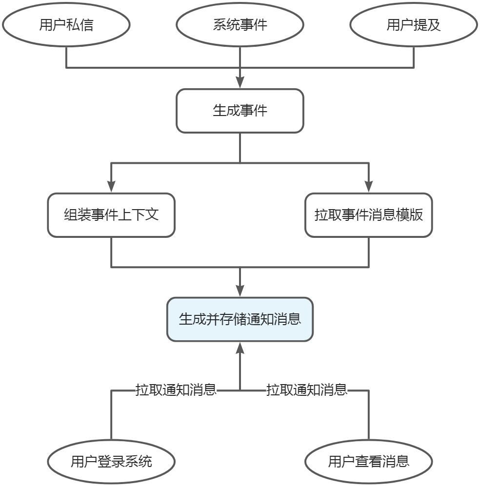

# yutool-notify 通知消息

站内通知消息也是大部分管理系统的必备功能，一般来说消息类型分为三类：私信、通知、提及。

- 私信是站内用户间的一对一通信，由用户主动发起，通信内容仅收发双方可见。
- 通知是在触发特定事件后，由系统自动向影响范围内的组织或者用户推送事件消息，这里影响范围一般指特定主体的关注者或订阅用户。
- 提及一般用于评论区或者群内消息，由用户手动输入`@目标用户`格式的文本后向目标用户推送消息。

消息还有一个重要特点是未读、已读状态（类似于邮件），用户可以手动切换消息的已读状态。未读状态消息点击之后会自动变更为已读状态。
消息可以根据实际的业务类别进行分类，例如：账户消息、订单消息、产品消息等。
## 实体字段
### 消息 Notice
| **字段名** | **字段说明** |
| --- | --- |
| id |  |
| senderType | 消息发送者类型（用户、组织……） |
| senderId | 消息发送者标识 |
| receiverType | 消息接受者类型（用户、组织、分组） |
| receiverId | 消息接收者标识 |
| noticeType | 消息类型 |
| noticeCate | 消息分类 |
| noticeSubCate | 消息子分类 |
| title | 消息标题 |
| content | 消息正文 |
| rtx | 富文本格式标识 |
| publishChannels | 推送渠道（多个以逗号分隔） |

### 消息已读记录 NoticeRead
| **字段名** | **字段说明** |
| --- | --- |
| id |  |
| noticeId | 消息ID |
| userId | 用户ID |
| read | 已读标记 |
| firstReadTime | 首次查阅时间 |
| lastReadTime | 最近一次查阅时间 |

### 消息分类 NoticeCate
| **字段名** | **字段说明** |
| --- | --- |
| id |  |
| parent_id | 上级分类ID |
| level | 分类层级 |
| code | 分类编码 |
| name | 分类名称 |
| description | 分类简介 |
| remark | 分类备注 |
| enable | 是否启用 |

### 消息模板 NoticeTemplate
| **字段名** | **字段说明** |
| --- | --- |
| id |  |
| title | 模板标题 |
| templateContent | 模板内容 |
| senderType | 消息发送者类型（用户、组织……） |
| receiverType | 消息接受者类型（用户、组织、分组） |
| noticeType | 消息类型 |
| noticeCate | 消息分类 |
| noticeSubCate | 消息子分类 |
| publishChannel | 推送渠道 |
| enable | 是否启用 |

### 全局消息推送配置 NoticePushGlobalProps
| **字段名** | **字段说明** |
| --- | --- |
| id |  |
| noticeType | 消息类型 |
| noticeCate | 系统消息分类 |
| noticeSubCate | 系统消息子分类 |
| publishChannels | 推送渠道（多个以逗号分隔） |

### 组织消息推送定制配置 NoticePushOrgProps
| **字段名** | **字段说明** |
| --- | --- |
| id |  |
| noticeType | 消息类型 |
| noticeCate | 系统消息分类 |
| noticeSubCate | 系统消息子分类 |
| orgId | 组织ID |
| orgReceiverScope | 组织内消息接收者范围 |
| publishChannels | 推送渠道（多个以逗号分隔） |

### 消息订阅配置 NoticeSubscribeProps
| **字段名** | **字段说明** |
| --- | --- |
| id |  |
| noticeType | 消息类型 |
| noticeCate | 消息分类 |
| noticeSubCate | 消息子分类 |
| userId | 用户ID |
| publishChannels | 推送渠道（多个以逗号分隔） |

## 实体外键

`Notice.id` 1---N `NoticeRead.noticeId`

`User.id` 1---N `NoticeRead.userId`

## 通知消息推送流程

如果想要实现通知消息生成存储之后实时通知用户，则可以通过消息推送的“推”模式或者“拉”模式来实现。
“推”模式是在客户端和服务端建立socket通信，服务端生成消息后即时发送socket消息，客户端接收后更新消息。
“拉”模式是客户端通过轮询的方式调用获取通知消息接口，以固定频率更新消息。
## 通知类型消息
用户私信和用户提及的场景，消息的收发方都是明确的。而通知类型消息则需要通过配置特定事件的影响范围才能确定消息接收方具体是哪些用户。
所谓“特定事件”，在系统内可以通过`消息分类+消息子分类`来进行标识，而消息的接收方范围（是组织还是用户）则可以由`特定事件+消息接收方类型`（也即`消息分类+消息子分类+消息接收方类型`）来确定。用户被动接收的消息是通过系统管理员来进行全局统一配置，或者是由组织管理员制定个性化的接收方式（如指定部分组织成员接收消息，消息接收渠道），组织的个性化配置优先级高于全局统一配置。而组织或用户主动订阅的消息则需要用户自身对“特定事件”消息的推送渠道进行个性化配置。
事件消息模板一般由系统管理员统一配置，对不同**消息发送者类型**、**消息接收者类型**、**消息类型**、**消息分类**、**消息子分类、推送渠道**的定制不同的模板。在模板中，不同的**消息发送者类型**、**消息接收者类型**、**消息类型**、**消息分类**、**消息子分类**可使用的模板变量也会不一样，当变量不可用时，根据模板生成消息就会失败或者时生成的内容不正确。
而消息的推送/接收渠道则一般分为：站内信、邮件、短信、IM消息、手机APP通知、消息队列、电话语音播报等。视系统实际接入的渠道种类情况而定。
