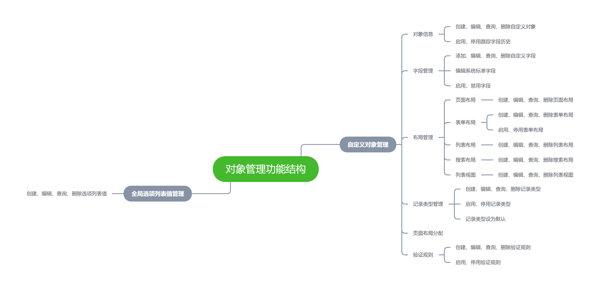
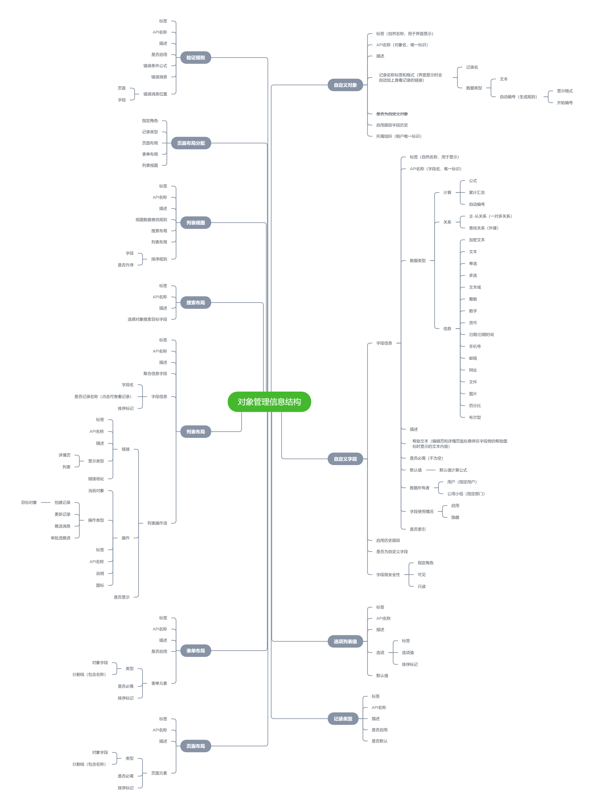

# 元数据自定义对象管理设计

## 功能结构

## 信息结构

## 详细功能需求
**说明**：文档中的“标签”指的是自然名称，用于界面显示。“API名称”指的是唯一标识，用于逻辑区分。
### 对象信息
#### 业务场景
管理员可以创建、编辑自定义对象的基本信息，可以设置是否启用跟踪字段历史功能，删除创建的自定义对象。
#### 业务规则
自定义对象内置了以下字段：

- 创建人 created_by
- 创建时间 created_time
- 最近修改人 last_modified_by
- 最近修改时间 last_modified_time
- 名称 name

编辑自定义对象需要输入以下内容：

- 标签（必填）
- API名称（必填）
- 描述
- 记录名称标签和格式（必填） 
   - 记录名（必填）
   - 数据类型（必填，单选，可选项：文本，自动编号）
- 是否启用跟踪字段历史（默认不启用）

记录名称格式数据类型为自动编号时，还需要设置编号的显示格式和开始编号。记录名称标签和格式会自动关联上自定义对象内置的name字段，这里设置标签和格式其实就是在设置name字段的标签和默认值生成策略。name字段可以在页面中被点击，点击后跳转至或者展开记录详情。
启用跟踪字段历史之后，会开启当前对象的字段审计记录功能。

---

### 字段管理
#### 业务场景
管理员可以对自定义对象的字段进行管理，包括添加、编辑、查询、删除自定义字段，编辑系统标准字段，启用、禁用字段（包括系统标准字段和自定义字段），设置字段级安全性，设置启用历史跟踪的字段。
#### 业务规则
自定义对象的字段分为系统标准字段和自定义字段，根据是否为自定义字段标记进行区分。
编辑自定义字段需要输入以下内容：

- 标签（必填）
- API名称（必填）
- 数据类型（必填）
- 描述
- 帮助文本
- 是否必需（默认非必需）
- 默认值（默认值计算公式）
- 数据所有者（单选，可选项：用户，部门。默认留空，不做限制）
- 字段使用情况（可选项：启用，隐藏。默认启用）
- 是否索引（默认不索引）

设置字段级安全性
指定目标角色，设定字段对于该角色是否**可见**和是否**只读**。设置字段只读时，无法对字段内容进行修改。
设置自定义对象启用历史跟踪的字段
选择自定义对象中需要启用历史跟踪的字段。启用历史跟踪之后，无论何时用户修改字段，旧字段值、新字段值、更新时间、修改字段用户都会被记录下来。**多选**和**文本域**类型的字段无法进行历史跟踪记录。

---

### 页面布局
#### 业务场景
管理员可以对自定义对象的页面布局进行管理，系统会自动生成一个包括了自定义对象所有字段的默认页面布局，默认页面布局无法删除但可以进行编辑。
管理员可以创建、编辑、查询、删除非默认页面布局。
#### 业务规则
编辑页面布局需要输入以下内容：

- 标签（必填）
- API名称（必填）
- 描述
- 页面元素列表 
   - 元素类型（必填，单选，可选项：对象字段，分割线）
   - 是否必需
   - 排序码（拖动排序时系统自动更新排序码）

页面元素类型为分割线时，可以设置分割线名称。
页面元素是否必需默认与关联的对象字段中是否必需的定义保持一致。当对象中该字段为必需时，则无法修改页面元素为非必需；而当对象中该字段为非必需时，则可以设置对应的页面元素必需或者非必需。

---

### 表单布局
#### 业务场景
管理员未启用自定义对象的表单布局功能时，该自定义对象的表单布局显示时使用的是默认页面布局的配置。而当管理员启用表单布局功能之后，系统会自动生成一个包括了自定义对象中除内置字段外所有字段的默认表单布局，默认表单布局无法删除但可以进行编辑。
管理员可以创建、编辑、查询、删除非默认表单布局。
#### 业务规则
编辑表单布局需要输入以下内容：

- 标签（必填）
- API名称（必填）
- 描述
- 页面元素列表 
   - 元素类型（必填，单选，可选项：对象字段，分割线）
   - 是否必需
   - 排序码（拖动排序时自动更新）

页面元素类型为分割线时，可以设置分割线名称。
页面元素是否必需默认与关联的对象字段中是否必需的定义保持一致。当对象中该字段为必需时，则无法修改页面元素为非必需；而当对象中该字段为非必需时，则可以设置对应的页面元素必需或者非必需。

---

### 列表布局
#### 业务场景
管理员可以对自定义对象的页面布局进行管理，系统会自动生成一个包括了自定义对象中除内置字段外所有字段的默认列表布局，默认列表布局无法删除但可以编辑。
管理员可以创建、编辑、查询、删除非默认列表布局。
#### 业务规则
编辑列表布局需要输入以下内容：

- 标签（必填）
- API名称（必填）
- 描述
- 聚合信息 
- 标签（必填）
- API名称（必填） 
- 对象字段（必填，可以是关联关系字段）
- 聚合方式（必填，单选，可选项：SUM-求和，COUNT-计数，AVERAGE-求平均值，MAX-最大值，MIN-最小值）
- 列表字段 
- 对象字段
- 排序码（拖动排序时自动更新）
- 列表操作项 
   - 类型（必填，可选项：链接，操作按钮）
   - 位置（必填，可选项：表头操作区，列表操作列）
   - 标签（必填）
   - API名称（必填）
   - 描述
   - 操作项是否显示
   - 显示类型（多选，可选项：详情页，列表）
   - 链接地址（操作项类型为链接时显示）
   - 按钮图标（操作项类型为操作按钮时显示）
   - 按钮触发事件（操作项类型为操作按钮时显示）

按钮触发事件有以下几种：

- 创建记录（需要选择目标对象，创建时通过对象字段的默认值规则自动生成内容）
- 更新记录（需要选择待更新目标对象和更新字段）
- 推送消息（指定消息模板和推送方式）
- 审批流推进（指定审批流程并进行推进）

---

### 搜索布局
#### 业务场景
管理员可以对自定义对象的搜索布局进行管理，包括创建、编辑、查询、删除搜索布局。
#### 业务规则
编辑搜索布局需要输入以下内容：

- 标签（必填）
- API名称（必填）
- 描述
- 搜索字段列表 
   - 对象字段
   - 排序码（拖动排序时自动更新）

---

### 列表视图
#### 业务场景
管理员可以对自定义对象的列表列表视图进行管理，系统会自动生成一个自定义对象的默认列表视图，默认列表视图无法删除但可以编辑。
管理员可以创建、编辑、查询、删除列表视图。
#### 业务规则
编辑列表视图需要输入以下内容：

- 标签（必填）
- API名称（必填）
- 描述
- 视图数据查找规则
- 关联的搜索布局（必填）
- 关联的列表布局（必填）
- 列表数据排序规则

视图数据查找规则指的是查询视图中的列表数据时强制添加的数据过滤条件。

---

### 记录类型管理
#### 业务场景
管理员可以对自定义对象的记录类型进行管理，系统会自动生成一个默认的记录类型，默认记录类型无法删除但可以编辑。
管理员可以创建、编辑、查询、删除记录类型，启用、停用非默认的记录类型。
#### 业务规则
编辑记录类型需要输入以下内容：

- 标签（必填）
- API名称（必填）
- 描述
- 是否启用（默认启用）

---

### 页面布局分配
#### 业务场景
管理员可以根据记录类型向指定的角色分配页面布局、表单布局和列表视图。默认情况下，系统会自动向所有角色、所有记录类型分配自定义对象的默认页面布局、默认表单布局、默认列表视图。
#### 业务规则
在进行页面布局分配时，需要先确定待分配的记录类型和指定角色，随后向指定角色和记录类型依次分配页面布局、表单布局和列表视图。

---

### 验证规则
#### 业务场景
管理员可以对自定义对象的验证规则进行管理，包括创建、编辑、查询、删除验证规则。
验证规则主要用于对象数据保存或更新时对数据的正确性、有效性进行验证，常见的验证规则有校验规则和去重规则。
#### 业务规则
编辑验证规则需要输入以下内容：

- 标签（必填)
- API名称（必填）
- 描述
- 是否启用（默认启用）
- 错误条件公式
- 错误小时
- 错误消息显示位置（必填，单选，可选项：页首，字段）
- 排序码（优先级，拖动排序时自动更新）

存在多条验证规则时使用责任链模式进行验证。

---

### 选项列表值管理
#### 业务场景
全局选项列表值可供所有自定义对象中的单选或者多选类型的自定义字段引用。
管理员可以对全局选项列表值进行管理，包括创建、编辑、查询、删除选项列表值。
#### 业务规则
编辑选项列表值需要输入以下内容：

- 标签（必填）
- API名称（必填)
- 描述
- 是否启用（默认启用）
- 选项 
   - 标签（必填）
   - 选项值（必填）
   - 排序码（拖动排序时自动更新）
- 默认值

默认值可以是多个选项值的集合，当自定义字段类型为单选时，字段默认值为选项列表默认值的第一个。
