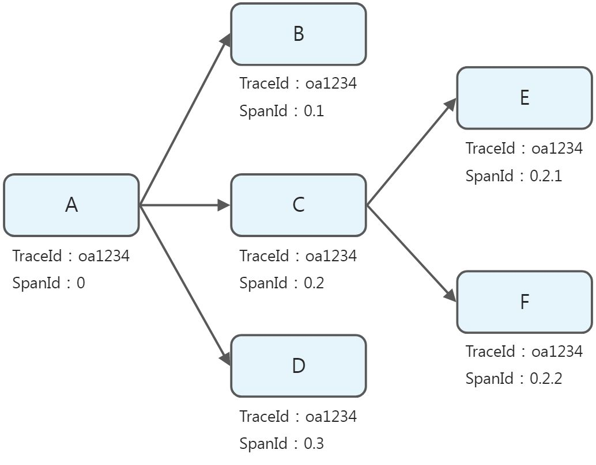

# trace-analysis链路追踪插件

## 快速上手
### 1. Maven依赖
在项目的 `pom.xml` 中添加以下依赖：
```xml
<parent>
    <groupId>com.yupaits</groupId>
    <artifactId>yutool-parent</artifactId>
    <version>${yutool.version}</version>
    <relativePath/>
</parent>

<dependencies>
    <dependency>
        <groupId>com.yupaits</groupId>
        <artifactId>trace-analysis</artifactId>
    </dependency>
</dependencies>
```
### 2. 配置类
在项目中的`FeignConfig`配置类中使用`@EnableFeignClients`即可自动注入`TraceFeignInterceptor`：
```java
@EnableFeignClients
@Configuration
public class FeignConfig {

}
```
在项目的`WebMvcConfig`配置类中添加`TraceInterceptor`拦截器：
```java
@Configuration
public class WebMvcConfig extends WebMvcConfigurationSupport {

    @Override
    protected void addInterceptors(InterceptorRegistry registry) {
        registry.addInterceptor(new TraceInterceptor()).order(Ordered.HIGHEST_PRECEDENCE);
    }
}
```
## 设计思路
参考开源日志框架[TLog](https://tlog.yomahub.com/)的设计实现，在一条调用链上，前置节点生成并传递`TraceId`和`SpanId`到后置节点，通过在日志中打印`TraceId`和`SpanId`标识一条完整的调用链信息。

附：`SpanId`生成规则

