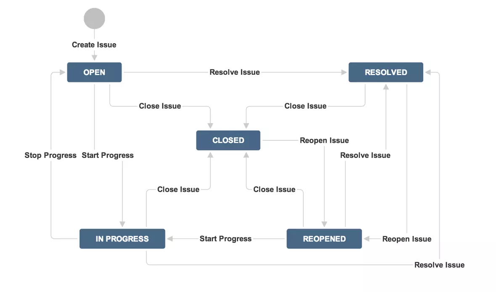

# Jira基本概念

## Project（项目）
Jira中的项目是一组问题单（issue）的集合，项目可以根据组织需求来定义，例如：软件研发项目，市场营销活动，服务台（helpdesk）系统，一个请假管理系统等等。每一个问题单属于一个项目。每个项目需要有一个名称（例如：Website Issues）和关键字（Key，例如WEB）。项目的关键字会成为项目问题单前缀，例如WEB-101，WEB-102等等。
### 组件是什么（component）
组件时项目中的问题单的一种逻辑分组。一个项目根据组织的需要可能会包括多种组件。 举例而言，一个软件开发项目可以包括如下组件：文档，后端，邮件子系统，界面。一个网站系统可能包括产品，联系方式等组件。在一个项目中，一个问题单可以归属于0到多个组件。 在Jira较新的版本中，组件被更名为模块。
### 版本是什么（version）
对于一些类型的项目，尤其是软件研发项目，把一个问题单关联到一个特定的项目版本（例如：1.0beta，1.0，1.2，2.0）会非常有用。 问题单（Issues）有两个跟版本有关的字段：

- 影响版本（Affects Version(s)）：这个是要说明受问题单影响的版本。举例而言，一个软件Bug可能影响1.1和1.2版本。
- 修复版本（Fix Version(s)）：这个是为了标明这个问题单在哪一个版本中被修复。继续上例，Bug的影响版本号是1.1和1.2，但是可能会在版本2.0中才被修复。没有修复版本号的问题单会被归类为未规划（Unscheduled）。

版本可以是下面三种状态之一：发布（Released），未发布（Unreleased）和归档（Archived）。版本会有一个发布日期，并且如果在发布日期之后还没有按时发布，这个状态会自动变为国企状态（overdue）。
## Workflow（工作流）
Jira中的工作流由一系列的状态（statuses）和变迁（transitions）构成，一个问题单在其生命周期中会经过这些状态和变迁。下图为例： 
## Issue（问题单）
Jira的问题单非常灵活，页面可以定制，字段也可以定义。这里介绍一些内置的基本概念。
### Issue Type（问题单类型）
Jira可以用来跟踪不同类型的问题单。默认类型如下，Jira的系统管理员也可能会定制这些类型。

- Bug：故障，功能失效
- Improvement：提升，既有功能增强
- New Feature：新功能
- Task：任务
- Custom Issue：根据需要客户化定制
### Priority（优先级）
优先级也可以自定义，系统默认优先级如下：

- Highest：最高级别，表明问题阻塞了业务流程正常进行
- High：高级，表明问题引发明显故障，需要紧急关注
- Medium：中级，表明问题有一个明显的影响
- Low：低级，表明问题有一个轻微的影响
- Lowest：最低级
### Status（状态）
每一个问题单都会有一个当前的状态。一个问题单开始阶段可能是Open状态，然后可以转移到Resolved或者Closed，依赖于系统流程配置的方式。内置的常见状态如下：

- Open：打开状态，表明问题单已经被创建，等待被分配到开始处理状态。
- In Progress：处理中状态，表明问题已经被分配人激活，并处于被处理状态中。
- Resolved：已解决状态，表明问题已经被处理完成，等待问题报告人的验证。从这个状态，问题单一般可以进一步变更为重新打开状态（Reopened）或关闭状态（Closed）。
- Reopened：重新打开状态，问题经过验证发现没有被解决，就可以变更到这个状态。
- Closed：关闭状态，问题被彻底解决就可以转为这个状态。
### Resolution（解决结果）
一个问题可以有多种解决结果，其中只有一种方法是修复。一个解决结果通常会砸状态变更时候被设置起来。系统默认的问题解决结果会有以下几种：

- Fixed：修复。
- Won't Fix：不用修复。例如这个问题所描述的现象已不再有影响了。
- Duplicate：重复。同其它已经存在的问题重复了，推荐把相关的单子链接起来。
- Incomplete：未完成。没有足够的信息继续完成这个问题。
- Cannot Reproduce：不能重现。如果以后有更多信息可以继续可以重新打开这张单子。
- Won't Do：不做。类似于不用修复的方案，适用于软件项目的默认状态。
