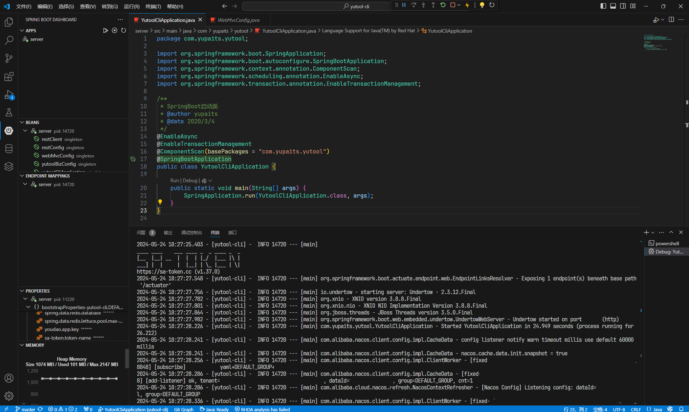
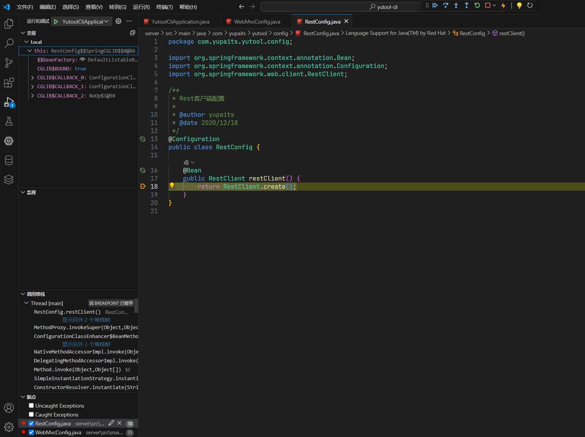

# VSCode搭建SpringBoot项目开发运行环境

JetBrains的IDEA作为当前最受Java开发者青睐的开发工具之一，确实拥有着卓越的开发体验，但是随着天气逐渐炎热，每当使用IDEA进行编码或者运行项目的时候，CPU和硬盘的温度就会飙升，让人无法忍受。

随着VS Code的不断优化和发展，让Java开发者在开发工具上有了更多的选择，本文就介绍了如何使用VS Code搭建Spring Boot项目的开发运行环境。

## VS Code插件安装

在VS Code的扩展中搜索并安装以下两个插件：

1. Extension Pack for Java
  
    

    该插件是一个集合包，会将以下6个插件打包进行安装：

    - Language Support for Java(TM) by Red Hat
    - Debugger for Java
    - Test Runner for Java
    - Maven for Java
    - Project Manager for Java
    - IntelliCode


2. Spring Boot Extension Pack

    

    该插件同样也是一个集合包，会打包安装以下3个插件：

    - Spring Boot Tools
    - Spring Initializr Java Support
    - Spring Boot Dashboard

如果碰到安装卡住的情况，可以进入对应插件在扩展市场的web页面，然后在Version History（版本历史）选项卡下选择并下载`.vsix`格式的插件打包文件，接着在VS Code中使用`Ctrl + Shift + P`组合键打开命令框，输入`install from vsix`后选择下载的`.vsix`文件安装即可。

## 环境配置

插件安装完成后，进入VS Code的设置页面，点击右上角的`打开设置(json)`按钮，输入以下配置项：

```json
{
  "maven.terminal.useJavaHome": true,
  "maven.executable.path": "D:\\apache-maven-3.9.6\\bin\\mvn",
  "maven.settingsFile": "D:\\apache-maven-3.9.6\\conf\\settings.xml",
  "redhat.telemetry.enabled": true,
  "java.configuration.maven.userSettings": "D:\\apache-maven-3.9.6\\conf\\settings.xml",
  "java.configuration.maven.globalSettings": "D:\\apache-maven-3.9.6\\conf\\settings.xml",
  "java.jdt.ls.java.home": "D:\\Java\\jdk-17",
}
```

具体的JDK所在目录和Maven所在目录填写实际路径即可，以上只是示例。

## 启动项目

使用VS Code打开Spring Boot项目目录，等待`Spring Boot Dashboard`完成项目扫描之后，进入到`Application`类，选择Run（运行）或者Debug（调试）即可启动项目。


图中的两个位置都可以点击启动。启动后，控制台会打印日志信息。



## 断点调试示例

使用Debug（调试）模式启动项目后，可以使用VS Code自带的**运行和调试**功能在打断点进行代码调试。

