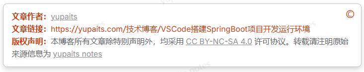
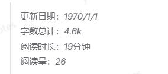
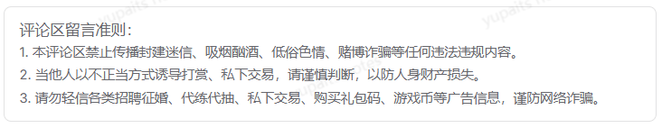
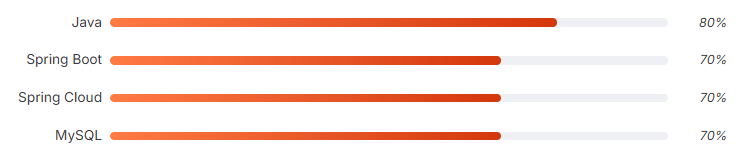
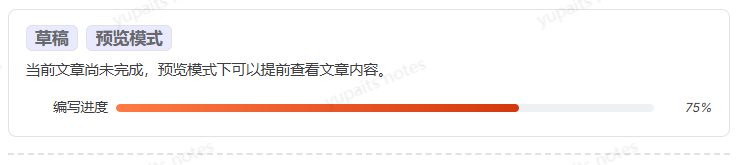
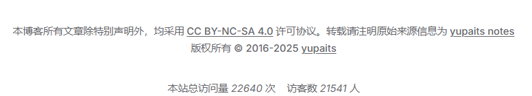
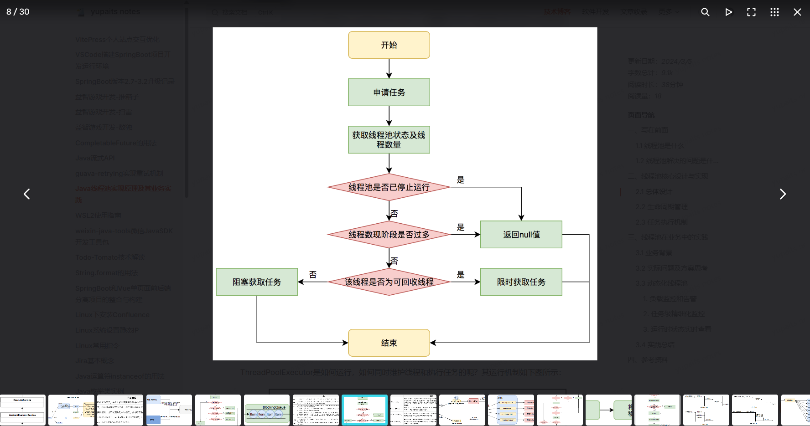

# VitePress个人站点交互优化

VitePress是一个[静态站点生成器](https://en.wikipedia.org/wiki/Static_site_generator)(SSG)，专为构建快速、以内容为中心的站点而设计。

VitePress附带一个专为技术文档设计的默认主题，使用默认主题搭建博客网站确实会缺失常见的分类、标签、归档等功能，但由于VitePress支持[完全的自定义主题](https://vitepress.dev/zh/guide/custom-theme)，弥补了这方面的缺陷。

目前已经有很多适配了VitePress的第三方开源主题，各位站长可根据网站的用途和特点，按需搜索使用。笔者搭建的站点主要用于记录和总结，使用VitePress默认主题搭配一些优化交互体验的方法也能获得较好的阅读感受。

本文从样式美化、组件开发和第三方插件的使用，三个方面对交互优化的具体方式进行说明。文中给出的代码示例是满足功能实现的最精简代码，多个功能一起使用需要进行代码拼装。

## 准备工作

### 自定义主题

参照VitePress的[自定义主题](https://vitepress.dev/zh/guide/custom-theme)和[扩展默认主题](https://vitepress.dev/zh/guide/extending-default-theme)，添加主题入口文件`.vitepress/theme/index.js`和包装组件`.vitepress/theme/MyLayout.vue`。

创建自定义主题样式的css文件`.vitepress/theme/style/var.css`。

::: code-group
```js [.vitepress/theme/index.js]
import DefaultTheme from 'vitepress/theme'
import MyLayout from './MyLayout.vue'

import './style/var.css'

export default {
  extends: DefaultTheme,
  Layout: MyLayout,
}
```

```vue [.vitepress/theme/MyLayout.vue]
<template>
  <div>

  </div>
</template>
```
:::

### 引入Element Plus组件

[Element Plus](https://element-plus.org/zh-CN/)是一款基于Vue3的组件库，库中包含的组件设计优秀，稳定可靠。通过以下方式可引入Element Plus。

安装依赖：

```shell
pnpm add -D element-plus unplugin-auto-import unplugin-vue-components
```

::: code-group
```js [.vitepress/config.mjs]
import { defineConfig } from 'vitepress'
import AutoImport from 'unplugin-auto-import/vite'
import Components from 'unplugin-vue-components/vite'
import { ElementPlusResolver } from 'unplugin-vue-components/resolvers'

export default defineConfig({
  vite: {
    plugins: [
      AutoImport({
        resolvers: [ElementPlusResolver()]
      }),
      Components({
        resolvers: [ElementPlusResolver()]
      })
    ]
  }
})
```

```js{4} [.vitepress/theme/index.js]
import DefaultTheme from 'vitepress/theme'
import MyLayout from './MyLayout.vue'

import 'element-plus/dist/index.css' // [!code focus]
import './style/var.css'

export default {
  extends: DefaultTheme,
  Layout: MyLayout,
}
```
:::

## 样式美化

### 基础样式调整

::: code-group
```css [.vitepress/theme/style/var.css]
/* 正文链接 */
.vp-doc a {
  text-decoration: none;
  padding: 0 4px;
}

/* 图片居中显示 */
img:not(.VPImage) {
  text-align: center;
  margin: 0 auto;
}
```
:::

### 切换深色/浅色主题过渡动画

::: code-group
```vue [.vitepress/theme/MyLayout.vue]
<template>
  <div>

  </div>
</template>

<script setup>
import { nextTick, provide } from 'vue'
import { useData } from 'vitepress'
const { isDark } = useData()

// 启用深色/浅色主题切换动画
const enableTransitions = () =>
  'startViewTransition' in document &&
  window.matchMedia('(prefers-reduced-motion: no-preference)').matches

// 深色/浅色主题切换动画
provide('toggle-appearance', async ({ x, y }) => {
  if (!enableTransitions()) {
    isDark.value = !isDark.value
    return
  }

  const clipPath = [
    `circle(0px at ${x}px ${y}px)`,
    `circle(${Math.hypot(
      Math.max(x, innerWidth - x),
      Math.max(y, innerHeight - y)
    )}px at ${x}px ${y}px)`
  ]

  await document.startViewTransition(async () => {
    isDark.value = !isDark.value
    await nextTick()
  }).ready

  document.documentElement.animate(
    { clipPath: isDark.value ? clipPath.reverse() : clipPath },
    {
      duration: 300,
      easing: 'ease-in',
      pseudoElement: `::view-transition-${isDark.value ? 'old' : 'new'}(root)`
    }
  )
})
</script>

<style>
::view-transition-old(root),
::view-transition-new(root) {
  animation: none;
  mix-blend-mode: normal;
}

::view-transition-old(root),
.dark::view-transition-new(root) {
  z-index: 1;
}

::view-transition-new(root),
.dark::view-transition-old(root) {
  z-index: 9999;
}

.VPSwitchAppearance {
  width: 22px !important;
}

.VPSwitchAppearance .check {
  transform: none !important;
}
</style>
```
:::

### 自定义容器边框

::: code-group
```css [.vitepress/theme/style/var.css]
/* 提示框背景颜色 */
:root {
  --vp-custom-block-tip-bg: var(--vp-c-green-soft);
}

/* 提示框 */
.custom-block.tip {
  border-color: var(--vp-c-green-2);
}

/* 警告框 */
.custom-block.warning {
  border-color: var(--vp-c-yellow-2);
}

/* 危险框 */
.custom-block.danger {
  border-color: var(--vp-c-red-2);
}
```
:::

### 导航栏毛玻璃

::: code-group
```css [.vitepress/theme/style/var.css]
/* 导航栏毛玻璃 */
:root {

  /* 首页下滑后导航透明 */
  .VPNavBar:not(.has-sidebar):not(.home.top) {
    background-color: rgba(255, 255, 255, 0);
    backdrop-filter: blur(10px);
  }

  /* Feature透明 */
  .VPFeature {
    border: none;
    box-shadow: 0 10px 30px 0 rgb(0 0 0 / 15%);
    background-color: transparent;
  }

  /* 文档页侧边栏顶部透明 */
  .curtain {
    background-color: rgba(255, 255, 255, 0);
    backdrop-filter: blur(10px);
  }

  @media (min-width: 960px) {

    /* 文档页导航中间透明 */
    .VPNavBar:not(.home.top) .content-body {
      background-color: rgba(255, 255, 255, 0);
      backdrop-filter: blur(10px);
    }
  }

  /* 移动端大纲栏透明 */
  .VPLocalNav {
    background-color: rgba(255, 255, 255, 0);
    backdrop-filter: blur(10px);
  }
}
```
:::

### 代码块美化

::: code-group
```css [.vitepress/theme/style/var.css]
/* 代码块：增加留空边距 增加阴影 */
.vp-doc div[class*=language-] {
  box-shadow: 0 10px 30px 0 var(--vp-c-border);
  padding-top: 20px;
}

/* 代码块：添加macOS风格的小圆点 */
.vp-doc div[class*=language-]::before {
  content: "";
  display: block;
  position: absolute;
  top: 12px;
  left: 12px;
  width: 12px;
  height: 12px;
  background-color: #ff5f56;
  border-radius: 50%;
  box-shadow: 20px 0 0 #ffbd2e, 40px 0 0 #27c93f;
  z-index: 1;
}

/* 代码块：下移行号 隐藏右侧竖线 */
.vp-doc .line-numbers-wrapper {
  padding-top: 40px;
  border-right: none;
}

/* 代码块：重建行号右侧竖线 */
.vp-doc .line-numbers-wrapper::after {
  content: "";
  position: absolute;
  top: 40px;
  right: 0;
  border-right: 1px solid var(--vp-code-block-divider-color);
  height: calc(100% - 60px);
}

.vp-doc div[class*='language-'].line-numbers-mode {
  margin-bottom: 20px;
}
```
:::

### 代码组美化

::: code-group
```css [.vitepress/theme/style/var.css]
/* 代码组：tab间距 */
.vp-code-group .tabs {
  padding-top: 20px;
}

/* 代码组：添加样式及阴影 */
.vp-code-group {
  color: var(--vp-c-black-soft);
  border-radius: 8px;
  box-shadow: 0 10px 30px 0 var(--vp-c-border);
}

/* 代码组：添加macOS风格的小圆点 */
.vp-code-group .tabs::before {
  content: ' ';
  position: absolute;
  top: 12px;
  left: 12px;
  height: 12px;
  width: 12px;
  background: #fc625d;
  border-radius: 50%;
  box-shadow: 20px 0 #fdbc40, 40px 0 #35cd4b;
}

/* 代码组：修正倒角、阴影、边距 */
.vp-code-group div[class*="language-"].vp-adaptive-theme.line-numbers-mode {
  border-radius: 8px;
  box-shadow: none;
  padding-top: 0px;
}

/* 代码组：隐藏小圆点 */
.vp-code-group div[class*="language-"].vp-adaptive-theme.line-numbers-mode::before {
  display: none;
}

/* 代码组：修正行号位置 */
.vp-code-group .line-numbers-mode .line-numbers-wrapper {
  padding-top: 20px;
}

/* 代码组：修正行号右侧竖线位置 */
.vp-code-group .line-numbers-mode .line-numbers-wrapper::after {
  top: 24px;
  height: calc(100% - 45px);
}

/* 代码组（无行号）：修正倒角、阴影、边距 */
.vp-code-group div[class*="language-"].vp-adaptive-theme {
  border-radius: 8px;
  box-shadow: none;
  padding-top: 0px;
}

/* 代码组（无行号）：隐藏小圆点 */
.vp-code-group div[class*="language-"].vp-adaptive-theme::before {
  display: none;
}
```
:::

## 组件开发

### BackToTop 回到顶部


::: code-group
```vue [.vitepress/theme/components/BackToTop.vue]
<template>
  <Transition name="fade">
    <div v-show="showBackTop" class="vitepress-backTop-main" title="返回顶部" @click="scrollToTop()">
      <svg t="1720595052079" class="icon" viewBox="0 0 1024 1024" version="1.1" xmlns="http://www.w3.org/2000/svg" p-id="4279" width="200" height="200">
        <path d="M752.736 431.063C757.159 140.575 520.41 8.97 504.518 0.41V0l-0.45 0.205-0.41-0.205v0.41c-15.934 8.56-252.723 140.165-248.259 430.653-48.21 31.457-98.713 87.368-90.685 184.074 8.028 96.666 101.007 160.768 136.601 157.287 35.595-3.482 25.232-30.31 25.232-30.31l12.206-50.095s52.47 80.569 69.304 80.528c15.114-1.23 87-0.123 95.6 0h0.82c8.602-0.123 80.486-1.23 95.6 0 16.794 0 69.305-80.528 69.305-80.528l12.165 50.094s-10.322 26.83 25.272 30.31c35.595 3.482 128.574-60.62 136.602-157.286 8.028-96.665-42.475-152.617-90.685-184.074z m-248.669-4.26c-6.758-0.123-94.781-3.359-102.891-107.192 2.95-98.714 95.97-107.438 102.891-107.93 6.964 0.492 99.943 9.216 102.892 107.93-8.11 103.833-96.174 107.07-102.892 107.192z m-52.019 500.531c0 11.838-9.42 21.382-21.012 21.382a21.217 21.217 0 0 1-21.054-21.34V821.74c0-11.797 9.421-21.382 21.054-21.382 11.591 0 21.012 9.585 21.012 21.382v105.635z m77.333 57.222a21.504 21.504 0 0 1-21.34 21.626 21.504 21.504 0 0 1-21.34-21.626V827.474c0-11.96 9.543-21.668 21.299-21.668 11.796 0 21.38 9.708 21.38 21.668v157.082z m71.147-82.043c0 11.796-9.42 21.34-21.053 21.34a21.217 21.217 0 0 1-21.013-21.34v-75.367c0-11.755 9.421-21.299 21.013-21.299 11.632 0 21.053 9.544 21.053 21.3v75.366z" fill="#FFF" p-id="4280"></path>
      </svg>
    </div>
  </Transition>
</template>

<script setup>
import { onBeforeUnmount, onMounted, ref } from 'vue'

// 是否显示返回顶部
const showBackTop = ref(false)

function scrollToTop() {
  window.scrollTo({
    top: 0,
    behavior: 'smooth',
  })
}

// 节流
function throttle(fn, delay = 100) {
  let lastTime = 0
  return function () {
    let nowTime = +new Date()
    if (nowTime - lastTime > delay) {
      fn.apply(this, arguments)
      lastTime = nowTime
    }
  }
}
const onScroll = throttle(
  () => (showBackTop.value = Boolean(window.scrollY > 150))
)

// 监听滚动事件
onMounted(() => window.addEventListener("scroll", onScroll))

// 移除监听事件
onBeforeUnmount(() => window.removeEventListener("scroll", onScroll))
</script>

<style scoped>
.vitepress-backTop-main {
  z-index: 999;
  position: fixed;
  bottom: 20px;
  right: 20px;
  cursor: pointer;
  width: 50px;
  height: 50px;
  border-radius: 50%;
  background-color: var(--vp-c-brand-2);
  padding: 10px;
  box-shadow: var(--vp-shadow-5);
}

.vitepress-backTop-main:hover {
  background-color: var(--vp-c-brand-1);
}

svg {
  width: 100%;
  height: 100%;
}

/* 旋转动画 */
@keyframes bounce {
  0% {
    transform: translateY(0) rotateY(0);
  }

  50% {
    transform: translateY(-10px) rotateY(180deg);
  }

  100% {
    transform: translateY(0) rotateY(360deg);
  }
}

/* 进入 退出动画 */
.fade-enter-active,
.fade-leave-active {
  transition: opacity 0.5s ease;
}

.fade-enter-from,
.fade-leave-to {
  opacity: 0;
}
</style>
```

```vue [.vitepress/theme/components/BlogPage.vue]
<template>
  <Layout>
    <template #doc-footer-before>
      <BackToTop />
    </template>
  </Layout>
</template>

<script setup>
import DefaultTheme from 'vitepress/theme'
import BackToTop from './BackToTop.vue'
const { Layout } = DefaultTheme
</script>
```
:::

### PageCopyright 版权声明



::: code-group
```vue [.vitepress/theme/components/PageCopyright.vue]
<template>
  <div class="page-copyright">
    <p><strong class="label">文章作者：</strong><a href="mailto:ts495606653@hotmail.com">yupaits</a></p>
    <p><strong class="label">文章链接：</strong><a :href="link" target="_blank">{{ decodeURI(link) }}</a></p>
    <p>
      <strong class="label">版权声明：</strong>
      <span>本博客所有文章除特别声明外，均采用 <a href="https://creativecommons.org/licenses/by-nc-sa/4.0/" target="_blank">CC BY-NC-SA
          4.0</a> 许可协议。转载请注明原始来源信息为 <a href="/" target="_blank">yupaits notes</a></span>
    </p>
  </div>
</template>

<script setup>
import { useRoute } from 'vitepress'
import { onMounted, ref, watch } from 'vue'
const link = ref('')
const route = useRoute()

const usePageUrl = () => {
  link.value = window.location.origin + window.location.pathname
}

onMounted(() => {
  usePageUrl()
})

watch(
  () => route.path,
  () => {
    usePageUrl()
  }
)
</script>

<style>
.page-copyright {
  position: relative;
  color: var(--vp-c-text-2);
  border: 1px solid var(--vp-c-border);
  border-radius: 8px;
  font-size: 15px;
  padding: 12px 16px;
  margin-bottom: 2rem;
}

.page-copyright:before {
  position: absolute;
  top: 8px;
  right: 12px;
  content: '©';
  color: var(--vp-c-brand-1);
  font-size: 1.3rem;
}

.page-copyright:hover {
  box-shadow: 0 5px 10px 0 rgb(0 0 0 / 15%);
  transition: box-shadow 0.3s ease-in-out;
}

.page-copyright .label {
  color: var(--vp-c-brand-1);
}

.page-copyright a {
  text-decoration: underline;
  color: var(--vp-c-text-3);
}

.page-copyright a:hover {
  text-decoration: none;
  color: var(--vp-c-brand-1);
}
</style>
```

```vue [.vitepress/theme/components/BlogPage.vue]
<template>
  <Layout>
    <template #doc-footer-before>
      <PageCopyRight v-if="hasComment" />
    </template>
  </Layout>
</template>

<script setup>
import { useData } from 'vitepress'
import DefaultTheme from 'vitepress/theme'
import PageCopyRight from './PageCopyright.vue'
const { Layout } = DefaultTheme
const { frontmatter } = useData()

const hasComment = computed(() => {
  return frontmatter.value.comment !== false
})
</script>
```
:::

### PageMetadata 文章信息



安装dayjs依赖：

```shell
pnpm add -D dayjs
```

::: code-group
```vue [.vitepress/theme/components/PageMetadata.vue]
<template>
  <section class="meta-info">
    <span class="meta-item">📆更新于 <span>{{ dayjs(page.lastUpdated).format('YYYY-MM-DD') }}</span></span>
    <span class="meta-item">✍字数总计：<span>{{ wordcount }}</span></span>
    <span class="meta-item">⌛阅读时长：<span>{{ readTime }}</span> 分钟</span>
    <span class="meta-item">📖阅读量：<span id="vercount_value_page_pv">◯</span></span>
  </section>
</template>

<script setup>
import { onMounted, ref, watch } from 'vue'
import { useData, useRoute } from 'vitepress'
import dayjs from 'dayjs'
const { page } = useData()
const route = useRoute()
const wordcount = ref(0)
const readTime = ref(0)

const pattern = /[a-zA-Z0-9_\u0392-\u03C9\u00C0-\u00FF\u0600-\u06FF\u0400-\u04FF]+|[\u4E00-\u9FFF\u3400-\u4DBF\uF900-\uFAFF\u3040-\u309F\uAC00-\uD7AF]+/g

const calcWords = (content) => {
  let words = 0
  const matches = content?.match(pattern)
  if (matches) {
    for (let i = 0; i < matches.length; i++) {
      const m = matches[i];
      if (m.charCodeAt(0) >= 19968) {
        words += m.length
      } else {
        words += 1
      }
    }
  }
  return words
}

const formatWordCount = (count) => {
  if (count >= 1000) {
    return Math.round((count / 1000) * 10) / 10 + 'k'
  }
  return count
}

// 计算原理参考：https://www.cnblogs.com/tnnyang/p/9140219.html
const calcWordTime = (count) => {
  return (count / 275) * 60
}

const calcImageTime = (count) => {
  if (count <= 10) {
    return count * 13 + (count * (count - 1)) / 2
  }
  return 175 + (count - 10) * 3
}

const analyse = () => {
  const container = document.querySelector('.vp-doc')
  const content = container?.textContent
  let wordCount = calcWords(content)
  wordcount.value = formatWordCount(wordCount)
  let imageCount = container?.querySelectorAll('img')?.length ?? 0
  const wordTime = calcWordTime(wordCount)
  const imageTime = calcImageTime(imageCount)
  readTime.value = Math.ceil((wordTime + imageTime) / 60)
}

onMounted(() => {
  analyse()
})

watch(
  () => route.path,
  () => {
    analyse()
  }
)
</script>

<style>
.meta-info {
  color: var(--vp-c-text-2);
  font-size: 14px;
  margin-bottom: 1rem;
}

.meta-item {
  display: inline-block;
  white-space: nowrap;
  margin-right: 1rem;
}
</style>
```

```vue [.vitepress/theme/components/BlogPage.vue]
<template>
  <Layout>
    <template #aside-outline-before>
      <PageMetadata v-if="showMeta" />
    </template>
  </Layout>
</template>

<script setup>
import DefaultTheme from 'vitepress/theme'
import PageCopyRight from './PageCopyright.vue'
const { hasMeta } = defineProps(['hasMeta'])
const { Layout } = DefaultTheme

const showMeta = computed(() => {
  return hasMeta && (frontmatter.value.draft !== true || frontmatter.value.draftPreview === true)
})
</script>
```

```vue{3,6} [.vitepress/theme/MyLayout.vue]
<template>
  <BlogPage :hasMeta="false" v-if="hideWm" />
  <el-watermark :font="font" :content="site.title" v-else>
    <BlogPage :hasMeta="true" />
  </el-watermark>
</template>

<script setup>
import { ElWatermark } from 'element-plus'
import { useData } from 'vitepress'
import { computed } from 'vue'
import BlogPage from './components/BlogPage.vue'
const { frontmatter } = useData()

const hideWm = computed(() => {
  return frontmatter.value.watermark === 'hidden'
})
</script>
```
:::

### CommentRule 评论区准则



::: code-group
```vue [.vitepress/theme/components/CommentRule.vue]
<template>
  <section class="comment-rule">
    <h4>评论区留言准则：</h4>
    <p>1. 本评论区禁止传播封建迷信、吸烟酗酒、低俗色情、赌博诈骗等任何违法违规内容。</p>
    <p>2. 当他人以不正当方式诱导打赏、私下交易，请谨慎判断，以防人身财产损失。</p>
    <p>3. 请勿轻信各类招聘征婚、代练代抽、私下交易、购买礼包码、游戏币等广告信息，谨防网络诈骗。</p>
  </section>
</template>

<script setup>
</script>

<style>
.comment-rule {
  margin-top: 1rem;
  border: 1px solid var(--vp-c-divider);
  border-radius: 8px;
  padding: 12px 16px;
  color: var(--vp-c-text-2);
  font-size: 14px;
}
</style>
```

```vue [.vitepress/theme/components/BlogPage.vue]
<template>
  <Layout>
    <template #doc-after>
      <CommentRule v-if="hasComment" />
    </template>
  </Layout>
</template>

<script setup>
import { useData } from 'vitepress'
import DefaultTheme from 'vitepress/theme'
import { computed } from 'vue'
import CommentRule from './CommentRule.vue'
const { Layout } = DefaultTheme
const { frontmatter } = useData()

const hasComment = computed(() => {
  return frontmatter.value.comment !== false
})
</script>
```
:::

### Progress 进度条



Progress进度条组件在文章正文中也有使用到，因此需要在`.vitepress/theme/index.js`中注册。

::: code-group
```vue [.vitepress/theme/components/Progress.vue]
<template>
  <div class="progress-container" :style="{ width: `${width ?? '100%'}` }">
    <div class="progress-label" :style="{ width: `${labelWidth ?? '120px'}` }" v-if="label">{{ label }}</div>
    <div class="progress-bar">
      <div class="progress-value" :style="{ width: `${percent}%` }"></div>
    </div>
    <div class="percentage-label" v-if="percent">
      <span v-if="percent >= 100">✔</span>
      <span style="font-style: italic;" v-else>{{ percent }}%</span>
    </div>
  </div>
</template>

<script setup>
const { label, width, labelWidth, percent } = defineProps(['label', 'width', 'labelWidth', 'percent'])
</script>

<style scoped>
.progress-container {
  display: flex;
  align-items: center;
  gap: 8px;
  line-height: 36px;
}

.progress-label {
  text-align: right;
  font-size: 13px;
  color: var(--vp-c-text-1);
}

.percentage-label {
  min-width: 48px;
  text-align: right;
  font-size: 12px;
  color: var(--vp-c-text-1);
}

.progress-bar {
  width: 100%;
  max-width: 100%;
  height: 8px;
  background-color: var(--vp-c-gray-soft);
  border-radius: 4px;
  position: relative;
  overflow: hidden;
}

.progress-value {
  height: 100%;
  background-image: linear-gradient(to right, var(--vp-c-brand-3), var(--vp-c-brand-1));
  border-radius: inherit;
  position: absolute;
}
</style>
```

```js [.vitepress/theme/index.js]
import DefaultTheme from 'vitepress/theme'
import MyLayout from './MyLayout.vue'
import Progress from './components/Progress.vue'

export default {
  extends: DefaultTheme,
  Layout: MyLayout,
  enhanceApp({ app }) {
    app.component('Progress', Progress)
  }
}
```
:::

### DraftAnnounce 草稿声明



在文档的`frontmatter`中可以声明草稿、是否启用预览，以及设置文章撰写进度。

::: code-group
```vue [.vitepress/theme/components/DraftAnnounce.vue]
<template>
  <section class="draft-announce-container" :class="{ 'has-content': preview }">
    <div class="draft-box">
      <div>
        <strong class="badge">草稿</strong>
        <strong class="badge badge-preview" v-if="preview">预览模式</strong>
      </div>
      <div class="draft-tip" v-if="preview">当前文章尚未完成，预览模式下可以提前查看文章内容。</div>
      <div class="draft-tip" v-else>当前文章尚未完成，敬请期待...</div>
      <p v-if="frontmatter?.draftPercent">
        <Progress label="编写进度" labelWidth="100px" :percent="frontmatter?.draftPercent" />
      </p>
    </div>
  </section>
</template>

<script setup>
import { useData } from 'vitepress'
import Progress from './Progress.vue'
const { frontmatter } = useData()
const { preview } = defineProps(['preview'])
</script>

<style scoped>
.draft-announce-container {
  border-radius: 8px;
  margin-bottom: 1rem;
}

.draft-announce-container.has-content {
  border-bottom: 2px dashed var(--vp-c-divider);
  border-bottom-left-radius: 0px;
  border-bottom-right-radius: 0px;
  padding-bottom: 1rem;
}

.draft-box {
  border: 1px solid var(--vp-c-divider);
  border-radius: 8px;
  padding: 16px 16px 8px 16px;
  background-color: var(--vp-c-bg);
}

.draft-box:hover {
  box-shadow: 0 5px 10px 0 rgb(0 0 0 / 15%);
  transition: box-shadow 0.3s ease-in-out;
}

.badge {
  cursor: default;
  color: var(--vp-c-text-2);
  font-size: 16px;
  border: 1px solid var(--vp-c-divider);
  border-radius: 6px;
  background-color: var(--vp-c-brand-soft);
  padding: 2px 8px;
}

.badge-preview {
  margin-left: 8px;
  background-color: var(--vp-c-brand-soft);
}

.draft-tip {
  line-height: 36px;
  font-size: 14px;
}
</style>
```

```vue [.vitepress/theme/components/BlogPage.vue]
<template>
  <Layout>
    <template #doc-before>
      <DraftAnnounce v-if="isDraft" :preview="previewDraft" />
    </template>
  </Layout>
</template>

<script setup>
import { useData, useRoute } from 'vitepress'
import { computed, onMounted, watch } from 'vue'
import DefaultTheme from 'vitepress/theme'
import DraftAnnounce from './DraftAnnounce.vue'
const { Layout } = DefaultTheme
const { frontmatter } = useData()
const route = useRoute()

const isDraft = computed(() => {
  return frontmatter.value.draft === true
})

const previewDraft = computed(() => {
  return frontmatter.value.draftPreview === true
})

const handleDoc = () => {
  const hideDoc = frontmatter.value.draft === true && frontmatter.value.draftPreview !== true
  document.querySelector('main .vp-doc')?.setAttribute('style', hideDoc ? 'display: none' : undefined)
}

onMounted(() => {
  handleDoc()
})

watch(
  () => route.path,
  () => {
    handleDoc()
  }
)
</script>
```

```md [frontmatter]
---
draft: true         # 是否声明为草稿，可选项：true/false，默认false
draftPreview: true  # 草稿是否可预览，可选项：true/false，默认false
draftPercent: 25    # 文章撰写完成进度百分比，取值范围：大于0的数字
---
```
:::

### PageShare 页面分享

通过调用浏览器原生分享功能实现。

::: code-group
```vue [.vitepress/theme/components/PageShare.vue]
<template>
  <div class="share-box">
    <a class="share-btn" @click="nativeShare()">📤分享页面</a>
  </div>
</template>

<script setup>
import { useData } from 'vitepress'
const { page } = useData()

const nativeShare = async () => {
  // 检测浏览器是否支持原生分享API
  if (navigator.share) {
    try {
      await navigator.share({
        title: document.title,
        text: page.value?.title,
        url: window.location.origin + window.location.pathname
      })
    } catch (err) {
      console.log('用户取消了分享')
    }
  }
}
</script>

<style>
.share-box {
  display: flex;
  justify-content: end;
  align-items: center;
  margin-bottom: 1rem;
}

.share-btn {
  padding: 4px 8px;
  border: 1px solid var(--vp-c-border);
  border-radius: 4px;
  color: var(--vp-c-brand-1);
  cursor: pointer;
  text-decoration: none;
}

.share-btn:hover {
  box-shadow: 0 2px 4px 0 rgb(0 0 0 / 15%);
  transition: box-shadow 0.3s ease-in-out;
}
</style>
```

```vue [.vitepress/theme/components/BlogPage.vue]
<template>
  <Layout>
    <template #doc-footer-before>
      <PageShare v-if="hasComment" />
    </template>
  </Layout>
</template>

<script setup>
import { useData } from 'vitepress'
import DefaultTheme from 'vitepress/theme'
import PageShare from './PageCopyright.vue'
const { Layout } = DefaultTheme
const { frontmatter } = useData()

const hasComment = computed(() => {
  return frontmatter.value.comment !== false
})
</script>
```
:::

## 插件使用

### 五彩纸屑


安装依赖：

```shell
pnpm add -D canvas-confetti
```
::: code-group
```js [.vitepress/theme/index.js]
import confetti from 'canvas-confetti'
import { onMounted } from 'vue'
import DefaultTheme from 'vitepress/theme'
import MyLayout from './MyLayout.vue'

export default {
  extends: DefaultTheme,
  Layout: MyLayout,
  setup() {
    // 五彩纸屑动画
    const initConfetti = () => {
      confetti({
        particleCount: 100,
        spread: 170,
        origin: { y: 0.6 }
      })
    }

    onMounted(() => {
      initConfetti()
    })
  }
}
```
:::

### 访客统计

通过[Vercount](https://cn.vercount.one/)可以对整个站点的访问量和访客数、单个页面的阅读量进行统计。

::: code-group
```js [.vitepress/theme/index.js]
import { onMounted, watch } from 'vue'
import DefaultTheme from 'vitepress/theme'
import MyLayout from './MyLayout.vue'

export default {
  extends: DefaultTheme,
  Layout: MyLayout,
  setup() {
    // 访客统计
    const useVisitor = () => {
      const script = document.createElement('script')
      script.defer = true
      script.async = true
      script.src = 'https://events.vercount.one/js'
      document.head.appendChild(script)
    }

    onMounted(() => {
      useVisitor()
    })

    watch(
      () => route.path,
      () => {
        useVisitor()
      }
    )
  }
}
```

```vue [.vitepress/theme/components/Visitor.vue]
<template>
  <div class="visitor">
    <span>本站总访问量 <i id="vercount_value_site_pv"></i> 次</span>
    <span style="margin-left: 1rem">访客数 <span id="vercount_value_site_uv">◯</span> 人</span>
  </div>
</template>

<style>
.visitor {
  text-align: center;
  font-size: 14px;
  color: var(--vp-c-text-2);
}
</style>
```

```vue [.vitepress/theme/components/BlogPage.vue]
<template>
  <Layout>
    <template #layout-bottom>
      <Visitor v-if="isHome" />
    </template>
  </Layout>
</template>

<script setup>
import { useData } from 'vitepress'
import DefaultTheme from 'vitepress/theme'
import { computed } from 'vue'
import Visitor from './Visitor.vue'
const { Layout } = DefaultTheme
const { frontmatter } = useData()

const isHome = computed(() => {
  return !!(frontmatter.value.isHome ?? frontmatter.value.layout === 'home')
})
</script>
```
:::

完成之后的效果如下：



### BProgress加载进度条

[BProgress](https://bprogress.vercel.app/)是NProgress的升级版，提供了更现代的设计和增强的功能，以获得更流畅的体验。直观感受就是更流畅，页面右上角多了一个转圈的加载动画。

安装依赖：

```shell
pnpm add -D @bprogress/core
```

::: code-group
```js [.vitepress/theme/index.js]
import { BProgress } from '@bprogress/core'
import { useRouter } from 'vitepress'
import DefaultTheme from 'vitepress/theme'
import MyLayout from './MyLayout.vue'

import '@bprogress/core/css'

export default {
  extends: DefaultTheme,
  Layout: MyLayout,
  setup() {
    const router = useRouter()

    // 页面加载进度条
    router.onBeforePageLoad = () => {
      BProgress.start()
    }
    router.onAfterPageLoad = () => {
      BProgress.done()
    }
  }
}
```

```css [.vitepress/theme/style/var.css]
/* 页面加载进度条适配主题色 */
:root {
  --bprogress-color: var(--vp-c-brand-1);
}
```
:::

### Giscus评论

安装依赖：

```shell
pnpm add -D vitepress-plugin-comment-with-giscus
```

打开[Giscus配置页面](https://giscus.app/zh-CN)，按照操作步骤获取Giscus配置参数。在`.vitepress/theme/index.js`进行启用。

当配置选项默认启用评论区时，在`frontmatter`中设置`comment: false`则不会生成评论区；反之，当配置选项默认不启用评论区时，也可以在`frontmatter`中设置`comment: true`，启用当前页面评论区。

::: code-group
```js [.vitepress/theme/index.js]
import giscusTalk from 'vitepress-plugin-comment-with-giscus'
import DefaultTheme from 'vitepress/theme'
import MyLayout from './MyLayout.vue'

export default {
  extends: DefaultTheme,
  Layout: MyLayout,
  setup() {
    // Giscus评论
    giscusTalk({
      repo: '你的仓库地址',
      repoId: '你的仓库id',
      category: '你选择的分类', // 默认: `General`
      categoryId: '你的分类id',
      mapping: 'pathname',
      reactionsEnabled: '1',
      inputPosition: 'bottom',
      lang: 'zh-CN',
      loading: 'lazy'
    }, {
      frontmatter, route
    }, 
      // 是否全部页面启动评论区。
      // 默认为 true，表示启用，此参数可忽略；
      // 如果为 false，表示不启用。
      // 可以在页面使用 `comment: true` 前言单独启用
      true
    )
  }
}
```

```css [.vitepress/theme/style/var.css]
/* giscus评论区宽度优化 */
#giscus {
  width: calc(100% - 8px);
}
```
:::

完成之后的效果如下：


## 其他

### 剪切板添加版权信息

::: code-group
```vue [.vitepress/theme/MyLayout.vue]
<template>
  <div>

  </div>
</template>

<script setup>
//监听copy事件，向剪切板内容添加版权信息
const copyright = `------\n著作权归 yupaits notes(yupaits.com) 所有\n采用CC BY-NC-SA 4.0许可协议\n原文链接: `
if (!import.meta.env.SSR) {
  document.addEventListener('copy', event => {
    const clipboardData = event?.clipboardData || window?.clipboardData
    if (!clipboardData) {
      return
    }
    const text = window?.getSelection()?.toString()
    if (text) {
      event.preventDefault()
      clipboardData.setData('text/plain', `${text}\n${copyright}${decodeURI(window.location.origin + window.location.pathname)}`)
    }
  })
}
</script>
```
:::

### 文章水印

引入Element Plus之后，可以使用`ElWatermark`组件实现文章背景添加文字水印。文章页默认显示水印，可在`frontmatter`中设置`watermark: hidden`进行隐藏。

::: code-group
```vue [MyLayout.vue]
<template>
  <BlogPage :hasMeta="false" v-if="hideWm" />
  <el-watermark :font="font" :content="site.title" v-else>
    <BlogPage :hasMeta="true" />
  </el-watermark>
</template>

<script setup>
import { ElWatermark } from 'element-plus'
import { useData } from 'vitepress'
import { computed, reactive, watch } from 'vue'
import BlogPage from './components/BlogPage.vue'
const { frontmatter, site, isDark } = useData()

const font = reactive({
  color: 'rgba(0, 0, 0, .08)'
})

const hideWm = computed(() => {
  return frontmatter.value.watermark === 'hidden'
})

watch(
  isDark,
  () => {
    font.color = isDark.value
      ? 'rgba(255, 255, 255, .08)'
      : 'rgba(0, 0, 0, .08)'
  },
  {
    immediate: true,
  }
)
</script>
```
:::

### Fancybox 图片预览

不少文章都推荐参考[vitepress issue#854](https://github.com/vuejs/vitepress/issues/854)的方案使用medium-zoom来实现图片缩放，但其实有更优雅的方式，那就是使用Fancybox。



安装依赖：

```shell
pnpm add -D markdown-it-custom-attrs
```

::: code-group
```js [.vitepress/config.mjs]
import { defineConfig } from 'vitepress'
import mdItCustomAttrs from 'markdown-it-custom-attrs'

export default defineConfig({
  markdown: {
    head: [
      // fancybox
      ['link', { rel: 'stylesheet', href: 'https://cdnjs.cloudflare.com/ajax/libs/fancyapps-ui/4.0.31/fancybox.min.css' }],
      ['script', { src: 'https://cdnjs.cloudflare.com/ajax/libs/fancyapps-ui/4.0.31/fancybox.umd.js' }],
    ],
    image: {
      lazyLoading: true
    },
    config: (md) => {
      md.use(mdItCustomAttrs, 'image', {
        'data-fancybox': 'gallery'
      })
    }
  },
})
```
:::

### Todo清单

安装依赖：

```shell
pnpm add -D markdown-it-task-checkbox
```

::: code-group
```js [.vitepress/config.mjs]
import { defineConfig } from 'vitepress'
import taskList from 'markdown-it-task-checkbox'

export default defineConfig({
  markdown: {
    config: (md) => {
      md.use(taskList)
    }
  },
})
```

```md [示例]
- [ ] 待办项
- [x] 已完成
```
:::

效果如下：

- [ ] 待办项
- [x] 已完成
