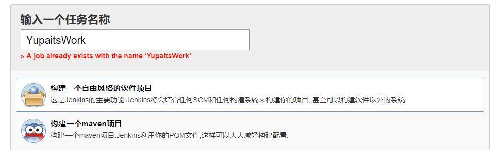
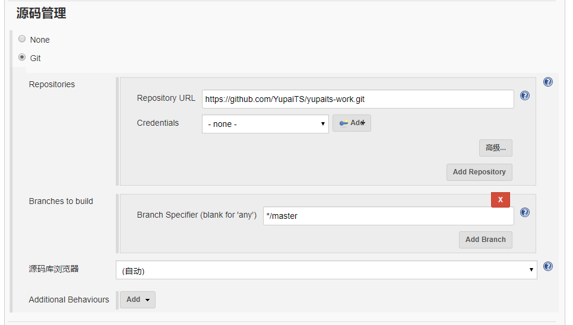

# 使用GitHub和Jenkins自动构建并部署静态页面

随着DevOps的日趋成熟，CI/CD的概念已经慢慢为广大开发运维人员所熟知和认同，本文记录了GitHub结合Jenkins自动构建和部署静态页面的方法，并从中窥见CI/CD之一二，同时也是做一个备忘记录。
## 创建任务
创建任务时选择**构建一个自由风格的软件项目**。


## 配置Jenkins任务
### General

### 源码管理


填写源码的git地址，用于下载源码到jenkins的工作空间，以便后续进行构建操作。
### 构建触发器


[进入GitHub的相应项目中配置webhook](https://github.com/YupaiTS/yupaits-work/settings/hooks)，webhook的`Payload URL`填写格式为`http://jenkins所在的domain或者ip:port/github-webhook/`。完成配置后，github接收特定的事件之后会触发请求该url。jenkins接收到请求之后会触发任务执行构建。
### 构建环境


在`Console Output`中加入时间戳，将`nodejs` 和 `npm`命令加入PATH，方便进行全局执行。
### 构建


首先执行`npm install`安装依赖包，再执行`npm run build`进行构建。

**YupaitsWork.sh**脚本用于将构建生成的页面覆盖掉nginx的静态页面，实现自动更新nginx主页的效果，其内容如下：
```bash
#!/bin/bash
rm -rf /var/www/html/**
cp -rf /var/lib/jenkins/workspace/YupaitsWork/dist/** /var/www/html
```
需要注意的是，默认的jenkins用户是没有`/var/www/html`目录的操作操作权限的，需要使用`chown -R jenkins:jenkins /var/www/html`更改该目录的所有者为jenkins用户。
### 构建后操作


将构建后的`dist`文件夹内容进行归档。
## 执行任务
完成任务的创建和配置之后，进入任务页面点击**立即构建**即可完成nginx主页的构建和覆盖部署。当然也可以通过push代码实现自动构建和部署。
