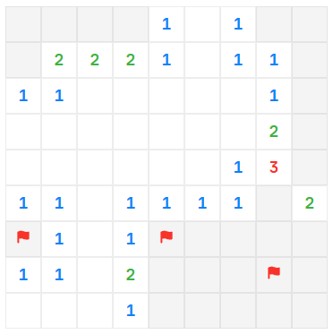

# 益智游戏开发-扫雷

yutool-cli高效工作套件中有几款休闲益智类的小游戏，本文介绍扫雷游戏是如何用代码实现的。



## 游戏规则

- 游戏在一个 `m*n` 的矩形雷区中进行
- 鼠标左键点击雷区中的某个坐标触发扫描，如果扫描到地雷则游戏结束，反之有以下两种情况：
  1. 该坐标周围九宫格内存在地雷（“周围九宫格内存在的地雷”在下文统一称为 **感应地雷**），则标识感应地雷数量，此次扫雷结束，游戏继续进行
  2. 该坐标不存在感应地雷，则自动向四周扩散扫描，找寻存在感应地雷的坐标，找到坐标之后停止扩散并标识感应地雷数量，当向四周的所有扩散都停止之后，此次扫雷结束，游戏继续进行
- 当根据坐标的感应地雷数量推理出未扫描区域的地雷坐标后，可点击鼠标右键对地雷坐标进行预标识
- 已经被预标识的坐标可点击鼠标左键或者鼠标右键取消预标识
- 当雷区内所有非地雷坐标都被扫描出来，则游戏过关

## 设计思路

在设计扫雷游戏时的关键问题及解决方案整理如下。

- 如何设计雷区的坐标体系？

  使用平面坐标系，雷区的列和行分别是坐标系的`x轴`和`y轴`，雷区的每个区域都可以用`x`、`y`坐标来表示。

- 地雷的坐标怎么确定？

  `m*n`的雷区如果有`p`个地雷，通过构建一个包含`1 ~ m*n`所有数值的乱序数组，取数组前`p`个元素的值，通过将元素值转换为坐标之后，可得到`p`个地雷坐标。（具体实现参考`randomFields`方法）

- 如何获取指定坐标周围九宫格区域的所有坐标？

  周围九宫格区域的8个坐标在x轴和y轴的偏移量相对于指定坐标来说是确定的，通过偏移量可快速计算出这8个坐标。

- 单局游戏开始后，首次扫描的坐标必定不是地雷，并且必定不存在感应地雷的机制如何实现？

  首次扫描，判断如果将要触发地雷，则将地雷移至九宫格区域外；同样的，如果存在感应地雷，则将所有感应地雷也移至九宫格外。地雷移动之后，触发扫描扩散，游戏继续进行。

## 代码实现

### 完整代码

以下是实现雷区及扫描操作的完整代码：

::: code-group
```jsx [MineFields.jsx 雷区]
import { IconFixedStroked, IconFlag } from '@douyinfe/semi-icons'
import { Button, Row, Space } from '@douyinfe/semi-ui'
import { useEffect, useMemo } from 'react'
import useStateRef from 'react-usestateref'
import { fieldMark, nineGridDelta, randomFields } from '../data'
import style from './style'

export default (props) => {
  const { mineConfig, mines, remainAmount, started, gameWin, gameOver, onStart, onWin, onOver, onRemainChange, cheat } = props
  const [_scanned, setScanned, scannedRef] = useStateRef([])
  const [_marked, setMarked, markedRef] = useStateRef([])
  const [_sensored, setSensored, sensoredRef] = useStateRef({})
  const [_boomMine, setBoomMine, boomMineRef] = useStateRef()

  const columns = Array.from(Array(mineConfig.columns), (k, v) => v + 1)
  const rows = Array.from(Array(mineConfig.rows), (k, v) => v + 1)
  const fieldSize = mineConfig.rows * mineConfig.columns

  const canFlag = useMemo(() => remainAmount > 0, [remainAmount])
  const gameDone = useMemo(() => gameWin || gameOver, [gameWin, gameOver])

  useEffect(() => {
    if (!started) {
      setScanned([])
      setMarked([])
      setSensored({})
      setBoomMine()
    }
  }, [started])

  //触发坐标
  const sweep = (i, j) => {
    if (!started && !isFlag(i, j)) {
      firstSweep(i, j)
      onStart()
    }
    if (gameWin || gameOver || isScanned(i, j)) {
      return
    }
    if (isFlag(i, j)) {
      toggleFlag(i, j)
      return
    }
    if (isMine(i, j)) {
      boomMineRef.current = fieldMark(i, j)
      onOver()
      return
    }
    spread(i, j)
    if (isWin()) {
      onWin()
    }
  }

  //切换坐标的地雷标识
  const toggleFlag = (i, j) => {
    if (gameWin || gameOver || isScanned(i, j)) {
      return
    }
    const mineMark = fieldMark(i, j)
    const marked = [...markedRef.current]
    const index = marked.indexOf(mineMark)
    if (index > -1) {
      marked.splice(index, 1)
      setMarked(marked)
      onRemainChange(remainAmount + 1)
    } else if (canFlag) {
      marked.push(mineMark)
      setMarked(marked)
      onRemainChange(remainAmount - 1)
    }
  }

  //确保首次不会触发地雷并且周围感应不到地雷
  const firstSweep = (i, j) => {
    let excludes = excludeFields(i, j)
    const sensorMines = sensor(i, j)
    const sensorSize = sensorMines.length
    const randomLimit = mineConfig.amount + 10
    //如果触发地雷则将地雷转移到九宫格以外
    if (isMine(i, j)) {
      moveMine(i, j, randomLimit, excludes)
    }
    //感应到的地雷也转移到九宫格外
    if (sensorSize > 0) {
      sensorMines.forEach(({ x, y }) => {
        moveMine(x, y, randomLimit, excludes)
      })
    }
  }

  //转移地雷，limit可根据抽屉原理计算得到
  const moveMine = (i, j, limit, excludes) => {
    const fields = randomFields(mineConfig.columns, mineConfig.rows, limit, excludes)
    const mineIndex = mines.indexOf(fieldMark(i, j))
    for (let k = 0; k < fields.length; k++) {
      const { x, y } = fields[k]
      if (!isMine(x, y) && !excludes.find(i => fieldMark(i.x, i.y) === fieldMark(x, y))) {
        mines.splice(mineIndex, 1, fieldMark(x, y))
        return
      }
    }
  }

  //计算以指定坐标为中心的九宫格坐标
  const excludeFields = (i, j) => nineGridDelta.map(delta => ({ x: i + delta.offsetX, y: j + delta.offsetY }))

  //扩散
  const spread = (i, j) => {
    if (!isValid(i, j) || isScanned(i, j) || isFlag(i, j) || isSensored(i, j)) {
      return
    }
    const mineMark = fieldMark(i, j)
    const scanned = [...scannedRef.current]
    scanned.push(mineMark)
    setScanned(scanned)
    const sensorMineAmount = sensor(i, j).length
    if (sensorMineAmount > 0) {
      const sensored = { ...sensoredRef.current }
      sensored[mineMark] = sensorMineAmount
      setSensored(sensored)
    } else {
      nineGridDelta.forEach(delta => {
        if (delta.offsetX === 0 && delta.offsetY === 0) {
          return
        }
        spread(i + delta.offsetX, j + delta.offsetY)
      })
    }
  }

  //感应周围九宫格的地雷坐标
  const sensor = (i, j) => {
    let sensorMines = []
    nineGridDelta.forEach(delta => {
      if (delta.offsetX === 0 && delta.offsetY === 0) {
        return
      }
      const x = i + delta.offsetX
      const y = j + delta.offsetY
      if (isValid(x, y) && isMine(x, y)) {
        sensorMines.push({ x, y })
      }
    })
    return sensorMines
  }

  //判断游戏是否胜利
  const isWin = () => (fieldSize === mines.length + scannedRef.current.length)

  //判断坐标是否为地雷
  const isMine = (i, j) => mines.includes(fieldMark(i, j))

  //判断坐标是否已经被扫描过
  const isScanned = (i, j) => scannedRef.current.includes(fieldMark(i, j))

  //判断坐标是否已经被标识过
  const isFlag = (i, j) => markedRef.current.includes(fieldMark(i, j))

  //判断坐标是否已经感应过
  const isSensored = (i, j) => sensoredRef.current[fieldMark(i, j)]

  //判断坐标是否为触发爆炸的地雷
  const isBoom = (i, j) => boomMineRef.current === fieldMark(i, j)

  //判断坐标的地雷标识是否正确
  const isCorrectFlag = (i, j) => gameOver && isMine(i, j) && isFlag(i, j)

  //判断坐标的地雷是否被成功扫除
  const isSwept = (i, j) => gameWin && isMine(i, j)

  //判断坐标是否位于雷区内
  const isValid = (i, j) => i > 0 && i <= mineConfig.columns && j > 0 && j <= mineConfig.rows

  //根据坐标感应到的地雷数量设置数字颜色
  const sensorColor = (i, j) => {
    const sensorAmount = sensoredRef.current[fieldMark(i, j)]
    return sensorAmount === 1 ? style.sensorColor.one :
      sensorAmount === 2 ? style.sensorColor.two :
        sensorAmount === 3 ? style.sensorColor.three :
          sensorAmount === 4 ? style.sensorColor.four :
            style.sensorColor.other
  }

  return (
    <Row type='flex' justify='space-around'>
      <Space spacing={0} vertical>
        {rows.map(j =>
          <Space key={j} spacing={0}>
            {columns.map(i =>
              <Button
                key={i}
                style={{
                  width: 40,
                  height: 40,
                  border: '1px solid var(--semi-color-border)',
                  borderRadius: 0,
                  backgroundColor: isBoom(i, j) ? style.boomBg :
                    isSwept(i, j) || isCorrectFlag(i, j) || isScanned(i, j) || (gameDone && isMine(i, j)) ? style.scannedBg :
                      gameDone ? style.notScannedBg : null
                }}
                onClick={() => sweep(i, j)}
                onContextMenu={(e) => {
                  e.preventDefault()
                  toggleFlag(i, j)
                }}>
                {cheat && !gameDone && isMine(i, j) ? <IconFixedStroked /> : null}
                {gameDone && isMine(i, j) ?
                  <IconFixedStroked
                    style={{
                      color: isBoom(i, j) ? style.boomColor :
                        isSwept(i, j) ? style.sweptColor :
                          style.mineColor
                    }} />
                  : isFlag(i, j) ?
                    <IconFlag style={{ color: isCorrectFlag(i, j) ? style.correctColor : style.flagColor }} />
                    : null
                }
                <span className='mono-font' style={{ color: sensorColor(i, j), fontSize: 18 }}>{sensoredRef.current[fieldMark(i, j)]}</span>
              </Button>
            )}
          </Space>
        )}
      </Space>
    </Row>
  )
}
```

```js [style/index.js 样式]
export default {
  boomColor: 'var(--semi-color-text-2)',
  flagColor: 'var(--semi-color-danger)',
  mineColor: 'var(--semi-color-text-0)',
  sensorColor: {
    one: 'rgba(var(--semi-blue-5), 1)',
    two: 'rgba(var(--semi-green-5), 1)',
    three: 'rgba(var(--semi-red-5), 1)',
    four: 'rgba(var(--semi-orange-5), 1)',
    other: 'rgba(var(--semi-grey-5), 1)'
  },
  sweptColor: 'var(--semi-color-success)',
  correctColor: 'var(--semi-color-success)',
  scannedBg: 'var(--semi-color-bg-0)',
  boomBg: 'var(--semi-color-danger)',
  notScannedBg: 'var(--semi-color-fill-0)'
}
```

```js [data/index.js 常量及公共方法]
export const levelConfig = {
  basic: {
    amount: 10,
    columns: 9,
    rows: 9,
    label: '基础'
  },
  intermediate: {
    amount: 40,
    columns: 16,
    rows: 16,
    label: '中级'
  },
  professional: {
    amount: 99,
    columns: 30,
    rows: 16,
    label: '专家'
  }
}

export const nineGridDelta = [
  { offsetX: -1, offsetY: -1 },
  { offsetX: 0, offsetY: -1 },
  { offsetX: 1, offsetY: -1 },
  { offsetX: -1, offsetY: 0 },
  { offsetX: 0, offsetY: 0 },
  { offsetX: 1, offsetY: 0 },
  { offsetX: -1, offsetY: 1 },
  { offsetX: 0, offsetY: 1 },
  { offsetX: 1, offsetY: 1 }
]

export const fieldMark = (x, y) => `${x}_${y}`

export const randomFields = (columns, rows, limit, excludes = []) => {
  const fields = []
  const fieldSize = columns * rows
  let array = Array.from(Array(fieldSize), (v, k) => k + 1)
  //将数组打乱顺序，取前limit个数转换为坐标
  array.sort(() => 0.5 - Math.random())
  let i = 0
  while (i < fieldSize && limit > 0) {
    const num = array[i]
    const isColLast = num % rows === 0
    const x = parseInt(num / rows) + (isColLast ? 0 : 1)
    const y = isColLast ? rows : num % rows
    if (excludes.findIndex(item => fieldMark(item.x, item.y) === fieldMark(x, y)) === -1) {
      fields.push({ x, y })
      limit--
    }
    i++
  }
  return fields
}
```
:::