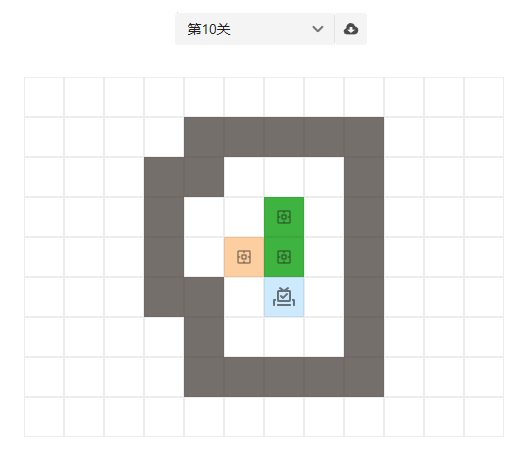

# 益智游戏开发-推箱子

yutool-cli高效工作套件中有几款休闲益智类的小游戏，本文介绍推箱子游戏是如何用代码实现的。



## 游戏规则

- 玩家控制角色上下左右移动
- 碰到墙壁无法行进
- 碰到箱子，在箱子的移动方向上没有障碍（障碍指的是墙壁或者另一个箱子）可将箱子推动
- 将所有箱子推到指定的目的地，游戏过关

## 设计思路

在设计推箱子游戏时的关键问题及解决方案整理如下。

- 游戏界面如何绘制？

  游戏界面在一个`12 * 9`的区域内进行，初始化一个二维数组，将区域内的每个格子的`i、j`坐标与二维数组的两层下标对应，数组元素对应的值对应初始游戏界面元素的类型。例如：`0`表示空白区域，可进行移动；`1`表示墙壁，无法移动；`2`表示箱子目的地。

- 如何判断是否能进行移动以及箱子是否能推动？

  如果角色行进的坐标为墙壁则无法移动。如果行进的坐标上有箱子，并且箱子行进的坐标不是墙壁或者另一个箱子，则可以推动箱子并移动。

- 如何实现“回退一步”功能？

  保存每一步有效移动（角色确确实实移动了，不是碰到墙壁或者箱子推不动的情况）之前的角色坐标及所有箱子的坐标，回退时直接将保存的角色坐标和所有箱子坐标覆盖当前的状态即可。具体可参考`undo`方法的代码实现。

## 代码实现

### 完整代码

游戏UI使用[semi design](https://semi.design/)组件绘制。

以下是实现推箱子的完整代码：

::: code-group
```jsx [SokobanTable.jsx]
import util from '@/util'
import { IconInteractiveStroked, IconMarginStroked, IconRefresh2, IconUndo, IconVoteVideoStroked } from '@douyinfe/semi-icons'
import { Button, ButtonGroup, Col, Row, Space, Toast } from '@douyinfe/semi-ui'
import { useEffect } from 'react'
import useStateRef from 'react-usestateref'
import style from './style'

export default (props) => {
  const { player, boxes, initData } = props
  const [_playerLoc, setPlayerLoc, playerLocRef] = useStateRef({})
  const [_blanks, setBlanks, blanksRef] = useStateRef([])
  const [_walls, setWalls, wallsRef] = useStateRef([])
  const [_boxes, setBoxes, boxesRef] = useStateRef([])
  const [_targets, setTargets, targetsRef] = useStateRef([])
  const [_actions, setActions, actionsRef] = useStateRef([])

  useEffect(() => {
    setPlayerLoc(player)
    setBoxes(boxes)
    init(initData)
    setActions([])
    initKeydownListeners()
    document.activeElement.blur()
  }, [initData])

  const init = (data) => {
    const blankCells = []
    const wallCells = []
    const targetCells = []
    for (let i = 0; i < data.length; i++) {
      const row = data[i]
      for (let j = 0; j < row.length; j++) {
        const type = row[j]
        if (type === 0) {
          blankCells.push({ i, j })
        } else if (type === 1) {
          wallCells.push({ i, j })
        } else if (type === 2) {
          blankCells.push({ i, j })
          targetCells.push({ i, j })
        }
      }
    }
    setBlanks(blankCells)
    setWalls(wallCells)
    setTargets(targetCells)
  }

  const initKeydownListeners = () => {
    window.onkeydown = (e) => {
      if (e.key === 'ArrowUp') {
        move(-1, 0)
      } else if (e.key === 'ArrowDown') {
        move(1, 0)
      } else if (e.key === 'ArrowLeft') {
        move(0, -1)
      } else if (e.key === 'ArrowRight') {
        move(0, 1)
      }
    }
  }

  const move = (offsetX, offsetY) => {
    const current = { ...playerLocRef.current }
    const boxCells = [...boxesRef.current]
    const newActions = [...actionsRef.current]
    newActions.push({ player: { ...current }, boxes: [...boxCells] })
    const next = { i: current.i + offsetX, j: current.j + offsetY }
    //判断是否推到了箱子
    if (isBox(next.i, next.j)) {
      const boxNext = { i: next.i + offsetX, j: next.j + offsetY }
      //判断箱子是否可推动
      if (isBlank(boxNext.i, boxNext.j) && !isBox(boxNext.i, boxNext.j)) {
        setPlayerLoc(next)
        //重新设置推动箱子的坐标
        const boxIndex = boxCells.findIndex(item => item.i === next.i && item.j === next.j)
        boxCells.splice(boxIndex, 1, boxNext)
        setBoxes(boxCells)
        setActions(newActions)
      }
    } else if (isBlank(next.i, next.j) && !isBox(next.i, next.j)) {
      setPlayerLoc(next)
      setActions(newActions)
    }
    checkWin()
  }

  const checkWin = () => {
    if (util.isEmpty(boxesRef.current)) {
      return
    }
    let win = true
    for (let i = 0; i < boxesRef.current.length; i++) {
      const box = boxesRef.current[i];
      if (!isTarget(box.i, box.j)) {
        win = false
        break
      }
    }
    if (win) {
      Toast.success('恭喜过关')
      setActions([])
      window.onkeydown = (e) => { }
    }
  }

  const undo = () => {
    const newActions = [...actionsRef.current]
    const lastAction = newActions.pop()
    setPlayerLoc(lastAction.player)
    setBoxes(lastAction.boxes)
    setActions(newActions)
  }

  const reset = () => {
    setPlayerLoc(player)
    setBoxes(boxes)
    init(initData)
    setActions([])
  }

  const isBlank = (i, j) => blanksRef.current.findIndex(item => item.i === i && item.j === j) > -1
  const isWall = (i, j) => wallsRef.current.findIndex(item => item.i === i && item.j === j) > -1
  const isBox = (i, j) => boxesRef.current.findIndex(item => item.i === i && item.j === j) > -1
  const isTarget = (i, j) => targetsRef.current.findIndex(item => item.i === i && item.j === j) > -1
  const isPlayer = (i, j) => i === playerLocRef.current?.i && j === playerLocRef.current?.j
  const isCorrect = (i, j) => isBox(i, j) && isTarget(i, j)

  return (
    <Row gutter={[0, 16]} type='flex' justify='space-around'>
      <Col span={24}>
        <Space spacing={0} vertical>
          <>
            {initData.map((row, i) =>
              <Space key={`row_${i}`}>
                <Space key={i} spacing={0}>
                  {row.map((type, j) =>
                    <Button
                      key={`${i}_${j}`}
                      style={{
                        width: 40,
                        height: 40,
                        border: '1px solid var(--semi-color-border)',
                        borderRadius: 0,
                        backgroundColor: isCorrect(i, j) ? style.correctColor :
                          isBox(i, j) ? style.boxColor :
                            isTarget(i, j) ? style.targetColor :
                              isWall(i, j) ? style.wallColor :
                                isBlank(i, j) ? style.blankColor :
                                  null
                      }}
                      icon={
                        isBox(i, j) ? <IconMarginStroked style={{ color: 'var(--semi-color-text-2)' }} /> :
                          isPlayer(i, j) ? <IconVoteVideoStroked style={{ color: 'var(--semi-color-text-2)' }} size='extra-large' /> :
                            isTarget(i, j) ? <IconInteractiveStroked style={{ color: 'var(--semi-color-text-2)' }} /> :
                              null
                      } />
                  )}
                </Space>
              </Space>
            )}
          </>
        </Space>
      </Col>
      <Col span={24}>
        <Row gutter={[0, 16]} type='flex' justify='center'>
          {util.isEmpty(actionsRef.current) ? null :
            <ButtonGroup>
              <Button type='tertiary' icon={<IconUndo />} title='回退一步' onClick={undo}>回退一步</Button>
              {player ?
                <Button type='tertiary' icon={<IconRefresh2 />} title='重新开始' onClick={reset}>重新开始</Button>
                : null
              }
            </ButtonGroup>
          }
        </Row>
      </Col>
    </Row>
  )
}
```
:::