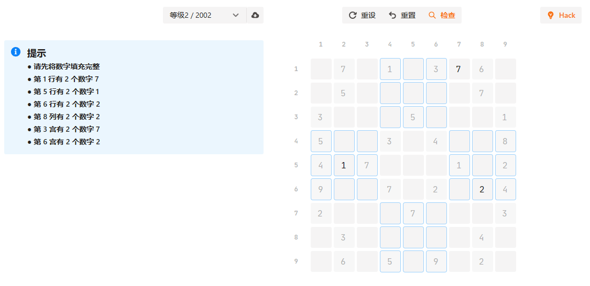
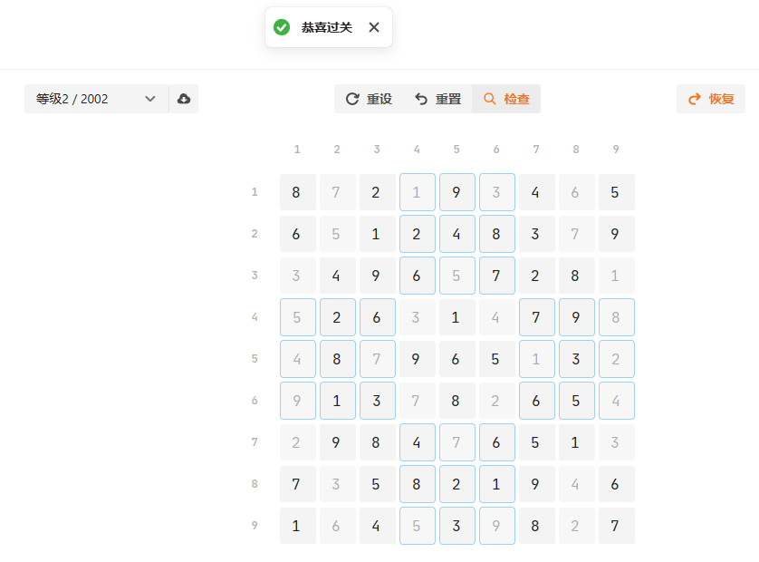

# 益智游戏开发-数独

yutool-cli高效工作套件中有几款休闲益智类的小游戏，本文介绍数独游戏是如何用代码实现的。



可以一键Hack，求解任意数独问题：



## 游戏规则

- 游戏在9*9的矩形区域内进行
- 每个格子填写1~9其中一个数字
- 每一行不能有重复数字
- 每一列不能有重复数字
- 每一宫不能有重复数字
- 所有81个格子都填写数字并满足以上条件，则游戏过关

## 设计思路

在设计数独游戏时的关键问题及解决方案整理如下。

- 如何设计数独游戏的坐标系？

  使用平面直角坐标系，数独的列和行分别是坐标系的`x轴`和`y轴`，数独的每个格子都可以用`x轴`和`y轴`坐标来表示。

- 数独游戏开始前的初始数字怎么确定？

  有两种方式，一种是直接从远程题库加载，一种是手动定义。手动定义的初始数独必须在检测没有问题之后才能开始游戏。

- 怎么判断游戏是否过关？

  填写数字之后，可手动触发检查，检查通过则游戏过关，反之系统会给出所有重复的数字的提示。

- **一键Hack** 如何实现？

  通过递归+回溯算法可对数独进行求解，具体的实现可以参考`data/index.js`文件中`hack`方法的代码实现和说明。

## 代码实现

### 完整代码

游戏UI使用[semi design](https://semi.design/)组件绘制。

以下是实现雷区及扫描操作的完整代码：

::: code-group
```jsx [Sudoku.jsx]
import api from '@/api'
import util from '@/util'
import { IconBulb, IconDownload, IconFile, IconRedo, IconRefresh, IconSearchStroked, IconTick, IconUndo } from '@douyinfe/semi-icons'
import { Banner, Button, ButtonGroup, Cascader, Col, InputGroup, Popconfirm, Row, SideSheet, Toast, Typography } from '@douyinfe/semi-ui'
import { useLocalStorageState } from 'ahooks'
import { useEffect, useMemo, useState } from 'react'
import useStateRef from 'react-usestateref'
import SudokuTable from './SudokuTable'
import { emptyData, hack, repoUrl, sudokuDir } from './data'

export default () => {
  const [sudokuDb, setSudokuDb] = useLocalStorageState('yutool_sudoku_db', { defaultValue: { value: [] } })
  const [syncing, setSyncing] = useState(false)
  const [initData, setInitData] = useState([])
  const [fillData, setFillData] = useState(emptyData())
  const [initialized, setInitialized] = useState(false)
  const [allFilled, setAllFilled, allFilledRef] = useStateRef(true)
  const [rowTips, setRowTips, rowTipsRef] = useStateRef([])
  const [colTips, setColTips, colTipsRef] = useStateRef([])
  const [gridTips, setGridTips, gridTipsRef] = useStateRef([])
  const [hacked, setHacked] = useState(false)
  const [hackedFillData, setHackedFillData] = useState(emptyData())

  useEffect(() => {
    loadSudoku()
  }, [])

  const levelData = useMemo(() => {
    const levels = [...new Set(sudokuDb?.value?.map(i => i?.level))]
    return levels.map(level => {
      const data = sudokuDb?.value?.filter(i => i.level === level)
        .map(i => ({
          value: i.no,
          label: i.no,
          initData: i.initData
        }))
      return {
        value: level,
        label: `等级${level}`,
        children: data
      }
    })
  }, [sudokuDb?.value])

  const hasTips = (rowTipsLength, colTipsLength, gridTipsLength) => (rowTipsLength > 0 || colTipsLength > 0 || gridTipsLength > 0)

  const fetchSudoku = () => {
    setSyncing(true)
    api.syncSudokuDatabase(repoUrl, sudokuDir)
      .then(res => {
        const db = {
          value: res?.data ?? [],
          expire: util.dayjs().add(7, 'day')
        }
        setSudokuDb(db)
        Toast.success('数独题库已同步')
        setSyncing(false)
      }).catch(() => {
        setSyncing(false)
      })
  }

  const loadSudoku = () => {
    if (!sudokuDb || !sudokuDb?.expire || !util.dayjs(sudokuDb?.expire).isValid()
      || util.dayjs().isAfter(sudokuDb.expire)) {
      fetchSudoku()
    }
    Toast.success('数独题库已加载')
  }

  const onSudokuSelect = (val) => {
    const { initData } = sudokuDb?.value?.filter(i => i.no === val)[0]
    setInitData([...initData])
    const newData = emptyData()
    initData.forEach(item => {
      newData[item.i - 1][item.j - 1] = item.num
    })
    setFillData(newData)
    setInitialized(false)
  }

  const onFill = (data) => {
    setFillData(data)
  }

  const clear = () => {
    setFillData(emptyData())
    setInitData([])
    setRowTips([])
    setColTips([])
    setGridTips([])
    setInitialized(false)
    setHacked(false)
    setHackedFillData(emptyData())
  }

  const doHack = () => {
    const hackFillData = emptyData()
    initData.forEach(item => {
      hackFillData[item.i - 1][item.j - 1] = item.num
    })
    const hacked = hack([...hackFillData], 0, 0)
    setHacked(hacked)
    if (hacked) {
      setHackedFillData(hackFillData)
    } else {
      Toast.error('数独无解')
    }
  }

  const resume = () => {
    setHacked(false)
    setHackedFillData(emptyData())
  }

  const reset = () => {
    const newData = emptyData()
    initData.forEach(item => {
      newData[item.i - 1][item.j - 1] = item.num
    })
    setFillData(newData)
    setHacked(false)
    setHackedFillData(emptyData())
  }

  const checkPass = () => {
    const data = hacked ? hackedFillData : fillData
    checkAllFilled(data)
    checkFillDuplicate(data)
    if (allFilledRef.current && !hasTips(rowTipsRef.current.length, colTipsRef.current.length, gridTipsRef.current.length)) {
      Toast.success('恭喜过关')
    }
  }

  const initial = () => {
    checkFillDuplicate(fillData)
    if (hasTips(rowTipsRef.current.length, colTipsRef.current.length, gridTipsRef.current.length)) {
      return
    }
    const newInitData = []
    let initCount = 0
    for (let i = 0; i < fillData.length; i++) {
      const arr = fillData[i]
      for (let j = 0; j < arr.length; j++) {
        const num = arr[j]
        if (num) {
          initCount++
          newInitData.push({ i: i + 1, j: j + 1, num: num })
        }
      }
    }
    if (initCount < 17) {
      Toast.warning('请至少设置17个初始数字，确保数独有唯一解')
      return
    }
    setInitData(newInitData)
    setInitialized(true)
  }

  const checkAllFilled = (data) => {
    let filled = true
    try {
      data?.forEach(row => {
        row.forEach(cell => {
          if (!cell) {
            filled = false
            throw new Error()
          }
        })
      })
    } catch (err) {
    }
    setAllFilled(filled)
  }

  const checkFillDuplicate = (data) => {
    const newRowTips = []
    const newColTips = []
    const newGridTips = []
    for (let i = 0; i < 9; i++) {
      const row = data[i]
      const set = {}
      row.forEach(num => {
        if (num) {
          const numCount = row.filter(item => item && num === item).length
          if (!set[num] && numCount > 1) {
            set[num] = numCount
            newRowTips.push(`● 第 ${i + 1} 行有 ${numCount} 个数字 ${num}`)
          }
        }
      })
    }
    setRowTips(newRowTips)
    for (let i = 0; i < 9; i++) {
      const column = data.map(row => row[i])
      const set = {}
      column.forEach(num => {
        if (num) {
          const numCount = column.filter(item => item && num === item).length
          if (!set[num] && numCount > 1) {
            set[num] = numCount
            newColTips.push(`● 第 ${i + 1} 列有 ${numCount} 个数字 ${num}`)
          }
        }
      })
    }
    setColTips(newColTips)
    for (let i = 0; i < 3; i++) {
      for (let j = 0; j < 3; j++) {
        const gridNo = i * 3 + j
        const startRow = i * 3
        const endRow = (i + 1) * 3
        const startCol = j * 3
        const endCol = (j + 1) * 3
        const grid = data.filter((row, rNo) => rNo >= startRow && rNo < endRow)
          .map(row => row.filter((item, cNo) => cNo >= startCol && cNo < endCol))
          .flat()
        const set = {}
        grid.forEach(num => {
          if (num) {
            const numCount = grid.filter(item => item && num === item).length
            if (!set[num] && numCount > 1) {
              set[num] = numCount
              newGridTips.push(`● 第 ${gridNo + 1} 宫有 ${numCount} 个数字 ${num}`)
            }
          }
        })
      }
    }
    setGridTips(newGridTips)
  }

  return (
    <div style={{ paddingTop: 16, paddingBottom: 16 }}>
      <Row gutter={[16, 32]} type='flex' justify='space-around'>
        <Col span={8}>
          <Row type='flex' justify='end'>
            <InputGroup>
              <Cascader
                style={{ width: 160 }}
                placeholder='选择题目'
                onSelect={onSudokuSelect}
                treeData={levelData} />
              <Button type='tertiary' icon={<IconDownload />} loading={syncing} title='同步远程题库' onClick={loadSudoku} />
            </InputGroup>
          </Row>
        </Col>
        <Col span={8}>
          <Row type='flex' justify='center'>
            <ButtonGroup>
              <Popconfirm position='bottom' title='确认' content='此操作会清空数独，确认继续？' onConfirm={clear}>
                <Button type='tertiary' icon={<IconRefresh />} title='重新设定数独问题'>重设</Button>
              </Popconfirm>
              {initialized ?
                <>
                  <Popconfirm position='bottom' title='确认' content='此操作会清除已填写的数字，确认继续？' onConfirm={reset}>
                    <Button type='tertiary' icon={<IconUndo />}>重置</Button>
                  </Popconfirm>
                  <Button icon={<IconSearchStroked />} onClick={checkPass}>检查</Button>
                </>
                :
                <Button icon={<IconTick />} title='完成数独问题设定' disabled={initialized} onClick={initial}>设定</Button>
              }
            </ButtonGroup>
          </Row>
        </Col>
        <Col span={8}>
          <Row type='flex' justify='space-between'>
            {hacked ?
              <Button icon={<IconRedo />} title='恢复到破解前的游戏状态' disabled={!initialized} onClick={resume}>恢复</Button>
              :
              <Button icon={<IconBulb />} title='一键获取数独答案' disabled={!initialized} onClick={doHack}>Hack</Button>
            }
          </Row>
        </Col>
        <Col span={8}>
          {!allFilled || hasTips(rowTips.length, colTips.length, gridTips.length) ?
            <Banner
              type='info'
              title='提示'
              fullMode={false}
              closeIcon={null}
              description={
                <Typography.Paragraph spacing='extended'>
                  <Typography.Text strong>{allFilled ? null : '● 请先将数字填充完整'}</Typography.Text>
                  {rowTips.map(tip =>
                    <div key={tip}>
                      <Typography.Text strong>{tip}</Typography.Text>
                    </div>
                  )}
                  {colTips.map(tip =>
                    <div key={tip}>
                      <Typography.Text strong>{tip}</Typography.Text>
                    </div>
                  )}
                  {gridTips.map(tip =>
                    <div key={tip}>
                      <Typography.Text strong>{tip}</Typography.Text>
                    </div>
                  )}
                </Typography.Paragraph>
              } />
            : null
          }
        </Col>
        <Col span={8}>
          <SudokuTable fillData={hacked ? hackedFillData : fillData} initData={initData} onFill={onFill} />
        </Col>
        <Col span={8}></Col>
      </Row>
    </div>
  )
}
```

```jsx [SudokuTable.jsx 游戏区域]
import { InputNumber, Row, Space, Typography } from '@douyinfe/semi-ui'
import { columns, rows } from '../data'

export default (props) => {
  const { fillData, initData, onFill } = props

  const onInputChange = (i, j, val) => {
    fillData[i][j] = val
    onFill([...fillData])
  }

  const isInitData = (i, j) => {
    return initData.findIndex(data => data.i === i + 1 && data.j === j + 1) > -1
  }

  const bordered = (i, j) => {
    if ((i > 2 && i < 6) && (j < 3 || j > 5)) {
      return true
    }
    if ((j > 2 && j < 6) && (i < 3 || i > 5)) {
      return true
    }
    return false
  }

  return (
    <Row type='flex' justify='space-around'>
      <Space spacing={0} vertical>
        <>
          <Space style={{ paddingLeft: 42, paddingBottom: 16 }}>
            {rows.map(i =>
              <Typography.Text key={`row_index_${i}`} size='small' type='quaternary' strong className='mono-font' style={{ width: 36, textAlign: 'center' }}>{i + 1}</Typography.Text>
            )}
          </Space>
          {rows.map(i =>
            <Space key={`row_${i}`}>
              <Typography.Text key={`col_index_${i}`} size='small' type='quaternary' strong className='mono-font' style={{ width: 36, textAlign: 'center' }}>{i + 1}</Typography.Text>
              <Space key={i} spacing={0}>
                {columns.map(j =>
                  <InputNumber
                    key={`${i}_${j}`}
                    size='large'
                    className='mono-font sudoku-input'
                    hideButtons
                    min={1}
                    max={9}
                    value={fillData[i][j]}
                    onChange={val => onInputChange(i, j, val)}
                    disabled={isInitData(i, j)}
                    style={{
                      width: 40,
                      margin: 2,
                      border: bordered(i, j) ? '1px solid var(--semi-color-info-light-active)' : null,
                      borderRadius: bordered(i, j) ? 4 : null
                    }} />
                )}
              </Space>
            </Space>
          )}
        </>
      </Space>
    </Row>
  )
}
```

```js [data/index.js 公共变量和方法]
export const repoUrl = ''
export const sudokuDir = 'sudoku'
export const rows = Array.from(Array(9), (v, k) => k)
export const columns = Array.from(Array(9), (v, k) => k)

//初始化数据
export const emptyData = () => {
  let data = Array.from(Array(9), () => new Array(9))
  for (let i = 0; i < 9; i++) {
    for (let j = 0; j < 9; j++) {
      data[i][j] = undefined;
    }
  }
  return data
}

//使用递归+回溯算法求解数独
export const hack = (data, i, j) => {
  if (i === 9) {
    //全部遍历完，找到一个可行解
    return true
  }
  if (j === 9) {
    //穷举到最后一列，换下一行开始
    return hack(data, i + 1, 0)
  }
  if (data[i][j]) {
    //如果有预设数字，不用穷举直接跳过
    return hack(data, i, j + 1)
  }
  for (let k = 1; k <= 9; k++) {
    if (!checkCell(data, i, j, k)) {
      continue
    }
    data[i][j] = k
    //找到一个可行解，立即结束
    if (hack(data, i, j + 1)) {
      return true
    }
    //撤销选择，继续尝试其他数字
    data[i][j] = undefined
  }
  //穷举完1~9，依然没有找到可行解，数独无解
  return false
}

const checkCell = (data, rowNo, colNo, num) => {
  for (let i = 0; i < 9; i++) {
    //判断行是否存在重复数字
    if (data[rowNo][i] === num) {
      return false
    }
    //判断列是否存在重复数字
    if (data[i][colNo] === num) {
      return false
    }
    //判断宫内是否存在重复数字
    if (data[parseInt(rowNo / 3) * 3 + parseInt(i / 3)][parseInt(colNo / 3) * 3 + i % 3] === num) {
      return false
    }
  }
  return true
}
```
:::