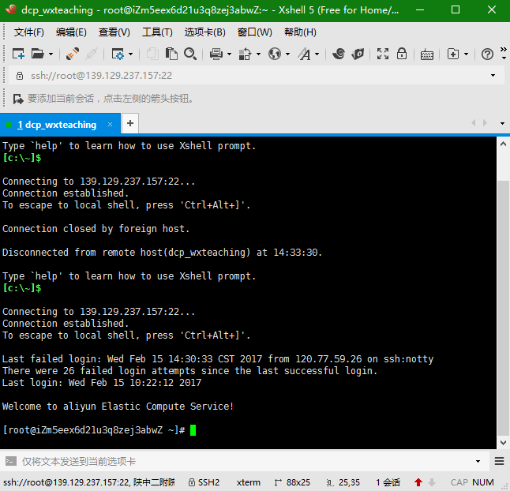

# 阿里云服务器环境搭建

远程云服务器的管理是运维人员的必备技能，本文总结了阿里云linux服务器的基本环境的搭建过程，方便日后查看回顾。
## 远程登录
目前windows平台上比较常见的SSH客户端有XShell、Putty等，这里选用比较熟悉的[XShell](https://www.netsarang.com/xshell_download.html)。官网需要填写个人信息之后才能下载，这里直接选择[百度软件中心](http://rj.baidu.com/soft/detail/15201.html?ald)下载。

安装完成之后，开始登录远程的linux服务器。

1.  新建会话


2.  输入用户名、密码，执行登录


## 操作系统
这里选用的是CentOS 7
## 环境搭建
CentOS 7 可以使用yum安装包管理器快速安装配置各种常用的软件工具。


在安装软件工具之前，先对yum进行更新。
```
$ yum update
```
### JDK
#### 安装前的检查
首先检查是否已经安装其他版本JDK，如openjdk等。
```
$ rpm -qa | grep -E '^open[jre|jdk]|j[re|dk]'
```
这里显示的输出信息为：


检查当前java版本信息
```
$ java -version
```
如果已经安装了openjdk，使用 `yum remove java-1.x.x-openjdk` 命令卸载。
#### 下载并安装Oracle JDK

- 下载[JDK](http://www.oracle.com/technetwork/java/javase/downloads/index.html)


-  安装JDK

安装之前使用**Xftp**工具将下载的rpm软件包上传到服务器。 
```
$ rpm -ivh jdk-8u121-linux-x64.rpm
```

-  使用 `java -version` 检查是否成功安装 
#### 设置JDK环境变量
```
# cp /etc/profile /etc/profile.backup0831
# vim /etc/profile
```
在最下面添加以下信息：
```
export JAVA_HOME=/usr/java/default
export PATH=$PATH:$JAVA_HOME/bin
export CLASSPATH=.:$JAVA_HOME/jre/lib:$JAVA_HOME/lib:$JAVA_HOME/lib/tools.jar
```

- 查看JDK环境变量是否设置成功
```
$ echo $JAVA_HOME
```
### MySQL
> MySQL的安装可以参考[阿里云Centos7使用yum安装MySQL5.6的正确姿势](http://www.cnblogs.com/XBlack/p/5178758.html)

以下为主要代码。

-  安装带有可用的mysql5系列社区版资源的rpm包 
```
$ rpm -Uvh http://dev.mysql.com/get/mysql-community-release-el7-5.noarch.rpm
```

-  查看当前可用的mysql安装资源 
```
$ yum repolist enabled | grep "mysql.*-community.*"
```

-  使用yum的方式安装MySQL 
```
$ yum -y install mysql-community-server
```

-  加入开机启动 
```
$ systemctl enable mysqld
```

-  启动mysql服务进程 
```
$ systemctl start mysqld
```

-  重置密码


```
$ mysql_secure_installation
```
### Redis
> 参考[官方文档](http://www.redis.cn/download.html)

下载，解压，编译：

```
$ wget http://download.redis.io/releases/redis-3.2.6.tar.gz
$ tar xzf redis-3.2.6.tar.gz
$ cd redis-3.2.6
$ make
```
make命令需要gcc，使用下列命令安装gcc：
```
$ yum -y install gcc
```
二进制文件是编译完成后在src目录下，通过下面的命令启动Redis服务：

`$ src/redis-server`

你可以使用内置的客户端命令redis-cli进行使用：
```
$ src/redis-cli
redis> set foo bar
OK
redis> get foo
"bar"
```
> [Centos开机自启动redis](https://my.oschina.net/indestiny/blog/197272)

- 修改redis.conf，打开后台运行选项：
```
# By default Redis does not run as a daemon. Use 'yes' if you need it.
# Note that Redis will write a pid file in /var/run/redis.pid when daemonized.
daemonize yes
```

- 编写脚本，vim /etc/init.d/redis:
```
# chkconfig: 2345 10 90
# description: Start and Stop redis

PATH=/usr/local/bin:/sbin:/usr/bin:/bin

REDISPORT=6379 #实际环境而定
EXEC=/usr/local/redis/src/redis-server #实际环境而定
REDIS_CLI=/usr/local/redis/src/redis-cli #实际环境而定

PIDFILE=/var/run/redis.pid
CONF="/usr/local/redis/redis.conf" #实际环境而定

case "$1" in
        start)
                if [ -f $PIDFILE ]
                then
                        echo "$PIDFILE exists, process is already running or crashed."
                else
                        echo "Starting Redis server..."
                        $EXEC $CONF
                fi
                if [ "$?"="0" ]
                then
                        echo "Redis is running..."
                fi
                ;;
        stop)
                if [ ! -f $PIDFILE ]
                then
                        echo "$PIDFILE exists, process is not running."
                else
                        PID=$(cat $PIDFILE)
                        echo "Stopping..."
                        $REDIS_CLI -p $REDISPORT SHUTDOWN
                        while [ -x $PIDFILE ]
                        do
                                echo "Waiting for Redis to shutdown..."
                                sleep 1
                        done
                        echo "Redis stopped"
                fi
                ;;
        restart|force-reload)
                ${0} stop
                ${0} start
                ;;
        *)
                echo "Usage: /etc/init.d/redis {start|stop|restart|force-reload}" >&2
                exit 1
esac
```

- 执行权限：
```
chmod +x /etc/init.d/redis
```

- 开机自启动：
```
# 尝试启动或停止redis
service redis start
service redis stop

# 开启服务自启动
chkconfig redis on
```
### Tomcat
> 参考[yum安装Tomcat](http://ju.outofmemory.cn/entry/53632)

```
yum -y install tomcat8
```
使用yum命令安装完成之后，可以方便的使用 `$ tomcat start` 和 `$ tomcat stop` 命令开关tomcat。

tomcat的安装目录位于 `/usr/share/tomcat` 下。
## 工具安装

- vim
> 参考[yum 安装vim编辑器](http://www.cnblogs.com/qianxiaoruofeng/p/5778733.html)

```
```
yum -y install vim
```
```

- [Xftp](http://rj.baidu.com/soft/detail/18249.html?ald)
- Git

[Git下载与安装](https://git-scm.com/download/linux)

[centos上如何yum安装git?](http://blog.csdn.net/laiahu/article/details/7516939)

[Git教程 - 廖雪峰的官方网站](http://www.liaoxuefeng.com/wiki/0013739516305929606dd18361248578c67b8067c8c017b000)
