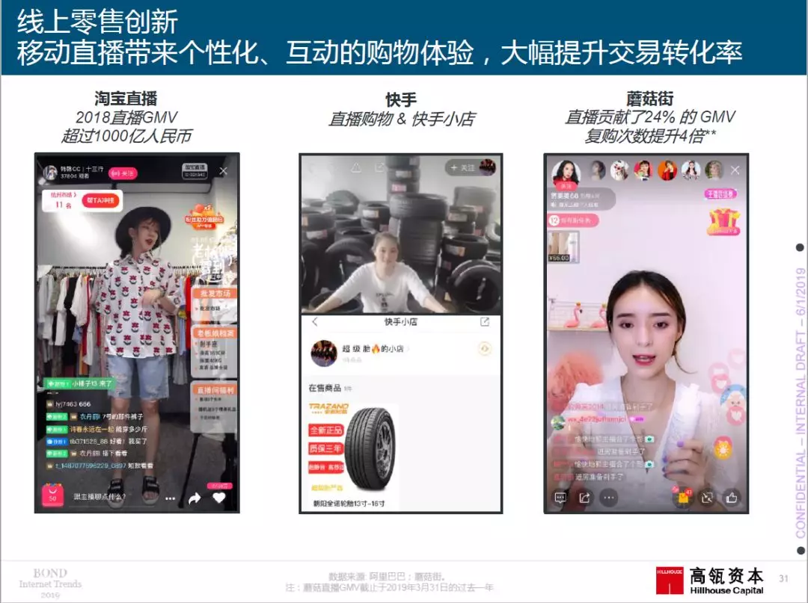
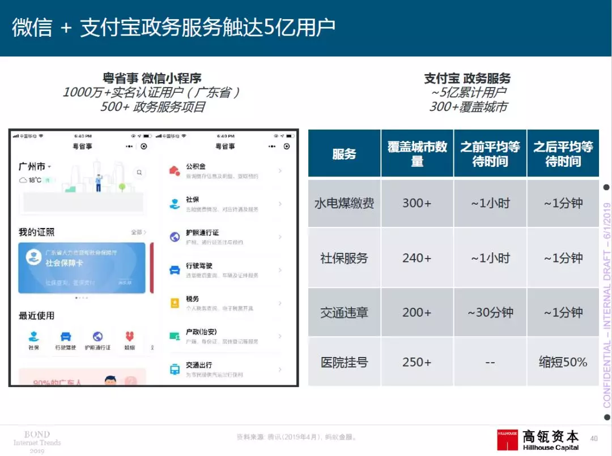

# 2019年“互联网女皇”报告重磅出炉：你想要的干货全在这里！

> 原文地址：[2019年“互联网女皇”报告重磅出炉：你想要的干货全在这里！](https://mp.weixin.qq.com/s/fsurBgd2EMUf_RRcCa4F2g)

> 导读：北京时间6月12日凌晨，“互联网女皇”玛丽·米克尔发布了《2019年互联网趋势报告》。报告中关于中国互联网发展的内容由高瓴资本撰写，这也是“互联网女皇”自2014年开始，连续第六年与高瓴资本合作。今年中国部分的报告里有哪些值得关注的重要趋势？我们为您总结出以下精华亮点。

## 宏观经济长期稳健
中国宏观经济走势将保持长期稳健，尽管短期内企业和消费者信心有所波动，但伴随着服务业的持续发展和城镇化进程的不断推进，长期宏观经济增速仍然可观。

## 中国互联网用户/时长持续增长 短视频成为重要驱动力
近年来，中国互联网行业始终保持着较快的增速。2018年，中国移动互联网用户已达到8.2亿，移动互联网数据流量同比增长189%，其中，短视频对中国互联网流量和使用时长的增长功不可没。

## 中国原发创新——游戏改变生活
线上游戏正日益改变着中国的支付、电商、零售、教育以及更多行业，通过游戏化和数字化为传统行业赋能的新模式正在重构人们的消费体验。

## 互联网驱动的产品和商业模式创新领先世界
以微信为代表的及时通讯软件,通过小程序等形式大大促进了产品交易与服务的创新发展;众多海外互联网公司纷纷效仿微信策略。

电子商务的持续发展使得部分单一功能APP进化为集多种功能于一身的超级APP，用户活跃度和交易频次得到进一步提升。例如，始于团购的美团，聚合了“吃喝玩乐”等多种本地交易服务；以电子钱包起家的支付宝现已拥有超过20万小程序、10亿全球用户，深入渗透并改变着人们的日常生活。

从线上到线下，再到全渠道的零售创新重构了消费者的购物体验，以数字化、信息化、个性化为主要特征的“新零售”赋予传统零售行业以崭新的生机和活力。

教育和政府服务向线上延伸，逐步实现线上线下一体化，极大地提高了服务的便利性和多样性。

