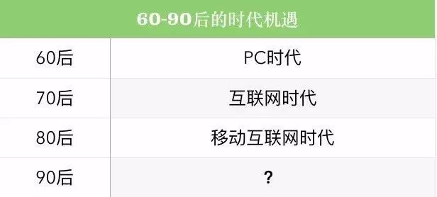
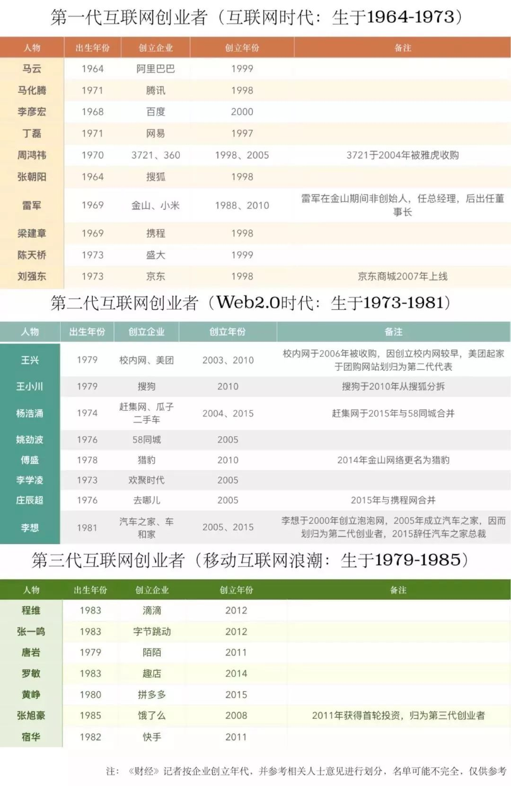
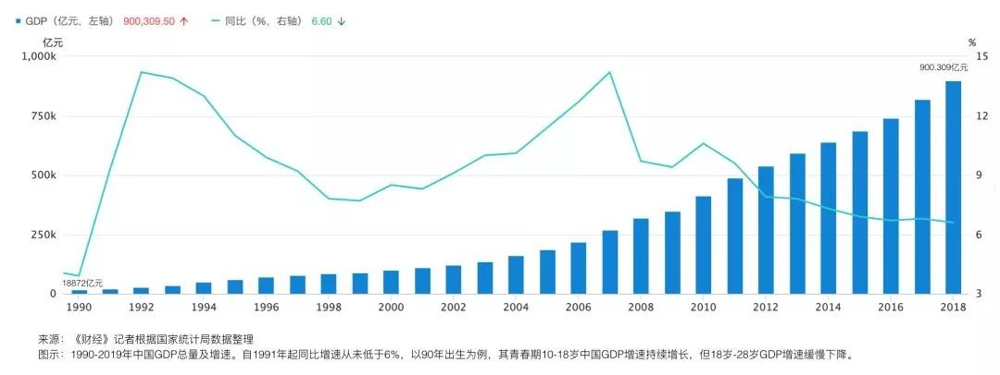

# 90后走入焦虑时代：没房没车没京户，还要梦想着财务自由

> 原文地址：[90后走入焦虑时代：没房没车没京户，还要梦想着财务自由](https://mp.weixin.qq.com/s/MAxqJxqNpTbqlalaJJX1Nw)

**划重点：**

1. 当互联网从高歌猛进向稳定期过渡，裁员、缩编成为各个公司主旋律，遍地是黄金、遍地是机会的年代似乎不属于90后。
2. **一款App就能睥睨天下的时代过去了，不计成本烧钱换增长的时代过去了，追上风口一夜暴富的时代也过去了。** 90后们开始理解，创业的本质是business，是生意，他们变得务实。
3. 如今在互联网各大公司，90-92年出生的人在向各大公司管理岗突围，96-97年出生的人陆续踏入职场，98-99年出生的人开始实习。**90大军才刚刚全面入境，00后已经在台下翘首以待。**

**“80后吃肉，85后喝汤，90后洗碗刷盘子。”** 一位小米员工在私下场合有些夸张地感叹。

在互联网，90后远未掌握话语权，在很多场合，他们在60、70、80后领导、资方、合作伙伴面前显得有些沉默。90后年轻气盛，喜欢标新立异，但他们也深感不安——不少人刚入行就发现，红利将尽，遍地是红海。

这是新生代撞上互联网高增长黄金时代末班车的故事。当风口消失、圈层固化、寒冬降临，**一个加剧他们危机感的事实来了：第一批90后明年就迈向30岁。**

## **梦断“财富自由”**

**_“没有，真的啥都没有！”_**

在2019春夏之交的夜晚，作为红极一时的90后创业代表ofo，核心团队在北四环一间茶馆里开了次闭门会。

已是晚上11点，在场几个人毫无困意，他们要开启一个沉重的话题——到底应不应该申请破产。ofo陷入危局已经一年半，他们比任何时候都渴望结果。按下破产重组的按钮，虽然情感难以割舍，但至少有清零巨额债务重新开始的机会。

戴威不出意料地拒绝了。他坐在包间门正对面沙发上，两腿并拢，其他几人围坐两旁。在长达3小时的夜间会议里，戴威几度哽咽，表态道：**“我们可以再起一摊事，但要把现在欠钱的人名单都带上，将来挣了钱还要还。”**

ofo走下神坛，90后创下的最声势浩大的“商业奇迹”破灭了。但比个体失落更令人不安的是，随着互联网红利殆尽，商业机会向产业深处渗透，赤手空拳创江山显得渺茫。**对于没有原始积累的90一代来说，还有一个大江大海、水大鱼大的时代等着他们吗？**

92年创业者安传东幸运地追赶上了移动互联网的尾巴。在ofo籍籍无名的2015年，他以青年创业代表身份被推荐到两会建言献策。“真的是第一次见大世面。”他对《财经》记者说。这时国家“双创”政策如火如荼，是一个“学生可以休学创业”、“拿着BP（商业计划书）就能融到钱”的年代。出生于河南农村、刚从人大哲学系毕业的安传东就这样被推上风口。

“觉得没什么可以阻拦我。”两会后一个月，安传东敲定第一笔大额融资，金额为1200万人民币，出资人是背靠马云和谢世煌（阿里十八罗汉之一）的云煌投资。一天傍晚，谢世煌打来电话，通知他资金到账。在位于五道口民宅的办公室，第一次看到账户里趴着这么多钱，这位23岁未满的年轻人望着窗外的网易大楼发起了呆。

他做的是校园最后一公里物流生意，目标是卖给阿里。然而，2015年少年得志的势头令他膨胀了，眼见80后大学生团队饿了么在上海校园崛起，他16年初转型外卖，希望凭借北京高校资源雄霸一方。但局中人没有看清形势，外卖战事早就步入中场，饿了么此时已创业7年。不到三个月，500万至800万／月的烧钱速度不仅把公司资金链耗尽，还欠下400万外债。

“在五六月最生机盎然的季节，人生是灰暗的。如果有配图，它一定没有颜色。”安传东记得那时特别害怕手机震动，一打开全是催还款、催工资的电话微信。他整天把自己关在紧闭窗帘的屋子里，不分昼夜地睡觉，即便出门坐地铁公交，也是走哪睡哪。最压抑的时候，他胖了30斤。

直到8月，**谢世煌又打来电话，问他有没有下一步打算，并告诉他，可以把运营点转给菜鸟，他们通过运营权偿还债务。**“喜从天降。”他充满感激地说，以后挣了钱一定还给煌老大。

安传东的第一个梦想被浇灭了。正逢91年出生、北大毕业的ofo创始人戴威却志得意满。2016年10月起，一众互联网大佬拿重金砸向ofo，从C轮到E轮融资金额达88.9亿人民币。顶峰时，戴威亲赴美国联合国总部签署合约。**“三十年河东，三十年河西，你现在看我比戴威幸福很多。”安传东心疼地说。他俩都出现在年初上映的纪录片《燃点》里。**

于信是ofo五名联合创始人之一，与戴威同龄，戴威在北大学生会担任主席时，于信是戴的副手。过去大半年，他的人生迎来接踵而至的麻烦。

从2017年底开始，ofo资金链步步紧缩，直至押金危机全面爆发。2018年12月16日，在昆明出差的于信看到北青网发文章说，ofo公司现场能退押金。他预感情形不妙，立马改签机票回京，晚上9点紧急召集30人开会。他们要负责次日维稳工作。

果不其然，第二天现场濒临崩溃。位于互联网金融中心的ofo办公室，出5层电梯后空间非常狭小，又是整块玻璃门，工作人员害怕人太多把门挤碎，只能大开其门。早上7点半到9点半，源源不断退押金的人把这家公司堵得水泄不通。

“大家别急，排队登记。”于信在前排嚷嚷，但没人听他的，现场不乏挑衅者起哄。有位大爷摔倒了，旁边的人赶紧把他拉起来，危急时分，于信给戴威打电话：“哥们今天估计要进去走一趟了。”

9点40分，警察赶来了，在楼下拉起警戒线，这场退押风波才得以缓解。当天总共来了2000人。

一个月后，科技媒体AI财经社发表名为《戴威，官威依旧》的文章。公司法务把文章打印出来，将24页A4纸交给于信。他逐页逐页对文中不符合实情的内容做批注。“越看越生气，最后直接一把摔出去了。”他们决定状告该媒体，要求索赔1元。“就是争口气。”

他还接过反腐的活儿，在把一位贪腐的运营人员交至警方后，嫌疑人妈妈发语音威胁说，要和孩子爹上北京砍他。

《财经》获悉，曾在外界看来高度团结的创始团队经历了一次分裂。此前五人是戴威、杨品杰、于信、张巳丁和薛鼎。目前，薛鼎已不太愉快地退出。

共享单车鼎盛时，摩拜创始人胡玮炜公开表示“失败了就当做公益了”，ofo当时还有人嘲笑说：“他们做公益，我们可是做生意！”现在回想起来，有一丝讽刺的意味。

“反正我很焦虑。”几周前，ofo刚刚开完高管半年会，高管们每人提交500字总结。“又是碌碌无为的一年。”于信在总结中写。**“但是怎么办？就是放不下。”他们目前在探索有桩共享单车。**

安传东记得好几年前加过的90后创业群，现在绝大多数项目都拍死在沙滩上。在记者采访中，几个常被提及不错的创业者是—— **Keep王宁（90年）、快看漫画陈安妮（92年）、霸蛮张天一（90年）、喜茶聂云宸（91年）等。** 安传东在连续几个项目不成功后转向教育（席读）。对于这代90后来说，扑上风口大展商业拳脚，坐拥一个帝国的机会已经越来越少。他们不得不把视线转向互联网垂直细分或传统生意，“在巨人肩膀上创业”成为共识。

一款App就能睥睨天下的时代过去了，不计成本烧钱换增长的时代过去了，追上风口一夜暴富的时代也过去了。90后们开始理解，创业的本质是business，是生意，他们变得务实。

万达集团董事长王健林在16年高调称，很多年轻人想当世界首富，“最好先定一个能达到的小目标，比方说我先挣它一个亿”。这句话影响了许多后辈。一位90后创业者兴奋地告诉朋友，要是项目成了，就能先实现它一两个小目标。然而，他的梦想落空了。追赶着移动互联网的尾巴，90后们刚扑上去，扑哧一下，浪花已经走了。

**一次ofo老员工聚会上，有员工小心翼翼问于信：“有个问题困扰了我很久，你们到底套现了多少钱？肯定有好多。”于信回答说：“没有，真的啥都没有！”**

## **遍地红海下的格子人生**

_**“不招人嫉妒是庸才。”**_

**“黄金时代已经过去了，现在是青铜时代。”** 一位互联网大企业高层对《财经》记者说。当互联网从高歌猛进向稳定期过渡，裁员、缩编成为各个公司主旋律，遍地是黄金、遍地是机会的年代似乎不属于90后。

2019年1月，又到了百度晋升季，蓝霄（化名）吃过晚饭，九十点回到公司。同事们讨论着晋升申报材料，老板走过来说，你也准备准备。这已经是老板第二次催促他，但他坚持：“我还是不提了。”老板只回了一句，“好”，就走开了。

此时距离他上一次晋升过去整整两年。“我当时特别难受，是我几年最难受的一次。”他一个人走进地库坐到车里，楞楞地发呆到零点。他记得自己流了眼泪。这天是周五，他打电话叫上朋友，连夜发车一路朝东南方向开，两天两夜没合眼。

91年的蓝霄和所有百度校招生一样，从最低一级P3开启职业生涯。前三年，一切顺风顺水。他主导的项目在内部一炮而红，仅用了两年半就已升至P6，比同龄大部队快两年。然而，此后的项目，打击接连不断。

第一次，项目没做起来，老板给他空降了Leader，磨合不成，他最终离开；第二次是2016年，正当他签好合作框架，突然百度遭遇外部巨大的舆论风波。危机刚出，项目只是暂停，一个月后传来永久叫停的消息。为规避风险，高层把很多商业相关项目都关停了。“刚好挖了一块水井，知道该怎么去喝了，结果突然叫停了。”第三次涉及业务冲突，在高层仲裁的内部会上，两个总监吵得不可开交，最后内部赛马，他的项目有可能被并给另一方。

外部风波、空降领导、总监争斗，他的项目连连败北，之后两年再也没有晋升。眼看晋升无望，他花了大半存款买了辆B字头入门车。他开车去西安、去重庆、去海南、去漠河……一年多时间，里程8万公里，把中国跑了一遍。这是他自我疗伤的方式。

据《财经》了解，在百度，最早工作的一批90后大多集中在P5、P6，P7的相对稀薄。（T技术序列同理。）BAT中，90后基本都还没有走到总监级别，即便是副总监也是凤毛麟角。**大厂高干多由70后把守，中干仍然是80后的天下。而90后佼佼者正从执行向基础管理岗突围，成为执行中坚。** 在总监、高级经理等中层开始守地盘时，这批人正在横冲直撞打地盘。蓝霄的P6，对应到管理岗是M1-A。

刚带团队，他不大好意思批评人。一次，蓝霄制定规则，每迟到一分钟罚款5块，一个女生迟到了一小时。一进会议室，女生开始抽泣，他不知所措看她哭了十多分钟，一言不发，最后淡淡地说：“你在公司附近租个房子吧。”他怀疑自己不擅长带人，在决定是继续P序列（专业岗）还是转M序列（管理岗）时，他选择了P。现在，支撑他不辞职的理由是，舍不得赏识自己的老板。

同为91年的黄橙宇（化名）不赞同蓝霄的做法。“他应该学会止损。”黄橙宇看起来野心勃勃，他刚刚痛下决心离开了在业界颇有名气的领导。他追随这名领导到过出行独角兽，到过内容巨无霸，从0到1见证过多款核心产品的诞生。他感激他的领导。

**“产品做到最后都是一个人的。”** 黄橙宇对这句产品圈流行语深信不疑。他领导年龄在80末尾，这让他感到压力。“比我们年纪大的人在食物链没有老去，比我们年轻的人在快速往上爬，处在中间最痛苦。”能有多痛苦呢？“能痛苦得让我离开我自己做的一款产品，从0开始。”求职中他拿到了阿里P8的offer，但他放弃了。

“我不是爬格子的人，我想自己当老板。”他说。

黄橙宇最后接了某10亿美金互联网上市企业产品负责人的录用通知书。入职当天，他在公司只呆了3小时就匆匆背着行李跑去T3机场。新公司在上海连开了四天战略会，每天都是晚上12点结束。现在，他满脑子想的是：“在这里生存下去。”

《财经》还了解到，在大公司人才建设中，傍移动互联网风口崛起的小巨头，相比BAT梯队要年轻化。其中字节90后最多，据记者不完全统计，**字节多个明星产品负责人都是90后，包括西瓜视频张楠、火山韩尚佑、皮皮虾张心皓等；此外美团有榛果民宿CEO冯威赫。**

“像张楠这种机会，可遇不可求。”黄橙宇说。为了弱化爬格子带来的攀比，字节要求员工职级严格保密。这家公司CEO被称为“理性机器”，有新员工入职时惊讶发现，他们同事见面几乎不打招呼。83年的张一鸣总是把手揣在裤兜里，电梯间碰到也没人跟他问好，他一个人站在人群后低头默默看手机。直到入职两周时，她午睡不小心把拖鞋踢到对面去了，才和对面同事第一次说上话。**前不久他们刚开除了几位私自向媒体释放信息的员工。**

格子中，90后们做着风格迥异的选择。92年的白安（化名）是某大厂P7，但她已经无心升P8了。该大厂新近公布了一批升职名单，按惯例升职的人会请部门同事吃饭，也邀请了白安，她冷漠地拒绝了对方。“不是我不愿意祝福他们，我最痛恨吃大锅饭。人只活一次我不愿意迎合别人变成social queen。”她说，在与记者电话前，她刚一个人在杭州家中舒适地吃完自己亲手烹调的晚餐，她的胃此刻很舒服。

“我只想吃肉。”在北京三里屯酒吧，黑鲨（化名）在抽完第7根烟，弹了弹烟灰后对记者说。他身上刺青了一头凶猛神兽。在公司，他的绩效是清一色的S。

“我从来都不觉得自己是个好人。我和我老板年轻的时候很像，一样的野心勃勃，一样的一无所有。”但他与这位互联网公司CXO级别的老板分道扬镳了。起因是，他与一名同级别同事产生矛盾，“有他没我，有我没他”他逼迫老板做选择，最后负气出走。

他拿到了一个BAT总监级别的offer，据HR反馈，这是他们给过最年轻的一个。由于太过年轻，还被加面了几轮。他对所有人隐瞒自己的年纪，只有亲自经手简历的HR知道，在记者见过他三次后，他才肯讲出实情——这位凶悍不可一世的年轻人是95年的。“不招人嫉妒是庸才。”黑鲨说。

一位92年的美团研发告诉记者，刚工作的时候，特别鄙视那种功利主义，为了晋升不顾实际业务需求的领导，现在却可以理解了。当然他不想成为那样激进的人。

互联网最惊心动魄的年代正在消逝。一位从ofo辗转去饿了么的90年员工说，在ofo，那种高增长的快感令人上瘾，而现在和美团间“不痛不痒的拉锯战让人麻木”。

如今，在互联网各大公司，**90-92年出生的人在向各大公司管理岗突围，96-97年出生的人陆续踏入职场，98-99年出生的人开始实习。90大军才刚刚全面入境，00后已经在台下翘首以待。**“真是前有堵截、后有追兵。”一位92年的分析师说，“慢慢变成在既定轨道上升升降降。”

上述高层称，现在这一波站在台上的互联网企业高管和中层，是十年前进来的，有机会跟随企业壮大；但“现在再毕业进来的年轻人没机会了，上面全是满的”。

上述美团研发说，他希望有一天能成为媒体笔下的一个名字，而不是代表某家公司的匿名人士。两者的区别是，**你到底是成为一个被人议论的人，还是成为一个议论别人的人。**

## **三十不立，徘徊在财富和阶层边缘**

**_“年轻人是被歧视的。”_**

方红（化名）点了一份墨西哥玉米片、一杯滴漏咖啡和一杯苏打水。咖啡和水里加满冰块。虽然已经晚上9点了，他还要强打精神，在接受完记者采访后，回家继续工作到深夜2点，第二天6点又起床。距离记者5个月前见他，现在，他的眼眶已经深深塌陷进去。

他白天是一名小米员工，但在清晨趁着同事还没来的7点到9点半，和晚上下班回家后的10点到凌晨2点，他都在为自己打工。这种状态持续了三个月。他和从学院路一带高校毕业的同龄人，一起做着外贸生意，其中好几位都在海淀互联网大厂任职。最大89年，最小98年。

他们在越南有工厂，货品销往中国本土和印尼。“周五下班就跑，去东南亚，晚上在飞机上睡，早上就到了。”但方红天天睡不好觉，因为这个生意触碰到灰色地带。他们犹豫要不要就此打住，不干了，也确实在中间停掉了部分生意。但没过多久，又忍不住。他们在赚取高利润的兴奋和法律边缘游走的忐忑情绪中来回反复。

“你们好多人都没挣到人生的第一个百万。”在小米的内部会上，一名总监级领导对手下说。**他有几分炫耀的意思，但本意是想告诫大家不要随便出去创业，外部环境艰险。** 几个知道方红行踪的年轻同事扭头看向他，对着他挤眉弄眼。方红嘴角一瞥，冷哼哼地笑了一下。

**方红代表另一类人。既然互联网处处是红海，他们索性不安安分分往上爬了，而是另谋他路。**“我最近价值观已经被摧毁了，老老实实上班挣着几万块钱，我看上个月工资卡到账真的以为是谁给我转账下午的货钱。”据他观察，不少工作了三四年的年轻人开始展开副业，有程序员下班去夜大代课，有人写网文小说，有人接外包，有人开网店，还有一种更流行的做法是做技术网红。

上述美团研发提到和自己同龄的朋友，毕业进不了互联网，而是跟着一位香港老板在阿里巴巴做起外贸。夫妻两人自主创业，去年全面爆发，流水做到2300万。他有些迷茫。不过想了想他又说，自己还年轻，非常喜欢现在的行业，有改变世界的梦想。希望有一天能实现财务自由，真正为了梦想而工作。

一位96年的滴滴产品说，大家都在谈中年人焦虑，但 **“90后的焦虑才是‘无孔不入’的”。** 他们一毕业就遇到2010年中国房价的快速上涨周期，一线城市房价已经让年轻人高攀不起。城镇人口大幅增加，又导致一线城市户口、车牌一证难求。他们大多没房、没车。不少盘踞在后厂村的青年退而求其次，上京外车牌在五环外穿梭。迫于生养和教育成本过大，很多人推迟甚至放弃了结婚和生育计划，过起“一人吃饱、全家不饿”的生活。

倒不是时代变差了，而是欲望膨胀了。享受改革开放红利期，90后从小物质条件优越——出生时中国迈入经济腾飞起步期，青春期碰上互联网高速发展，大学校园遍布俞敏洪、马云演讲，大学生创业比赛风靡，是商业气息高过文艺气质的一代。股票市场成立、港澳回归、中国加入WTO、奥运会、世博会等时代盛事都发生在90后成长过程中，他们也是出国人数飙升的一代人。加之独生子女政策，他们更自我，缺乏隐忍意识，父母期待和自我期许都更高。

“我爸63年出生，他们是很辛苦的一代人，但总体走势一路上扬，从这个层面来讲也挺幸运。”一位91年美国基金投资人说，我们这一代人的问题在于，预期在顶点，好高骛远，所以容易失落。

**眼睁睁看着时代红利拱起一批又一批人，终于等到自己施展拳脚，没想到红利没了。**

一位90后去年满怀憧憬地从公司杀到投资行业，结果进来发现，这是一个更难打破的圈子。“那群人跟那群人玩，小朋友跟小朋友玩。”

过去几年，在互联网黄金年代吃到红利的一波人，已经掌管各个基金话语权。FA倾向把案子推给他们，主动找到投资经理的项目一般前景不会特别好。“年轻人是被歧视的，很多投资经理在底下盘旋发现没机会，就会离开这里。”

“没有高速增长就不可能有高速成长的年轻人。”上述人士说。一些人悲观地联想到日本，它是高龄、低生育东亚社会的缩影。在90年代房地产泡沫戳破后，日本房价大跌，金融系统崩溃，资产价格一落千丈。年轻人看不到希望。他们买不起房，生育人口下降，开始重娱乐、低欲望，晋升缓慢，层级固化。

和财富、阶层一样在边缘的，还有婚姻。一位阿里员工和女友同居六七年，建立了稳定亲密关系，但他们协商好不去领结婚证。他说，有人觉得婚礼是仪式，是成人礼最后一步，他一度觉得不过是朋友圈炫耀一下的工具。他担心陷入魔咒，从领证到婚礼到生孩子，再过几年又死去活来要离婚。“不如第一步就不要在一起。”他的想法代表部分90后。

不少90后过了25岁，体检开始小毛病不断。方红见完记者的第二天准备去医院体检，由于身体过度消耗，除公司安排的常规项外，他把所有癌症相关检查都自费报了一遍。

上述互联网大企业高管认为，90后或许是 **“中间不适的一代人”**，刚工作时处在蓬勃的顶点，工作几年后突然滑坡；而00后要步入职场的时候，大形势已经显现，而且这一代人父母更加殷实，购置房产压力减弱。“90后夹在中间。”**他们或许是宏观经济L型走势转角处阵痛的一代，他们是需要自我调解情绪的一代人。**

一位95年的陌陌员工说，她花了一段时间平复自己的焦虑，最后想通了。在现在的经济形势下，**“一个是要认清自己，一个是要让自己的长板足够长”。**

“需要抛下羡慕忌妒恨的心态。”一位94年的互联网观察者说，上面几代人在互联网新大陆完成了原始积累后，需要有一代人深耕基础建设，90后或许需要承担这样的使命。

一位91年的金融科技创业者称，今天的技术应用是20世纪中叶开始积累的——1946年计算机发明、58年现代集成电路创造、65年摩尔定律提出、69年Internet出现。这一代人要创造下一代革命的科学基础，更需要戒掉膨胀和自负，需要耐心。

在2019年已经过去的寒冷冬天，一群投资界大佬穿着黑色大棉袄挤在ofo一方狭小的办公室里，由于节省成本这天没有开暖气。“各位老板，再支持我们一把。”戴威恳切地对在座大佬说，但几乎无人应声。他们都没有吃饭，吉野家的饭菜摞在会议桌上已经凉了。在场没有一个人吃得进去。

末班车开过，尘土飞杨。对于身处时代接壤处的90一代来说，他们在等待一个崭新的奇迹。
