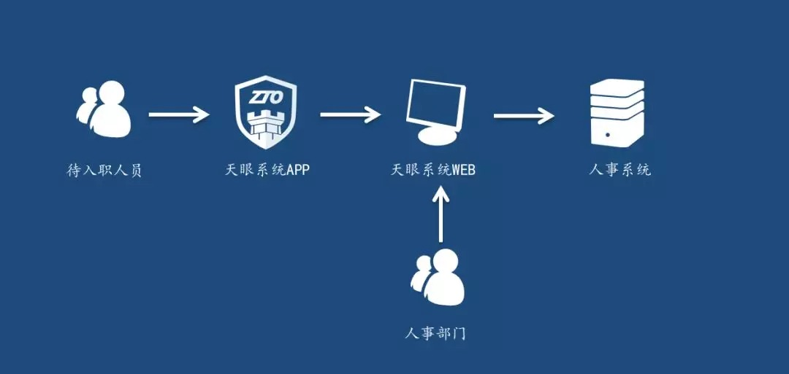
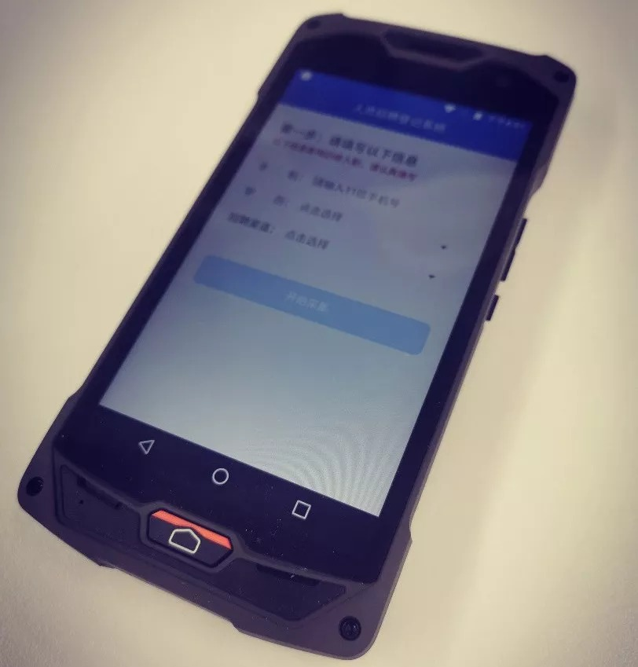
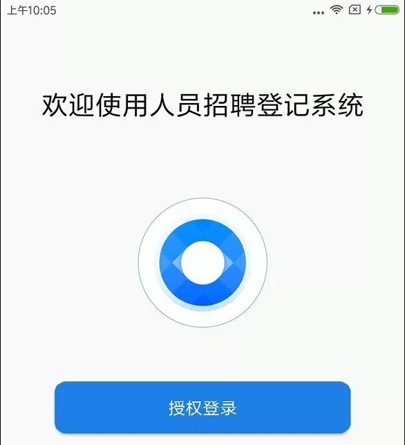
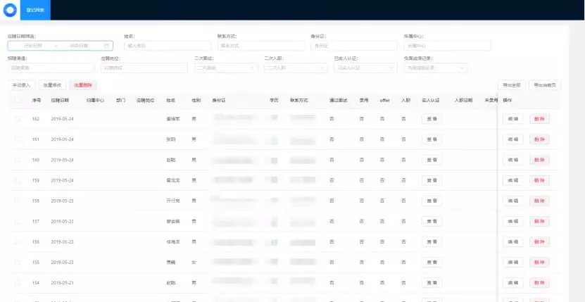
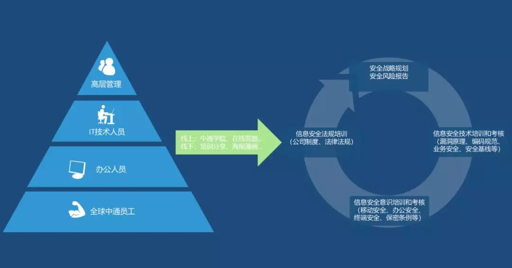
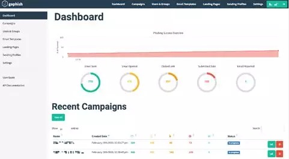
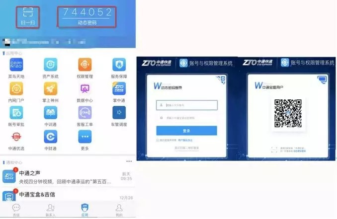
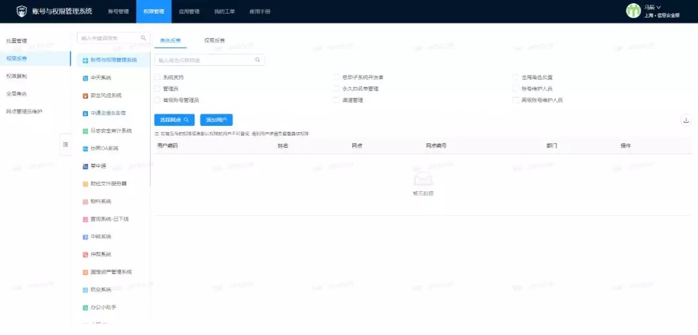
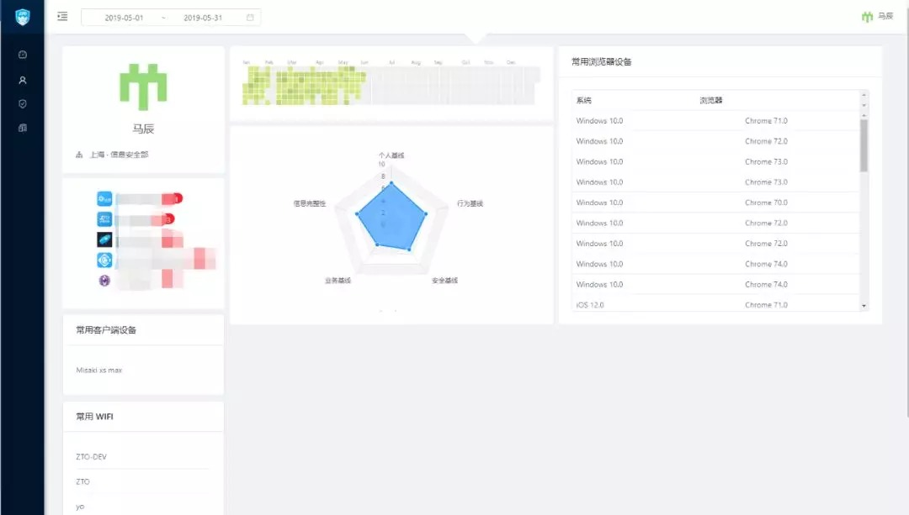

# 中通安全合规之人员安全实践

> 原文地址：[中通安全合规之人员安全实践](https://mp.weixin.qq.com/s?__biz=MzUyMTcwNTY3Mg==&mid=2247484402&idx=1&sn=df314f7d54c778864e10fd053ab3ecb9&chksm=f9d64255cea1cb43ad1644f0bb86d6c3fac637ff80e3938dc104ac07b831ede9dcadc9b2870c&xtrack=1&scene=0&subscene=93&clicktime=1559297884&ascene=7&devicetype=android-28&version=2700043b&nettype=ctnet&abtest_cookie=BAABAAoACwASABMABgAjlx4AVpkeAMCZHgDcmR4A+pkeAAOaHgAAAA==&lang=zh_CN&pass_ticket=2CKX5Hqk/BcOK2hGTH+PV4B3tD0RqxX47y3G13tk6Vyo1nNTzgP2Tu0gvbg2q4LR&wx_header=1)

## 背景
5月13日正式发布的“等保2.0”成为了最近安全圈子里的大新闻，同时也将等保和ISO27001等信息安全标准带上了新热度。作为国家关键信息基础设施企业，中通快递同样实施了等保，在实施等保的过程中我们系统地学习了信息安全管理体系，其中人员安全和合规是重要的组成部分。作为一家拥有几十万员工的企业，毫无疑问人是中通非常宝贵的资源，但同时人也是信息安全极其重要的要素，因此企业的人员安全和合规就显得尤为重要。 从生命周期的方法论来看，企业员工在企业内同样需要按照生命周期进行安全管理。从人员的入职到离职，在整个生命周期都应当伴随着人员安全管理。为了更好地保障人员安全和合规，中通安全围绕着企业人员的生命周期做了一些实践，在整个人员生命周期内针对不同的人员安全风险设计了安全流程，完成了整个人员安全生命周期的管理，大大降低了人员安全的风险。
## 企业人员安全的生命周期
中通安全目前将人员安全生命周期分为三个阶段：人员入职阶段、人员在职阶段、人员离职阶段。在人员入职阶段主要对人员历史信息进行检查、设置入职门槛、避免问题人员的流入。在人员在职阶段，中通安全秉承持续发展和动态安全管理的理念，加强人员安全培训的同时不断完善认证和权限的建设。在人员离职阶段，通过自动审计避免离职导致的侥幸心理带来的安全风险，也可以保证离职人员权限的自动回收。
### 人员入职阶段
随着中通快递的快速发展，越来越多的人加入到中通，人员的快速增长给人事部门带来了大量的工作，同时也出现了很多急需解决的痛点，例如：

- 一线操作员的大量入职，需要进行重复性的身份录入工作
- 部分员工存在身份异常等问题，入职后会带来很多后续麻烦

为了解决上述痛点，中通安全开发了天眼系统，通过中通天眼系统，仅需30秒即可完成上述内容，大大提高了人员入职环节的工作效率，并减少了人员安全问题的产生。 中通天眼系统由用户端的天眼APP和人事端的天眼WEB管理后台组成，用户端的天眼APP负责基础的人员信息收集和身份校验，完成后可以在人事端的天眼WEB管理后台查看采集的信息和校验结果。  图1 天眼系统
#### 天眼APP
在入职办公室内设置了专用于人事信息登记的移动终端，负责人员入职登记工作的人事需要在开启天眼系统时使用中通宝盒进行身份验证，通过后即可开启天眼系统进行入职人员身份登记。  图2 天眼系统定制移动终端 入职人员通过天眼系统APP仅需三步即可完成入职登记和校验工作。

- 第一步：输入基础的手机号、学历等信息
- 第二步：通过设备上的NFC模块读取身份证信息
- 第三步：进行人脸校验即可

但其实在简单的操作背后进行了多次的校验。

1. 普通的NFC设备是无法直接读取身份证明文信息的，天眼APP通过NFC识别读取到了身份证号的信息加密串后，通过公安网接口解密对应的明文信息，防止身份证造假行为
2. 在进行人脸校验时，除了进行活体检测，还会截取当前的人脸照片，通过公安网的接口校验身份证信息与人脸是否匹配，防止身份证盗用问题
3. 完成身份信息的读取后，通过物流从业人员黑名单、法院执行人黑名单等系统的接口对人员历史进行审查，避免履历造假、身份异常等问题

 图3 天眼系统APP
#### 天眼WEB管理后台
在完成人员入职登记后，人事即可在天眼WEB管理后台查看人员信息收集情况以及安全校验情况，在确认无误后即可直接登记入职并自动推送到人事系统，避免重复的录入工作和背景审查工作。  图4 天眼系统WEB
### 人员在职阶段
人员在入职之后需要做的安全管理相比于入职时会更多更复杂，中通安全对人员安全的管理的理念是持续发展和自动化控制。很多员工对安全的了解水平参差不齐，为了可以避免未来的潜在问题，需要潜移默化的不断引导员工学习安全知识，通过自我管理以规范员工的安全行为。
#### 人员的持续教育：中通安全培训体系
为了更好的引导员工学习安全知识，中通安全建立了中通安全培训体系。对高层管理人员、IT技术人员、办公人员、普通业务员等设置了不同的培训方式。通过差异化的培训，可以更好的让不同岗位的人学习到与其岗位相关的安全知识。 针对高层管理人员，通过安全风险的输出传达正确的安全理念，以便帮助高层更好的制定安全战略规划。 针对IT技术人员，每季度会组织一次安全技术培训，给所有本季度内入职未进行安全培训的技术人员培训安全开发等基础安全知识。为了让所有的技术人员可以更好的掌握基础安全知识，在完成培训后中通安全还会进行安全技术培训考试帮助技术人员巩固知识，考试结束后中通安全公布考试成绩，而考试未通过的人员需重修课程。 对普通的办公人员，中通培训部每月会组织一次新员工培训，中通安全在培训中设置了安全意识培训，对新员工进行信息安全介绍、讲解信息安全相关的法律法规、办公安全相关的要求等以提高员工的安全意识水平。 对于分布于全国的普通业务员们，中通安全会定期的通过漫画、通知等贴近一线业务员的方式推送信息安全知识。为了提高一线业务员的参与度，在信息安全活动中设置有奖竞答环节。只有不断地引导员工进行安全知识学习，才能营造良好的安全意识，将安全管理落实到员工的自我管理。  图5 中通安全培训体系
#### 人员的安全意识：中通钓鱼测试
人员的安全意识很难通过量化的数字进行显现，但是通过具体的行为很容易判断出一个人的安全意识是否及格。中通快递因为企业人员较多，所面临的信息安全相关的威胁也较多。其中最多的就是钓鱼邮件问题，为了提高企业人员应对钓鱼邮件的安全意识，除了培训和宣传外，中通安全在开源的钓鱼框架gophish上做了二次开发，不定期的针对不同的部门和人员进行不同主题的钓鱼测试，并要求所有的中招人员重新参加中通安全组织的专项安全意识培训和考试。通过钓鱼测试极大的提高了企业员工应对钓鱼邮件的安全意识。  图6 gophish钓鱼系统 人员的安全管理不仅仅包含人员的行为和意识，还包括对人员的帐号和权限的管理。中通作为一家集团性的企业，有着庞大的员工队伍和系统规模，为了保障人员的帐号和权限安全，中通安全开发了中通统一认证系统和统一权限安全管控系统。
#### 人员的帐号安全：中通统一认证系统
人员在完成入职后即可获得内部员工的身份，作为内部员工访问内部系统的凭证，还需申请内部系统帐号。中通安全以OAuth2授权框架为主, 同时支持LDAP和JWT等多种身份验证方式，开发了认证与权限管理相结合的中通统一认证系统（SSO）系统，支持了内部300+系统的统一接入。为了保障人员和系统身份的绑定安全，中通已经废除了常规的固定密码，中通安全开发了中通宝盒APP，提供了动态口令、二维码扫描、推送验证等多种身份认证方式以替代传统的固定密码，保障访问系统的安全性。关于中通统一认证系统的具体详情可以参考中通安全应急响应中心的文章中通统一认证（SSO）系统安全实践。
#### 人员的权限安全：统一权限安全管控系统
SSO负责验证人员是否可以登录系统，而登录了系统后可做什么则由统一权限安全管控系统负责。中通安全开发统一权限安全管控系统将所有的应用权限进行集中管理，通过灵活的权限管理可以快速的判断人员的权限情况，对人员的权限进行最小化管理。另外通过与风控等系统的联动，可以判断出人员的操作是否存在风险并及时进行告警和通知。关于统一权限安全管控系统的具体详情可以参考中通安全应急响应中心的文章中通统一权限安全管控系统实践。  图7 中通宝盒和中通统一认证（SSO）系统  图8 中通统一权限安全管控系统
### 人员离职阶段
生命周期有开始自然也就会有结束，当人员发起离职申请的时候便意味在企业的生命周期即将终止。不管因为哪种原因选择离开中通，我们都祝福每一个曾经的中通人有一个更好的未来。据调查，将近一半的人在离职后会测试曾经的权限是否被收回，所以对离职人员的权限收回就显得尤为的重要。
#### 人员的安全离职：自动审计系统
自动审计系统为了满足公司内审和外审的工作，会从各个核心系统中读取各类操作日志，自动进行日志分析和确认。而在人员发起离职流程后，自动审计系统会自动分析员工的历史行为，若存在异常行为会推送相关的领导进行确认，只有当所有的审计异常信息被确认，才能通过离职申请。在离职人员完成最后的离职流程后，自动审计系统除了会自动停用离职人员的帐号外，还会定期检查离职人员的帐号状况，避免未经授权的帐号启用等异常情况。  图 9 帐号异常信息审计
## 未来展望
人员的安全管理毫无疑问会是信息安全工作非常重要的一环，围绕着企业人员生命周期还有着很多的工作可以做。未来中通还会继续完善人员的安全管理，例如建立高危人员的快速识别和告警机制等等。
