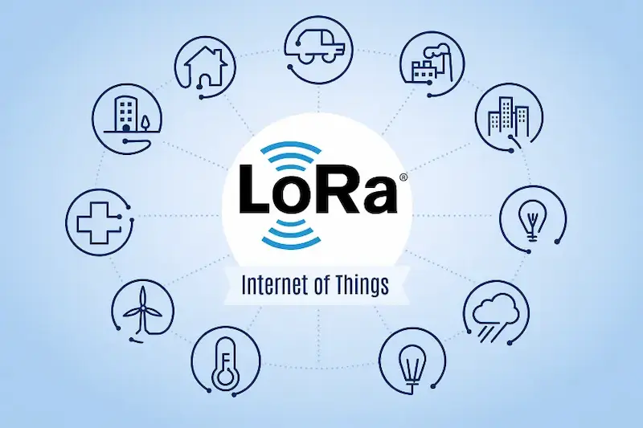
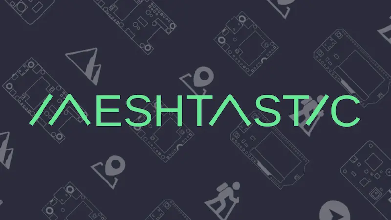
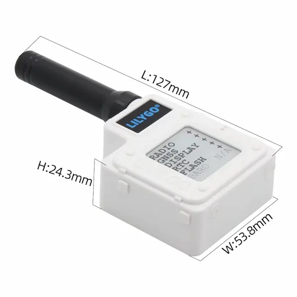
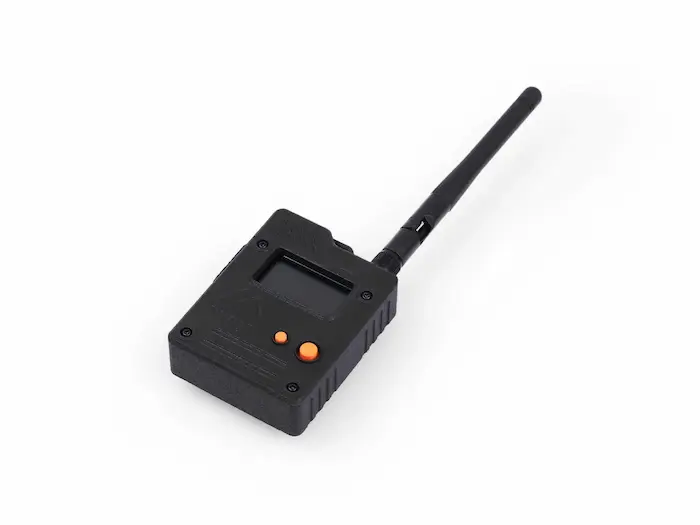
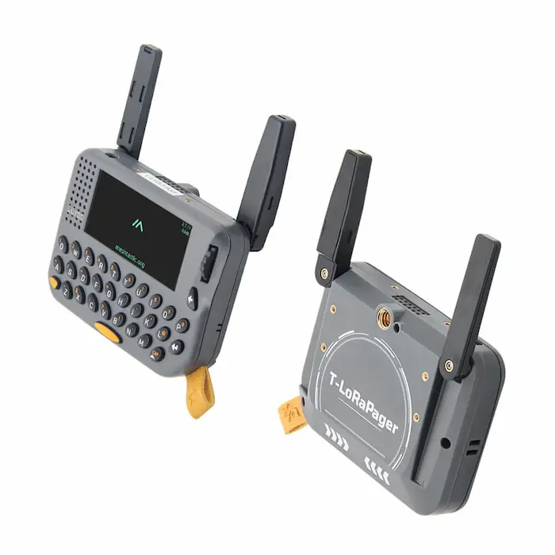
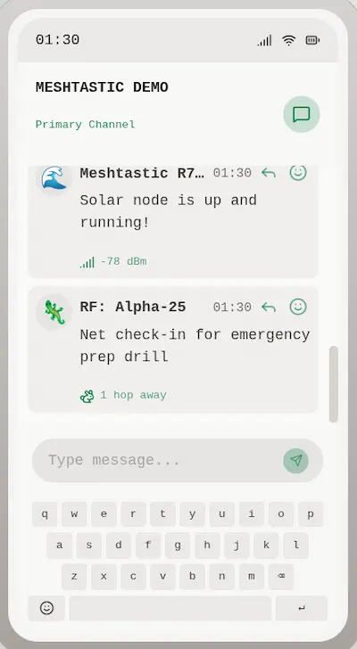

# 互联网通信的替代方案

> 摘录自[《科技爱好者周刊（第 396 期）：互联网通信的替代方案》](https://www.ruanyifeng.com/blog/2026/05/weekly-issue-396.html)

某天清晨，你醒来发现互联网断了，怎么办？

我说的是彻底的中断，完全不能运作，整个城市无法上网。这种事件虽然可能性很小，但还是有可能，比如遭遇了自然灾害或战事。

假设一时半会无法恢复通信，那么有没有替代方案？也就是说，**我们怎么自己组网**。

虽然互联网是无中心结构，搞一个子网并不难，但搞一个大规模子网，能够容纳一群分散的朋友，还是很难的。无论通过何种方式组网----无线路由、电话线、蓝牙或自己拉光纤----难度和成本都不低。

今天，分享一个我所知的最简单组网方案。

1. 覆盖范围达到几十公里，甚至更远。
2. 不需要架设任何线缆，自己发射无线信号。
3. 供电只需要一个移动电源，甚至一节电池。
4. 价格非常便宜，单套设备（发射端+客户端）最多只要几百元人民币。

唯一的缺点是带宽比较小，不能用来浏览网页，更不能看视频，只能发送/接收文本信息。

这个方案叫做 LoRa，或者严格地说，它的通信协议叫做 LoRa，也就是"长距离"（Long Range）的缩写。

LoRa 协议是专为远距离通信而发明的，只需很小的设备和一点点能量，就能向周围发送无线信号，有点像个人的无线电广播。它的编码算法特别强调抗干扰，哪怕信号非常弱，也能还原出来，所以可以远距离接收。

它本身只是一个无线信号的协议，需要自己实现发送/接收设备，完成编码和解码。开源项目 [Meshtastic](https://meshtastic.org/) 就做了这件事，规定了软硬件接口，并给出了设备实现。

所以，一切就很简单了。**你只要找 Meshtastic 兼容设备，人手一个，就能组一个简单的通信网**。它自己会在所有节点之间网状传递消息。

在国内电商网站上，Meshtastic 终端设备一个从几十元到几百元人民币不等。它是开源系统，任何厂商都可以生产兼容设备，官网有一个[设备名单](https://meshtastic.org/docs/hardware/devices/)可以查看，下面是几种终端设备的样子。

官网也提供各种平台的[软件客户端](https://meshtastic.org/docs/software/)，下面就是手机客户端的界面。

前面说过了，它的终端耗电量很小，只需要充电宝，就能长时间使用（几天到几周），如果配上随身太阳板，可以永久在线。

两个节点之间的传输距离5公里以内没有问题，如果建筑不密集，可以达到10公里～15公里；如果是空旷地带（比如水面），则可以达到几十公里或更远。多节点组网后，消息就能接力传播，那就传得更远了。

综合以上各点，这应该是最简单实用、最便宜的个人组建通信网方案了。它替代不了网页，但可以替代互联网的消息功能。