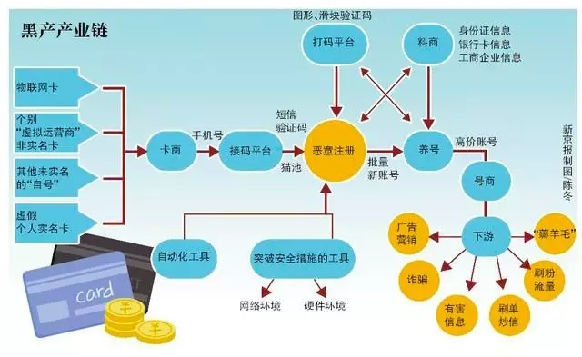
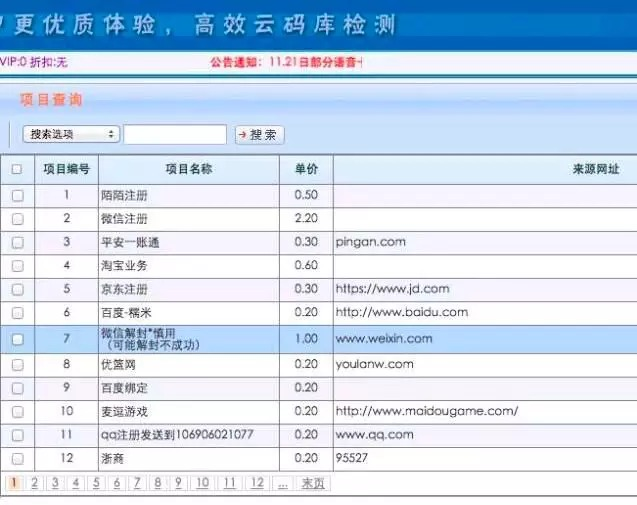
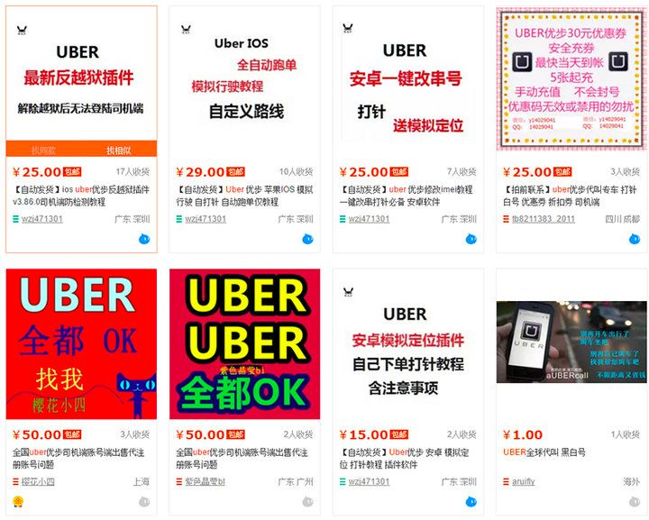
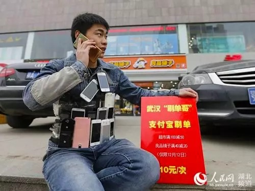
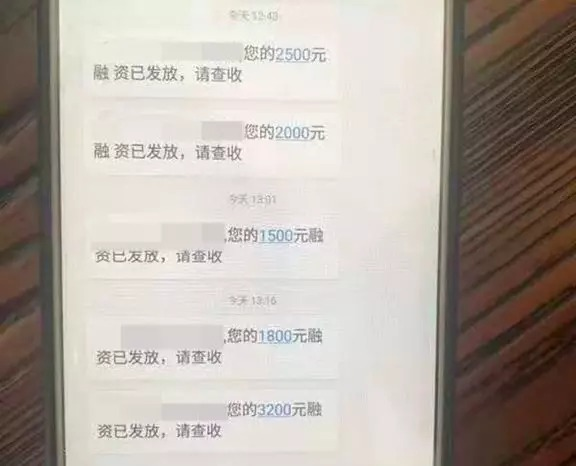
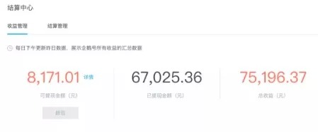
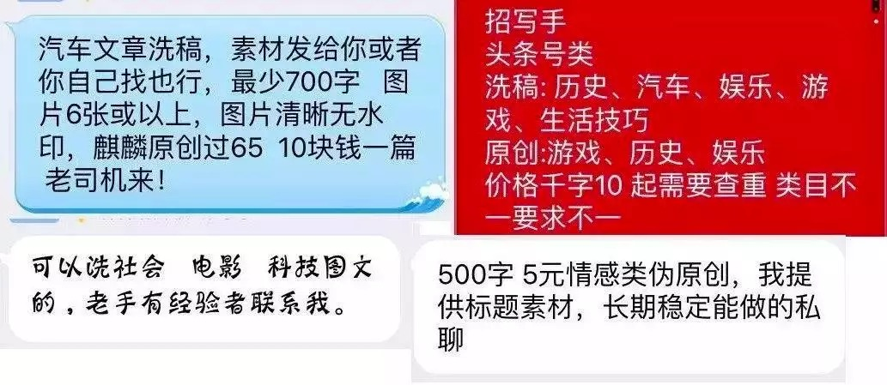
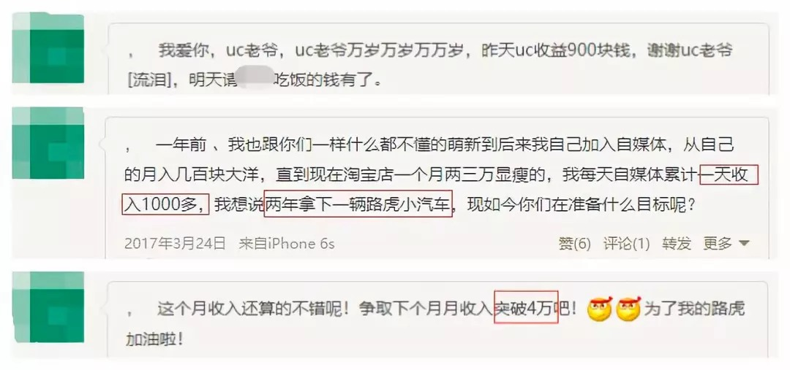
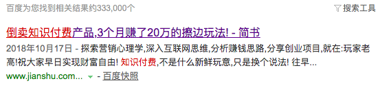

# 互联网黑产：那些职业羊毛党到底如何月赚几十万？

> 原文地址：[互联网黑产：那些职业羊毛党到底如何月赚几十万？](https://mp.weixin.qq.com/s/TrIqZ7FPoCRXyicZnEg6Ow)

> 世界上有没有一种职业
> 可以用最少成本赚最多的钱？
> 可以用最少时间获得最多的回报？
> 可以没有技能赚得却比有颜有才的人多？
> 甚至可以在四五线城市赚一二线城市的钱？

看这篇文章之前，相信你和我之前的答案一样，掷地有声两个字：“没有”，因为不劳而获躺赚都是骗人的。但看完文章，相信你也会和我一样感慨：**“原来还真有”**。

今天，我们就给大家介绍一群 **生存在互联网灰色地带的职业羊毛党**，他们有组织有纪律有完整产业上下游的去利用一些大型互联网公司的运营规则甚至漏洞，套取各种补贴和奖金，少的月收入一两万，多的月赚几十万。

这些人一般活跃在什么平台？有哪些曾经或现在很常见的薅羊毛手段？给你介绍五种。
## 1. 套取新用户补贴，年收入百万
要说这群职业羊毛党从什么时候就开始有了，应该就是从大型互联网公司有新用户补贴那天开始。

所以我们介绍的第一种方法就是 **套取新用户补贴，这也是一种行之有效的手段**。

一般情况下，一款App新用户注册都有补贴，多数是使用门槛很低的优惠券，比如买10块钱的东西就能减9块。如果用户每次买东西都想要优惠，那么每次用新手机号注册就行。

一般人因为只有一个手机号，所以都只会注册一次享受一次优惠。但是，有需求，自然就有供给。一条养卡、注册账号、代收短信验证码、薅羊毛的产业链就这样形成了。

图片来源：新京报

**产业链的上游是卡商**，他们用猫池养着大量的手机卡，猫池是一种可同时支持多张手机卡的设备，根据机型不同，插口从8到2048不等。通过猫池，手机卡可以直接拨号和接收短信，而上游卡商就靠售卖卡号和验证码赚钱。

**中游是卡商平台，又称为验证码平台，这个平台上活跃着两类人，上游卡商和下游羊毛党**。卡商将手机卡号码和验证码放到平台售卖，羊毛党可以在平台购买，平台提供软件支持、业务结算，赚取分成。根据验证码属性不同，平台与卡商分成比例也不同。

据之前媒体报道，语音类验证码五五开，短信类验证码三七开，卡商占七成。目前较大的卡商平台有星辰、Thewolf、爱乐赞、玉米、爱码等。平台手机卡很多，有的平台能提供上万个网站的接收验证码服务，几百万张手机号。

图片来源网络

除了手机号，微信号也成了销售对象。根据《腾讯网络安全与犯罪研究基地》公众号发布的黑产市场微信号价格的变化趋势数据，2018年6月，微信新号的价格8元一个，老号价格70元一个。

**下游数量庞大的羊毛党一般活跃在贴吧、社区、QQ群等社交媒体**，发布各种薅羊毛信息，还形成一套师傅带徒弟的体系，收费从88元到888元不等。据《第一财经》报道，目前羊毛党的直接从业者超过40万人。

**有些时候，羊毛党厉害到能搞垮一个产品。**

2015年11月，快操盘推出“充1分钱返500元”的活动，无限制提款，一夜被薅近亿。

2018年12月，星巴克上线“星巴克App注册新人礼”活动。羊毛党迅速注册大量虚假账号，领取活动优惠券，导致星巴克紧急下线活动。网络安全厂商“威胁猎人”估计，短短一天半时间，按普通中杯售价估算，星巴克损失可能达1000万。

为了防止被薅羊毛，互联网公司也使出一些手段，比如短信验证码变成语音验证码，提高技术门槛；用户手机号与手机识别码绑定，一机一码才认定为新用户。但是这些手段并不能杜绝羊毛党，只能让薅羊毛的成本越来越高。

不过，也存在一些公司为了冲用户量，找到羊毛党。

普通用户是用户，羊毛党也是用户，找羊毛党，营销成本低，难度也低。尤其是互联网金融行业，常规获客成本极高，找羊毛党则低得多。一本财经曾报道，互金公司百万的预算，如果全用羊毛党，只需30-50万，剩下的几十万的利润分成。一名互金行业运营人员，靠着频繁跳槽，哪家公司预算高就去哪家，5年跳了7家公司，年收入早就过了百万。

这么容易赚的钱，偶尔薅翻车的情况也有。

2018年，斐讯在京东推出0元购。路由器标价399元，返现399元，钱返到合作的互金平台联壁金融App中，一个月后可以提现。羊毛党一拥而上，想通过返现白拿一个路由器，结果遇到P2P行业爆雷，联壁公司涉嫌违法犯罪被公安部门侦察，399也拿不回来了。
## 2. 刷单套奖励，月入十万
**有奖励的地方，就有刷单。**

**O2O打车软件大战时，刷单非常疯狂，特别是Uber**。2015年时，Uber在中国每天有上百万的订单，不过，有媒体爆出30%-40%是刷单。当然也是Uber初入中国，完全低估了国人的小智慧。

Uber的补贴政策是每天跑满10单奖励120元，15单170元，20单220元。新入司机每天完成20单甚至还有500元奖励。

为了快速完成补贴单量，有的司机接到单，未到目的地提前结束，让乘客再下一单，乘客可以使用两次优惠券，司机跑一趟也有两单。

Uber车主还建了刷单群，在群里有专门的黑话，辅助刷单的叫【护士】，车主称为【病人】，刷单就是【打针】。车主根据自己的位置让【护士】下一单，然后开着空车跑一趟，完成后再把乘车费和佣金转给【护士】。车主则获得平台的奖励。这种刷单手段还需要空跑一趟，要油费，最为初级。

**高级一点的做法是带着一堆手机坐地铁，坐公交，坐火车**，油费都省了，不仅车主可以刷，没有车的人PS一张驾驶证和行驶证，在大街上随便拍一辆车，照样可以注册成为车主。

**更高级的做法是利用模拟软件+虚拟定位，足不出户就能刷单**。只需要买一个可以修改串号的安卓手机，同时登录几个乘客和司机账号，通过电脑虚拟操作，模拟跑一圈就完成一单。可变成本几乎为零。通过刷单，月净收入可以达到1.5-2.5万。

**也有职业刷单人，专门帮司机刷单，一个月最高月入10万。**

如今去打车，遇到一些司机还能给你讲一讲当年的盛况，言语间流露出自豪。 后来，只剩下一家公司，打车刷单也就消亡了。

但是刷单仍然活跃网上，哪里有补贴，哪里就有刷单。外卖，拼团，生鲜电商，互联网金融，统统不能幸免。 双12线下活动时，武汉出现一名刷单哥，带着百部手机代刷优惠，一天赚上千元。

**手动刷单，这种薅法，不侵权不作弊，平台拿你也没办法，缺点就是成本有点高。**
## 3. P2P借贷“黑吃黑”月入十万是基础
你看中人家收益，人家看中你的本金。

P2P爆雷让很多参与者倾家荡产，观望者望而怯之，但在一些人看来，爆雷算什么，714高炮算什么，从来都不害怕和紧张，他们看到的全是捞钱的机会。他们就是撸贷大军，P2P网贷的另一端用户。

平台有1000%的年化利率，照样贷，因为他们根本就没有打算还钱。

撸贷者只需要买一张电话卡，养卡半年，一次性下载几百个网贷App，挨个贷款，贷完后立马剪卡，从此人间蒸发。电话卡里的所有通话记录都是伪造的，亲朋好友都不会被催收，身份证地址也找不到人。

撸贷大军在网上至少有几十万人，有撸得多的，一次性撸出50万。他们从不认为自己不道德，反而还站在道德高地：**我们不是老赖，我们只是高利贷的终结者**。

2017年底，现金贷监管后，一部分人还清贷款，上岸重新做人。

这样做风险非常大，你必须和现在的朋友圈断绝关系，不能再用自己的身份证办手机卡，还可能成为老赖。

**于是有P2P从业人员不自己撸贷，而是下海当起了中介教别人撸贷**。他们熟悉平台的规则和风控体系，知道如何才能撸更多的钱，甚至还会买通一些现金贷的风控主管。

中介从内蒙古、甘肃等西部地区寻找客户，这些地方信息相对闭塞，还不知道现金贷是什么，当地人也没有违约等不良信息。中介教他们用现金贷贷款，贷到钱后对半分，几天之内就能下款6万。贷款的人拿3万，中介拿3万，当地人收入一个月才两三千，这比他们一年的收入还多。

有的中介提成更高，甚至高达70%-80%，也就是贷1000块，中介拿七八百，贷款人只有两三百。干得好的中介，一个月最高有50多万收入，少的时候也有10多万。

**中介一般还搞培训，教别人如何撸贷，一个月下来，培训费就能赚几十万。**

还有些客户资质太差，贷不款，中介就会将这些信息收集起来，与平台合作，注册账号，但不下款，每个账号也有8-10元的返佣，一个月下来也是两三万收入。

**总之，无论你有钱没钱，贷不贷款，每一位客户的价值，都要榨干。**

在撸贷大军的行动下，平台被撸垮也是常见的。有平台创始人透露，自家产品被撸贷大军看中，当自己正高兴用户增长时，却发现一个还款都没有，一天损失高达70万。

这些撸贷者从来不怕催收，网贷平台通常用“呼死你”来催收，而他们开发了防爆软件，只要输入手机号、身份证号和贷款平台名称，平台的催收座机就会被拦截。撸贷者还会主动进攻，反向轰炸催收电话。在很多反催收的群里，只要提供被骚扰的截图，一些老哥会免费帮网友轰炸催收。

**PS:薅羊毛有风险，搞不好被罚款，还可能坐牢。**
## 4、做号集团：洗一篇稿赚几万
今年3月份，知名自媒体三表龙门阵写了篇文章，自述企鹅号被盗经历，一名叫露露的河南女子，用他的号平均每天发五篇娱乐八卦文章，六十天收益高达7.5万，最高一篇文章分了1.2万。而自己之前日常更新文章却根本没赚到钱。

相信，全天下自媒体人都会好奇，内容平台一出手补贴几个亿，但 **自己辛苦更新原创，一共也就赚了几十块钱，补贴都到哪里去了？**

在露露的背后，就是做号集团，补贴都被他们拿去了。

**补贴一般是根据阅读量来算，阅读量越高，收益越高**。做号集团对各平台内容特点把握得非常到位，能做到量产高阅读量爆文。

他们雇佣兼职写手来洗稿，以学生、宝妈和上班族为主，群里领取任务，价格通常为千字10元。也有全职写手，公司开在二三线城市，工资一个月三四千元，加上提成，优秀者月入过万不是问题。

通常，洗稿内容集中在娱乐明星八卦故事，利用明星效应，调动起读者窥私欲，再靠着劲爆的标题和捕风捉影的内容，能带来大量阅读。

图片文章可能出自大妈之手

**一篇文章阅读量过百万，广告分成+补贴，收益多的上万元**。据新榜报道，30人的做号集团，一个月平台分成700多万。还有UC平台上有留言，一日收益达900元；两年拿下一辆路虎；期待下月收入破4万。

## 5、倒卖付费课程：零边际成本
**凡是能倒卖的，统统不能放过。**

知识付费课程火起来时，一些人通过众筹的方式实现低价购买课程，一门课程199，100人众筹每人也就2块钱。

既然能众筹，何不自己当二道贩子？只需要把课程复制粘贴，放到某网盘里，转手就能在网上卖几块到几十块，几乎不需要成本。通过网盘分享，后期更新也能做到同步，不用再一个个地重新发给顾客。

想学习的人也很喜欢低价课，199的课程，9块9就能买到。

二道贩子再通过淘宝，百度贴吧、微信群、个人号等渠道推广，哪有不赚钱的。有些人做倒卖，3个月就赚到20万。

从二道贩子买过课程的人，同样做起三道贩子、四道贩子…… **永远不知道你买到的课程是几手，但这无所谓，质量都一样**。

**行业竞争大了，有的二道贩子开始注重服务。他们做的服务甚至比平台原版还好。** 当平台还在单门课程销售时间，他们已经开始做包年服务，一年99元，可以看几乎所有主流平台的内容，包括得到、喜马拉雅、混沌大学、千聊、荔枝微课、网易云课堂等等。论品类，他们已经超越了任何一家平台；论价格，他们也有优势，能卖得不好吗？

**了知识付费课程可以转手卖，盗版游戏、电子书等一切付费稀缺资源都成为贩卖对象，单价虽然低，做起来靠量也是一笔不小的收入。**

以上介绍的5种互联网黑产薅羊毛手段已经有些过时了，现在互联网平台对付手段也变高明了，薅羊毛的操作空间也越来越少，于是羊毛党开始把对象放到传统企业，这些企业上网后反作弊的经验普遍不足。一个风口过去了，他们又去追逐下一个风口。

_**最后，蛋解创业编辑部还是提醒每一位：空手套白狼，大家都爱。但是，互联网黑产薅羊毛有风险，有些罚款有些甚至要入狱，我们仍然坚信“一分耕耘一分收获”。**_
