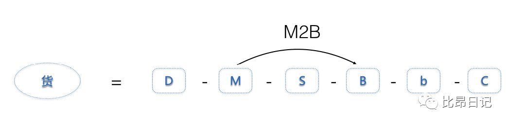
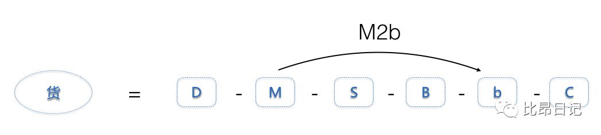
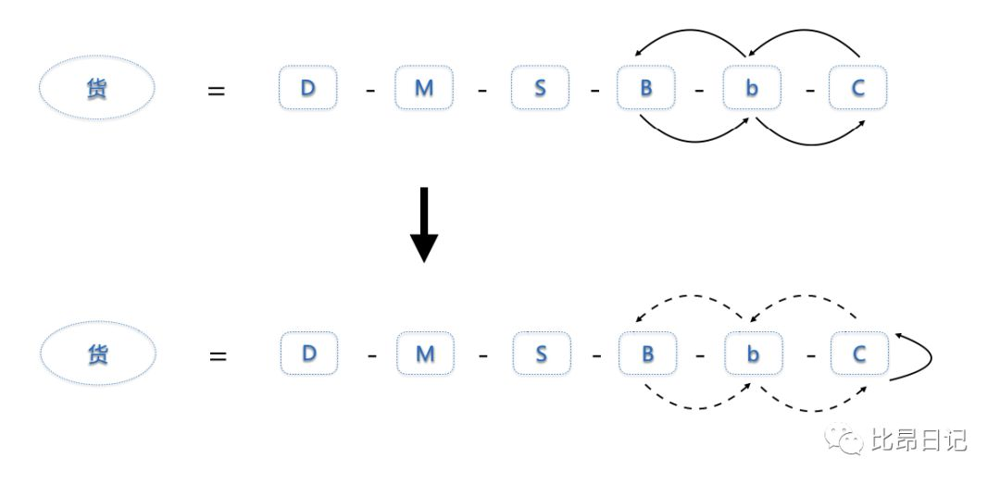
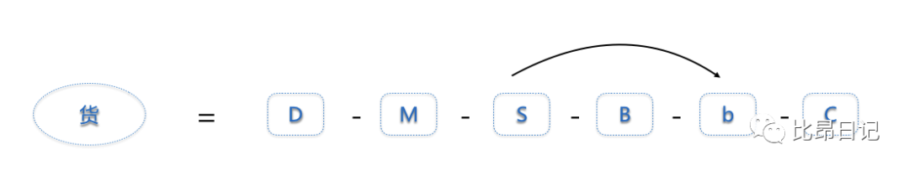
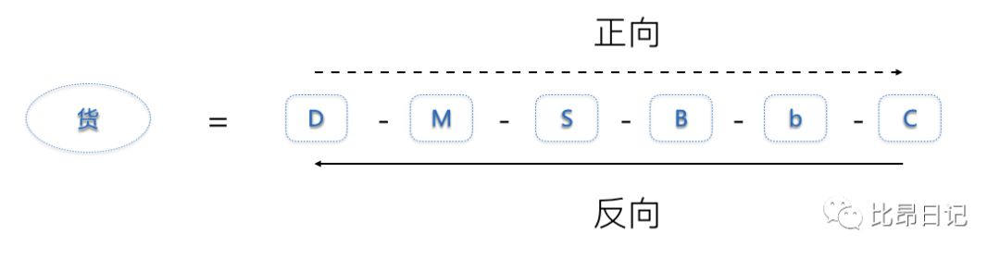
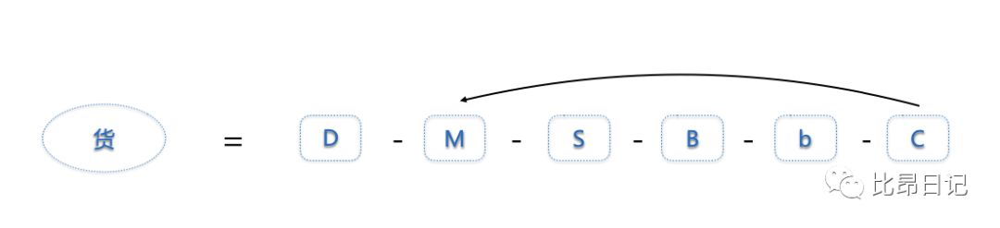

# 什么是新零售

> 原文地址：[什么是新零售（上）](https://mp.weixin.qq.com/s/EHpkJNsbL1zckK_ilO5KZA)，[什么是新零售（下）](https://blog.csdn.net/onehao/article/details/94517763)

## 什么是零售
**人**，为什么商家要给购物中心支付租金？租金的本质是什么？为什么租金和人流量正相关？ 购物中心之所以收商家的租金，是因为购物中心为商家带来了流量，人流量是真正的核心价值。租金的本质，是购物中心把人流量折算成一个价格，卖给商家。  怎么吸引流量，然后将流量变现的能力。 流量经济，就是要研究销售漏斗公式：   **货**，可以归纳为D-M-S-B-b-C 

- D=Design（设计），指产品款式的设计过程；
- M=Manufacture（制造商），也有人称其为工厂；
- S=Supply Chain（供应链），通常指的是总代理、省代理、分销商、经销商等机构；
- B=Business（大B，商场），指的是大卖场、超市、连锁店等；
- b=business（小b，商店），指的是夫妻店、地摊、微商等个人销售者；
- C=Consumer（消费者），也就是最终端的客户。
> 以皮鞋为例，设计师（D）研究市场、研究人体、研究时尚，设计出一双皮鞋，然后把设计卖给制造商；制造商（M）开模具，购买原材料、设备，雇人把鞋子做出来；皮鞋通过总代理、省级代理、市级代理等供应链企业（S），通过物流完成在全国的铺货，建立存库；皮鞋陈列在大商场（B），或是微商的朋友圈（b），抵达消费者；最终，消费者（C）下单购买。
> 整个商品供应链，每个环节都有其独特的价值，并为此获得自己的利润。但一般来说，我们把“D— M”称为创造价值，做鞋子；把“S—B—b”称为传递价值，卖鞋子。

**场**  零售的本质，是链接“人”与“货”的“场”；而“场”的本质，是信息流，资金流，物流的万千组合。
## 新零售
优化商品在人、货、场之间的有效传递方式，就是新零售。 第一个逻辑是“坪效革命”。坪效是每一平方米场地产生的营业额。简单地说，就是如何高效地为顾客提供最有价值的货品，如何提高转化率、客单价、复购率。 第二个逻辑是“数据赋能”。通过比较线上、线下孰优孰劣，研究如何利用线上、线下各自的优势来提升零售效率。 第三个逻辑是“短路经济”。定倍率过高，就是因为中间环节太多，在传统零售模式下，要经过总代理、一级代理、二级代理等，才能进入商场。在这种情况下，商场其实扮演的是“二房东”，环节过多、效率过低。短路经济，就是通过短路中间不必要的环节，从而提升效率。 新零售就是更高效率的零售。用数据赋能，提升“场”的效率；用坪效革命，提升“人”的效率；用短路经济，提升“货”的效率。
## 数据赋能
 **信息流：高效性vs.体验性** 互联网擅长信息流的高效维度，更快，更全，更便宜，线下擅长信息流的“体验维度”，更复杂、更多感、更立体。新零售的方向是结合互联网的高效性与线下信息流的体验性。 **资金流：便携性vs.可信性** 互联网的资金流，相比于线下，缺乏可信性，利用大数据赋能，将京东白条，蚂蚁借呗给历史信用良好的用户使用，让用户买东西之前不用付款，让共享单车让信用好的用户免押金骑走。数据赋能让零售不在在便携性和可行性之间做选择题。 **物流：跨度性vs.即得性** 衡量跨度性最重要的指标是快，衡量即得性最重要的指标是近。 从人找货，到货找人，利用大数据分析，可能需要哪些货物，全世界的货物向你奔来，这就是电商物流跨度性的优势。 但是线下就没有优势了吗？恰恰相反，线下物流，依然是传统零售在“三流”中最大的优势 – 即得性。小区遛弯，突然想喝酸奶，雪糕，忍受不了网上第二天到。 让线下商品离你更近，或者让互联网的物流更快，都是新零售的机会。
## 坪效革命
这套逻辑，设计上就是“销售漏斗公式”。   不过，销售公式可以用来衡量销售额，却无法衡量销售的效率，如何来衡量销售的效率呢？根据成本结构的不同通常分为“人效”或者“坪效”。 线上互联网成本结构和员工人数基本相关，所以重视人效，即每个员工创造的年收入。 人效 = （流量 * 转化率 * 客单价 * 复购率） /  人数 线下零售的成本结构和店铺面积基本正相关，一般用每平方米的年收入额来衡量 – 坪效。 坪效 = （流量 * 转化率 * 客单价 * 复购率） /  店铺面积 传统的方法，尽量接近坪效的极限，这需要用户思维和产品思维，但是要突破刘润老师提到了要突破坪效极限，唯有依靠交易结构思维，用时代赋予的高效率工具，才能做到。

- 流量 – 一切与消费者的触点。要进入新零售企业要做的第一件事，就是用“流量思维”取代“旺铺思维”。旺铺思维是坐在那里，等着消费者来；流量思维是用户在哪里，就跑到哪里去。
- 转化率 – 提高转化率，找到社群很重要。一群有共同兴趣、认知、价值观的用户更容易抱团，形成群峰效应，在一起互动、交流、协作。
- 客单价 – 更透析数据，更洞察用户。提高客单的传统方法，是“连带率”。当遇到流量天花板，需要寻找新的流量，提高转化率，增加客单价。
- 复购率 – 体现忠诚度。在小米的案例的时候提到了：另外，在盒马鲜生案例中提到了，做好“顶层设计”。定义了盒马鲜生的本质，其实是获取流量的方式，用户最终的留存是在网上，复购率也是在网上。
   1. 爆品战略 + 大数据选品。爆品战略的好处是可以在单品上倾注更多的心血，并且可以带来巨大的销量进而带来供应链成本的降低。
   2. 提高连带率 + 增加体验感，连带率就是卖了一样东西，顺便多买了其他几样。
   3. 强化品牌认知 + 打通全渠道。米家有品，小米商城，小米之家。
## 短路经济：环节越短，效率越高
商品供应链，人与货不必在商场相见，书中提到了一个定倍率，类似的意思是服装业接过来的一个概念，一个商品的价格，直接乘以一个倍数，其中包括设计一个产品的成本，未来卖出去，可能要不同的号码，渠道，所以你买的服装可能是同时付了几个号码的钱，服装可能相比手机更复杂，分型号，款式，号码，不同号码不通用，进而带来库存，所以有存在了奥特莱斯这种工厂店，用来售出冗余的号码。 **定倍率越低，效率越高。** 还要考虑消费频率，化妆品属于低频消费，长时间卖出不去多少，但零售商要付出同样的租金、员工工资等，所以化妆品的定倍率一般很高。 短路经济，德鲁克说过，当今企业之间的竞争，不是产品时间的竞争，而是商业模式之间的竞争。 什么是商业模式？商业模式，就是利益相关者的交易结构。 新零售不仅要有用户思维，产品思维，还要有交易结构思维，优化自己的商业模式。 短路经济主要体现在两个方面： 缩短环节，如百货商场和链条反向，如团购。
### a. 缩短环节

- Costco， M2B模式，尽可能减少中间环节，做到更高效的零售。

- 名创优品，店面都比较小，选址很好，一种介于直营和加盟之间的开店模式，叫做“直管”。直营，就是自己投资，自己管理；加盟，就是别人投资，别人管理；而直管，就是别人投资，自己管理。

- 闲鱼，瓜子二手车：C2C。

- 天猫小店：S2b。

### b. 链条反向
 如果能能拿到真实需求，按需生产，较少库存。

- 海尔的无灯工厂、上汽大通C2B智能选配：C2B
- 必要商城，C2M， 反向定制本质，是反向，不是定制。一端连着消费者，一端连着制造商，不但反向，还短路掉b，B，S等一切不必要的环节，砍掉所有不必要的成本，用高质低价吸引消费者，用零库存吸引顶级制造商。

 C2M的优势，通过反向定制，取消了中间环节，做到零库存。如上文提到，过去一件衣服有很大成本是为库存买单的。 总结一下，什么是新零售？

1. 零售的本质，是连接“人”和“货”的“场”；
2. “场”，是信息流、资金流和物流的万千组合；
3. “人”，会通过“流量 * 转化率 * 客单价 * 复购率”的层层过滤，接触“货”；
4. “货”，要经历D-M-S-B-b-C的千山万水，抵达“人”。

如何提高新零售的效率？

1. 用“数据赋能”，优化信息流、资金流、物流的组合；
2. 用“坪效革命”，提升流量、转化率、客单价、复购率的效率；
3. 用“短路经济”，缩短D-M-S-B-b-C的路径。
