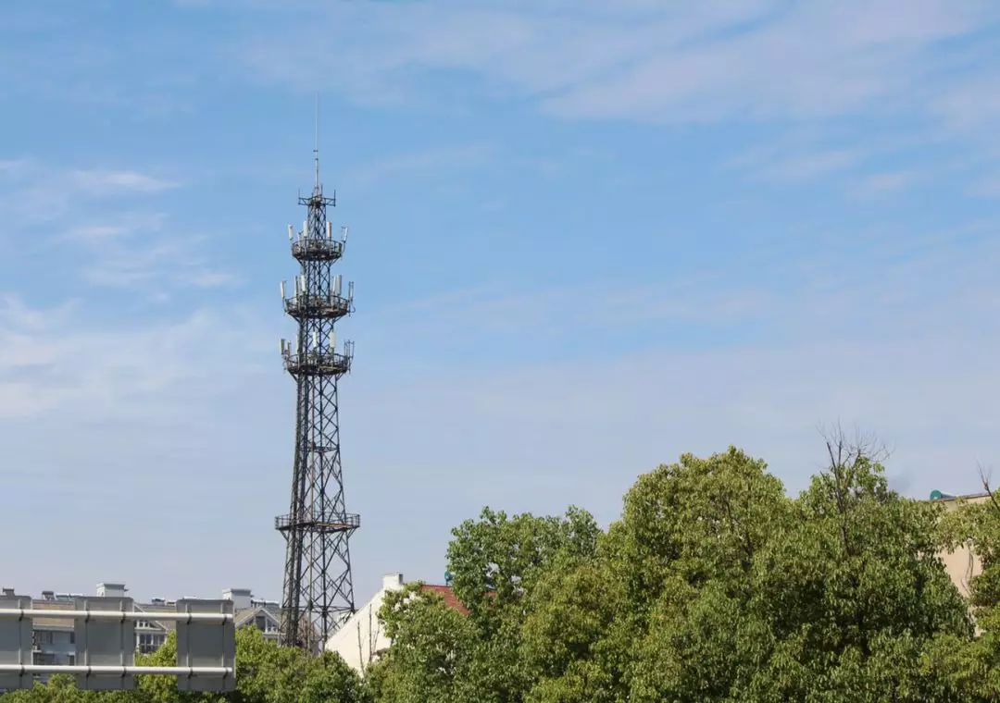
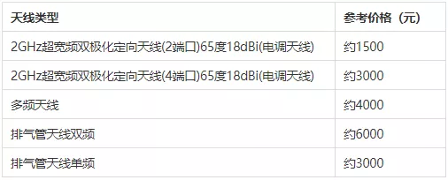
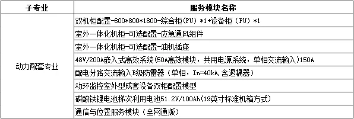
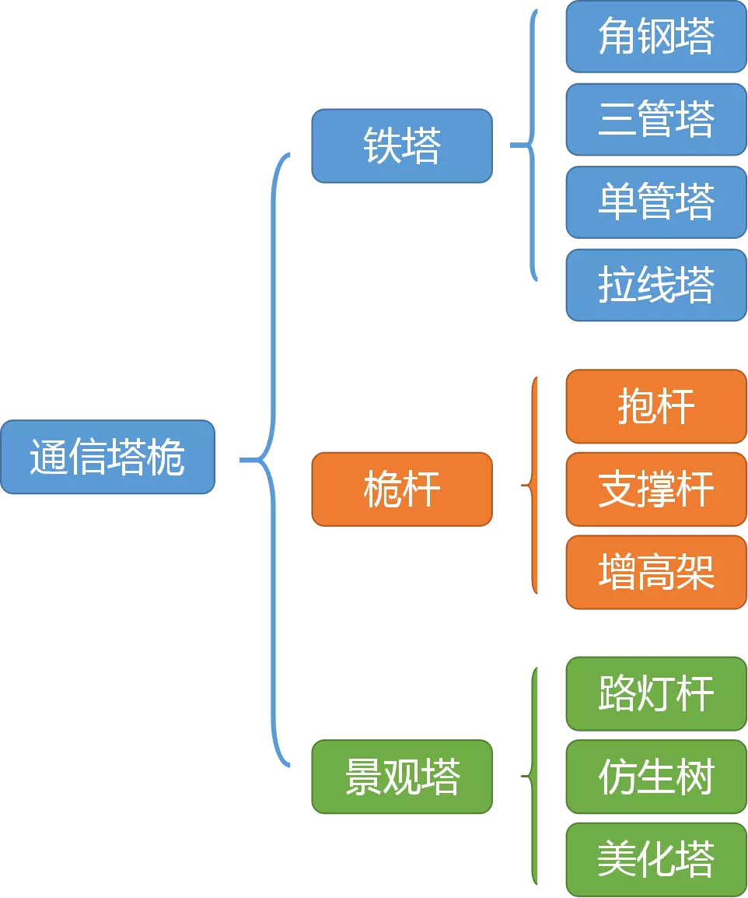
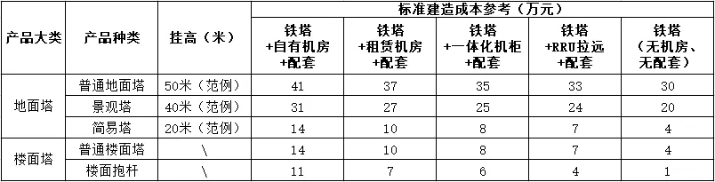

# 建一个5G基站，到底要花多少钱？

> 原文地址：[建一个5G基站，到底要花多少钱？](https://mp.weixin.qq.com/s/26BHCsWXCLPDUhRqXOpYBw)

自从国内5G正式宣布商用之后，全国各地的5G网络建设速度明显加快了。

5G基站的身影，出现在越来越多的城市、角落。5G信号的覆盖范围，也在不断扩大。

这意味着，5G的投资已经全面启动，并且在不断增加。

一直以来，“5G究竟要花多少钱”，是人们普遍关心的话题。有人说，5G的投资将会是4G的2~3倍。也有人说，5G的总投资将到达惊人的1.5万亿元。

根据最新的《2020中国5G经济报告》，国内2020-2025年的5G网络总投资额是0.9~1.5万亿元。

这笔投资的最大一部分，将花在5G基站的建设上。

那么，作为5G投资的重要对象，5G基站，它的成本究竟是由哪些部分组成的呢？这些成本，有没有下降的可能性呢？

今天，小枣君就来做一次5G基站的建设成本分析。

我之前曾经介绍过，基站一般可以分为宏基站和微基站。室外那种大铁塔的，是宏基站。目前我们国内正在规模建设的5G基站，也是宏基站为主。

宏基站

我们就先从**宏基站**开始说。

一个5G宏基站，目前通常包括以下组成部分：

下图是4G宏基站的组成部分，放在一起对比：

可以看出，相比4G宏基站，5G时代，RRU（射频拉远单元）和天线馈线“合并”，变成了AAU（有源天线单元），通过光纤和BBU（基带处理单元）相连。（注意：BBU按真正5G来说，是变成DU和CU的，如下图所示。但是目前国内建设还没有到那个阶段，还是BBU+AAU为主。）

4G基站和5G基站的区别

5G宏基站的成本，一般来说，是由**主设备、动力配套设备设施、土建施工**共同组成。

像BBU、AAU、传输设备这些，就是主设备。像电源、电池、空调、监控这些，就是动力配套。而机房这些，当然就是土建施工了。

**先看主设备。**

目前5G还处于刚起步的阶段，各个设备商的5G主设备价格还存在变动。而且，单买一个设备的价格，和运营商集团采购（集采）的价格，存在巨大的差距。

举个例子来说，目前，某设备商的标配（1个BBU+3个AAU），只算硬件的价格，报给国内运营商大约是20万元人民币（以下如未特殊说明，单位都是人民币）。而在国外，可以报到30-40万人民币的价格。

网友透露的AAU价格，差不多。

5G AAU

如果你作为个人去找设备商，**1BBU+1AAU**，对方敢报80万。非主流厂商也敢报30万。（别问我怎么知道的，因为我刚去问过。）

所以说，主设备的报价差距是非常悬殊的。我们暂且还是以国内运营商购买的价格来算，大约**20~25万**吧。

BBU一般包括基带板、主控板、电源模块等。基带板价格最贵，占成本的大头（1~2万）。主控板和电源啥的，不值钱，几千块。

同时支持4G和5G的BBU

顺便说说4G主设备的价格，一般BBU1~2万，RRU1万左右，天线1~5千不等。

国内天线价格，仅供参考

**再来看看动力配套的费用。**

动力配套设备为基站提供电力和降温保障，是一个基站正常运行的前提。

基站站房内景

根据不同的基站配置，所需的动力配套设备数量和规格也有很大不同。下表是动力配套相关设备设施的一个范例：

一个室外机柜，大约5000元/个。电源柜一般也是5000~10000元。

基站室外机柜

蓄电池是基站市电意外中断后，提供应急电力的。普通铅酸电池价格是1~2元/Ah。磷酸铁锂电池是4元以上/Ah。电池分为机柜式安装和铁架式安装，规格是48V100Ah~48V1000Ah等。

基站蓄电池，是小偷的主要目标

基站站房还配有空调，价格几千到一万不等。

此外还有一些防雷设施设备和防盗监控的设备，价格都不是很贵，就不单列了。

动力配套的硬件成本，算下来大约是**3~5万元**。

**接下来是站房的土建施工费用。**

这个费用就有点复杂了。有的时候是自建物业，有的时候是租用业主物业，根据所处的地域不同，价格存在很大的差别。

你说北京闹市区高档写字楼租一个机房，价格和四五线城市当然是不能比的。一线城市的场租有时候都要5-6万。

铁塔方面，前几天小枣君刚好介绍过，分为单管塔、角钢塔、景观塔、抱杆等好多种。不同的铁塔类型，价格差异也很大。

通信塔桅的分类

例如，一个普通的三管塔，重量在8.5吨左右，造价约9万元。

三管塔

根据手头上的资料，我大概估算了一下各类型铁塔的价格，如下表所示：

铁塔建造成本参考

注：铁塔价格随钢材价格有较大波动，以上成本仅供参考。

土建这块涉及的杂七杂八的费用多种多样，有时候还包括地勘费、建设用地及综合赔补费、外电引入施工费用、选址费等。我今天并不是真正要去做工程概预算，就不一个一个抠了。通过上面的表格，大家心里大概有个数。

一般来说，机房基建相关的工作，都是中国铁塔公司负责。铁塔承担成本之后，再向运营商收取租金。收租的方式，一般根据设备的体积和占用的空间来计算。例如铁塔上挂AAU，就会根据AAU的数量，占用的天面资源，来计算租金。

以上所说的费用，就是建设一个基站需要支出的硬件相关的成本和费用。

**除了硬件费用之外，再加上（主设备）软件费用，安装耗材等等，七七八八加在一起，不算租金和人工的话，如果新建一个5G宏基站，大约是30万。如果把租金和人工算上，平均下来估计是40~50万。**

需要注意的是，目前运营商建设5G宏基站，只有很少部分是全新建设，大部分都是在现有2/3/4G站址下，新增5G主设备。可能涉及到的费用，就是主设备成本、机房改造、电源扩容，还有就是新增5G设备所需要交的租金等。这个费用远远低于新建一个基站的费用。

前面说的是宏基站。微基站的话，和宏基站有较大不同。微基站本身的价格肯定没有宏基站高，但是在城市人口密集场所，租金、入场费往往会比较贵，而且室内施工（布线、安装）的成本也比较贵。

5G微基站

目前国内5G建设还是宏基站为主，相对比较容易。后期进入深度覆盖，开始拼命建微基站，运营商的压力就会越来越大了。

宏站主要负责广域覆盖，微站和室分负责深度覆盖和容量吸收。

**5G除了建设成本（CAPEX）之外，更可怕的是后期的维护和使用成本（OPEX）。**

以前我曾经和大家说过，5G基站的功耗远远大于4G基站，目前大约是3~~3.5KW，约是4G基站的2~~3倍。电费将是5G时代运营商最不可忽视的现实威胁。

当然，国家应该会在电费方面给予一定的补贴。而且，随着技术的不断改进，5G基站的功耗也会显著下降，这是后话。

如果5G的行业应用迟迟不能爆发，如果运营商不能通过5G建设获得投资回报，那么，势必影响后续5G的投资热情，也会影响5G的最终成败。
