# 深圳十峰

所在地：`中国 / 广东省 / 深圳市`

|名称|海拔（米）|打卡次数|简介|
|---|---:|---:|---|
| 梧桐山 | 943.7 | 14 |
| 七娘山 | 869 | 1 |
| 大雁顶 | 801 |  |
| 梅沙尖 | 753 | 3 |
| 大笔架山 | 717 |  |
| 阳台山 | 587 | 8 |
| 塘朗山 | 432 | 3 |
| 大南山 | 336 | 9 |
| 凤凰山 | 376 | 2 |
| 莲花山 | 106 | 5 |

### 梧桐山

梧桐山主峰海拔943.7米，是深圳第一高峰。总面积超过42公里，是深圳面积最大的山地。梧桐山地势起伏，丛林密布，沟谷深切，溪流众多，景观多样而优美。四通八达的登山道可以从各个方向登上最高点，俯瞰深圳全景。

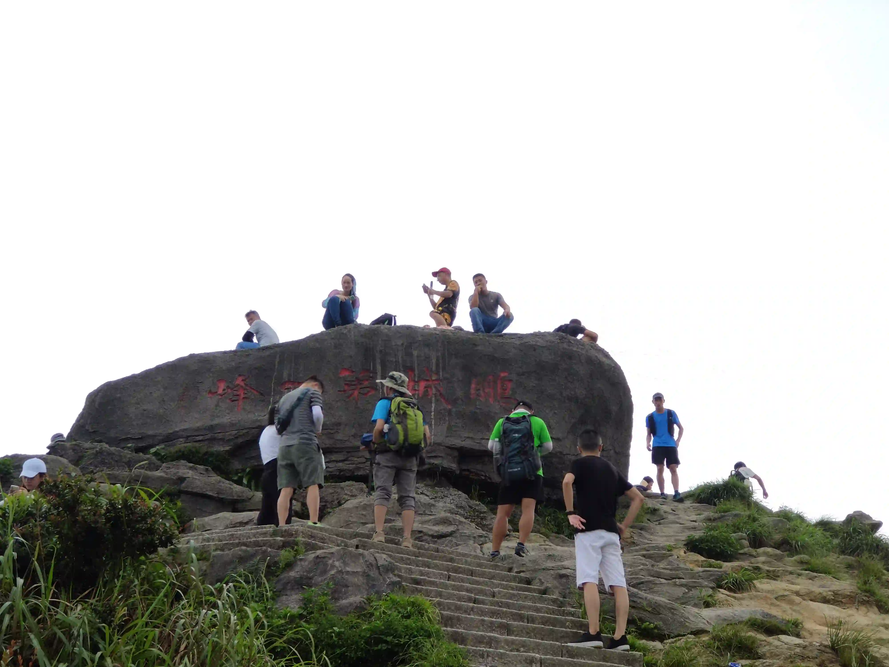
> 梧桐山-鹏城第一峰

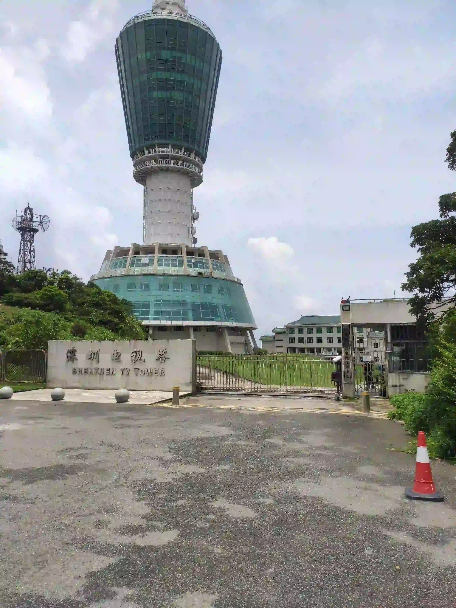
> 梧桐山-小梧桐-深圳电视塔

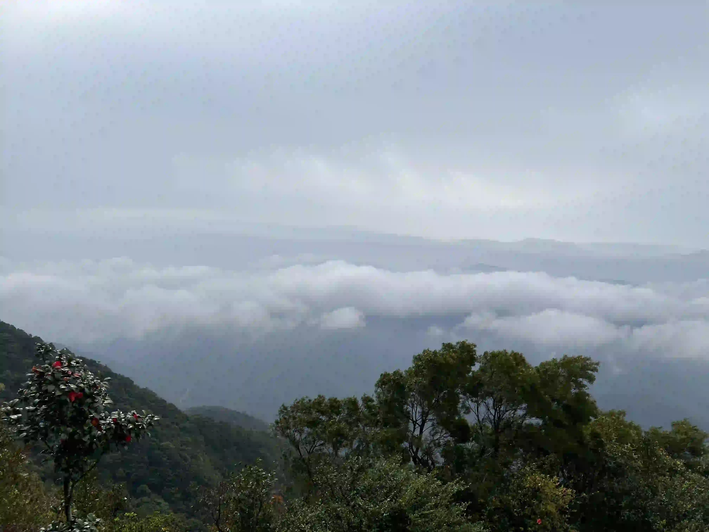
> 梧桐山-云海

> 梧桐山-俯瞰

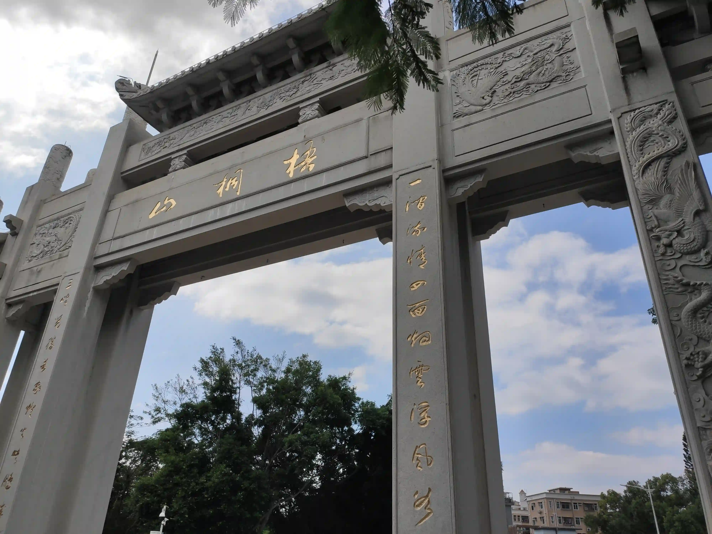
> 梧桐山-北门

### 七娘山

七娘山海拔869米，是深圳第二高峰，可沿主峰科考线登顶。西涌社区是深圳暗夜环境最好的地域，光污染小，视线开阔，空气清澈，是深圳最佳观星地点。

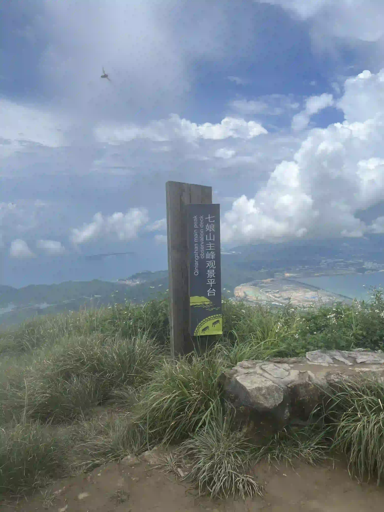
> 七娘山-主峰

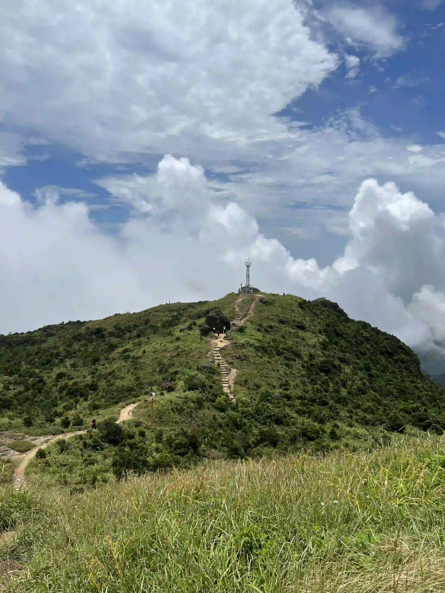
> 七娘山-山顶

### 大雁顶

大雁顶，海拔801米，是深圳十峰的第三高峰。沿着鹿雁科考线登顶后，可以俯瞰大鹏半岛延绵的山岭，远望大亚湾、大鹏湾、香港西贡海域，山海相连，景象壮美。近300公里长的深圳远足径东部的起点就是大雁顶。

### 梅沙尖

梅沙尖海拔753米，因山形如巨大的尖锥从群山中拔起而得名。登顶梅沙尖有多条路线，山顶有360°观景台，可瞭望大鹏湾、盐田港和梧桐山延绵的山岭，梅沙尖顶峰也是深圳观赏落日的绝佳胜地。

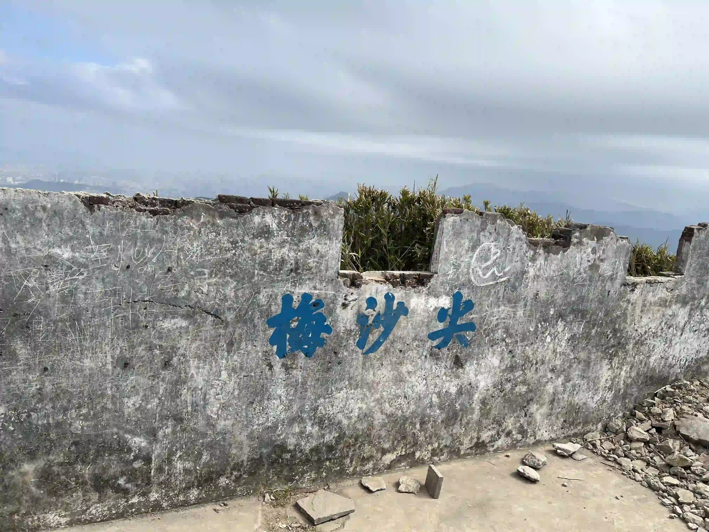
> 梅沙尖

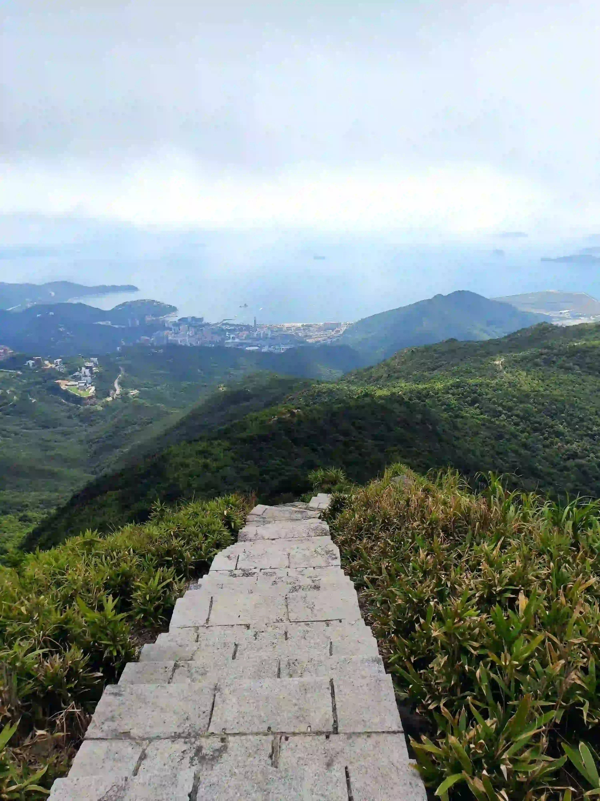
> 梅沙尖-陡峭石阶

### 大笔架山

大笔架山位于深圳与惠州交界处，海拔717米，是深圳第四高峰。翻越大笔架山的线路是深圳最艰难的登山线路之一，是户外经典线路三水线(三杆笔——水祖坑)的一部分。

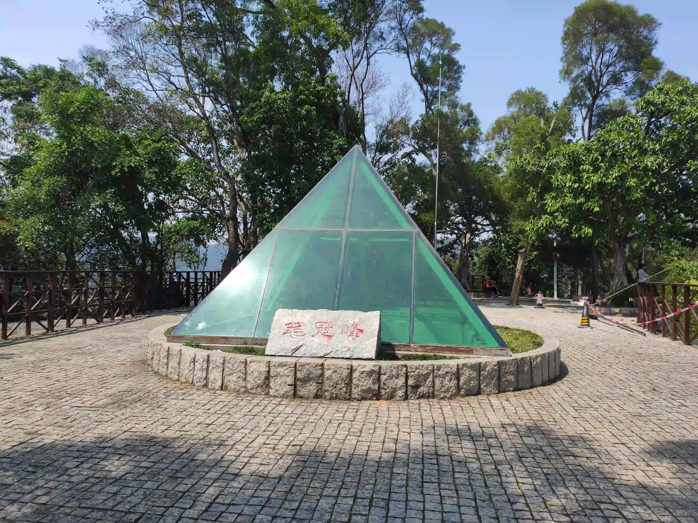

> 没去过大笔架山，这里是小笔架山的笔冠峰

### 阳台山

阳台山海拔587米，是深圳西部的最高峰。登顶后可俯瞰珠江口、深圳西部全景，阳台山山高林密，覆盖着次生南亚热带常绿阔叶林和南亚热带沟谷雨林， “阳台叠翠 ”被评为深圳八景之一。

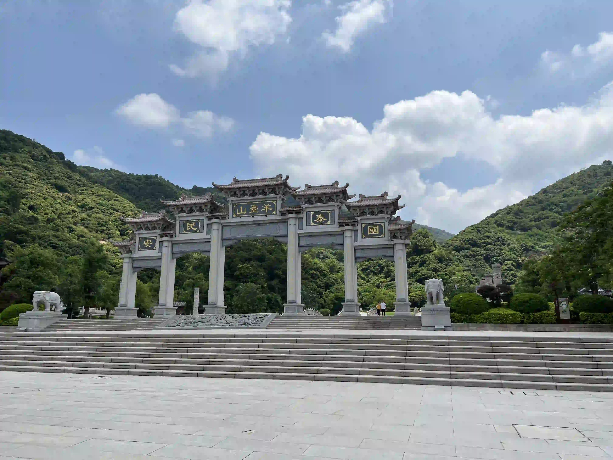
> 阳台山-石岩广场

### 塘朗山

塘朗山主峰海拔432米，延绵的山岭穿过深圳中心区，犹如深圳市中心的一艘绿色方舟。登顶塘朗山可俯瞰深圳湾，中国香港的新界，天气晴朗时，甚至可以远眺珠江口的深中通道。

> 塘朗山-红亭

> 塘朗山-灵猴

> 塘朗山-梅林水库

### 大南山

大南山位于蛇口半岛，主峰高336米。有多条步道登顶，观景台可以俯瞰深圳湾、珠江口，深圳著名的“粤海街道办”尽收眼底，远望可以看到中国香港的流浮山脉以及元朗景色。

### 凤凰山

主峰海拔376米的凤凰山有着月牙形的山脊线，三面环山，一面临海，是观赏落日的胜地。山中有一座据说求姻缘特别灵的“凤岩古寺”，成为情侣喜欢相伴而行的山岭。凤凰山是深圳远足径的西部起点。

### 莲花山

莲花山七个山头相拥，犹如盛开的莲花而得名。在深圳十峰里，莲花山并不高，海拔只有106米。却是闻名中外的地标。山顶矗立着邓小平的青铜像，是缅怀伟人、眺望深圳中轴线景象的好去处。

> 莲花山-邓小平雕像

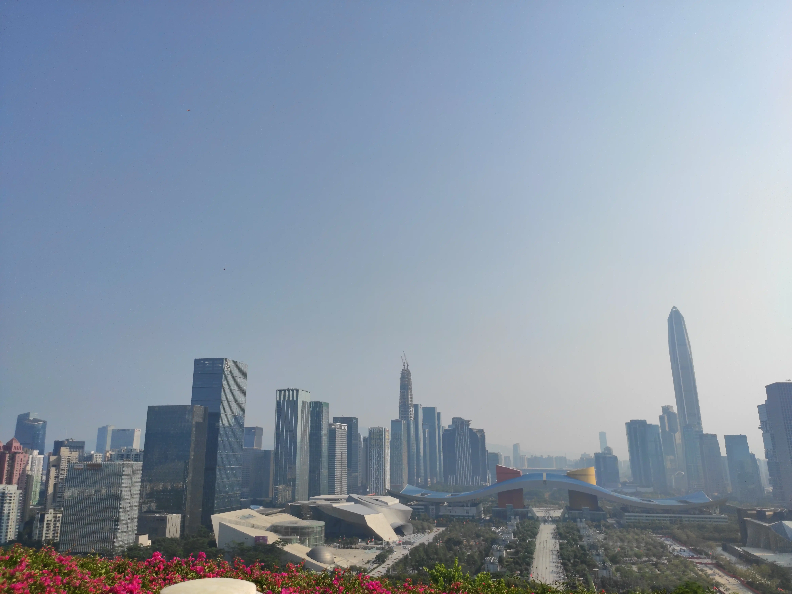
> 莲花山-山顶俯瞰中轴线