# 黔灵山公园

所在地：`中国 / 贵州省 / 贵阳市`

黔灵山公园位于贵州省贵阳市中心区西北，建于1957年，因有“黔南第一山”之称的黔灵山而得名，是国家AAAA级旅游景区和“中国名园”。它是一座集自然风光、文物古迹、民俗风情和娱乐休闲为一体的综合性城市公园，有“贵在城中，美在自然”的美誉。

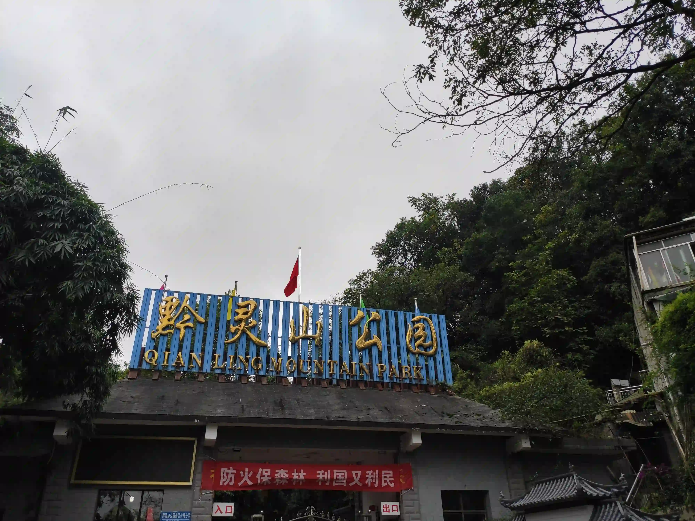
> 东门

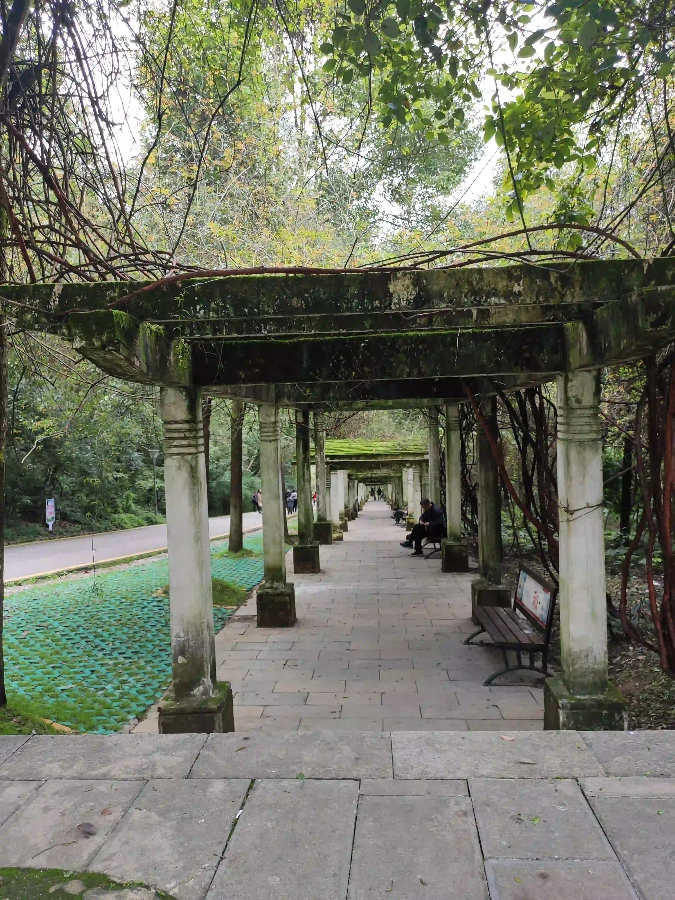
> 廊亭

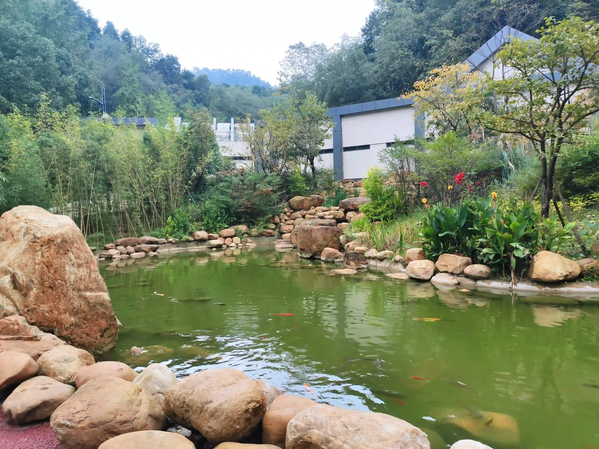
> 锦鲤

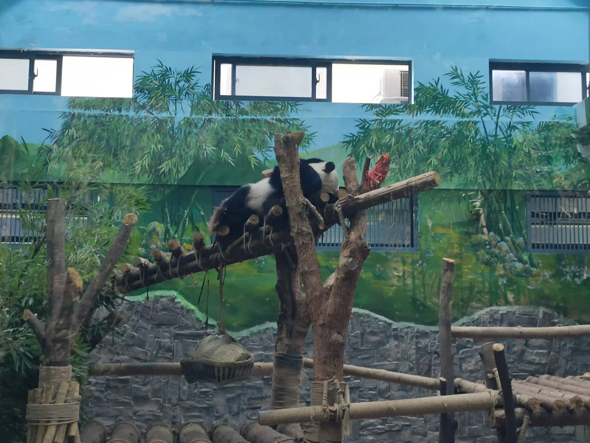
> 大熊猫

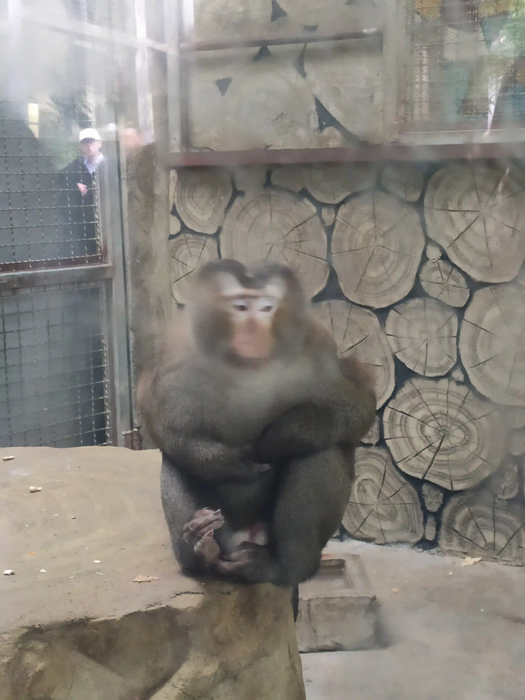
> 成为网红前的吗喽（拍摄于2020年10月）

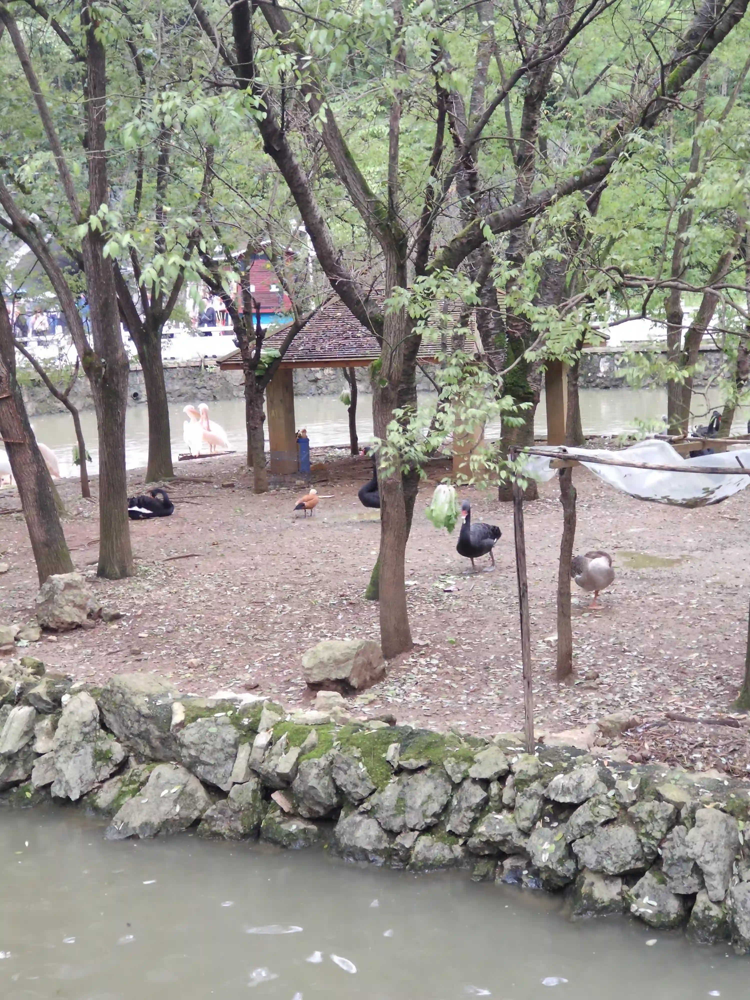
> 百鸟园

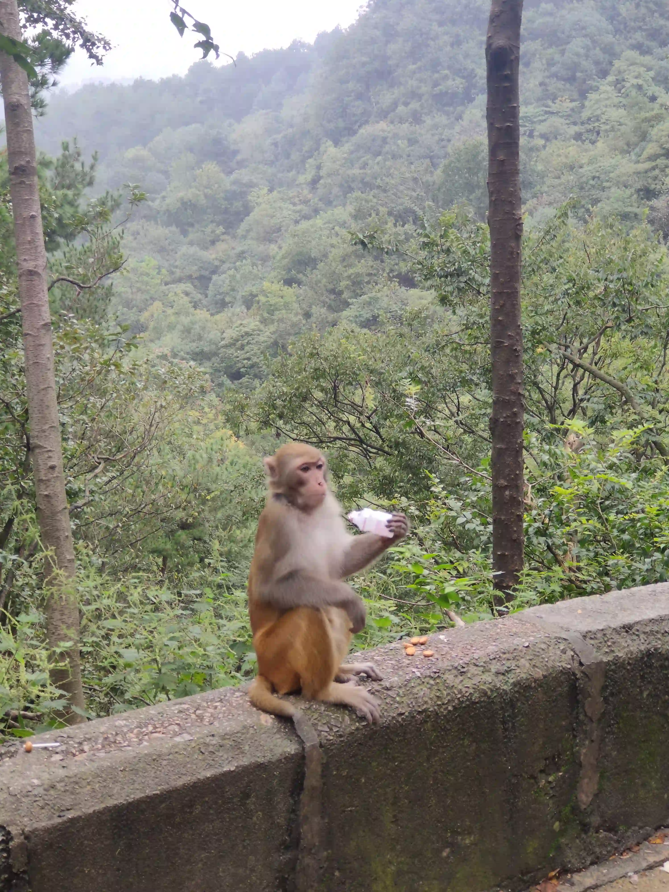
> 炫酸奶吗喽

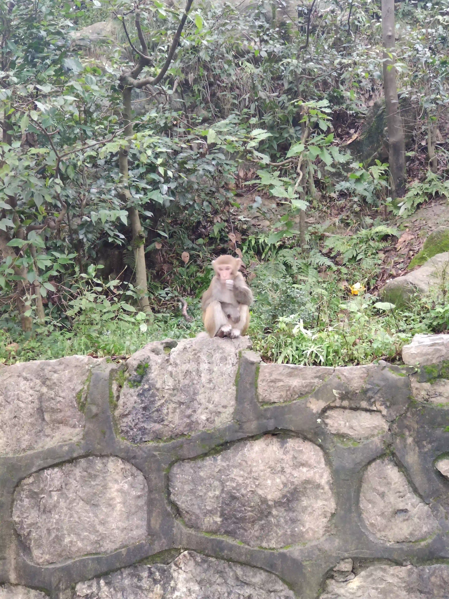
> 路边吗喽

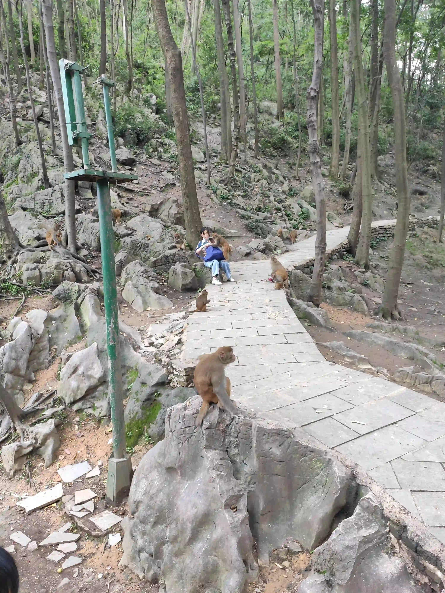
> 打劫吗喽

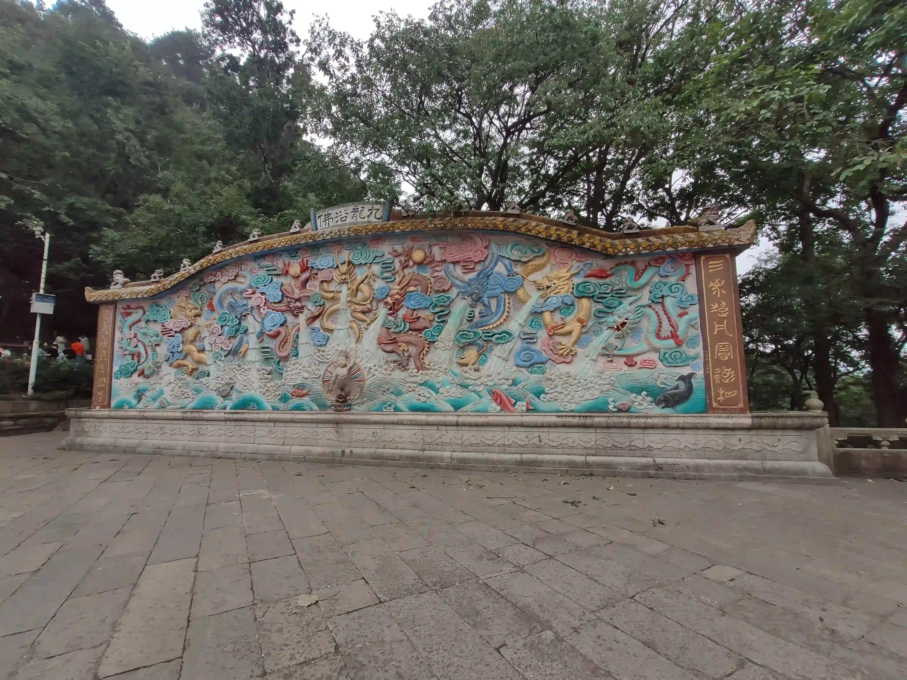
> 弘福寺-九龙浴佛

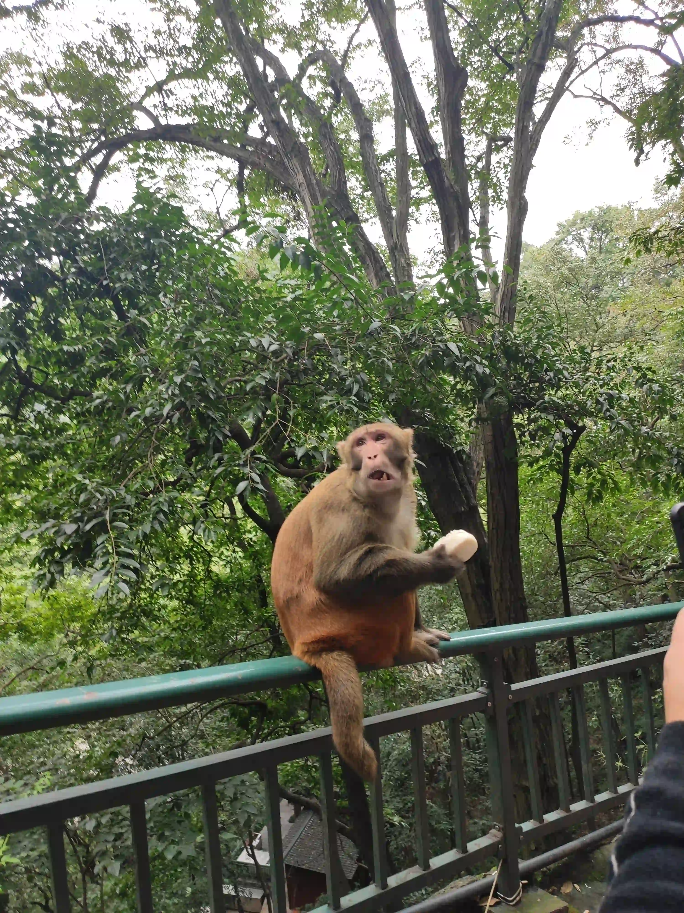
> 啃馒头吗喽

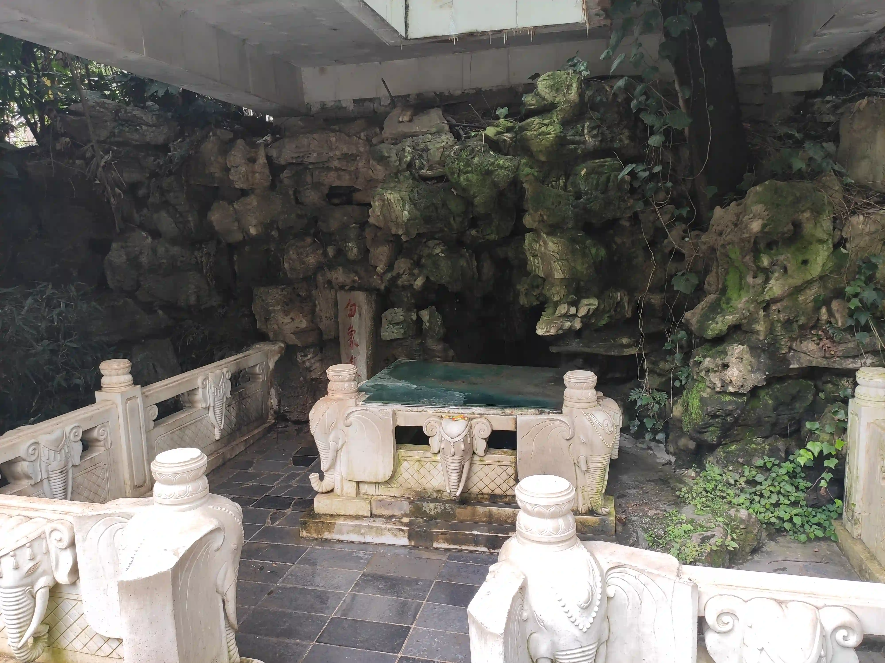
> 白象泉