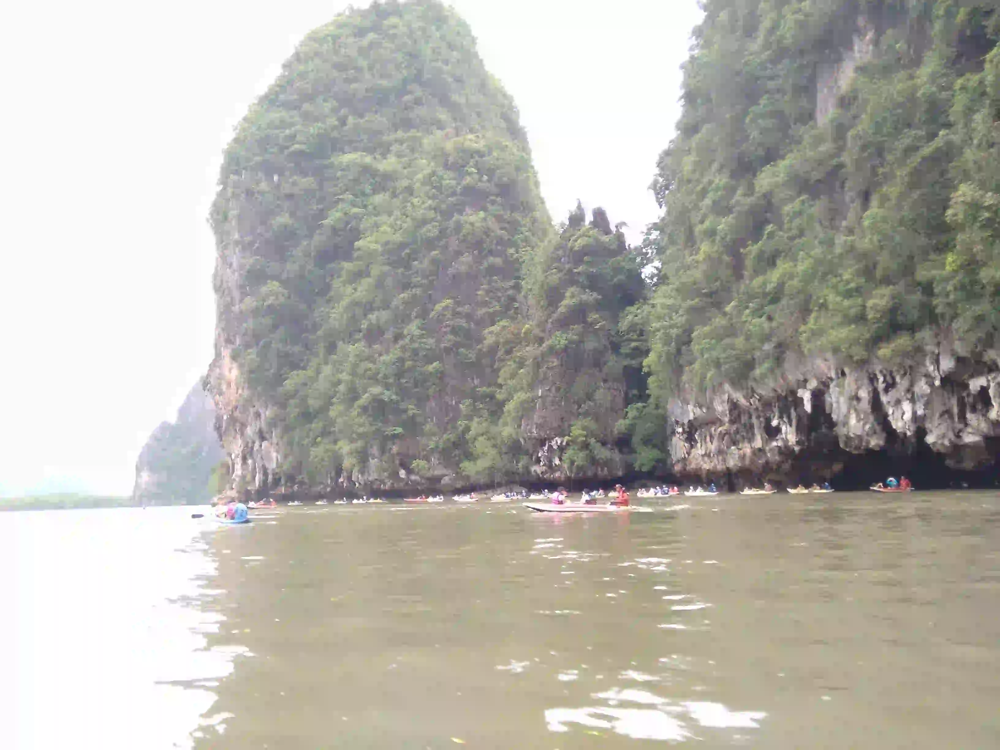
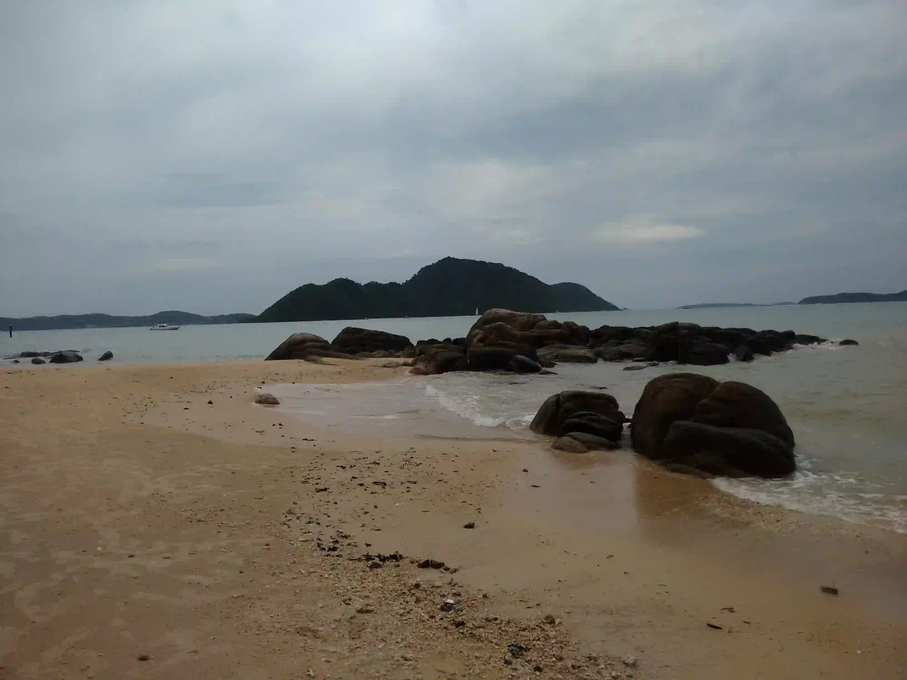
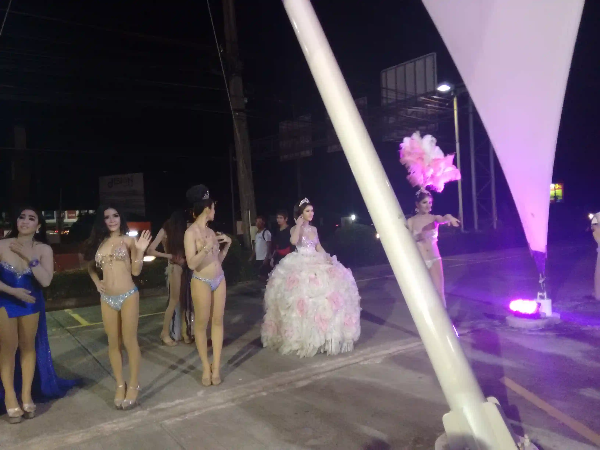
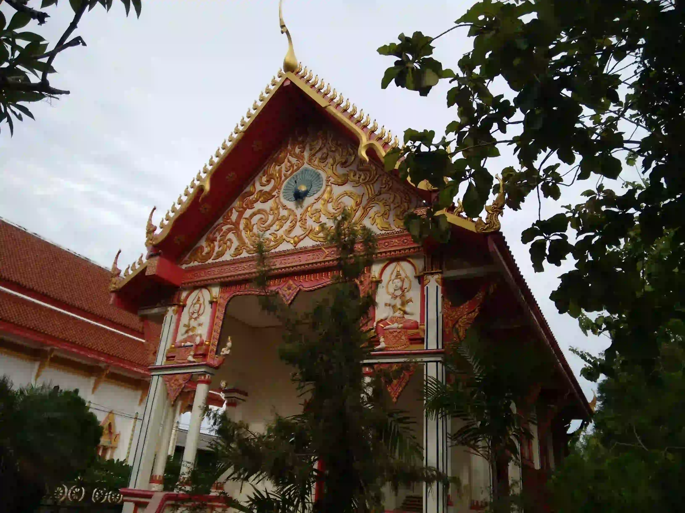
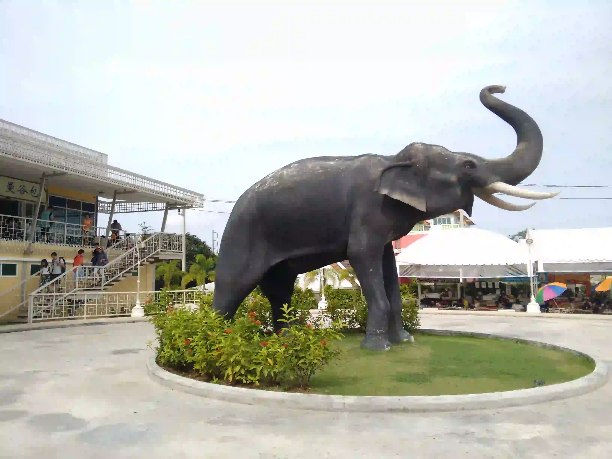
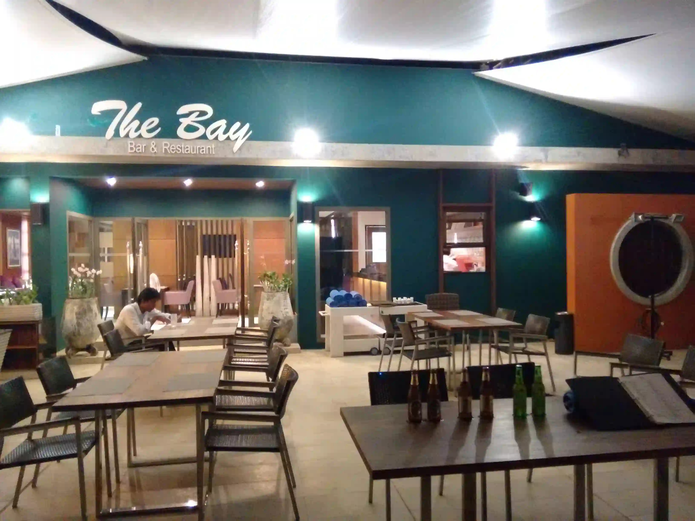

# 普吉岛

所在地：`泰国 / 普吉岛`

普吉岛（Phuket）位于泰国的南部，是泰国最大的海岛，也是泰国最小的一个府。其丰富的自然资源，使他获得“珍宝岛”、“金银岛”的美称。普吉岛有深远的历史和文化，被誉为安达曼海的明珠，500多年前是锡矿基地，泰国主要的旅游胜地。岛上海水清澈湛蓝，拥有众多的美丽海滩，主要集中在西部海域、水上活动较为丰富，潜水爱好者更不能错过海底的美丽景致，再加上周边的奇特小岛，每年岛上都会吸引大量的游客。在普吉岛，白天的椰林树影，傍晚的美丽夕阳，夜晚的繁荣闹市都是不容错过的体验，甚至只是躺在沙滩椅上无所事事都是一种享受。

> 攀牙湾（小桂林）

> 珊瑚岛

> 特色表演

> 海龙寺-四面佛

> 免税店-昆虫标本

> 舞蛇人

> 大象雕塑

> 海滨独栋泳池别墅酒店

泰式按摩：泰式按摩是一种源自泰国的传统疗法，以全身系统性拉伸、按压和点穴手法著称，常从脚部开始向心脏方向进行，结合瑜伽式的体位摆放，强调筋骨关节活动和能量流通，以达到舒缓肌肉疲劳、增强柔韧度和促进身心平衡的效果。