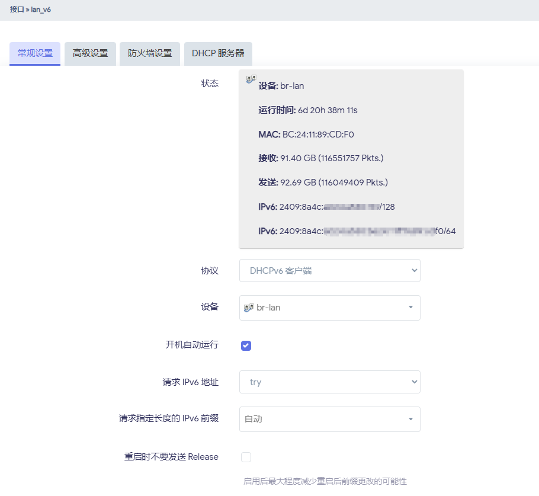
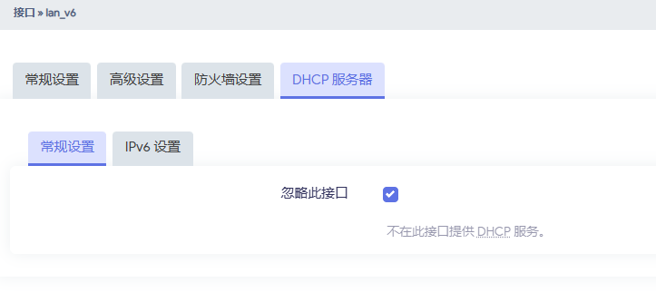

# iStoreOS旁路由

iStoreOS的目标是提供一个人人会用的路由兼轻NAS系统。iStoreOS源自OpenWRT，在OpenWRT的基础上做了很多的交互简化，同时提供了软件中心：[iStore](https://github.com/linkease/istore)，极大的丰富了应用生态和使用场景。

由于笔者已经购买了专门的NAS设备，iStoreOS的主要用途是旁路由，NAS功能暂时不需要。

## pve安装iStoreOS

iStoreOS提供了在pve下安装的[官方教程](https://doc.linkease.com/zh/guide/istoreos/install_pve.html)，根据教程即可在pve下成功安装iStoreOS虚拟机。

## 配置iStoreOS

安装完成后，在管理电脑的浏览器中登录iStoreOS的管理后台。在网络向导中选择iStoreOS的连接方式，由于笔者使用的mini主机两个网卡一个直通给了爱快做wan口，另一个给了pve做桥接，因此只能让iStoreOS使用这个桥接网卡并配置为旁路由。

旁路由的配置如下：

## 进阶技巧

### IPv6设置

由于爱快系统中IPv6使用了中继模式，因此需要在iStoreOS中配置DHCPv6的客户端用于IPv6的动态分配。具体方式为：在`网络 -> 接口`中`添加新接口`，添加一个名为"lan_v6"的DHCPv6客户端。DHCPv6客户端详细配置如下：

### iStore安装软件

在iStore中可以按需安装软件，让iStoreOS的使用场景更加丰富。注意基于Docker的软件需要启用Docker服务才能正常运行。

iStore列表中找不到的软件可以通过下载`.ipk包`或`.run自解压格式文件`进行手动安装。一般优化网络的插件都是需要自行在网络上查找并下载安装包来手动安装的。

还有一些OpenWRT的插件可以通过`系统 -> 软件包`中搜索下载并安装。

这里推荐几款常用好用的插件：
- iKoolProxy滤广告
- AdGuard Home
- ShadowSocksR Plus+
- Privoxy 网络代理
- KMS服务器
- SmartDNS

在安装配置完这些插件之后，家庭网络的速度和质量都会有很大的提升，安全性也能得到加强。