# 爱快软路由

## 软路由是什么？

硬路由是厂商基于专用的硬件设备，或嵌入式系统结构进行设计，软硬件之间相互优化，来提供稳定安全的网络通信服务。我们常见的路由器：华为、华硕、中兴、小米、TP-Link、网件、华三、水星、领势、思科、锐捷等等，都可以称为硬路由。

软路由是则与传统硬路由不同，软路由不依赖于专用网络硬件，而是运行在标准的PC或虚拟机上，通过软件来处理网络数据包的转发和路由决策。

爱快(iKuai)路由系统是国内开发，功能十分齐全的软路由系统。其web响应十分迅速，管理界面逻辑清晰，功能简洁易懂。

## 下载爱快路由系统镜像

进入[爱快路由系统下载页面](https://www.ikuai8.com/component/download)，按需下载镜像文件。这里我下载的是64位ISO镜像。

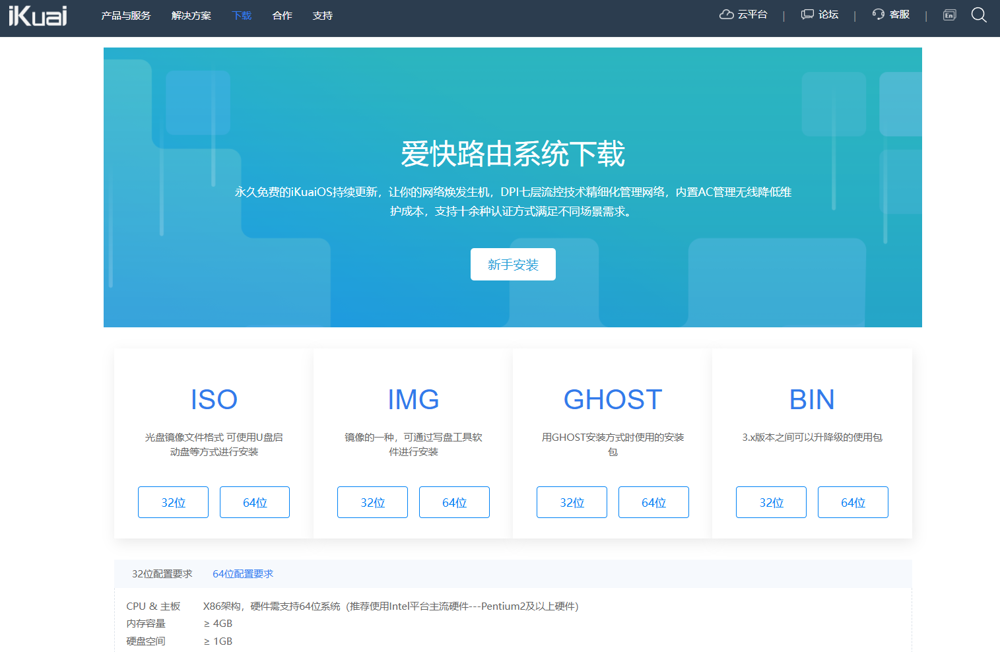

## pve安装爱快路由系统

将下载的爱快路由系统ISO镜像文件上传至pve的local存储节点ISO镜像中。

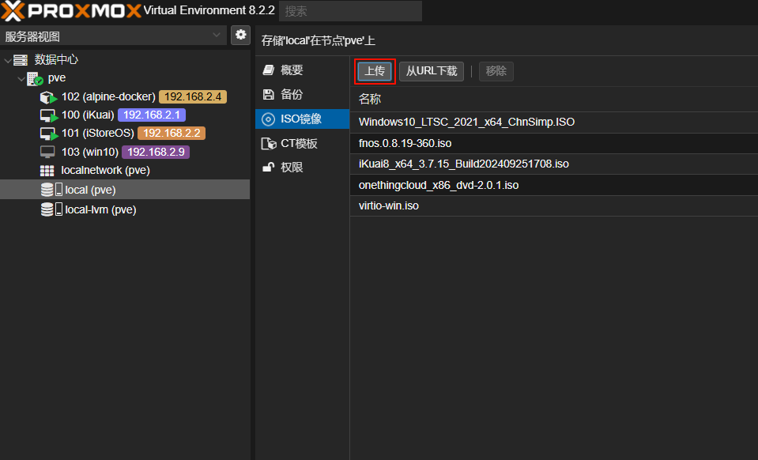

在pve管理页面右上角点击**创建虚拟机**，依次设置爱快虚拟机的硬件配置。

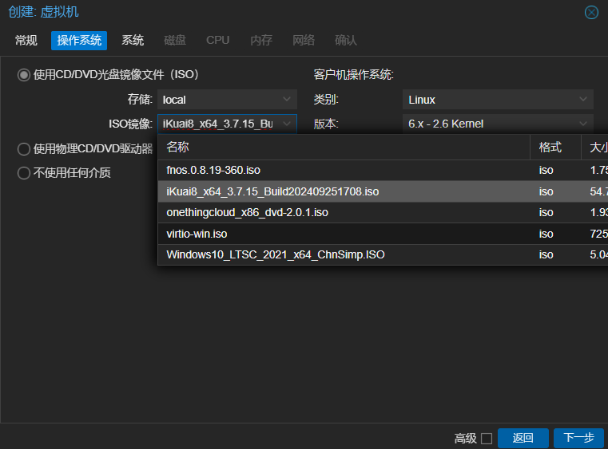

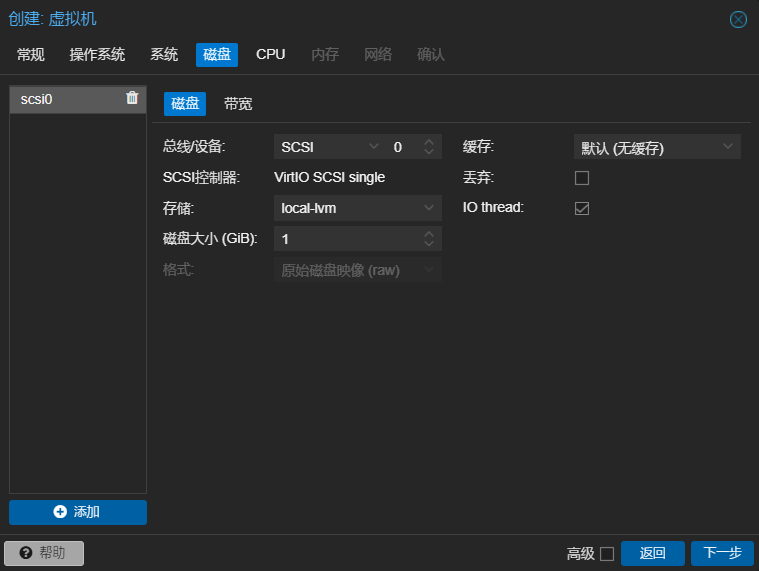

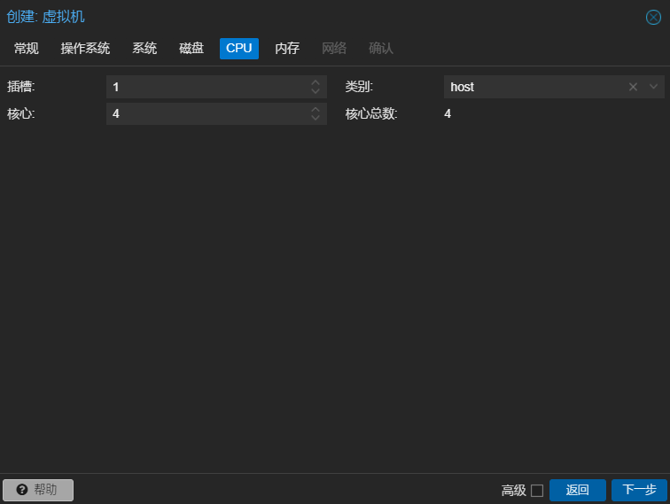

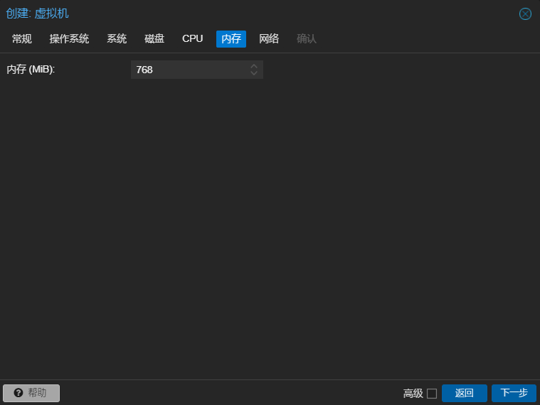

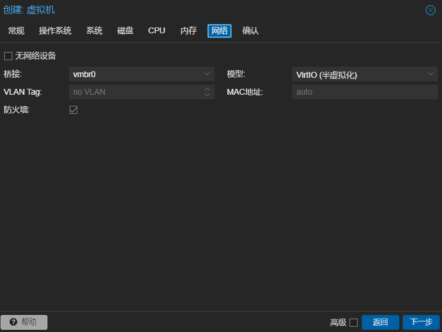

在爱快虚拟机的硬件中选择添加`PCI设备`，选择需要直通的网卡设备。我这里选择pve系统桥接网卡之外的另一个网卡作为直通给爱快的wan口网卡。

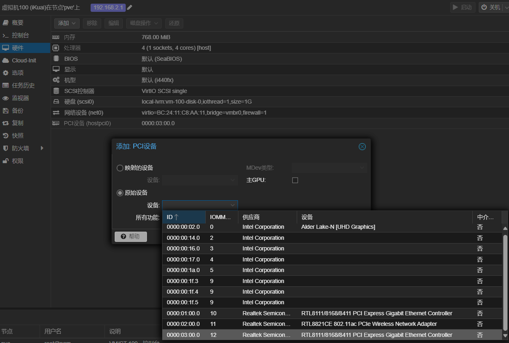

在爱快虚拟机的选项中设置引导顺序，将挂载爱快ISO镜像的虚拟光驱拖至第1位，分配的1G大小的虚拟硬盘拖至第2位。

随后进入爱快虚拟机控制台界面，点击启动进行开机。开机后选择`1、将系统安装到硬盘1 sda`，等待系统安装，安装完成后，会返回开始的界面，这时候选择`S、关闭计算机`，回车关机。

再次进入爱快虚拟机的硬件中删除挂载爱快ISO镜像的虚拟光驱，进入选项设置引导顺序，将硬盘设置为第一启动项。

再次开机进入爱快控制台，首先选择`2、设置LAN/WAN地址`，再选择`0、设置LAN1地址`，输入LAN地址。

设置完成后，在管理电脑的浏览器中输入LAN地址，就可以进入爱快的后台管理页面，默认账号密码都是`admin`，首次登录后需要修改密码。

进入管理页面后，首先需要配置爱快的wan口。在`网络设置 -> 内外网设置`页面中，选择wan口对应的网卡，并设置接入方式（我这里由于使用光猫自带的路由器进行拨号，因此选择`DHCP（动态获取方式）`，由光猫路由器分配爱快的wan口地址）。

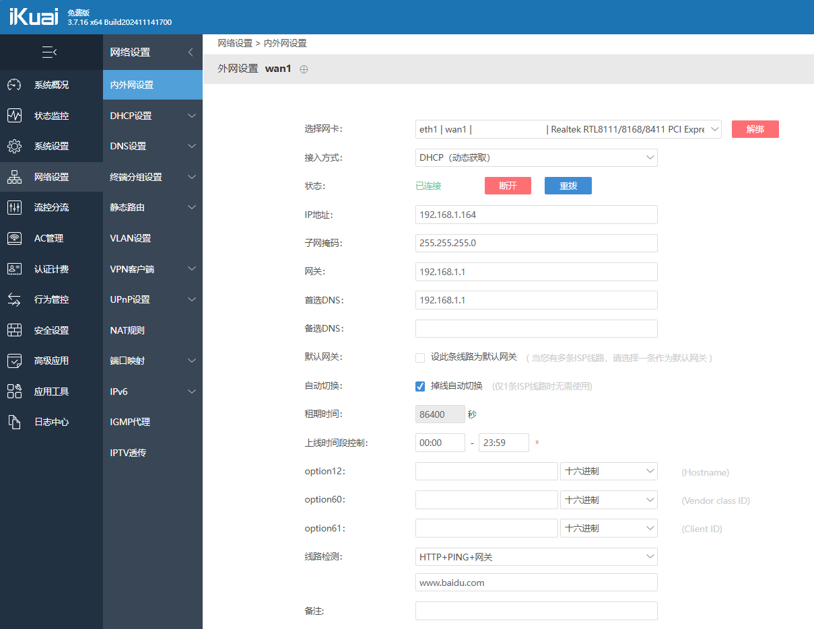

此时使用网线连接爱快的wan口和光猫的lan口，爱快系统就可以联网了，同时pve虚拟机系统也能成功联网并进行其他优化操作了。

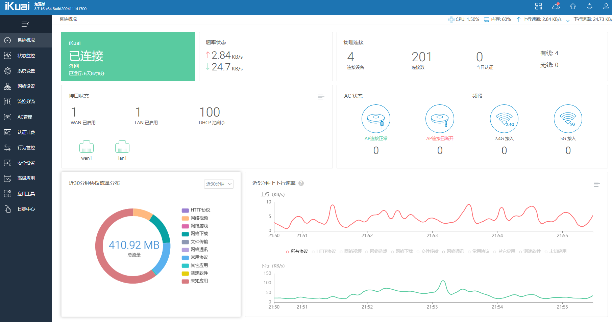

## 进阶技巧

### IPv6设置

由于光猫路由器有公网IPv6，并且IPv6的DHCP客户端预期将在iStoreOS旁路由系统中进行搭建，因此爱快的IPv6的外网接入方式设置为`中继模式`，内网配置类型也设为`中继模式`。

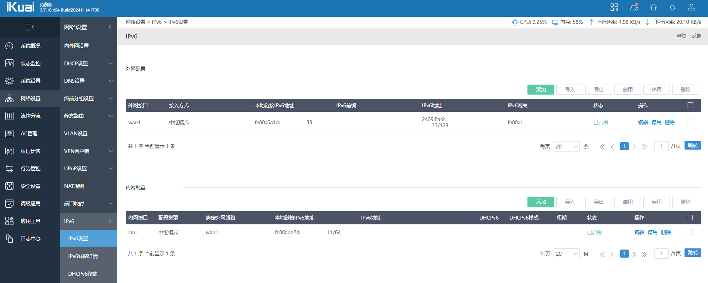

**参考资料：**
- [【小白成长记12】PVE All in one AIO iKuai iStoreOS LXC Alpine Docker TrueNAS Wins11核显直通](https://www.bilibili.com/video/BV1UQ4y1b7Nz/?vd_source=397ff4ce16ca423e318cacc40c3f4acb)
