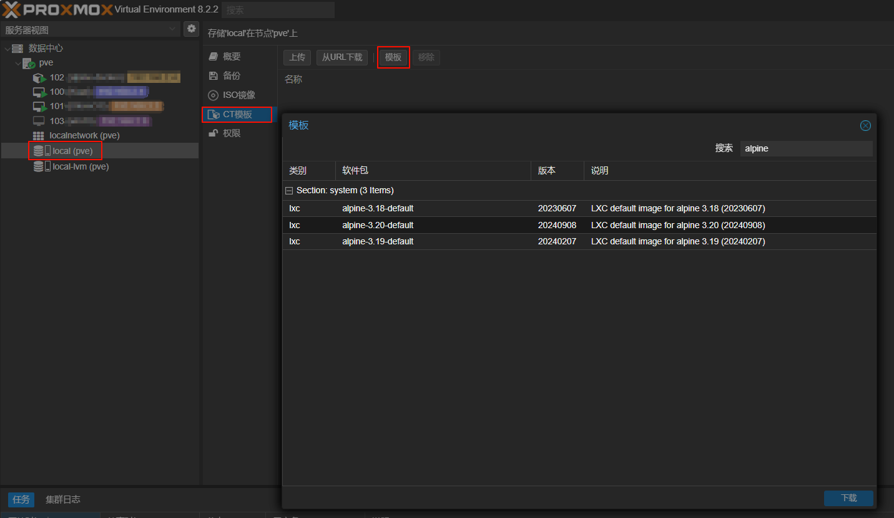
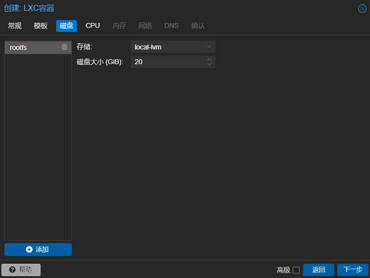
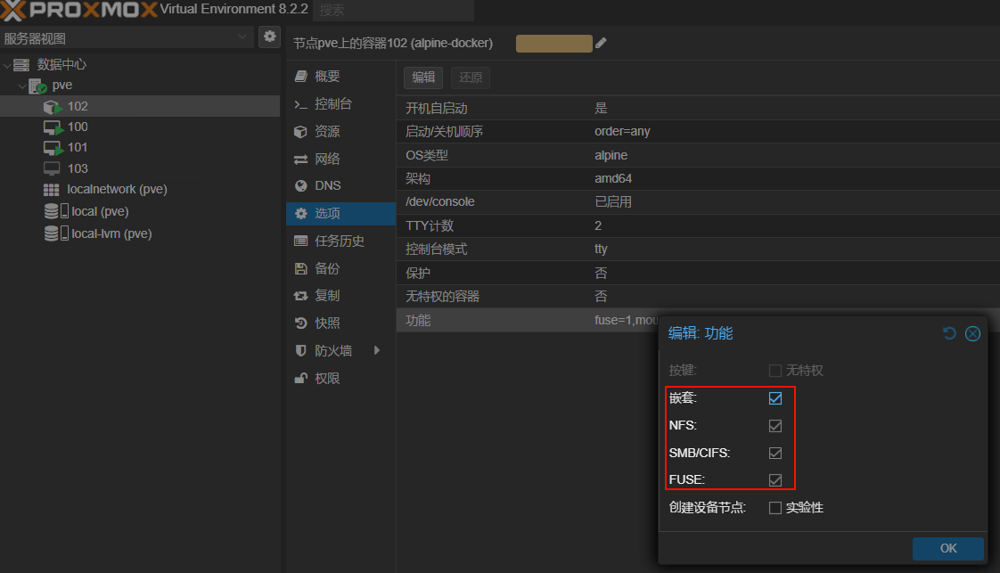

# 基于LXC的Docker环境

在pve系统中除了创建虚拟机，还有一个选择就是创建CT（Linux Container,简称LXC）容器。LXC利用cgroup和namespace在linux应用层创建了一个“虚拟机”（隔离的裸露文件系统），lxc和docker不同地方在于lxc包含完整的操作系统，是一个系统容器。

Alpine Linux是一个面向安全，轻量级的基于musl libc与busybox项目的Linux发行版。这里选择Alpine Linux系统容器作为Docker的宿主系统。



下载alpine的CT模板之后，创建CT容器。





创建完成后，进入`选项`，双击`功能`，启用嵌套、NFS、SMB/CIFS和FUSE。



进入`pve -> Shell`，输入`nano /etc/pve/lxc/102.conf`（102为alpine容器编号，按需替换成实际编号）设置apline LXC的权限，在文件底部追加以下两行配置信息并保存文件：

```conf
lxc.apparmor.profile: unconfined
lxc.cap.drop:
```

进入alpine-docker控制台点击启动，开机后输入用户名`root`和密码登录。首次登录输入`setup-alpine`进行系统初始化配置，详细配置过程可参考文末的视频资料或是自行搜索。

alpine初始化完成并重启后，输入`apk add wget curl nano docker`安装常用工具及Docker运行环境。

输入`rc-update add docker boot`设置Docker开机启动。输入`service docker start`运行Docker服务。

Docker服务成功运行后，一般会部署`portainer`图形化Docker管理工具，具体可参考[portainer官方安装教程](https://docs.portainer.io/start/install-ce/server/docker/linux)。

至此，基于LXC的Docker环境就部署完成了，这里推荐几款常用的Docker镜像：
- `jgraph/drawio`：经典画图软件
- `excalidraw/excalidraw`：交互友好，图例丰富的画图软件
- `mondedie/flarum`：简洁美观的现代化论坛应用，支持大量拓展插件
- `rustdesk/rustdesk-server`：跨平台开源远程桌面应用
- `herberthe0229/iptv-sources`：iptv网络电视源

除了部署仓库中海量的Docker镜像之外，还可以将自己开发的应用打包成Docker镜像文件上传至portainer后进行部署，可玩性极强。

**参考资料：**
- [【小白成长记12】PVE All in one AIO iKuai iStoreOS LXC Alpine Docker TrueNAS Wins11核显直通](https://www.bilibili.com/video/BV1UQ4y1b7Nz/?vd_source=397ff4ce16ca423e318cacc40c3f4acb)