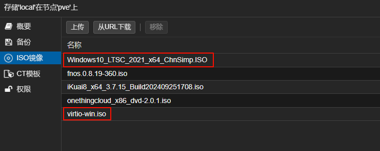
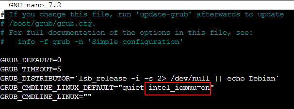
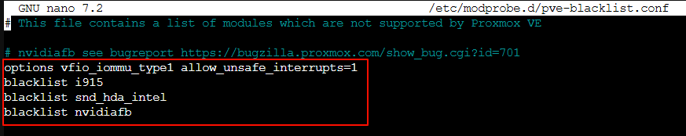
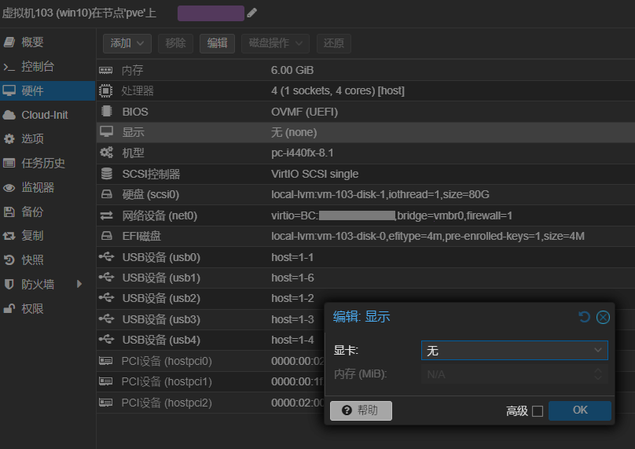

# 安装Windows10开启核显直通

笔者已经确认过手里这台N100的mini主机支持核显直通，并且BIOS也开启了虚拟化功能。因此是可以实现pve下安装Windows10系统并实现核显直通的。

## 准备工作

在安装之前需要准备好以下资料：
- Windows10系统安装镜像（推荐下载微软官方镜像，我这里使用的是Windows10 LTSC版本）
- virtio-win.iso驱动包（[下载地址](https://fedorapeople.org/groups/virt/virtio-win/direct-downloads/latest-virtio/)）
- 核显直通rom文件（可以在github上搜索下载，或是在部分硬件厂商的用户QQ群资料中获取）



## 安装过程

### 创建win10虚拟机

参考文末的视频资料，创建windows10虚拟机，创建完成后暂时不启动，先完成核显直通的相关配置。

### 核显直通

1. 启用IOMMU支持



进入pve系统的Shell环境，编辑`/etc/default/grub`文件，在`GRUB_CMDLINE_LINUX_DEFAULT`参数中添加`intel_iommu=on`。

执行`update-grub`命令更新grub配置。

2. 添加驱动黑名单



编辑`/etc/modprobe.d/pve-blacklist.conf`文件，添加以下内容以屏蔽核显驱动和HDMI声卡驱动：

```
options vfio_iommu_type1 allow_unsafe_interrupts=1
blacklist i915
blacklist snd_hda_intel
blacklist nvidiafb
```

执行`update-initramfs -u -k all`命令更新initramfs。

3. 重启pve系统

4. 编辑win10虚拟机配置文件


  - 编辑`/etc/pve/qemu-server/103.conf`（103是win10虚拟机的编号，按需替换成实际编号），在文件头部添加以下内容：

    ```
    args: -set device.hostpci0.addr=02.0 -set device.hostpci0.x-igd-gms=0x8 -set device.hostpci0.x-igd-opregion=on
    ```

    其中`device.hostpci0.x-igd-gms=0x8`中的`0x8`代表核显大小是`512M`，**这个值要大于等于BIOS中设置的核显大小，否则会导致HDMI连接显示器后黑屏**，如果BIOS中找不到设置核显大小的地方可以咨询客服了解机器BIOS默认配置的核显大小。

  - 在`hostpci0: 0000:00:02.0`后追加`,legacy-igd=1,romfile=n100.rom`内容。

    其中`n100.rom`是核显BIOS文件，请确保将`n100.rom`文件上传至pve系统的`/usr/share/kvm`目录下。  
    `0000:00:02.0`是N100处理器核显的PCI设备ID，一般是固定值，如果不是请根据实际情况进行调整。

  - 在win10虚拟机的`硬件`中，将`显示`的显卡项设置为`无`。

  

使用HDMI线连接mini主机和显示器，就可以开始安装win10系统了。除了核显直通外，如果想使用键盘、鼠标、音响等设备或是连接WiFi，则还需要将USB接口、音频接口及无线网卡等设备直通给win10虚拟机。

### 安装win10系统

参考文末的视频资料，安装win10系统。注意在选择系统安装盘的时候需要使用virtio的驱动加载磁盘。安装完成后，使用virtio安装程序安装完整的系统驱动，还要设置win10系统的电源模式为“从不休眠”，以避免休眠导致PCI设备无法加载的问题。

**参考资料：**
- [利用PVE虚拟机，来打造属于自己的All In One系统吧！](https://www.bilibili.com/video/BV1bc411v7A3/?vd_source=397ff4ce16ca423e318cacc40c3f4acb)
- [【小白成长记12】PVE All in one AIO iKuai iStoreOS LXC Alpine Docker TrueNAS Wins11核显直通](https://www.bilibili.com/video/BV1UQ4y1b7Nz/?vd_source=397ff4ce16ca423e318cacc40c3f4acb)
- [PVE实现Windows 10的核显直通](https://blog.topwo.com/blog/article/303)