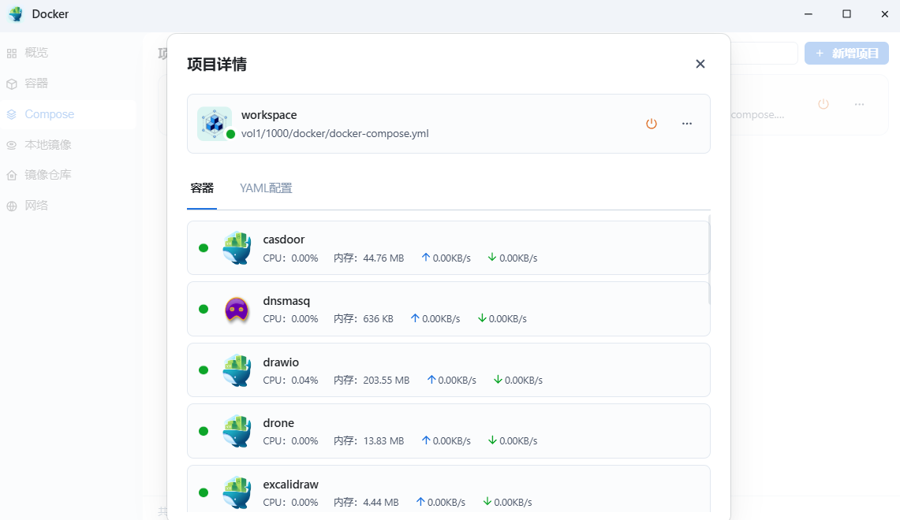

# 飞牛私有云NAS系统

飞牛私有云是一款国产NAS系统，拥有**正版免费**、**硬件兼容**、**性能超群**、**存储自由**、**智能影视**等特性。飞牛私有云基于最新Linux内核（Debian发行版）深度开发，兼容主流x86硬件，可自由组装NAS，灵活扩展外部存储。


飞牛私有云fnOS系统的使用教程在官方的[帮助中心](https://help.fnnas.com/)网站上可以轻松获取到，这里就不做过多陈述。

笔者手中已经有了一台专业NAS设备，但由于CPU是arm架构，不支持虚拟机也无法畅玩Docker应用，而fnOS中的Docker和虚拟机功能，正好填补了这一空白。

以下内容简单介绍了个人飞牛NAS设备中Docker和虚拟机功能的一些使用场景和相关应用。

## Docker

fnOS的Docker整合了Docker Compose容器编排工具，可以通过编写`docker-compose.yml`文件实现容器编排。



`docker-compose.yml`内容如下：

> 注意：`192.168.2.3`是fnOS的本地IP地址，按需替换；使用`[]`标记的值需修改为实际值。

```yml
services:
  # mariadb数据库
  mariadb:
    image: mariadb:10
    container_name: mariadb
    network_mode: bridge
    ports:
      - 3306:3306
    environment:
      - MYSQL_ROOT_PASSWORD=[root用户密码]
    volumes:
      - /vol1/1000/docker/mariadb/data:/var/lib/mysql
    restart: always

  # dnsmasq 无公网域名或者无公网IP时，通过dnsmasq将域名解析到内网IP，实现在局域网内使用域名访问服务
  dnsmasq:
    image: dockurr/dnsmasq:latest
    container_name: dnsmasq
    network_mode: bridge
    environment:
      - DNS1=223.5.5.5
      - DNS2=119.29.29.29
    ports:
      - 53:53/udp
      - 53:53/tcp
    volumes:
      - /vol1/1000/docker/dnsmasq/dnsmasq.conf:/etc/dnsmasq.conf
    cap_add:
      - NET_ADMIN
    restart: always

  # Git服务 代码托管
  gitea:
    image: gitea/gitea:1.23
    container_name: gitea
    network_mode: bridge
    extra_hosts:
      - "casdoor.yupaits.com:192.168.2.3"
      - "drone.yupaits.com:192.168.2.3"
    ports:
      - 3000:3000
    environment:
      - USER_UID=1000
      - USER_GID=1000
      - GITEA_database_DB_TYPE=mysql
      - GITEA_database_HOST=192.168.2.3:3306
      - GITEA_database_NAME=gitea
      - GITEA_database_USER=[数据库用户名]
      - GITEA_database_PASSWD=[数据库密码]
    volumes:
      - /vol1/1000/docker/gitea/data:/data
    depends_on:
      - dnsmasq
    restart: always

  # drone-ci 整合Gitea实现CI/CD
  drone:
    image: drone/drone:2
    container_name: drone
    network_mode: bridge
    extra_hosts:
      - "gitea.yupaits.com:192.168.2.3"
    environment:
      - DRONE_GITEA_SERVER=https://gitea.yupaits.com
      - DRONE_GITEA_CLIENT_ID=[Gitea中drone应用的客户端ID]
      - DRONE_GITEA_CLIENT_SECRET=[Gitea中drone应用的客户端密钥]
      - DRONE_RPC_SECRET=[drone应用通信密钥]
      - DRONE_SERVER_HOST=drone.yupaits.com
      - DRONE_SERVER_PROTO=https
      # 在drone中创建yupaits管理员用户
      - DRONE_USER_CREATE=username:yupaits,admin:true
    ports:
      - 1080:80
    volumes:
      - /vol1/1000/docker/drone:/data
    depends_on:
      - dnsmasq
    restart: always

  # minio对象存储，文件存储服务
  minio:
    image: minio/minio:latest
    container_name: minio
    command: server /data --console-address ':9001'
    network_mode: bridge
    extra_hosts:
      - "casdoor.yupaits.com:192.168.2.3"
    ports:
      - 9000:9000
      - 9001:9001
    environment:
      - MINIO_ROOT_USER=[root用户名]
      - MINIO_ROOT_PASSWORD=[root用户密码]
    volumes:
      - /vol1/1000/docker/minio/data:/data
    restart: always

  # Redis分布式缓存
  redis:
    image: redis/redis-stack:6.2.6-v19
    container_name: redis
    network_mode: bridge
    ports:
      - 6379:6379
      - 28001:8001
    volumes:
      - /vol1/1000/docker/redis-stack/data:/data
    restart: always

  # Casdoor单点登录服务
  casdoor:
    image: casbin/casdoor:latest
    container_name: casdoor
    network_mode: bridge
    ports:
      - 8800:8000
    environment:
      - driverName=mysql
      - dataSourceName=[数据库用户名]:[数据库密码]@tcp(192.168.2.3:3306)/
    volumes:
      - /vol1/1000/docker/casdoor/files:/files
    depends_on:
      - mariadb
    restart: always

  # Jackett磁力种子搜索
  jackett:
    image: linuxserver/jackett:latest
    container_name: jackett
    network_mode: bridge
    ports:
      - 9117:9117
    environment:
      - PUID=1000
      - PGID=1000
      - TZ=Asia/Shanghai
    volumes:
      - /vol1/1000/docker/jackett/config:/config
    restart: always

  # Drawio绘图应用
  drawio:
    image: jgraph/drawio:latest
    container_name: drawio
    network_mode: bridge
    ports:
      - 8080:8080
    restart: always

  # Nacos配置中心
  nacos-server:
    image: nacos/nacos-server:v2.4.3
    container_name: nacos-server
    network_mode: bridge
    ports:
      - 8848:8848
      - 9848:9848
    environment:
      - MODE=standalone
      - TZ=Asia/Shanghai
      - MYSQL_SERVICE_HOST=192.168.2.3
      - MYSQL_SERVICE_DB_NAME=nacos
      - MYSQL_SERVICE_USER=[数据库用户名]
      - MYSQL_SERVICE_PASSWORD=[数据库密码]
      - SPRING_DATASOURCE_PLATFORM=mysql
    depends_on:
      - mariadb
    restart: always

  # Excalidraw手绘风格绘图应用
  excalidraw:
    image: excalidraw/excalidraw:latest
    container_name: excalidraw
    network_mode: bridge
    ports:
      - 5000:80
    restart: always

  # xxl-job定时任务平台
  xxl-job-admin:
    image: xuxueli/xxl-job-admin:2.4.1
    container_name: xxl-job-admin
    network_mode: bridge
    environment:
      - PARAMS=--spring.datasource.url=jdbc:mysql://192.168.2.3:3306/xxl_job?useUnicode=true&characterEncoding=UTF-8&autoReconnect=true&serverTimezone=Asia/Shanghai --spring.datasource.username=[数据库用户名] --spring.datasource.password=[数据库密码] --xxl.job.accessToken=[调度中心通讯Token]
    ports:
      - 3080:8080
    depends_on:
      - mariadb
    restart: always

  # RustDesk ID服务
  hbbs:
    image: rustdesk/rustdesk-server:latest
    container_name: hbbs
    command: hbbs
    network_mode: host
    volumes:
      - /vol1/1000/docker/rustdesk:/root
    depends_on: 
      - hbbr
    restart: always

  # RustDesk 中继服务
  hbbr:
    image: rustdesk/rustdesk-server:latest
    container_name: hbbr
    command: hbbr
    network_mode: host
    volumes:
      - /vol1/1000/docker/rustdesk:/root
    restart: always

  # Memos备忘录
  memos:
    image: neosmemo/memos:stable
    container_name: memos
    network_mode: bridge
    extra_hosts:
      - "casdoor.yupaits.com:192.168.2.3"
    environment:
      - MEMOS_DRIVER=mysql
      - MEMOS_DSN=[数据库用户名]:[数据库密码]@tcp(192.168.2.3:3306)/memos
    ports:
      - 5230:5230
    volumes:
      - /vol1/1000/docker/memos/:/var/opt/memos
    depends_on:
      - mariadb
      - dnsmasq
    restart: always

  # How To Cook程序员做饭指南
  howtocook:
    image: ghcr.io/anduin2017/how-to-cook:latest
    container_name: howtocook
    network_mode: bridge
    ports:
      - 5500:5000
    restart: always
```

## 虚拟机

在虚拟机中安装了Alpine系统，并在Alpine系统中安装了Docker环境，用于个人项目的自动构建和部署，实现了push代码到Gitea后触发drone-runner构建项目的Docker并部署为Docker容器。


Alpine系统中的`docker-compose.yml`内容如下：

```yml
services:
  # Docker管理面板
  dpanel:
    image: dpanel/dpanel:lite
    container_name: dpanel
    network_mode: bridge
    ports:
      - 8807:8080
    volumes:
      - /root/dpanel:/dpanel
      - /var/run/docker.sock:/var/run/docker.sock
    restart: always

  # drone-ci 运行服务，用于执行构建部署任务
  drone-runner:
    image: drone/drone-runner-docker:1
    container_name: drone-runner
    network_mode: bridge
    extra_hosts:
      - "drone.yupaits.com:192.168.2.3"
    environment:
      - DRONE_RPC_PROTO=https
      - DRONE_RPC_HOST=drone.yupaits.com
      - DRONE_RPC_SECRET=[drone应用通信密钥]
      - DRONE_RUNNER_CAPACITY=3
      - DRONE_RUNNER_NAME=drone-runner
    ports:
      - 3000:3000
    volumes:
      - /var/run/docker.sock:/var/run/docker.sock
    restart: always

  # Nginx用于内网部署个人博客静态页面
  nginx:
    image: nginx:latest
    container_name: nginx
    network_mode: bridge
    ports:
      - 80:80
    volumes:
      - /root/nginx/log:/var/log/nginx
      - /root/drone/yupaits-notes:/usr/share/nginx/html
    restart: always
```