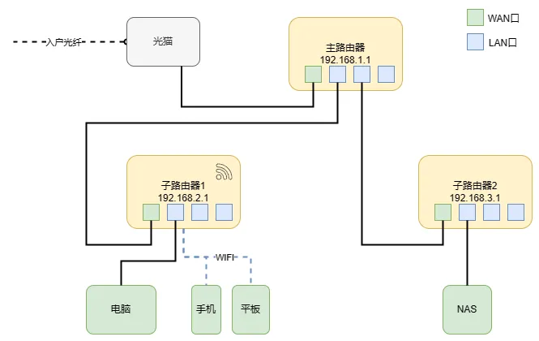
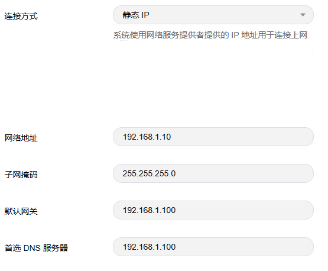
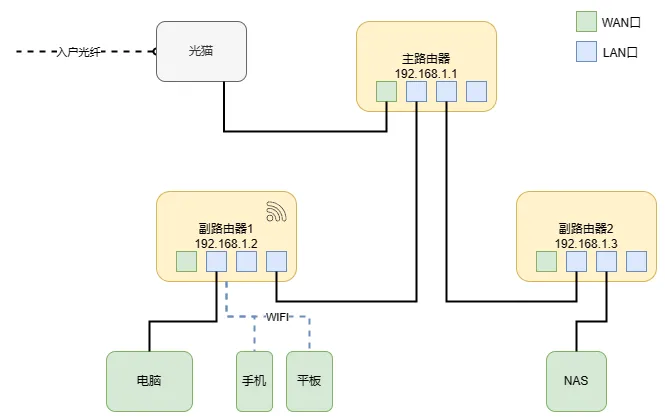

# 多个路由器组网实践

NAS设备在实际使用时可能会碰到以下场景：

由于NAS设备一般是全天处于运行状态，并且使用机械硬盘作为存储介质时由于噪音较大，一般会将NAS设备单独放置。这就导致NAS设备往往与家里很多的网络设备并没有连接到同一台路由器下，在传统的路由器网络配置下，NAS设备与其他网络设备无法处于同一局域网内。

> 通过传统组网方式，电脑、手机、平台和NAS均能连接上网，但由于子路由器1和子路由器2分别搭建了各自的局域网，导致连接子路由器1的电脑、手机和平板设备与连接子路由器2的NAS设备并不在同一个局域网内。

由于NAS设备的特殊性，通过内网进行访问的速度一般会大大高于外网访问的速度，因此将家里多台服务器进行组网，让各个网络设备（包括NAS设备）处于同一局域网内，其他设备通过内网访问NAS的体验将会大大改善。

虽然现在有很多厂商推出了Mesh网关，使得家庭组网方式变得十分简单，但是一般都需要各个路由器都支持Mesh组网方式，换句话说，就是对路由器硬件设备的品牌和型号有硬性要求，限制较多。

本文介绍一种通用的组网方式，可以使多个不同品牌的路由器完成组网。

## 组网步骤

### 1. 配置副路由器

首先，通过副路由器web管理界面或者按压RESET口的方式进行重置，重置完成后用网线连接副路由器的LAN口和电脑的网口。从电脑的浏览器进入路由器管理界面，路由器管理界面的地址、用户名/密码信息一般可以在路由器的包装上或者产品说明书中获取到。

1. 设置副路由器的上网方式为**静态IP**，填写IP地址、子网掩码、网关、DNS服务器信息并保存。

> 具体界面不同品牌型号的路由器并不一定相同，仅供参考。

2. 关闭副路由器的**DHCP功能**（禁用副路由器的自动分配IP功能）。

### 2. 连接路由

完成以上配置后，如图所示，将主路由器和副路由器的LAN口连接，此时连接上路由器的设备均由主路由器进行IP分配，待IP分配完成之后即可正常上网，并且所有设备都在同一局域网内。

此时如果想要将设备绑定IP，可以自行配置各联网设备手动设置IP，或是在主路由器中将设备与IP进行绑定（前提是主路由器支持该功能）。
