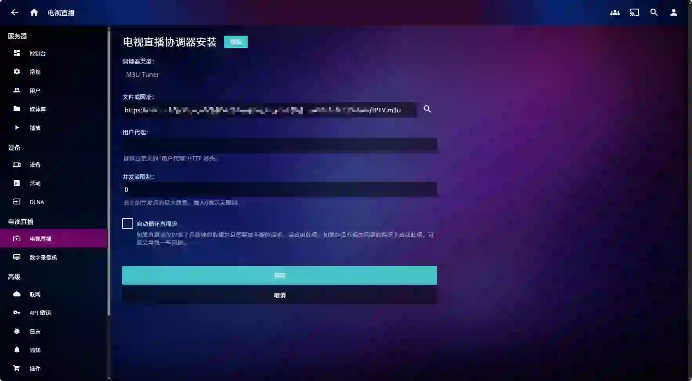
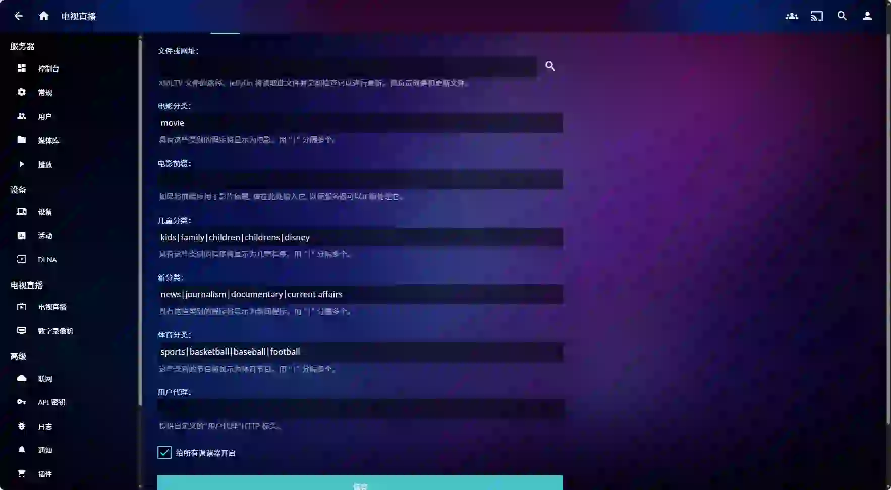
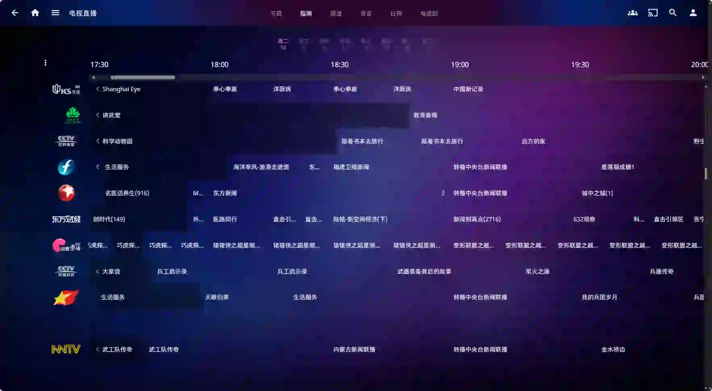
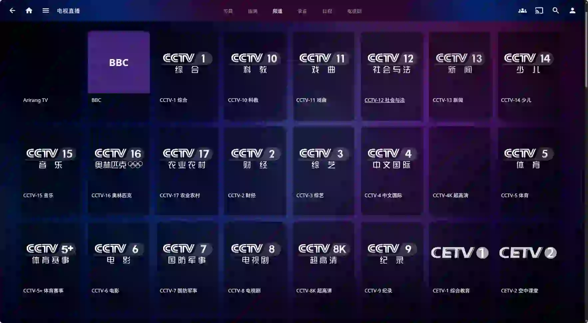
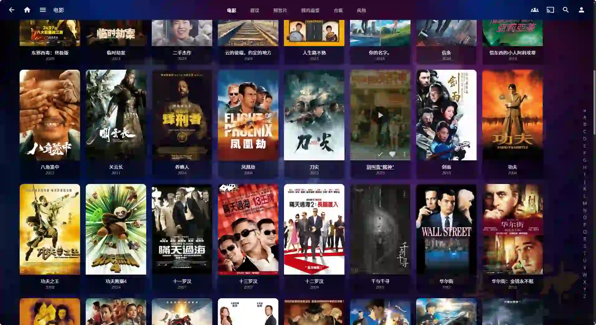

# 安装Jellyfin实现IPTV播放及自建家庭影视系统

互联网诞生了这么多年，看电视这项传统娱乐项目已经被大多数年轻人所遗忘，越来越多的人似乎更热衷于刷短视频，玩手游来消遣时间。但也有一群怀旧的人，依然对电视直播情有独钟。

目前主流看电视的方式是使用三大电信运营商的IPTV（交互式网络电视）业务联网观看，由于这项业务是收费的，于是很多人选择了免费的第三方电视直播软件。然而好景不长，在监管越来越严的大背景下，“电视家”之类的第三方电视直播软件都出现了无法使用的情况。

网络上大神众多，秉持着开放自由的精神，渐渐出现了一些长期稳定有效的电视直播源，于是就有了通过安装Jellyfin实现IPTV电视直播的方法。

## 安装及配置

### 前期准备

- 直播源：[m3u直播源](https://github.com/search?q=m3u&type=repositories)
- Jellyfin Docker镜像：https://hub.docker.com/r/jellyfin/jellyfin

### 运行Jellyfin容器

```sh
docker run -d \
 --name jellyfin \
 --user uid:gid \
 --net=host \
 --volume /path/to/config:/config \ # Alternatively --volume jellyfin-config:/config
 --volume /path/to/cache:/cache \ # Alternatively --volume jellyfin-cache:/cache
 --mount type=bind,source=/path/to/media,target=/media \
 --restart=unless-stopped \
 jellyfin/jellyfin
```

### 配置电视直播

进入`控制台 -> 电视直播`设置界面，添加调谐器设备，选择`M3U Tuner`类型，并填写找到的直播源地址，保存。



添加电视指南数据提供方，选择`XMLTV`类型，填写找到的EPG接口地址，保存。



配置完成后，执行刷新指南数据。刷新完成后，进入主页的“电视直播”，就可以看电视了，在指南中还能看到节目预告。





### 搭建家庭影音系统

进入`控制台 -> 媒体库`设置界面，将视频资源所在目录添加到媒体库，系统会自动进行刮削并生成电影海报。

