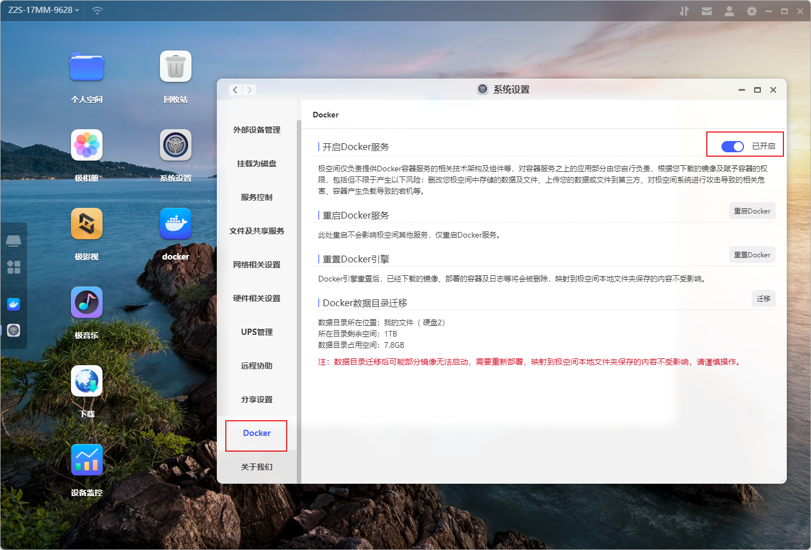
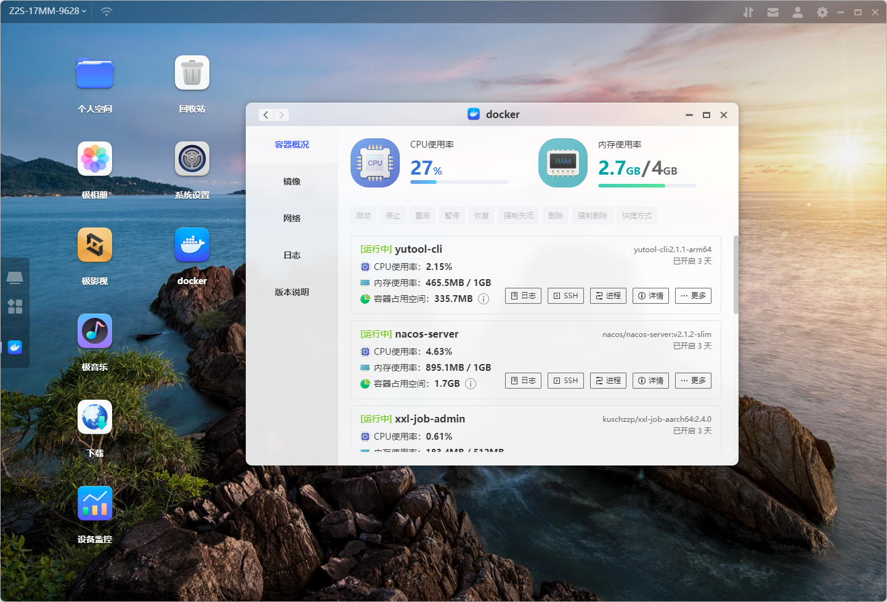
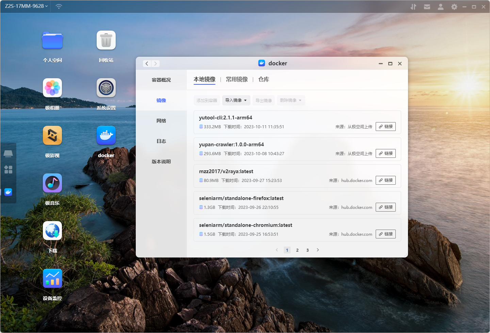
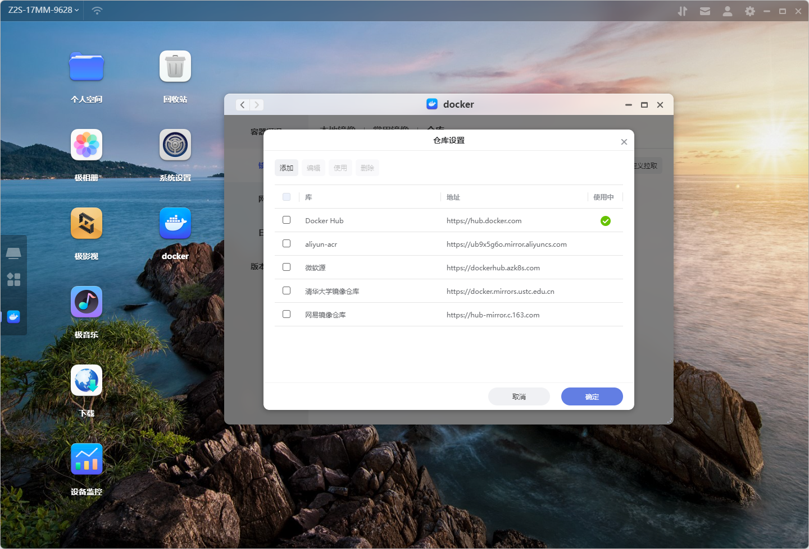
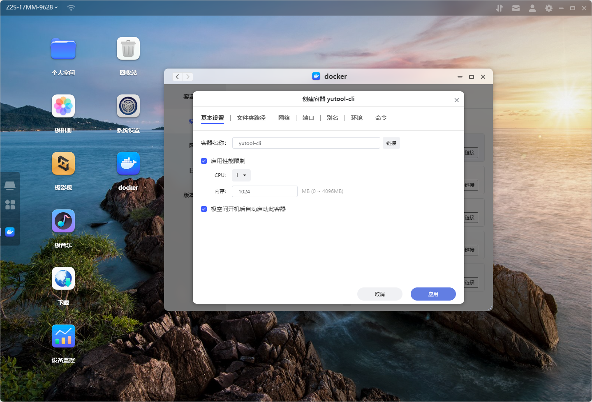

# 极空间Docker使用攻略

## 使用步骤
### 启用极空间Docker服务

### Docker容器管理

可以对现有容器进行启动、停止、暂停等基本操作。
### Docker镜像管理

可以配置多个镜像仓库，按需使用。一般来说Docker Hub的镜像是最全的，但是国内无法正常访问网页导致不能查看镜像的具体信息，也可以选择国内的镜像源加速镜像下载速度。

### 添加容器
选择已经下载好的镜像，使用“添加到容器”功能，在完成容器的配置之后，即可创建一个新的容器。

## 进阶技巧

### 1. 如何部署本地构建的Docker镜像

通过以下步骤上传并部署本地镜像：

1. 在自己的开发机上使用`docker build`命令构建本地Docker镜像
2. 使用`docker save`将构建好的本地镜像打包成镜像文件
3. 上传镜像文件到极空间
4. 进入极空间Docker管理工具的镜像管理界面-本地镜像
5. 选择“导入镜像-从极空间导入”
6. 选择上传好的镜像文件导入Docker镜像
7. 导入完成之后，选择Docker镜像并添加到容器即可

也可以将镜像上传至其他Docker镜像平台，然后在极空间的镜像仓库配置该镜像源拉取镜像进行部署。

### 2. 搜索或下载DockerHub镜像失败

通过设置Docker代理使用优质网络连接到DockerHub，实现可以正常地搜索及下载镜像。

具体操作步骤为：

1. 进入Docker工具的设置界面
2. 在弹出的窗口完成HTTP/HTTPS的代理地址及端口的设置
3. 待Docker服务重启后，进入镜像仓库搜索下载DockerHub镜像