# OpenWrt系统安装及配置

OpenWrt是一个功能齐全、易于修改、高度可定制的路由器操作系统，在树莓派上安装OpenWrt系统之后可以作为软路由或者旁路由优化网络连接、扩展路由器功能。

## 准备工作

准备清单：
- 一张用于刷入固件的内存卡
- 一台可以连接树莓派的电脑
- 下载好的树莓派OpenWrt固件，这里用的是适配树莓派3B+的固件，在[下载页面](https://github.com/bigbugcc/OpenWrts/releases)中选择`squashfs-factory`固件

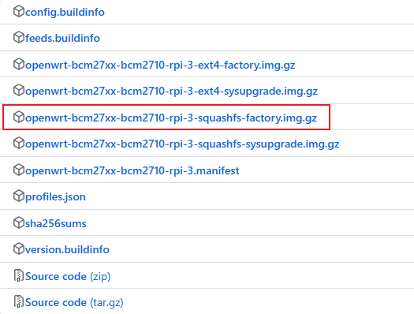

## 刷入固件

将内存卡插上电脑，使用 SD Card Formatter 软件对内存卡进行格式化。

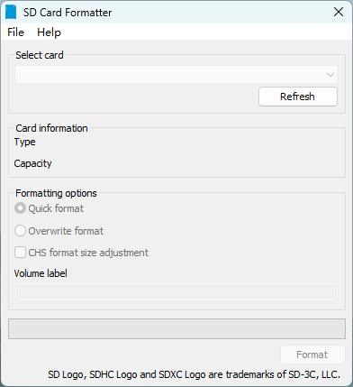

格式化完成后，使用 balenaEtcher 软件将固件烧录到内存卡上。

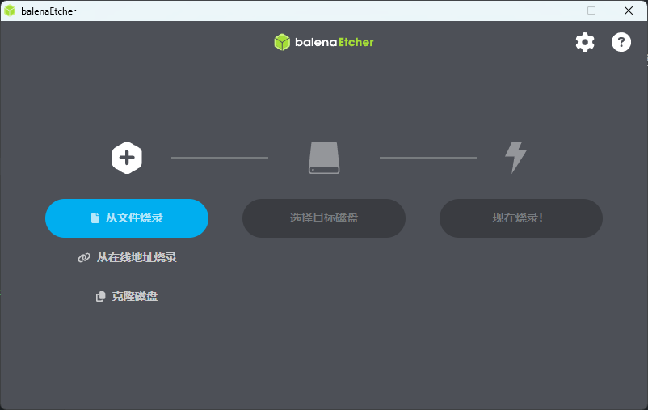

烧录完成后，将内存卡插入树莓派，通电启动树莓派，等待30秒后，OpenWrt系统会自动完成初始化及启动。

使用网线将电脑连接上树莓派的网线接口，配置电脑的IP分配为**DHCP自动分配**，分配IP后IPv4网关地址即OpenWrt的web管理界面地址，通过浏览器打开该地址进入OpenWrt管理界面。默认的用户名为`root`，密码为`password`。


至此，完成了OpenWrt系统的安装工作。

> **注：** 如果发现刷入固件后，无法顺利获取到树莓派OpenWrt的地址，一般是内存卡格式化失败导致的，这时需要使用 SD Card Formatter 软件选择`Overwirte format`模式对内存卡进行完全覆写格式化之后，再次烧录固件即可解决。

## 旁路由配置

树莓派OpenWrt一般作为旁路由使用。

进入`网络-接口`页面，选择LAN接口点击修改，按照下图完成各项配置：

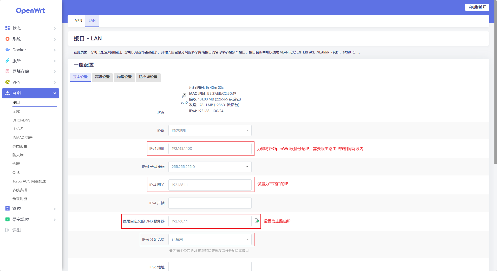

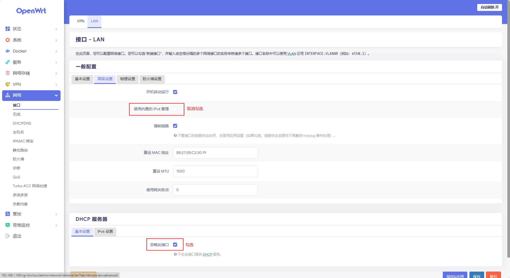

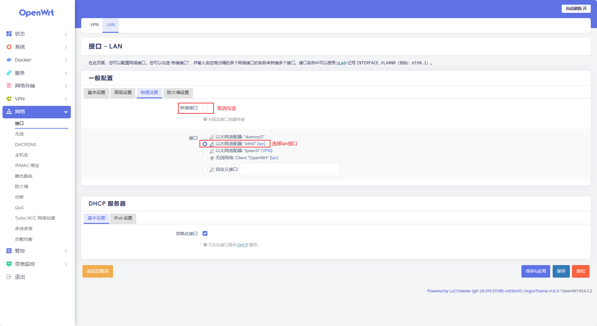

完成配置后，点击`保存&应用`使配置生效。由于树莓派OpenWrt设备地址发生更改，此时使用原来的地址已经无法进入管理界面了。

接着将电脑IP分配方式改为**手动分配**，并分配一个与树莓派OpenWrt设备在同一个网段的IP地址，如：`192.168.1.12`，随后在浏览器中输入更改后的OpenWrt地址`http://192.168.1.100`即可重新进入管理界面。

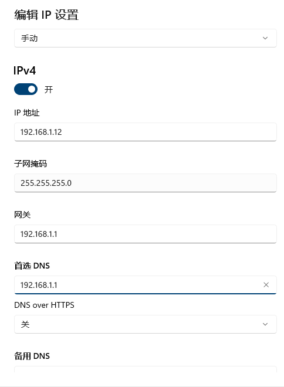

在管理界面确认之前对LAN接口的修改生效后，断开电脑与树莓派的连接的网线，然后将树莓派接入主路由，完成树莓派OpenWrt与主路由器的组网。

此时OpenWrt还不能作为旁路由发挥作用，还需要将同局域网的联网设备手动配置网关和DNS服务器为OpenWrt的IP地址后，就可以使OpenWrt真正发挥旁路由的效用。

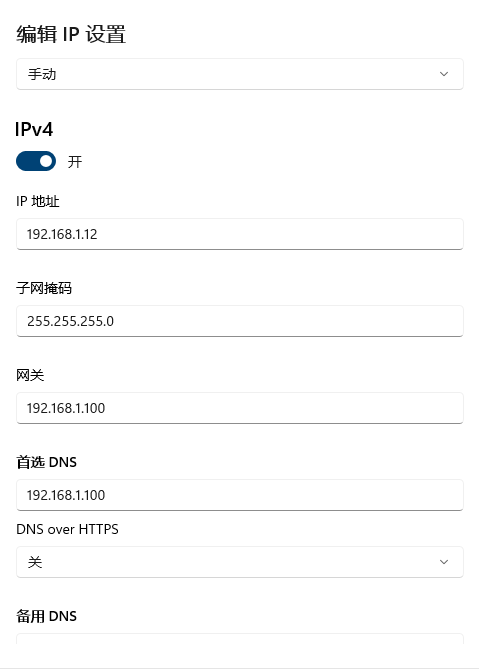

通过在OpenWrt中配置并启用各种服务之后，就可以让连接上OpenWrt的设备享受服务提供的各种实用功能（如广告过滤、科学上网等）。


## 进阶技巧

### 广告过滤

进入`服务-AdGuardHome`页面，进行如下配置后，勾选启用。

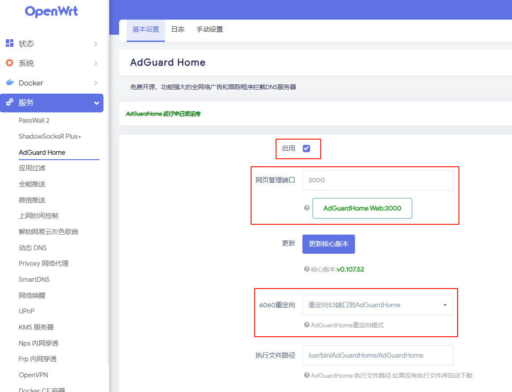

打开AdGuardHome的控制台地址，登录之后通过对DNS服务器和过滤器进行配置，可实现优化网络连接速度、广告过滤等功能。

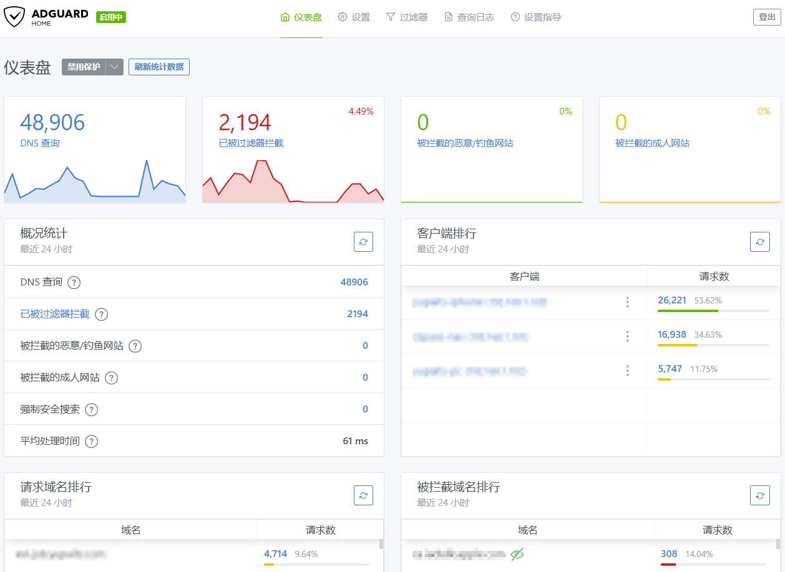

### 优化上网环境

进入`服务-ShadowSocksR Plus+`页面，选择`服务器节点`选项卡，添加一个拥有优质网络环境的服务器节点配置并保存之后。回到`客户端`选项卡，主服务器选择刚添加的服务器节点，保存并应用。完成配置之后，同一个局域网中的其它连接OpenWrt旁路由的设备就可以优化上网环境。


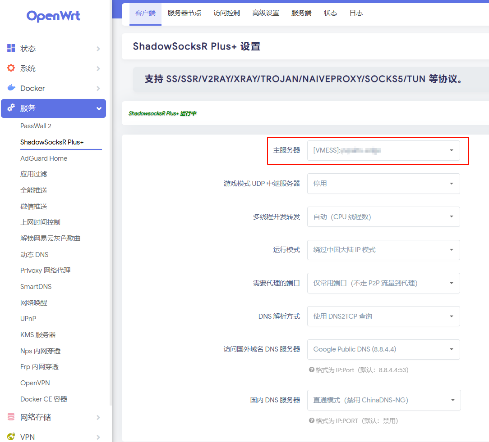

### 搭建代理服务

- 安装`privoxy`插件

  进入`系统-软件包`页面，安装`luci-app-privoxy`、`luci-i18n-privoxy-zh-cn`、`privoxy`软件包完成之后，刷新页面在`服务`下会新增`Privoxy 网络代理`菜单项。

  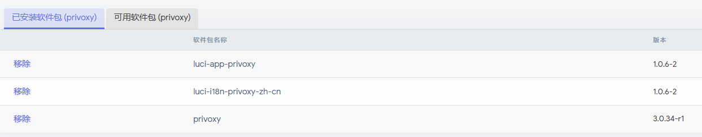

- 启用`ShadowSocksR Plus+`的`SOCKS5 代理服务端（全局）`

  进入`服务-ShadowSocksR Plus+`页面，选择`高级设置`选项卡，启用SOCKS 5代理。

  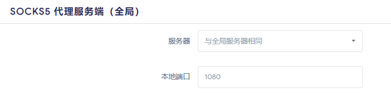

  **局域网内的设备可使用SOCKS5代理: `192.168.1.100:1080`**

- 启用HTTP/HTTPS代理服务

  使用ssh连接打开OpenWrt控制台，打开privoxy配置文件（路径：`/etc/config/privoxy`）并覆写为以下内容:

  ```conf
  config  privoxy 'privoxy'
        option  confdir         '/etc/privoxy'
        option  logdir          '/var/log'
        option  logfile         'privoxy.log'
        list    listen_address  '192.168.1.100:8118'
        option  forward_socks5  '/ 192.168.1.100:1080 .'
  ```

  通过将HTTP/HTTPS转发至SOCKS5代理，实现HTTP/HTTPS代理。进入`服务-Privoxy 网络代理`页面，启动privoxy服务。

  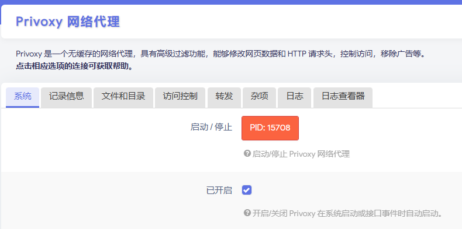

  **局域网内的设备可使用HTTP/HTTPS代理: `192.168.1.100:8118`**