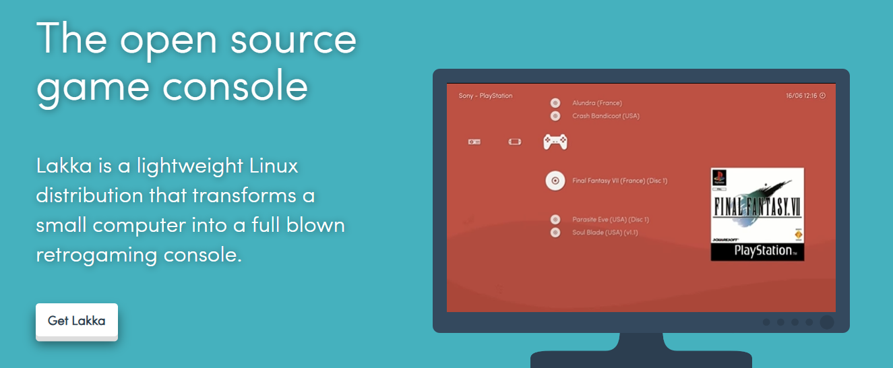
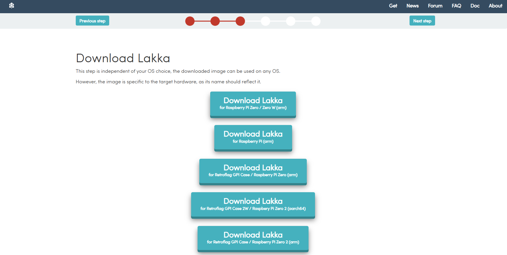
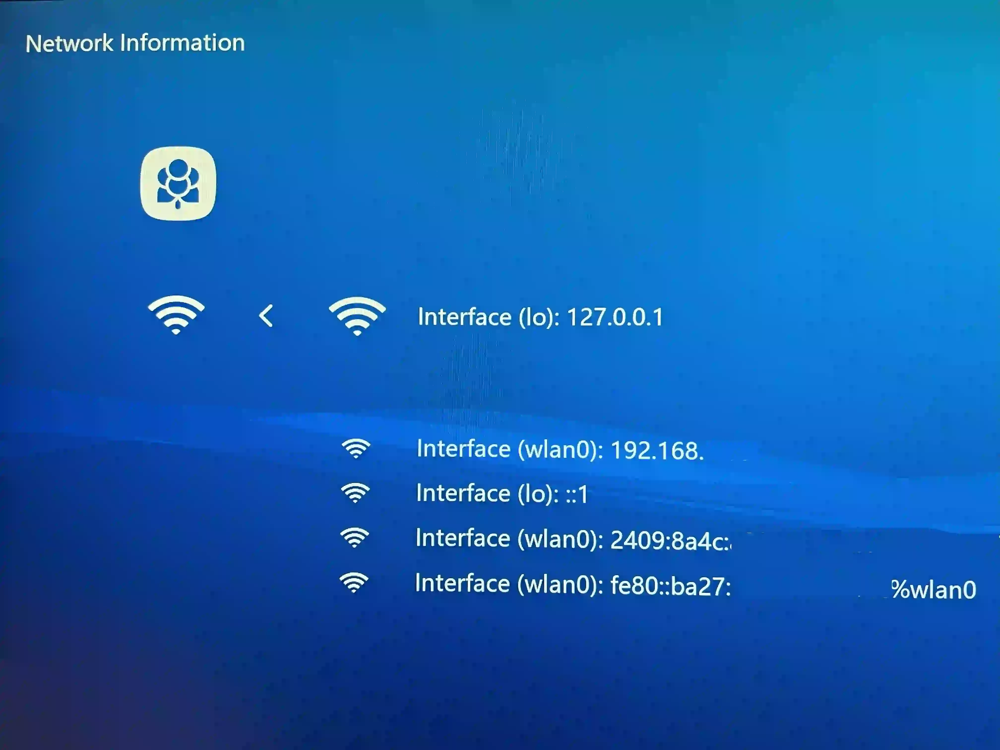
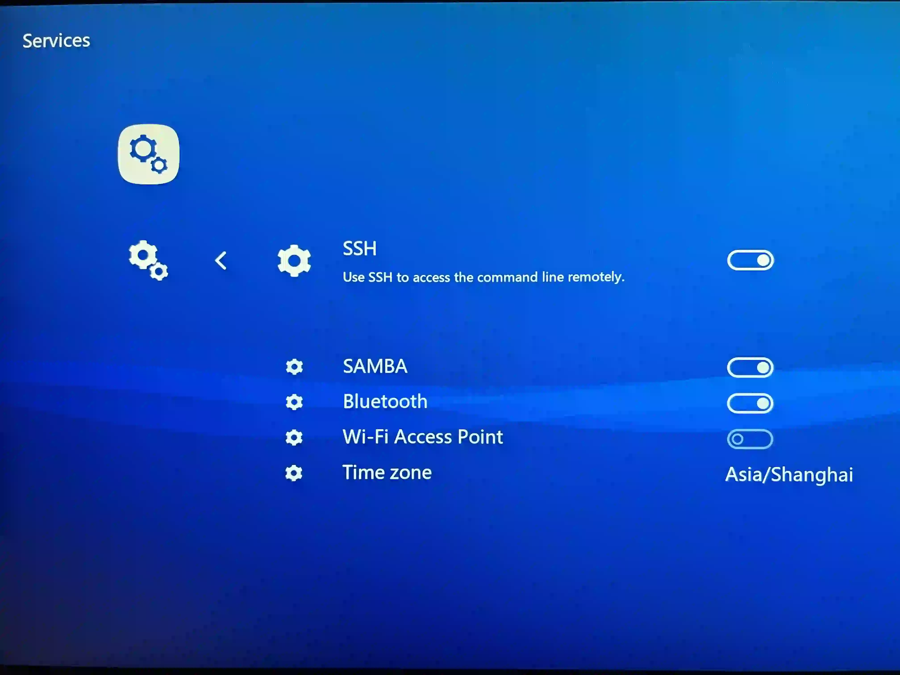
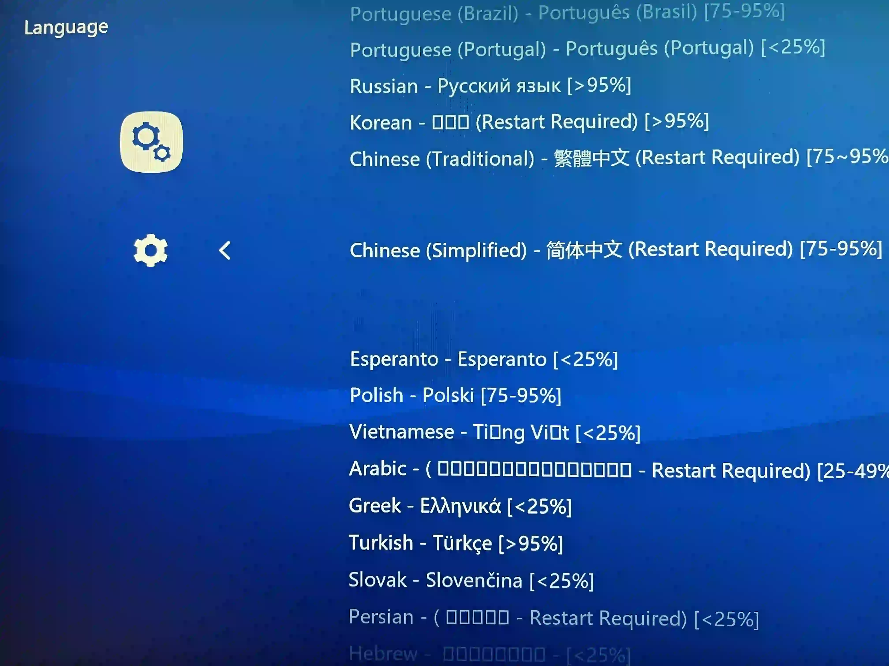
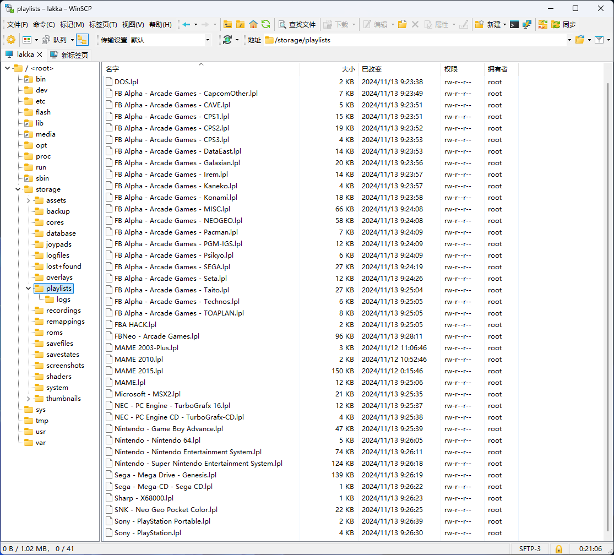
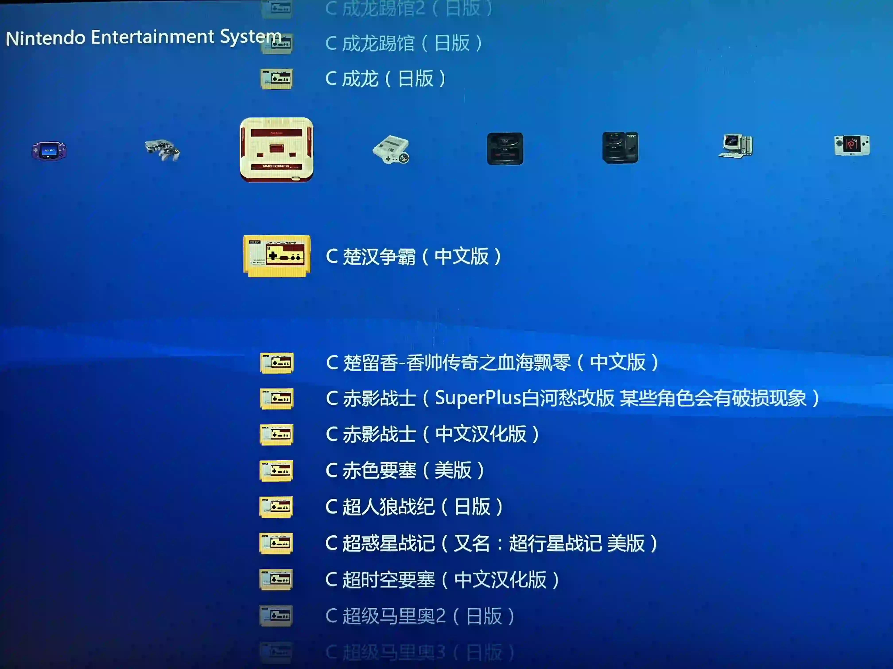
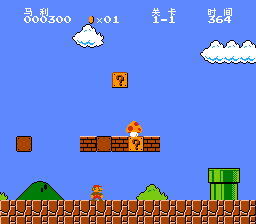

# 树莓派变身高性能复古游戏机

目前适配了手里这块树莓派3B+机器的街机模拟器系统有[batocera](https://batocera.org/)、[RetroPie](https://retropie.org.uk/)和[Lakka](https://www.lakka.tv/)等。经过对各系统初步使用体验之后，个人感觉Lakka更简洁美观，交互体验更好，因此基于Lakka系统来打造一台自己的游戏机。

## 下载镜像

在[Lakka官方下载页面](https://www.lakka.tv/get/windows/rpi/)上可以找到树莓派各个型号对应的镜像下载链接，点击后即可下载。

同时网络上也有很多包含大量游戏的Lakka整合镜像，这里推荐下载[P哥全手工精心定制版 LAKKA 整合镜像](http://cqucg.com/index.php/archives/7/)，下载的整合镜像在后续步骤也会用到。

## 安装配置系统

准备一张容量大于镜像体积的内存卡，使用 SD Card Formatter 软件对内存进行格式化。格式化完成后，使用 balenaEtcher 软件将镜像烧录到内存卡上。

将内存卡插入树莓派，将树莓派连接显示器、键盘，通电启动系统。Lakka系统首次启动会进行初始化，初始化完成后自动重启进入系统主界面。

### 连接WiFi

在Lakka系统的 `Settings` -> `Wi-Fi` 界面扫描WiFi并输入WiFi密码进行连接。

在 `Main Menu` -> `Information` -> `Network Information` 界面查看树莓派的IP信息。

### 启用ssh和samba服务

在Lakka系统的 `Settings` -> `Services` 界面启用ssh服务和samba服务。

### 语言设置

Lakka默认语言是English，对中文的支持不完善，主要是字体问题导致，添加中文字体后界面就能正常显示中文了。

具体方法为：使用 WinSCP 软件输入树莓派的IP登录到Lakka系统，默认的用户名和密码都是`root`。将字体文件复制到 `/storage/assets/xmb/monochrome/` 目录下，然后在Lakka系统的 `Settings` -> `User` -> `Language` 界面设置语言为简体中文，如果没有即时生效则需要重启系统。

## 添加编辑游戏

进入`/storage`目录，可以找到以下文件夹：
- `roms`：存放游戏ROM文件
- `playlists`：存放游戏描述信息
- `thumbnails`：存放游戏缩略图和截图

将游戏ROM文件上传至 `/storage/roms` 目录，在Lakka中扫描该目录之后可在 `/storage/playlists` 中生成模拟器对应的游戏列表文件，后缀是 `.lpl`。默认扫描出的游戏信息都是英文的，可以手动编辑 `.lpl` 文件内容进行修改。

## 使用技巧

由于驱动原因，笔者手上的手柄对各镜像安装的Lakka系统支持程度如下：

|手柄|官方镜像|整合镜像|
|---|---|---|
| XBox手柄 | 完全不支持 | 部分支持 |
| PS5手柄 | 完美支持 | 完全不支持 |

游戏ROM文件是从整合镜像安装的Lakka系统 `/storage/roms` 目录提取出来的，使用官方系统扫描游戏后生成的 `.lpl` 游戏列表文件全是英文的，手动去编辑成千上万的游戏名称确实太过费时费力，于是想到将整合镜像安装的Lakka系统 `/storage/playlists` 目录中的游戏列表文件一并提取出来，并覆盖掉官方系统生成的游戏列表文件，这样就可以在官方系统中使用PS5手柄畅玩中文名称的海量游戏了。

> 超级马里奥-游戏截图
