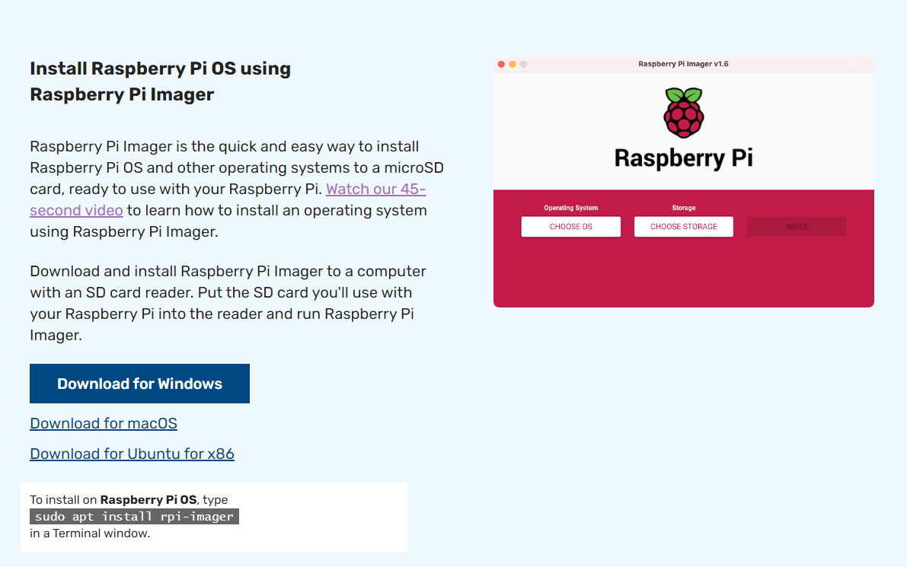
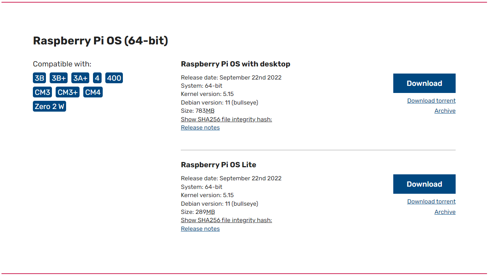
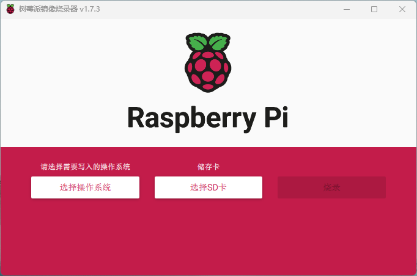
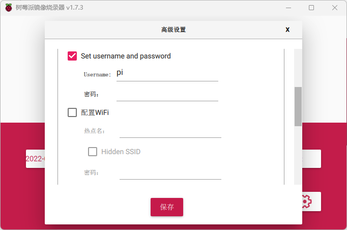

# 树莓派系统安装及配置

## 系统安装
### 下载Raspberry Pi Imager
浏览器输入[https://www.raspberrypi.com/software/](https://www.raspberrypi.com/software/)进入下载页面，点击`Download For Windows`按钮下载。<br />
### 下载Raspberry Pi OS系统镜像
浏览器输入[https://www.raspberrypi.com/software/operating-systems/](https://www.raspberrypi.com/software/operating-systems/)进入镜像下载页面，推荐下载`Raspberry Pi OS Lite`。<br />
### 系统镜像烧录
插入SD卡，安装并打开Raspberry Pi Imager。`选择操作系统`选`使用自定义镜像`，`选择SD卡`选我们插入的SD卡。<br /><br />在烧录之前可以对系统进行配置，配置内容包括：

- 设置主机名
- 开启SSH服务
- 设置登录账户密码
- 配置WiFi
- 语言设置

<br />配置完成后，点击`烧录`，会格式化SD卡并写入系统镜像。<br />烧录完成后，将SD卡插入树莓派，接通电源，开机。
### 配置apt软件源
参考以下配置<br />阿里云Raspbian镜像：[https://developer.aliyun.com/mirror/raspbian](https://developer.aliyun.com/mirror/raspbian)<br />清华源Raspbian镜像：[https://mirrors.tuna.tsinghua.edu.cn/help/raspbian/](https://mirrors.tuna.tsinghua.edu.cn/help/raspbian/)<br />更新软件源列表，更新软件版本：
```bash
# 更新软件源列表
sudo apt update
# 更新软件
sudo apt upgrade
```
###    控制台设置中文环境
执行`sudo raspi-config`进入配置界面，`Localisation options`->`Locale`选择`zh_CN.UTF-8`并确认。<br />执行 `sudo nano /etc/default/locale` 修改配置文件为如下内容：
```toml
LANG=zh_CN.UTF-8
LANGUAGE=zh_CN:zh
LC_NUMERIC=zh_CN
LC_TIME=zh_CN
LC_MONETARY=zh_CN
LC_PAPER=zh_CN
LC_NAME=zh_CN
LC_ADDRESS=zh_CN
LC_TELEPHONE=zh_CN
LC_MEASUREMENT=zh_CN
LC_IDENTIFICATION=zh_CN
LC_ALL=zh_CN.UTF-8
```
执行 `sudo nano /etc/environment` 在环境配置文件追加以下内容：
```toml
LANG=zh_CN.UTF-8
LANGUAGE=zh_CN:zh
LC_NUMERIC=zh_CN
LC_TIME=zh_CN
LC_MONETARY=zh_CN
LC_PAPER=zh_CN
LC_NAME=zh_CN
LC_ADDRESS=zh_CN
LC_TELEPHONE=zh_CN
LC_MEASUREMENT=zh_CN
LC_IDENTIFICATION=zh_CN
LC_ALL=zh_CN.UTF-8
```
重启后控制台即切换为中文环境。
### swap扩容
默认的100M swap不太够用，修改为2G。<br />查看所有swap：
```bash
swapon --show
```
编辑`/etc/dphys-swapfile`修改swap默认大小为2G：
```nginx
CONF_SWAPSIZE=2048
```
重启后生效。
