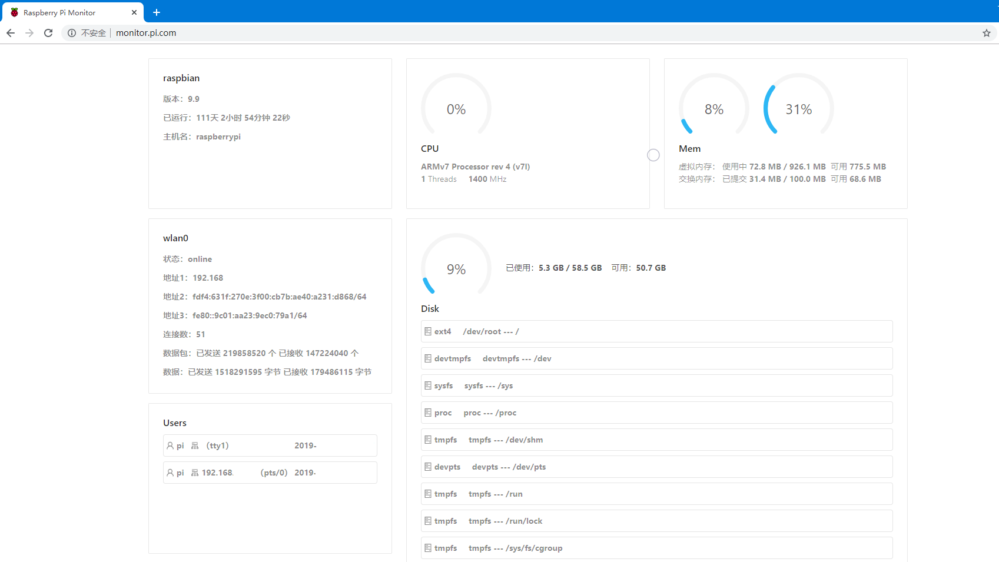

# 运行情况监控

项目地址：[go-pi-monitor](https://github.com/yupaits/go-pi-monitor)<br />go-pi-monitor 是在 [gopsutil](https://github.com/shirou/gopsutil) 的基础上挑选部分 metric 信息进行监控可视化。
## 编译部署
在 Raspbian 上安装 GoLang 1.12.5 版本的脚本如下：
```bash
#install_go_pi.sh
cd $HOME
FileName='go1.12.5.linux-armv6l.tar.gz'
wget https://dl.google.com/go/$FileName
sudo tar -C /usr/local -xvf $FileName
cat >> ~/.bashrc << 'EOF'
export GOPATH=$HOME/go
export PATH=/usr/local/go/bin:$PATH:$GOPATH/bin
EOF
source ~/.bashrc
```
参考 [Install Go Lang 1.12.5 on Raspberry Pi 3 B+](https://gist.github.com/bigsan/c936451ed1a5b18bb8b0d7e8cc3e7212)。<br />下载 go-pi-monitor 并进行编译运行：
```bash
git clone https://github.com/yupaits/go-pi-monitor.git
cd go-pi-monitor
go build app/main.go
cd ui
npm install
npm run build
cd ..
sudo copy -f app/main ./
sudo chmod +x main
./main
```
<br />监控界面<br />创建并编辑 nginx 配置文件`/etc/nginx/sites-enabled/pi-monitor`，输入以下内容并保存：
```nginx
server {
    listen 80;
    server_name monitor.pi.com;

    location / {
        proxy_pass http://127.0.0.1:888;
        proxy_redirect off;
        proxy_set_header Host $host;
        proxy_set_header X-Real-IP $remote_addr;
        proxy_set_header X-Forwarded-For $proxy_add_x_forwarded_for;
        proxy_connect_timeout 60;
        proxy_send_timeout 300;
        proxy_read_timeout 300;
    }
}
```
使新增的 nginx 配置生效：`sudo nginx -s reload`。<br />客户端修改`hosts`文件以便使用`monitor.pi.com`域名访问监控界面。<br />例如：`192.168.1.1 monitor.pi.com`
## 开机启动
编写`/etc/init.d/go-pi-monitor.sh`文件并保存：
```bash
#!/bin/bash

### BEGIN INIT INFO
# Provides: go-pi-monitor
# Required-Start:
# Required-Stop:
# Default-Start: 2 3 4 5
# Default-Stop: 0 1 6
# Short-Description: go-pi-monitor
# Description: go-pi-monitor service start
### END INIT INFO

cd /home/pi/app/go-pi-monitor
nohup ./main >go-pi-monitor.out 2>&1 &
```
配置可执行权限，`sudo chmod +x /etc/init.d/go-pi-monitor.sh`。
