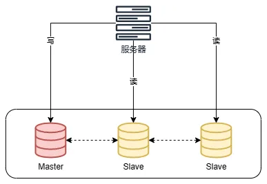
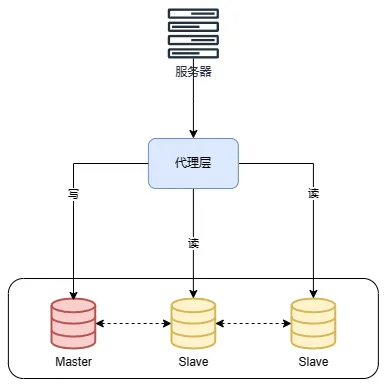

# 数据库读写分离&分库分表

## 读写分离

### 什么是读写分离？

顾名思义，**读写分离主要是为了将对数据库的读写操作分散到不同的数据库节点上。** 这样的话，就能够小幅提升写性能，大幅提升读性能。



一般情况下，我们都会选择一主多从，也就是一台住数据库负责写，其他的从数据库负责读。主库和从库之间会进行数据同步，以保证从库中数据的准确性。这样的架构实现起来比较简单，并且也符合系统的写少读多的特点。

### 如何实现读写分离？

不论是使用哪一种读写分离具体的实现方案，想要实现读写分离一般包含如下几步：

1. 部署多台数据库，选择其中的一台作为住数据库，其他的一台或者多台作为从数据库。
2. 保证主数据库和从数据库之间的数据是实时同步的，这个过程也就是我们常说的主从复制。
3. 系统将写请求交给主数据库处理，读请求交给从数据库处理。

落实到项目本身的话，常用的方式有两种：

#### 1. 代理方式



我们可以在应用和数据中间加上一个代理层。应用程序所有的数据请求都交给代理层处理，代理层负责分离读写请求，将它们路由到对应的数据库中。

提供类似功能的中间件有**MySQL Router**（官方，MySQL Proxy的替代方案）、**Atlas**（基于MySQL Proxy）、**MaxScale**、**MyCat**。

关于MySQL Router多提一点：在MySQL 8.2的版本中，MySQL Router能自动分辨对数据库的读写操作并把这些操作路由到正确的实例上。这是一项有价值的功能，可以优化数据库性能和可扩展性，而无需在应用程序中进行任何更改。具体介绍可以参考官方博客：[MySQL 8.2 – transparent read/write splitting](https://blogs.oracle.com/mysql/post/mysql-82-transparent-readwrite-splitting)。

#### 2. 组件方式

在这种方式中，我们可以通过引入第三方组件来帮助我们读写请求。

这也是比较推荐的一种方式。这种方式目前是在各种互联网公司中用的最多的，相关的实际案例也非常多。如狗你要采用这种方式的话，推荐使用**sharding-jdbc**，直接引入jar包即可使用，非常方便。同时，也节省了很多运维的成本。

你可以在shardingsphere官方找到[sharding-jdbc 关于读写分离的操作](https://shardingsphere.apache.org/document/legacy/3.x/document/cn/manual/sharding-jdbc/usage/read-write-splitting/)。

### 主从复制原理是什么？

MySQL binlog（binary log即二进制日志文件）主要记录了MySQL数据库中数据的所有变化（数据库执行的所有DDL和DML语句）。因此，我们根据主库的MySQL binlog日志就能够将主库的数据同步到从库中。

更具体和详细的过程是这样的（来自：[《MySQL Master-Slave Replication on the Same Machine》](https://www.toptal.com/mysql/mysql-master-slave-replication-tutorial)）：


1. 主库将数据库中数据的变化写入到binlog
2. 从库连接主库
3. 从库会创建一个I/O线程向主库请求更新的binlog
4. 主库会创建一个binlog dump线程来发送binlog，从库中的I/O线程负责接收
5. 从库的I/O线程将接收的binlog写入到relay log中
6. 从库的SQL线程读取relay log同步数据到本地（也就是再执行一遍SQL）

一般看到binlog就要想到主从复制。当然，除了主从复制之外，binlog还能帮助我们实现数据恢复。

例如阿里开源了一个叫做canal的工具。这个工具可以帮助我们实现MySQL和其他数据源比如Elasticsearch或者另外一台MySQL数据库之间的数据同步。很显然，这个工具的底层原理肯定也是依赖binlog。cannal的原理就是模拟MySQL主从复制的过程，解析binlog将数据同步到其他的数据源。

另外，像常用的分布式缓存组件Redis也是通过主从复制实现的读写分离。

简单总结一下：

**MySQL主从复制是依赖于binlog。另外，常见的一些同步MySQL数据到其他数据源的工具（比如canal）的底层一般也是依赖binlog。**

### 如何避免主从延迟？

读写分离对于提升数据库的并发非常有效，但是，同时也会带来一个问题：主库和从库的数据存在延迟，比如你写完主库之后，主库的数据同步到从库是需要时间的，这个时间差就导致了主库和从库的数据不一致问题。这也就是我们经常说的**主从同步延迟**。

如果我们的业务场景无法容忍主从同步延迟的话，应该如何避免呢（注意：这里说的是避免而不是减少延迟）？

这里提供两种方案。

#### 1. 强制将读请求路由到主库处理

既然从库的数据过期了，那就直接从主库读取！这种方案虽然会增加主库的压力，但是实现起来比较简单。

比如`Sharding-JDBC`就是采用的这种方案。通过使用Sharding-JDBC的`HintManager`分片键值管理器，可以强制使用主库。

```java
HintManager hintManager = HintManager.getInstance();
hintManager.setMasterRouteOnly();
// 继续JDBC操作
```

对于这种方案，你可以将那些必须获取最新数据的读请求都交给主库处理。

#### 2. 延迟读取

还有一种方式是，既然主从同步存在延迟，那就在延迟之后读取，比如主从同步延迟0.5s，那就1s之后再读取数据。这种方式方便但不优雅。

不过，这样的设计对于业务流程会比较友好：对于一些对数据比较敏感的场景，你可以在完成写请求之后，避免立即进行请求操作。比如你支付成功之后，跳转到一个支付成功的页面，当你点击返回之后才返回自己的账户。

#### 总结

关于如何避免主从延迟，我们这里介绍了两种方案。实际上，延迟读取这种方案没办法完全避免主从延迟，只能说可以减少出现延迟的概率而已，实际项目中一般不会使用。

总得来说，要想不出现延迟问题，一般还是要强制将那些必须获取最新数据的读请求都交给主库处理。如果你的项目大部分业务场景对数据准确性要求不是那么高的话，这种方案还是可以选择的。

### 什么情况下会出现主从延迟？如何尽量减少延迟？

要搞懂什么情况下会出现主从延迟，首先要搞懂什么是主从延迟。

MySQL主从同步延时是指从库的数据落后于主库的数据，这种情况可能由以下两个原因早成：

1. 从库I/O线程接收binlog的速度跟不上主库写入binlog的速度，导致从库relay log的数据滞后于主库binlog的数据。
2. 从库SQL线程执行relay log的速度跟不上从库I/O线程接收binlog的速度，导致从库的数据滞后于从库relay log的数据。

与主从同步有关的时间点主要有3个：

1. 主库执行完一个事务，写入binlog，将这个时刻记为T1；
2. 从库I/O线程接收到binlog并写入relay log的时刻记为T2；
3. 从库SQL线程读取relay log同步数据到本地的时刻记为T3.

结合上面讲到的主从复制原理，可以得出：

- T2和T1的差值反映了从库I/O线程的性能和网络传输的效率，这个差值越小说明从库I/O线程的性能和网络传输效率越高。
- T3和T2的差值反映了从库SQL线程执行的速度，这个差值越小，说明从库SQL线程执行的速度越快。

那什么情况下会出现主从延迟呢？这里列举几种常见的情况：

1. **从库机器性能比主库差**：从库接收binlog并写入relay log以及执行SQL语句的速度会比较慢（也就是T2-T1和T3-T2的值会较大），进而导致延迟。解决方法是选择与主库一样规格或更高规格的机器作为从库，或者对从库进行性能优化，比如调整参数、增加缓存、使用SSD等。
2. **从库处理的读请求过多**：从库需要执行主库的所有写操作，同时还要响应读请求，如果读请求过多，会占用从库的CPU、内存、网络等资源，影响从库的复制效率（也就是T2-T1和T3-T2的值会较大，和前一种情况类似）。解决方法是引入缓存（推荐）、使用一主多从的架构，将读请求分散到不同的从库，或者使用其他系统来提供查询的能力，比如将binlog接入到Hadoop、Elasticsearch等系统中。
3. **大事务**：运行时间比较长，长时间未提交的事务就可以成为大事务。由于大事务执行时间长，并且从库上的大事务会比主库上的大事务花费更多的时间和资源，因此非常容易造成主从延迟。解决办法是避免大批量修改数据，尽量分批进行。类似的情况还有执行时间较长的慢SQL，实际项目遇到慢SQL应该进行优化。
4. **从库太多**：主库需要将binlog同步到所有的从库，如果从库数量太多，会增加同步的时间和开销（也就是T2-T1的值会比较大，但这里是因为主库同步压力大导致的）。解决方案是减少从库的数量，或者将从库分为不同的层级，让上层的从库再同步给下层的从库，减少主库的压力。
5. **网络延迟**：如果主从之间的网络传输速度慢，或者出现丢包、抖动等问题，那么就会影响binlog的传输效率，导致从库延迟。解决方法是优化网络环境，比如提升带宽、降低延迟、增加稳定性等。
6. **单线程复制**：MySQL 5.5及之前，只支持单线程复制。为了优化复制性能，MySQL 5.6引入了**多线程复制**，MySQL 5.7还进一步完善了多线程复制。
7. **复制模式**：MySQL默认的复制是异步的，必然会存在延迟问题。全同步复制不存在延迟问题，但性能太差了。半同步复制是一种折中方案，相对于异步复制，半同步复制提高了数据的安全性，减少了主从延迟（还是有一定程度的延迟）。MySQL 5.5开始，MySQL以插件的形式支持**semi-sync半同步复制**。并且，MySQL 5.7引入了**增强半同步复制**。
8. ……

## 分库分表

读写分离主要应对的是数据库读并发，没有解决数据库存储问题。试想一下：**如果MySQL一张表的数据量过大怎么办？**

换言之，**我们该如何解决MySQL的存储压力呢？**

最常用的解决方案就是**分库分表**。

### 什么是分库？

**分库**就是将数据库中的数据分散到不同的数据库上，可以垂直分库，也可以水平分库。

**垂直分库**就是把单一数据库按照业务进行划分，不同的业务使用不同的数据库，进而将一个数据库的压力分担到多个数据库。

举个例子：说你将数据库中的用户表、订单表和商品表分别单独拆分为用户数据库、订单数据库和商品数据库。


**水平分库**是把同一个表按一定规则拆分到不同的数据库中，每个库可以位于不同的服务器上，这样就实现了水平扩展，解决了单表的存储和性能瓶颈的问题。

举个例子：订单表数据量太大，你对订单表进行了水平切分（水平分表），然后将切分后的2张订单表分别放在两个不同的数据库。


### 什么是分表？

**分表**就是对单表的数据进行拆分，可以是垂直拆分，也可以是水平拆分。

**垂直分表**是对数据表列的拆分，把一张列比较多的表拆分为多张彪。

举个例子：我们可以将用户信息表中的一些列单独抽出来作为一个表。

**水平分表**是对数据表行的拆分，把一张行比较多的表拆分为多张表，可以解决单一表数据量过大的问题。

举个例子：我们可以将用户信息表拆分成多个用户信息表，这样就可以避免单一表数据量过大对性能造成影响。

水平拆分只能解决单表数据量大的问题，为了提升性能，我们通常会选择将拆分后的多张表放在不同的数据库中。也就是说，水平分表通常和水平分库同时出现。


### 什么情况下需要分库分表？

遇到下面几种场景可以考虑分库分表：

- 单表的数据达到千万级别以上，数据库读写速度比较缓慢。
- 数据库中的数据占用的空间越来越大，备份时间越来越长。
- 应用的并发两太大。

### 常见的分片算法有哪些？

分片算法主要解决了数据被水平分片之后，数据究竟该存放在哪个表的问题。

- **哈希分片**：求指定key（比如id）的哈希，然后根据哈希值确定数据应被放置在哪个表中。哈希分片比较适合随机读写的场景，不太适合经常需要范围查询的场景。
- **范围分片**：按照特性的范围区间（比如时间区间、ID区间）来分配数据，比如将`id`为`1~299999`的记录分到第一个库，`300000~599999`分到第二个库。范围分片适合需要经常进行范围查找的场景，不太适合随机读写的场景（数据未被分散，容易出现热点数据的问题）。
- **地理位置分片**：很多NewSQL数据库都支持地理位置分片算法，也就是根据地理位置（如城市、地域）来分配数据。
- **融合算法**：灵活组合多种分片算法，比如将哈希分片和范围分片组合。
- ……

### 分库分表会带来什么问题？

记住，你在公司做的任何技术决策，不光是要考虑这个技术能不能满足我们的要求，是否适合当前业务场景，还要重点考虑其带来的成本。

引入分库分表之后，会给系统带来什么挑战呢？

- **join操作**：同一个数据库中的表分布在了不同的数据库中，导致无法使用join操作。这样就导致我们需要手动进行数据的封装，比如你在一个数据库中查询到一个数据之后，再根据这个数据去另外一个数据库中找对应的数据。不过，很多大厂的资深DBA都是建议尽量不要使用join操作。因为join的效率低，并且会对分库分表造成影响。对于需要用到join操作的地方，可以采用多次查询业务层进行数据组装的方法。不过，这种方法需要考虑业务上多次查询的事务性的容忍度。
- **事务问题**：同一个数据库中的表分布在了不同的数据库中，如果单个操作涉及到多个数据库，那么数据库自带的事务就无法满足我们的要去了。这个时候，我们就需要引入分布式事务了。
- **分布式ID**：分库之后，数据遍布在不同服务器上的数据库，数据库的自增主键已经没办法满足生成的主键唯一了。我们如何为不同的数据节点生成全局唯一主键呢？这个时候，我们就需要为我们的系统引入分布式ID了。
- **跨库聚合查询问题**：分库分表会导致常规聚合查询操作（如group by，order by等）变得异常复杂。这是因为这些操作需要在多个分片上进行数据汇总和排序，而不是在单个数据库上进行。为了实现这些操作，需要编写复杂的业务代码，或者使用中间件来协调分片间的通信和数据传输。这样会增加开发和维护的成本，以及影响查询的性能和可扩展性。
- ……

另外，引入分库分表之后，一般需要DBA的参与，同时还需要更多的数据库服务器，这些都属于成本。

### 分库分表的推荐方案

Apache ShardingSphere是一款分布式的数据库生态系统，可以将任意数据库转换为分布式数据库，并通过数据分片、弹性伸缩、加密等能力对原有数据库进行增强。

ShardingSphere项目（包括Sharding-JDBC、Sharding-Proxy和Sharding-Sidecar）是当当捐入Apache的，目前主要由京东数科的一些巨佬维护。

ShardingSphere绝对可以说是当前分库分表的首选！ShardingSphere的功能完善，除了支持读写分离和分库分表，还提供分布式事务、数据库治理、影子库、数据加密和脱敏等功能。

ShardingSphere提供的功能如下：


ShardingSphere的优势如下（摘自ShardingSphere官方文档：[https://shardingsphere.apache.org/document/current/cn/overview/](https://shardingsphere.apache.org/document/current/cn/overview/)）：

- 极致性能：驱动程序端经历长年打磨，效率接近原生JDBC，性能极致。
- 生态兼容：代理端支持任何通过MySQL/PostgreSQL协议的应用访问，驱动程序端可对接任意实现JDBC规范的数据库。
- 业务零侵入：面对数据库替换场景，ShardingSphere可满足业务无需改造，实现平滑业务迁移。
- 运维低成本：在保留原技术栈不变前提下，对DBA学习、管理成本低，交互友好。
- 安全稳定：基于成熟数据库底座之上提供增量能力，兼顾安全性及稳定性。
- 弹性扩展：具备计算、存储平滑在线扩展能力，可满足业务多变的需求。
- 开放生态：通过多层次（内核、功能、生态）插件化能力，为用户提供可定制满足自身特殊需求的独有系统。

另外，ShardingSphere的生态体系完善，社区活跃，文档完善，更新和发布比较频繁。

不过，还是要多提一句：**现在很多公司都是用的类似于TiDB这种分布式关系型数据库，不需要我们手动进行分库分表（数据库层面已经帮我们做了），也不需要解决手动分库分表引入的各种问题，直接一步到位，内置很多实用的功能（如无感扩容和缩容、冷热存储分离）！**

### 分库分表后，数据如何迁移？

分库分表之后，我们如何将老库（单库单表）的数据迁移到新库（分库分表后的数据库系统）呢？

比较简单同时也是非常常用的方案就是**停机迁移**，写个脚本老库的数据写到新库中。比如你在凌晨2点，系统使用的人数非常少的时候，挂一个公告说系统要维护升级预计1小时。然后，你写一个脚本将老库的数据都同步到新库中。

如果你不想停机迁移数据的话，也可以考虑**双写方案**。双写方案是针对那种不能停机迁移的场景，实现起来要稍微麻烦一些。具体原理是这样的：

- 我们对老库的更新操作（增删改），同时也要写入新库（双写）。如果操作的数据不存在于新库的话，需要插入到新库中。这样就能保证，咱们新库里的数据是最新的。
- 在迁移过程中，双写只会让被更新操作过的老库中的数据同步到新库，我们还需要自己写脚本将老库中的数据和新库的数据做比对。如果新库中没有，那咱们就把数据插入到新库。如果新库有，旧库没有，就把新库对应的数据删除（冗余数据清理）。
- 重复上一步的操作，直到老库和新库的数据一致为止。

想要在项目中实施双写还是比较麻烦的，很容易会出现问题。我们可以借助上面提到的数据库同步工具Canal做增量数据迁移（还是依赖binlog，开发和维护成本较低）。

## 总结

- 读写分离主要是为了将对数据库的读写操作分散到不同的数据库节点上。这样的话，就能够小幅提升写性能，大幅提升读性能。
- 读写分离基于主从复制，MySQL主从复制是依赖于binlog。
- **分库** 就是将数据库中的数据分散到不同的数据库上。**分表** 就是对单表的数据进行拆分，可以是垂直拆分，也可以是水平拆分。
- 引入分库分表之后，需要系统解决事务、分布式ID、无法join操作问题。
- 现在很多公司都是用的类似于TiDB这种分布式关系型数据库，不需要我们手动进行分库分表（数据库层面已经帮我们做了），也不需要解决手动分库分表引入的各种问题，直接一步到位，内置很多实用的功能（如无感扩容和缩容、冷热存储分离）！
- 如果必须要手动分库分表的话，ShardingSphere是首选！ShardingSphere的功能完善，除了支持读写分离和分库分表，还提供分布式事务、数据库治理等功能。另外，ShardingSphere的生态体系完善，社区活跃，文档完善，更新和发布比较频繁。