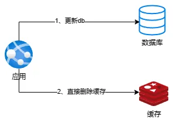
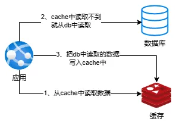
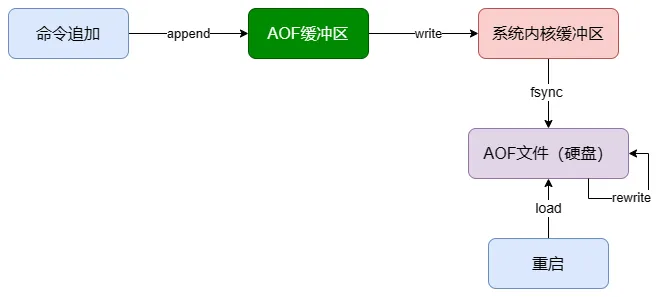
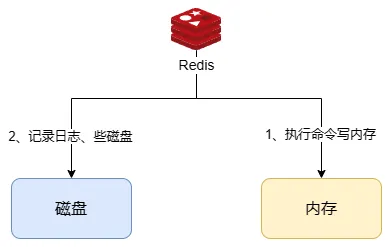
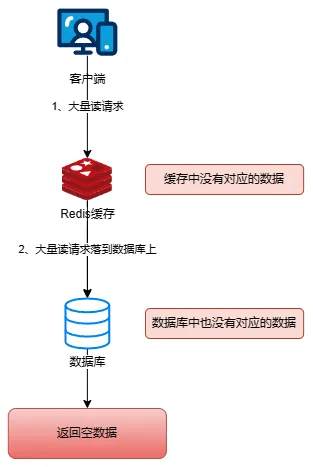
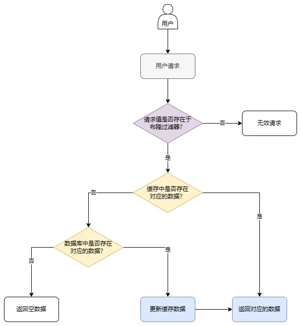
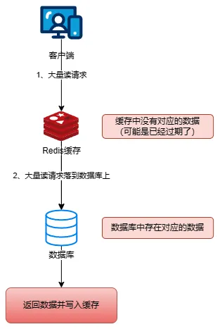

# 缓存

## 缓存的用途

- 高性能

当一个数据获取的请求查询数据库比较耗时（假设是`600ms`），并且查询出来的结果在接下来的几个小时内都不会变化，这时可以将查询的结果放在缓存里，当下次相同的请求发起时，直接从缓存中读取数据，耗时在`2ms`，性能提升300倍。像这种需要复杂操作耗时查出来的结果并且变化不大，但是有很多读请求，直接将查询结果放在缓存中，后续的查询直接查询缓存即可。

- 高并发

MySQL数据库单机大概能支撑`2000QPS`，当系统高峰期的并发量过高时，MySQL单机数据库肯定会挂掉。这时如果将数据放在缓存里，就可以支撑并发量到几万或者几十万。单机承载并发量是MySQL的几十倍。

**缓存是在内存中的，内存天然就支持高并发。**

## 3种常用的缓存读写策略

### Cache Aside Pattern（旁路缓存模式）

`Cache Aside Pattern`是我们平时使用比较多的一种缓存读写模式，比较适合读请求比较多的场景。

`Cache Aside Pattern`中服务端需要同时维系`db`和`cache`，并且是以db的结果为准。

这个模式下的缓存读写步骤如下。

- 写：
  - 先更新`db`
  - 然后直接删除`cache`

  

- 读：
  - 从`cache`中读取数据，读取到就直接返回
  - `cache`中读取不到的话，就从`db`中读取数据返回
  - 再把数据放到`cache`中
  

- 场景一：在写数据的过程中，可以先删除cache，后更新db吗？

肯定是不行的，因为这样可能会造成**数据库（db）和缓存（cache）数据不一致**的问题。

举例：请求1先写数据A，请求2随后读数据A的话，就很有可能产生数据不一致的问题。

这个过程可以简单描述为：

> 请求1先把cache中的A数据删除 -> 请求2从db中读取数据 -> 请求1再把db中的A数据更新

- 场景二：在写数据的过程中，先更新db，后删除cache就没有问题了吗？

理论上来说还是可能会出现数据不一致的问题，不过概率非常小，因为缓存的写入速度是比数据库的写入速度快很多的。

举例：请求1先读数据A，请求2随后写数据A，并且数据A在请求1请求之前不在缓存中的话，也可能产生数据不一致的问题。

这个过程可以简单描述为：

> 请求1从db读数据A -> 请求2更新db中的数据A（此时缓存中无数据A，故不用执行删除缓存的操作）-> 请求1将数据A写入cache

- 缺陷

1. 首次请求数据一定不在cache的问题

    解决办法：可以将热点数据提前放入`cache`中。

2. 写操作比较频繁的话导致`cache`中的数据会频繁被删除，这样会影响缓存命中率

    解决办法：
      - 数据库和缓存数据强一致场景：更新db的时候同样更新cache，不过我们需要加一个锁/分布式锁来保证更新cache的时候不存在线程安全问题。
      - 可以短暂地允许数据库和缓存数据不一致的场景：更新db的时候同样更新cache，但是给缓存加一个比较短的过期时间，这样的话就可以保证即使数据不一致的话影响也比较小。

### Read/Write Through Pattern（读写穿透）

`Read/Write Through Pattern`中服务端把`cache`视为主要的数据存储，从中读取数据并将数据写入其中。`cache`服务负责将此数据读取和写入`db`，从而减轻了应用程序的职责。

这种缓存读写策略在平时开发过程中非常少见。抛去性能方面的影响，大概率是因为我们经常使用的分布式缓存`Redis`并没有提供`cache`将数据写入`db`的功能。

- 写（Write Through）：
  - 先查`cache`，`cache`中不存在，直接更新`db`
  - `cache`中存在，则先更新`cache`，然后`cache`服务自己更新`db`（同步更新`cache`和`db`）
  

- 读（Read Through）：
  - 从`cache`中读取数据，读取到就直接返回
  - 读取不到的话，先从`db`加载，写入到`cache`后返回响应
  

`Read/Write Through Pattern`实际上只是在`Cache Aside Pattern`之上进行了封装。在`Cache Aside Pattern`下，发生读请求的时候，如果`cache`中不存在对应的数据，是由客户端自己负责把数据写入`cache`，而`Read/Write Through Pattern`则是`cache`服务自己来写入缓存的，这对客户端是透明的。

和`Cache Aside Pattern`一样，`Read/Write Through Pattern`也有首次请求数据一定不再`cache`的问题，对于热点数据可以提前放入缓存中。

### Write Behind Pattern（异步缓存写入）

`Write Behind Pattern`和`Read/Write Through Pattern`很相似，两者都是由`cache`服务来负责`cache`和`db`的读写。

但是，两个又有很大的不同：`Read/Write Through Pattern`是同步更新`cache`和`db`，而`Write Behind Pattern`则是只更新缓存，不直接更新`db`，而是改为异步批量的方式来更新`db`。

很明显，这种方式对数据一致性带来了更大的挑战，比如`cache`数据可能还没异步更新`db`的话，`cache`服务可能就挂掉了。

这种策略在我们平时开发过程中也非常非常少见，但不代表它的应用场景少，比如消息队列中消息的异步写入磁盘、MySQL的`Innodb Buffer Pool`机制都用了这种策略。

`Write Behind Pattern`下`db`的写性能非常高，非常适合一些数据经常变化又对数据一致性要求没那么高的场景，比如浏览量、点赞量。

## Redis
### Redis的特性

1. 支持复杂的数据结构

Redis拥有多种数据结构，能支持更丰富的数据操作。如果需要缓存能够支持更复杂的结构和操作，Redis会是不错的选择。

2. 原生支持集群模式

在Redis 3.x版本中，就能支持`cluster`模式。

3. 性能

由于Redis只使用单核，在每一个核上存储小于`100k`的小数据时，性能较高。

### Redis的线程模型

Redis内部使用文件事件处理器`file event handler`，这个文件事件处理器是单线程的，所以Redis才叫做单线程的模型。它采用IO多路复用机制同时监听多个socket，将产生事件的socket压入内存队列中，事件分派器根据socket上的事件类型来选择对应的事件处理器进行处理。

文件事件处理器的结构包含4个部分：

- 多个socket
- IO多路复用工具
- 文件事件分派器
- 事件处理器（连接应答处理器、命令请求处理器、命令回复处理器）

多个socket可能会并发产生不同的操作，每个操作对应不同的文件事件，但是IO多路复用程序会监听多个socket，会将产生事件的socket放入队列中排队，事件分派器每次从队列中取出一个socket，根据socket的事件类型交给对应的事件处理器进行处理。

来看客户端与Redis的一次通信过程：


通信是通过socket来完成的。

首先，Redis服务端进程初始化的时候，会将server socket的`AE_READABLE`事件与连接应答处理器关联。

客户端socket01向Redis进程的server socket请求建立连接，此时server socket会产生一个`AE_READAblE`事件，IO多路复用程序监听到server socket产生的事件后，将该socket压入队列中。文件事件分派器从队列中获取socket，交给连接应答处理器。连接应答处理器会创建一个能与客户端通信的socket01，并将改socket01的`AE_READABLE`事件与命令请求处理器关联。

假设此时客户端发送了一个`set key value`请求，此时Redis中的socket01会产生`AE_READABLE`事件，IO多路复用程序将socket01压入队列，此时事件分派器从队列中获取到socket01产生的`AE_READABLE`事件，由于前面socket01的`AE_READABLE`事件已经与命令请求处理器关联，因此事件分派器将事件交给命令请求处理器来处理。命令请求处理器读取socket01的`key value`并在自己内存中完成`key value`的设置。操作完成后，它会将socket01的`AE_WRITABLE`事件与命令回复处理器关联。

如果此时客户端准备好接收返回结果了，那么Redis中的socket01会产生一个`AE_WRITABLE`事件，同样压入队列中，事件分派器找到相关联的命令回复处理器，由命令回复处理器对socket01输入本次操作的一个结果，比如ok，之后解除socket01的`AE_WRITABLE`事件与命令回复处理器的关联。
这样便完成了一次通信。

### Redis单线程模型效率高的原因

- 纯内存操作
- 核心是基于非阻塞的IO多路复用机制
- C语言实现，一般来说，C语言实现的程序“距离”操作系统更近，执行速度相对会更快
- 单线程反而避免了多线程的频繁上下文切换问题，预防了多线程可能产生的竞争问题

### Redis 6.0开始引入多线程

**注意！** Redis 6.0之后的版本抛弃了单线程模型这一设计，原本使用单线程运行的Redis也开始选择性地使用多线程模型。

前面还在强调Redis单线程模型的高效性，现在为什么又要引入多线程？这其实说明Redis在有些方面，单线程已经不具备优势了。因为读写网络的Read/Write系统调用在Redis执行期间占用了大部分CPU时间，如果把对网络读写做成多线程的方式对性能会有很大提升。

**Redis的多线程部分只是用来处理网络数据的读写和协议解析，执行命令仍然是单线程。** 之所以这么设计是不想Redis因为多线程而变得复杂，需要去控制key、lua、事务、LPUSH/LPOP等等的并发问题。

Reids选择使用单线程模型处理客户端的请求主要还是因为CPU不是Redis服务器的瓶颈，所以使用多线程模型带来的性能提升并不能抵消它带来的开发成本和维护成本，系统的性能瓶颈也主要在网络I/O操作上；而Redis引入多线程操作也是出于性能上的考虑，对于一些大键值对的删除操作，通过多线程非阻塞地释放内存空间（释放操作不会阻塞网络IO读写，因为网络IO读写与释放的命令执行不是同一个线程）也能减少对Redis主线程阻塞的时间，提高执行的效率。

### Redis 5种基本数据类型

Redis共有5种基本类型：String（字符串）、List（列表）、Set（集合）、Hash（散列）、Zset（有序集合）。

这5种数据类型是直接提供给用户使用的，是数据的保存形式，其底层实现主要依赖这8种数据结构：简单动态字符串（SDS）、LinkedList（双向链表）、Dict（哈希表/字典）、SkipList（跳跃表）、Intset（整数集合）、ZipList（压缩列表）、QuickList（快速列表）。

Redis 5种基本数据类型对应的底层数据结构实现如下表所示：

| String | List | Hash | Set | Zset |
|---|---|---|---|---|
| SDS | LinkedList/ZipList/QuickList | Dict、ZipList | Dict、Intset | ZipList、SkipList |

Redis 3.2之前，List底层实现是LinkedList或者ZipList。Redis 3.2之后，引入了LinkedList和ZipList的结合QuickList，List的底层实现变为QuickList。从Redis 7.0开始，ZipList被ListPack取代。

可以在Redis官网上找到Redis数据类型/结构非常详细的介绍：

- [Redis Data Structures](https://redis.com/redis-enterprise/data-structures/)
- [Redis Data types tutorial](https://redis.io/docs/manual/data-types/data-types-tutorial/)

#### String（字符串）

String是Redis中最简单同时也是最常用的一个数据类型。

String是一种二进制安全的数据类型，可以用来存储任何类型的数据比如字符串、整数、浮点数、图片（图片的base64编码或者解码或者图片的路径）、序列化后的对象。


虽然Redis是用C语言写的，但是Redis并没有使用C的字符串表示，而是自己构建了一种**简单动态字符串**（Simple Dynamic String，**SDS**）。相比于C的原生字符串，Redis的SDS不光可以保存文本数据还可以保存二进制数据，并且获取字符串长度复杂度为O(1)（C字符串为O(N)），除此之外，Redis的SDS API是安全的，不会造成缓冲区溢出。

##### 常用命令

| 命令 | 介绍 |
|---|---|
| SET key value | 设置指定key的值 |
| SETNX key value | 只有在key不存在时设置key的值 |
| GET key | 获取指定key的值 |
| MSET key1 value1 key2 value2 …… | 设置一个或多个指定key的值 |
| MGET key1 key2 … | 获取一个或多个指定key的值 |
| STRLEN key | 返回key所储存的字符串值的长度 |
| INCR key | 将key中储存的数字值增一 |
| DECR key | 将key中储存的数字值减一 |
| EXISTS key | 判断指定key是否存在 |
| DEL key（通用） | 删除指定的key |
| EXPIRE key seconds（通用） | 给指定key设置过期时间 |

更多Redis String命令以及详细使用指南，请查看Redis官网对应的介绍：[https://redis.io/commands/?group=string](https://redis.io/commands/?group=string)

**基本操作：**

```bash
> SET key value
OK
> GET key
"value"
> EXISTS key
(integer) 1
> STRLEN key
(integer) 5
> DEL key
(integer) 1
> GET key
(nil)
```

**批量设置：**

```bash
> MSET key1 value1 key2 value2
OK
> MGET key1 key2 # 批量获取多个 key 对应的 value
1) "value1"
2) "value2"
```

**计数器（字符串的内容为整数的时候可以使用）：**

```bash
> SET number 1
OK
> INCR number # 将 key 中储存的数字值增一
(integer) 2
> GET number
"2"
> DECR number # 将 key 中储存的数字值减一
(integer) 1
> GET number
"1"
```

**设置过期时间（默认为永不过期）：**

```bash
> EXPIRE key 60
(integer) 1
> SETEX key 60 value # 设置值并设置过期时间
OK
> TTL key
(integer) 56
```

##### 应用场景

- 需要存储常规数据的场景

  - 举例：缓存Session、Token、图片地址、序列化后的对象（相比较于Hash存储更节省内存）。
  - 相关命令：`SET`、`GET`。

- 需要计数的场景

  - 举例：用户单位时间的请求数（简单限流可以用到）、页面单位时间的访问数。
  - 相关命令：`SET`、`GET`、`INCR`、`DECR`。

- 分布式锁

  利用`SETNX key value`命令可以实现一个简易的分布式锁（存在一些缺陷，通常不建议这样实现分布式锁）。

#### List（列表）

Redis中的List其实就是链表数据结构的实现。

许多高级编程语言都内置了链表的实现，比如Java中的`LinkedList`，但是C语言并没有实现链表，所以Redis实现了自己的链表数据结构。Redis的List的实现为一个**双向链表**，既可以支持反向查找和遍历，更方便操作，不过带来了部分额外的内存开销。


##### 常用命令

|命令|介绍|
|---|---|
| RPUSH key value1 value2 … | 在指定列表的尾部（右边）添加一个或多个元素 |
| LPUSH key value1 value2 … | 在指定列表的头部（左边）添加一个或多个元素 |
| LSET key index value | 将指定列表索引index位置的值设置为value |
| LPOP key | 移除并获取指定列表的第一个元素（最左边） |
| RPOP key | 移除并获取指定列表的最后一个元素（最右边） |
| LLEN key | 获取列表元素数量 |
| LRANGE key start end | 获取列表start和end之间的元素 |

更多Redis List命令以及详细使用指南，请查看Redis官网对应的介绍：[https://redis.io/commands/?group=list](https://redis.io/commands/?group=list)

**通过`RPUSH/LPOP`或者`LPUSH/RPOP`实现队列：**

```bash
> RPUSH myList value1
(integer) 1
> RPUSH myList value2 value3
(integer) 3
> LPOP myList
"value1"
> LRANGE myList 0 1
1) "value2"
2) "value3"
> LRANGE myList 0 -1
1) "value2"
2) "value3"
```

**通过`RPUSH/RPOP`或者`LPUSH/LPOP`实现栈：**

```bash
> RPUSH myList2 value1 value2 value3
(integer) 3
> RPOP myList2 # 将 list的最右边的元素取出
"value3"
```

以下是`RPUSH、LPOP、LPUSH、RPOP命令的示意图：


**通过`LRANGE`查看对应下标范围的列表元素：**

```bash
> RPUSH myList value1 value2 value3
(integer) 3
> LRANGE myList 0 1
1) "value1"
2) "value2"
> LRANGE myList 0 -1
1) "value1"
2) "value2"
3) "value3"
```

通过`LRANGE`命令，可以基于List实现分页查询，性能非常高！

**通过`LLEN`查看链表长度：**

```bash
> LLEN myList
(integer) 3
```

##### 应用场景

- 信息流展示

  - 举例：最新文章、最新动态。
  - 相关命令：`LPUSH`、`LRANGE`。

- 消息队列

  `List`可以用来做消息队列，只是功能过于简单且存在很多缺陷，不建议这样做。

  相对来说，Redis 5.0新增加的一个数据结构`Stream`更适合做消息队列，只是功能依然非常简陋。和专业的消息队列相比，还是有甚多欠缺的地方比如消息丢失和堆积问题不好解决。

#### Hash（哈希）

Redis中的Hash是一个String类型的field-value（键值对）映射表，特别适合用于存储对象，后续操作的时候，你可以直接修改这个对象中的某些字段的值。

Hash类似于JDK 1.8前的`HashMap`，内部实现也差不多（数组 + 链表）。不过，Redis的Hash做了更多优化。


##### 常用命令

|命令|介绍|
|---|---|
| HSET key field value | 设置指定哈希表中指定字段的值 |
| HSETNX key field value | 只有指定字段不存在时设置指定字段的值 |
| HMSET key field1 value1 field2 value2 …… | 同时将一个或多个field-value（域-值）对设置到指定哈希表中 |
| HGET key field | 获取指定哈希表中指定字段的值 |
| HMGET key field1 field2 … | 获取指定哈希表中一个或者多个指定字段的值 |
| HGETALL key | 获取指定哈希表中所有的键值对 |
| HEXISTS key field | 查看指定哈希表中指定的字段是否存在 |
| HDEL key field1 field2 … | 删除一个或多个哈希表字段 |
| HLEN key | 获取指定哈希表中字段的数量 |
| HINCRBY key field increment | 对指定哈希中的指定字段做运算操作（正数为加，负数为减） |

更多Redis Hash命令以及详细使用指南，请查看Redis官网对应的介绍：[https://redis.io/commands/?group=hash](https://redis.io/commands/?group=hash)

**模拟对象数据存储：**

```bash
> HMSET userInfoKey name "guide" description "dev" age 24
OK
> HEXISTS userInfoKey name # 查看 key 对应的 value中指定的字段是否存在。
(integer) 1
> HGET userInfoKey name # 获取存储在哈希表中指定字段的值。
"guide"
> HGET userInfoKey age
"24"
> HGETALL userInfoKey # 获取在哈希表中指定 key 的所有字段和值
1) "name"
2) "guide"
3) "description"
4) "dev"
5) "age"
6) "24"
> HSET userInfoKey name "GuideGeGe"
> HGET userInfoKey name
"GuideGeGe"
> HINCRBY userInfoKey age 2
(integer) 26
```

##### 应用场景

- 对象数据存储场景

  - 举例：用户信息、商品信息、文章信息、购物车信息。
  - 相关命令：`HSET`（设置单个字段的值）、`HMSET`（设置多个字段的值）、`HGET`（获取单个字段的值）、`HMGET`（获取多个字段的值）。

#### Set（集合）

Redis中的Set类型是一种无序集合，集合中的元素没有先后顺序但都唯一，有点类似于Java中的`HashSet`。当你需要存储一个列表数据，又不希望出现重复数据时，Set是一个很好的选择，并且Set提供了判断某个元素是否在一个Set集合内的重要接口，这个也是List所不能提供的。

你可以基于Set轻易实现交集、并集、差集的操作，比如你可以将一个用户所有关注人存在一个集合中，将其所有粉丝存在一个集合。这样的话，Set可以非常方便的实现如共同关注、共同粉丝、共同喜好等功能。这个过程也就是求交集的过程。


##### 常用命令

|命令|介绍|
|---|---|
| SADD key member1 member2 … | 向指定集合添加一个或多个元素 |
| SMEMBERS key | 获取指定集合中的所有元素 |
| SCARD key | 获取指定集合的元素数量 |
| SISMEMBER key member | 判断指定元素是否在指定集合中 |
| SINTER key1 key2 … | 获取给定所有集合的交集 |
| SINTERSTORE destination key1 key2 … | 将给定所有集合的交集存储在destination中 |
| SUNION key1 key2 … | 获取给定所有集合的并集 |
| SUNIONSTORE destination key1 key2 … | 将给定所有集合的并集存储在destination中 |
| SDIFF key1 key2 … | 获取给定所有集合的差集 |
| SDIFFSTORE destination key1 key2 … | 获取给定所有集合的差集存储在destination中 |
| SPOP key count | 随机移除并获取指定集合中一个或多个元素 |
| SRANDMEMBER key count | 随机获取指定集合中指定数量的元素 |

更多Redis Set命令以及详细使用指南，请查看Redis官网对应的介绍：[https://redis.io/commands/?group=set](https://redis.io/commands/?group=set)。

**基本操作：**

```bash
> SADD mySet value1 value2
(integer) 2
> SADD mySet value1 # 不允许有重复元素，因此添加失败
(integer) 0
> SMEMBERS mySet
1) "value1"
2) "value2"
> SCARD mySet
(integer) 2
> SISMEMBER mySet value1
(integer) 1
> SADD mySet2 value2 value3
(integer) 2
```

- `mySet`: `value1`、`value2`。
- `mySet2`: `value2`、`value3`。

**求交集：**

```bash
> SINTERSTORE mySet3 mySet mySet2
(integer) 1
> SMEMBERS mySet3
1) "value2"
```

**求并集：**

```bash
> SUNION mySet mySet2
1) "value3"
2) "value2"
3) "value1"
```

**求差集：**

```bash
> SDIFF mySet mySet2 # 差集是由所有属于 mySet 但不属于 A 的元素组成的集合
1) "value1"
```

##### 应用场景

- 需要存放的数据不能重复的场景

  - 举例：网站UV统计（数据量巨大的场景还是`HyperLogLog`更适合一些）、文章点赞、动态点赞等场景。
  - 相关命令：`SCARD`（获取集合数量）。

- 需要获取多个数据源交集、并集和差集的场景

  - 举例：共同好友（交集）、共同粉丝（交集）、共同关注（交集）、好友推荐（差集）、音乐推荐（差集）、订阅号推荐（差集 + 交集）等场景。
  - 相关命令：`SINTER`（交集）、`SINTERSTORE`（交集）、`SUNION`（并集）、`SUNIONSTORE`（并集）、`SDIFF`（差集）、`SDIFFSTORE`（差集）。

- 需要随机获取数据源中的元素的场景

  - 举例：抽奖系统、随机点名等场景。
  - 相关命令：`SPOP`（随机获取集合中的元素并移除，适合不允许重复中奖的场景）、`SRANDMEMBER`（随机获取集合中的元素，适合允许重复中奖的场景）。

#### Sorted Set（有序集合）

Sorted Set类似于Set，但和Set相比，Sorted Set增加了一个权重参数`score`，使得集合中的元素能够按`score`进行有序排列，还可以通过`score`的范围来获取元素的列表。有点像是Java中`HashMap`和`TreeSet`的结合体。


##### 常用命令

|命令|介绍|
|---|---|
| ZADD key score1 member1 score2 member2 …… | 向指定有序集合添加一个或多个元素 |
| ZCARD KEY | 获取指定有序集合的元素数量 |
| ZSCORE key member | 获取指定有序集合中指定元素的score值 |
| ZINTERSTORE destination numkeys key1 key2 … | 将给定所有有序集合的交集存储在destination中，对相同元素对应的score值进行SUM聚合操作，numkeys为集合数量 |
| ZUNIONSTORE destination numkeys key1 key2 … | 求并集，其它和ZINTERSTORE类似 |
| ZDIFFSTORE destination numkeys key1 key2 … | 求差集，其它和ZINTERSTORE类似 |
| ZRANGE key start end | 获取指定有序集合start和end之间的元素（score从低到高） |
| ZREVRANGE key start end | 获取指定有序集合start和end之间的元素（score从低到高） |
| ZREVRANK key member | 获取指定有序集合中指定元素的排名（score从大到小排序） |

更多Redis Sorted Set命令以及详细使用指南，请查看Redis官网对应的介绍：[https://redis.io/commands/?group=sorted-set](https://redis.io/commands/?group=sorted-set)。

**基本操作：**

```bash
> ZADD myZset 2.0 value1 1.0 value2
(integer) 2
> ZCARD myZset
2
> ZSCORE myZset value1
2.0
> ZRANGE myZset 0 1
1) "value2"
2) "value1"
> ZREVRANGE myZset 0 1
1) "value1"
2) "value2"
> ZADD myZset2 4.0 value2 3.0 value3
(integer) 2
```

- `myZset`: `value1`(2.0)、`value2`(1.0)。
- `myZset2`: `value2`(4.0)、`value3`(3.0)。

**获取指定元素的排名：**

```bash
> ZREVRANK myZset value1
0
> ZREVRANK myZset value2
1
```

**求交集：**

```bash
> ZINTERSTORE myZset3 2 myZset myZset2
1
> ZRANGE myZset3 0 1 WITHSCORES
value2
5
```

**求并集：**

```bash
> ZUNIONSTORE myZset4 2 myZset myZset2
3
> ZRANGE myZset4 0 2 WITHSCORES
value1
2
value3
3
value2
5
```

**求差集：**

```bash
> ZDIFF 2 myZset myZset2 WITHSCORES
value1
2
```

##### 应用场景

- 需要随机获取数据源中的元素根据某个权重进行排序的场景

  - 举例：各种排行榜比如直播间送礼物的排行榜、朋友圈的微信步数排行榜、王者荣耀中的段位排行榜、话题热度排行榜等等。
  - 相关命令：`ZRANGE`（从小到大排列）、`ZREVRANGE`（从大到小排列）、`ZREVRANK`（指定元素排名）。

- 需要存储的数据有优先级或者重要程度的场景

  - 举例：优先级任务队列。
  - 相关命令：`ZRANGE`（从小到大排列）、`ZREVRANGE`（从大到小排列）、`ZREVRANK`（指定元素排名）。

#### 总结

| 数据类型 | 说明 |
|---|---|
| String | 一种二进制安全的数据类型，可以用来存储任何类型的数据比如字符串、整数、浮点数、图片（图片的base64编码或者解码或者图片的路径）、序列化后的对象。 |
| List | Redis的List的实现为一个双向链表，即可以支持反向查找和遍历，更方便操作，不过带来了部分额外的内存开销。 |
| Hash | 一个String类型的field-value（键值对）的映射表，特别适合用于存储对象，后续操作的时候，你可以直接修改这个对象中的某些字段的值。 |
| Set | 无序集合，集合中的元素没有先后顺序但都唯一，有点类似于Java中的`HashSet`。 |
| Zset | 和Set相比，Sorted Set增加了一个权重参数`score`，使得集合中的元素能够按`score`进行有序排列，还可以通过`score`的范围来获取元素的列表。有点像是Java中`HashMap`和`TreeSet`的结合体。 |

### Redis 3种特殊数据类型

除了5中基本的数据类型之外，Redis还支持3种特殊的数据类型：Bitmap、HyperLogLog、GEO。

#### Bitmap（位图）

根据官网介绍：

> Bitmaps are not an actual data type, but a set of bit-oriented operations defined on the String type which is treated like a bit vector. Since strings are binary safe blobs and their maximum length is 512 MB, they are suitable to set up to 2^32 different bits. <br> Bitmap 不是 Redis 中的实际数据类型，而是在 String 类型上定义的一组面向位的操作，将其视为位向量。由于字符串是二进制安全的块，且最大长度为 512 MB，它们适合用于设置最多 2^32 个不同的位。

Bitmap存储的是连续的二进制数字（0和1），通过Bitmap，只需要一个bit位来表示某个元素对应的值或者状态，key就是对应元素本身。我们知道8个bit可以组成一个byte，所以Bitmap本身会极大的节省储存空间。

你可以将Bitmap看作是一个存储二进制数字（0和1）的数组，数组中每个元素的下标叫做offset（偏移量）。


##### 常用命令

|命令|说明|
|---|---|
| SETBIT key offset value | 设置指定offset位置的值 |
| GETBIT key offset | 获取指定offset位置的值 |
| BITCOUNT key start end | 获取start到end之间值为1的元素个数 |
| BITOP operation destkey key1 key2 … | 对一个或多个Bitmap进行运算，可用运算符有AND，OR，XOR以及NOT |

**Bitmap基本操作演示：**

```bash
# SETBIT 会返回之前位的值（默认是 0）这里会生成 7 个位
> SETBIT mykey 7 1
(integer) 0
> SETBIT mykey 7 0
(integer) 1
> GETBIT mykey 7
(integer) 0
> SETBIT mykey 6 1
(integer) 0
> SETBIT mykey 8 1
(integer) 0
# 通过 bitcount 统计被被设置为 1 的位的数量。
> BITCOUNT mykey
(integer) 2
```

##### 应用场景

- 需要保存状态信息（0/1即可表示）的场景

  - 举例：用户签到情况、活跃用户情况、用户行为统计（比如是否点赞过某个视频）。
  - 相关命令：`SETBIT`、`GETBIT`、`BITCOUNT`、`BITOP`。

#### HyperLogLog（基数统计）

HyperLogLog是一种有名的基数计数概率算法，基于LogLog Counting（LLC）优化改进得来，并不是Redis特有的，Redis只是实现了这个算法并提供了一些开箱即用的API。

Redis提供的HyperLogLog占用空间非常小，只需要12k的空间就能存储接近`2^64`个不同元素。并且，Redis对HyperLogLog的存储结构做了优化，采用两种方式计数：

- **稀疏矩阵**：计数较少的时候，占用空间很小。
- **稠密矩阵**：计数达到某个阈值的时候，占用12k的空间。

基数计数概率算法为了节省内存并不会直接存储元数据，而是通过一定的概率统计方法预估基数值（集合中包含元素的个数）。因此，HyperLogLog的计数结果并不是一个精确值，存在一定的误差（标准误差为0.81%）。


HyperLogLog的使用非常简单，但原理非常复杂。HyperLogLog的原理以及在Redis中的实现可以看这篇文章：[HyperLogLog 算法的原理讲解以及 Redis 是如何应用它的](https://juejin.cn/post/6844903785744056333)。

除了HyperLogLog之外，Redis还提供了其他的概率数据结构，对应的官方文档地址：[https://redis.io/docs/data-types/probabilistic/](https://redis.io/docs/data-types/probabilistic/)。

##### 常用命令

HyperLogLog相关的命令非常少，最常用的也就3个。

|命令|说明|
|---|---|
| PFADD key element1 element2 … | 添加一个或多个元素到HyperLogLog中 |
| PFCOUNT key1 key2 | 获取一个或者多个HyperLogLog的唯一计数 |
| PFMERGE destkey sourcekey1 sourcekey2 … | 将多个HyperLogLog合并到destkey中，destkey会结合多个源，算出对应的唯一计数 |

**HyperLogLog基本操作演示：**

```bash
> PFADD hll foo bar zap
(integer) 1
> PFADD hll zap zap zap
(integer) 0
> PFADD hll foo bar
(integer) 0
> PFCOUNT hll
(integer) 3
> PFADD some-other-hll 1 2 3
(integer) 1
> PFCOUNT hll some-other-hll
(integer) 6
> PFMERGE desthll hll some-other-hll
"OK"
> PFCOUNT desthll
(integer) 6
```

##### 应用场景

- 数据量巨大（百万、千万级别以上）的计数场景

  - 举例：热门网站每日/每周/每月访问ip数统计、热门帖子uv统计。
  - 相关命令：`PFADD`、`PFCOUNT`。

#### Geospatial（地理位置）

Geospatial index（地理空间索引，简称GEO）主要用于存储地理位置信息，基于Sorted Set实现。通过GEO我们可以轻松实现两个位置距离的计算、获取指定位置附近的元素等功能。


##### 常用命令

|命令|说明|
|---|---|
| GEOADD key longitude1 latitude1 member1 … | 添加一个或多个元素对应的经纬度信息到GEO中 |
| GEOPOS key member1 member2 … | 返回给定元素的经纬度信息 |
| GEODIST key member1 member2 M/KM/FT/MI | 返回两个给定元素之间的距离 |
| GEORADIUS key longitude latitude radius distance | 获取指定位置附近distance范围内的其他元素，支持ASC（由近到远）、DESC（由远到近）、Count（数量）等参数 |
| GEORADIUSBYMEMBER key member radius distance | 类似于GEORADIUS命令，只是参照的中心点是GEO中的元素 |

**基本操作：**

```bash
> GEOADD personLocation 116.33 39.89 user1 116.34 39.90 user2 116.35 39.88 user3
3
> GEOPOS personLocation user1
116.3299986720085144
39.89000061669732844
> GEODIST personLocation user1 user2 km
1.4018
```

通过Redis可视化工具查看`personLocation`，可以看到底层就是Sorted Set。

GEO中存储的地理位置信息的经纬度数据通过GeoHash算法转换成了一个整数，这个整数作为Sorted Set的score（权重参数）使用。


**获取指定位置范围内的其他元素：**

```bash
> GEORADIUS personLocation 116.33 39.87 3 km
user3
user1
> GEORADIUS personLocation 116.33 39.87 2 km
> GEORADIUS personLocation 116.33 39.87 5 km
user3
user1
user2
> GEORADIUSBYMEMBER personLocation user1 5 km
user3
user1
user2
> GEORADIUSBYMEMBER personLocation user1 2 km
user1
user2
```

`GEORADIUS`命令的底层原理解析可以看看阿里的这篇文章：[Redis 到底是怎么实现“附近的人”这个功能的呢？](https://juejin.cn/post/6844903966061363207)。

**移除元素：**

GEO底层是Sorted Set，你可以对GEO使用Sorted Set相关的命令。

```bash
> ZREM personLocation user1
1
> ZRANGE personLocation 0 -1
user3
user2
> ZSCORE personLocation user2
4069879562983946
```

##### 应用场景

- 需要管理使用地理空间数据的场景

  - 举例：附近的人。
  - 相关命令：`GEOADD`、`GEORADIUS`、`GEORADIUSBYMEMBER`。

#### 总结

|数据类型|说明|
|---|---|
| Bitmap | 你可以将 Bitmap 看作是一个存储二进制数字（0 和 1）的数组，数组中每个元素的下标叫做 offset（偏移量）。通过 Bitmap, 只需要一个 bit 位来表示某个元素对应的值或者状态，key 就是对应元素本身 。我们知道 8 个 bit 可以组成一个 byte，所以 Bitmap 本身会极大的节省储存空间。 |
| HyperLogLog | Redis 提供的 HyperLogLog 占用空间非常非常小，只需要 12k 的空间就能存储接近2^64个不同元素。不过，HyperLogLog 的计数结果并不是一个精确值，存在一定的误差（标准误差为 0.81% ）。 |
| Geospatial index | Geospatial index（地理空间索引，简称 GEO） 主要用于存储地理位置信息，基于 Sorted Set 实现。 |

### Redis持久化机制

使用缓存的额时候，我们经常需要对内存中的数据进行持久化也就是将内存中的数据写到硬盘中。大部分原因是为了之后重用数据（比如重启机器、机器故障之后恢复数据），或者是为了做数据同步（比如Redis集群的主从节点通过RDB文件同步数据）。

Redis不同于Memcached的很重要一点就是，Redis支持持久化，而且支持3种持久化方式：
- 快照（snapshotting，RDB）
- 只追加文件（append-only file，AOF）
- RDB和AOF的混合持久化（Redis4.0 新增）

官方文档地址：[https://redis.io/topics/persistence](https://redis.io/topics/persistence)


#### RDB持久化

##### 什么是RDB持久化？

Redis可以通过创建快照来获得存储在内存里面的数据在**某个时间点**上的副本。Redis创建快照之后，可以对快照进行备份，可以将快照复制到其他服务器从而创建具有相同数据的服务器副本（Redis主从结构，主要用来提高Redis性能），还可以将快照留在原地以便重启服务器的时候使用。

快照持久化是Redis默认采用的持久化方式，在`redis.conf`配置文件中默认有以下配置：

```
save 900 1           #在900秒(15分钟)之后，如果至少有1个key发生变化，Redis就会自动触发bgsave命令创建快照。

save 300 10          #在300秒(5分钟)之后，如果至少有10个key发生变化，Redis就会自动触发bgsave命令创建快照。

save 60 10000        #在60秒(1分钟)之后，如果至少有10000个key发生变化，Redis就会自动触发bgsave命令创建快照。
```

##### RDB创建快照时会阻塞主线程吗？

Redis提供了两个命令来生成RDB快照文件：

- `save`：同步保存操作，会阻塞Redis主线程；
- `bgsave`：fork出一个子进程，子进程执行，不会阻塞Redis主线程，默认选项。

> 这里说Redis主线程而不是主进程，主要是因为Redis启动后抓哟是通过单线程的方式完成主要的工作。如果你想将其描述为Redis主进程，也没问题。

#### AOF持久化

##### 什么是AOF持久化？

与快照持久化相比，AOF持久化的实时性更好。默认情况下Redis没有开启AOF（append only file）方式的持久化（Redis 6.0之后已经默认是开启了），可以通过appendonly参数开启：

```
appendonly yes
```

开启AOF持久化后每执行一条会更改Redis中数据的命令，Redis就会将该命令写入到AOF缓冲区`saver.aof_buf`中，然后再写入到AOF文件中（此时还在系统内核缓存区未同步到磁盘），最后再根据持久化方式（`fsync`策略）的配置来决定何时将系统内核缓存区的数据同步到硬盘中的。

只有同步到磁盘中才算持久化保存了，否则依然存在数据丢失的风险，比如说：系统内核缓存区的数据还未同步，磁盘机器就宕机了，那这部分数据就算丢失了。

AOF文件的保存位置和RDB文件的位置相同，都是通过`dir`参数设置的，默认的文件名是`appendonly.aof`。

##### AOF工作基本流程是怎样的？

AOF持久化功能的实现可以简单分为5步：

1. **命令追加（append）：** 所有的写命令会追加到AOF缓冲区中。
2. **文件写入（write）：** 将AOF缓冲区的数据写入AOF文件中。这一步需要调用`write`函数（系统调用），`write`将数据写入到了系统内核缓冲区之后直接返回了（延迟写）。注意：此时并没有同步到磁盘。
3. **文件同步（fsync）：** AOF缓冲区根据对应的持久化方式（`fsync`策略）向硬盘做同步操作。这一步需要调用`fsync`函数（系统调用），`fsync`针对单个文件操作，对其进行强制硬盘同步，`fsync`将阻塞直到写入磁盘完成后返回，保证了数据持久化。
4. **文件重写（rewrite）：** 随着AOF文件越来越大，需要定期对AOF文件进行重写，达到压缩的目的。
5. **重启加载（load）：** 当Redis重启时，可以加载AOF文件进行数据恢复。

> Linux系统直接提供了一些函数用于对文件和设备进行访问和控制，这些函数被称为**系统调用（syscall）**。

这里对上面提到的一些Linux系统调用再做一遍解释：

- `write`：写入系统内核缓冲区之后直接返回（仅仅是写到缓冲区），不会立即同步到硬盘。虽然提高了效率，但也带来了数据丢失的风险。同步硬盘操作通常依赖于系统调度机制，Linux内核通常为30s同步一次，具体值取决于写出的数据量和I/O缓冲区的状态。
- `fsync`：`fsync`用于强制刷新系统内核缓冲区（同步到磁盘），确保写磁盘操作结束才会返回。

AOF工作流程图如下：



##### AOF持久化方式有哪些？

在Redis的配置文件中存在三种不同的AOF持久化方式（`fsync`策略），它们分别是：

1. `appendfsync always`：主线程调用`write`执行写操作后，后台线程（`aof_fsync`线程）立即会调用`fsync`函数同步AOF文件（刷盘），`fsync`完成后线程返回，这样会严重降低Redis的性能（`write` + `fsync`）。

2. `appendfsync everysec`：主线程调用`write`执行写操作后立即返回，由后台线程（`aof_fsync`线程）每秒钟调用`fsync`函数（系统调用）同步一次AOF文件（`write` + `fsync`，`fsync`间隔为1秒）。

3. `appendfsync no`：主线程调用`write`执行写操作后立即返回，让操作系统决定何时进行同步，Linux下一班为30秒一次（`write`但不`fsync`，`fsync`的时机由操作系统决定）。

可以看出：**这3种持久化方式的主要区别在于fsync同步AOF文件的额时机（刷盘）**。

为了兼顾数据和写入性能，可以考虑`appendfsync everysec`选项，让Redis每秒同步一次AOF文件，Redis性能受到的影响较小。而且这样即使出现系统崩溃，用户最多只会丢失一秒之内产生的数据。当硬盘忙于执行写入操作的时候，Redis还会优雅的放慢自己的速度以便适应硬盘的最大写入速度。

从Redis 7.0.0开始，Redis使用了**Multi Part AOF**机制。顾名思义，Multi Part AOF就是将原来的单个AOF文件拆分成多个AOF文件。在Multi Part AOF中，AOF文件被分为三种类型，分别为：

- BASE：表示基础AOF文件，它一般由紫禁城通过重写产生，该文件最多只有一个。
- INCR：表示增量AOF文件，它一般会在AOFRW开始执行时被创建，该文件可能存在多个。
- HISTORY：表示历史AOF文件，它由BASE和INCR AOF变化而来，每次AOFRW成功完成时，本次AOFRW之前对应的BASE和INCR AOF都将变为HISTORY，HISTORY类型的AOF会被Redis自动删除。

Multi Part AOF不是重点，了解即可，详细介绍可以看看：[Redis 7.0 Multi Part AOF 的设计和实现](https://zhuanlan.zhihu.com/p/467217082)。

##### AOF为什么是在执行完命令之后记录日志？

关系型数据库（如MySQL）通常都是执行命令之前记录日志（方便故障恢复），而Redis AOF持久化机制是在执行完命令之后再记录日志。



**为什么是在执行完命令之后记录日志呢？**

- 避免额外的检查开销，AOF记录日志不会对命令进行语法检查；
- 在命令执行完之后再记录，不会阻塞当前的命令执行。

这样也带来了风险（上文的AOF持久化中也提到过）：

- 如果刚执行完命令Redis就宕机回导致对应的修改丢失；
- 可能会阻塞后续其他命令的执行（AOF记录日志是在Redis主线程中进行的）。

##### AOF重写

当AOF变得太大时，Redis能够在后台自动重写AOF产生一个新的AOF文件，这个新的AOF文件和原有的AOF文件所保存的数据库状态一样，但体积更小。


> AOF重写（rewrite）是一个有歧义的名称，该功能是通过读取数据库中的键值对来实现的，程序无须对现有AOF文件进行任务读入、分析或者写入操作。

由于AOF重写会进行大量的写入操作，为了避免对Redis正常处理命令请求造成影响，Redis将AOF重写程序放到子进程里执行。

AOF文件重写期间，Redis还会维护一个**AOF重写缓冲区**，该缓冲区会在子进程创建新AOF文件期间，记录服务器执行的所有写命令。当子进程完成创建新AOF文件的工作之后，服务器会将重写缓冲区中的所有内容追加到新AOF文件的末尾，使得新的AOF文件保存的数据库状态于现有的数据库状态一致。最后，服务器用新的AOF文件替换旧的AOF文件，以此来完成AOF文件重写操作。

开启AOF重写功能，可以调用`BGREWRITEAOF`命令手动执行，也可以设置以下两个配置项，让程序自动决定触发时机：

- `auto-aof-rewrite-min-size`：如果AOF文件大小小于该值，则不会触发AOF重写。默认值为64MB；

- `auto-aof-rewrite-percentage`：执行AOF重写时，当前AOF大小（aof_current_size）和上一次重写时AOF大小（aof_base_size）的比值。如果当前AOF文件大小增加了这个百分比值，将触发AOF重写。将此值设置为0将禁用自动AOF重写。默认值为100。

Redis 7.0版本之前，如果在重写期间有写入命令，AOF可能会使用大量内存，重写期间到达的所有写入命令都会写入磁盘两次。

Redis 7.0版本之后，AOF重写机制得到了优化改进。以下是相关介绍，来自[从 Redis7.0 发布看 Redis 的过去与未来](https://mp.weixin.qq.com/s/RnoPPL7jiFSKkx3G4p57Pg)这篇文章。

> AOF 重写期间的增量数据如何处理一直是个问题，在过去写期间的增量数据需要在内存中保留，写结束后再把这部分增量数据写入新的 AOF 文件中以保证数据完整性。可以看出来 AOF 写会额外消耗内存和磁盘 IO，这也是 Redis AOF 写的痛点，虽然之前也进行过多次改进但是资源消耗的本质问题一直没有解决。阿里云的 Redis 企业版在最初也遇到了这个问题，在内部经过多次迭代开发，实现了 Multi-part AOF 机制来解决，同时也贡献给了社区并随此次 7.0 发布。具体方法是采用 base（全量数据）+inc（增量数据）独立文件存储的方式，彻底解决内存和 IO 资源的浪费，同时也支持对历史 AOF 文件的保存管理，结合 AOF 文件中的时间信息还可以实现 PITR 按时间点恢复（阿里云企业版 Tair 已支持），这进一步增强了 Redis 的数据可靠性，满足用户数据回档等需求。

##### AOF校验机制

AOF校验机制是Redis在启动时对AOF进行检查，以判断文件是否完整，是否有损坏或者丢失的数据。这个机制的原理其实非常简单，就是通过使用一种叫做 **校验和（checksum）** 的数字来验证AOF文件。这个校验和是通过对整个AOF文件内容进行CRC64算法计算得出的数字。如果文件内容发生了变化，那么校验和也会随之改变。因此，Redis在启动时会比较计算出的校验和与文件末尾保存的校验和（计算的时候会把最后一行保存校验和的内容给忽略掉），从而判断AOF文件是否完整。如果发现文件有问题，Redis就会拒绝启动并提供相应的错误信息。AOF校验机制十分简单有效，可以提高Redis数据的可靠性。

类似地，RDB文件也有类似的校验机制来保证RDB文件的正确性，这里就不重复进行介绍了。

#### Redis 4.0对于持久化机制做了什么优化？

由于RDB和AOF各有优势，于是，Redis 4.0开始支持RDB和AOF的混合持久化（默认关闭，可以通过配置项`aof-use-rdb-preamble`开启）。

如果把混合持久化打开，AOF重写的时候就直接把RDB的内容写到AOF文件开头。这样做的好处是可以结合RDB和AOF的优点，快速加载同时避免丢失过多的数据。当然缺点也是有的，AOF里面的RDB部分是压缩格式不再是AOF格式，可读性较差。

官方文档地址：[https://redis.io/topics/persistence](https://redis.io/topics/persistence)


#### 如何选择RDB和AOF？

关于RDB和AOF的优缺点，官网上面也给了比较详细的说明，这里结合个人理解简单总结一下。

**RDB比AOF优秀的地方：**

- RDB文件存储的内容是经过压缩的二进制数据，保存着某个时间点的数据集，文件很小，适合做数据的备份，灾难恢复。AOF文件存储的是每一次写命令，类似于MySQL的binlog日志，通常会比RDB文件大很多。当AOF变得太大时，Redis能够在后台自动重写AOF。新的AOF文件和原有的AOF文件所保存的额数据库状态一样，但体积更小。不过，Redis 7.0版本之前，如果在重写期间有写入命令，AOF可能会使用大量内存，重写期间到达的所有写入命令都会写入磁盘两次。
- 使用RDB文件恢复数据，直接解析解析还原数据即可，不需要一条一条地执行命令，速度非常快。而AOF则需要以此执行每个写命令，速度非常慢。也就是说，与AOF相比，恢复大数据集的时候，RDB速度更快。

**AOF比RDB优秀的地方：**

- RDB的数据安全性不如AOF，没有办法实时或者秒级持久化数据。生成RDB文件的过程是比较繁重的，虽然BGSAVE子进程写入RDB文件的工作不会阻塞主线程，但会对机器的CPU资源和内存资源产生影响，严重的情况下甚至会直接把Redis服务干宕机。AOF支持秒级数据丢失（取决fsync策略，如果是everysec，最多丢失1秒的数据），仅仅是追加命令到AOF文件，操作轻量。
- RDB文件是以特定的二进制格式保存的，并且在Redis版本演进中有多个版本的RDB，所以存在老版本的Redis服务不兼容新版本的RDB格式的问题。
- AOF以一种易于理解和解析的格式包含所有操作的日志。你可以轻松地导出AOF文件进行分析，你也可以直接操作AOF文件来解决一些问题。比如，如果执行`FLUSHALL`命令意外地刷新了所有内容后，只要AOF文件没有被重写，删除最新命令并重启即可恢复之前的状态。

**综上：**

- Redis保存的数据丢失一些也没什么影响的话，可以选择使用RDB。
- 不建议单独使用AOF，因为时不时地创建一个RDB快照可以进行数据库备份、更快的重启以及解决AOF引擎错误。
- 如果保存的数据要求安全性比较高的话，建议同时开启RDB和AOF持久化或者开启RDB和AOF混合持久化。

### Redis内存管理

#### Redis为什么要给缓存数据设置过期时间？

一般情况下，我们设置保存的缓存数据时都会设置一个过期时间，原因是：内存是有限的，如果缓存中的所有数据都是一直保存的话，很容易Out of memory。

Redis自带了给缓存数据设置过期时间的功能，比如：

```bash
127.0.0.1:6379> expire key 60 # 数据在 60s 后过期
(integer) 1
127.0.0.1:6379> setex key 60 value # 数据在 60s 后过期 (setex:[set] + [ex]pire)
OK
127.0.0.1:6379> ttl key # 查看数据还有多久过期
(integer) 56
```

注意：**Redis中除了字符串类型有自己独有的设置过期时间的命令`setex`外，其他方法都需要依靠`expire`命令来设置过期时间。另外，`persist`命令可以移除一个键的过期时间。**

**过期时间除了有助于缓解内存的消耗，还有什么其他用途吗？**

很多时候，我们的业务场景就是需要某个数据只在某一时间段内存在，比如我们的短信验证码可能只在1分钟内有效，用户登录的Token可能只在1天内有效。

如果使用传统的数据库来处理的话，一般都是自己判断过期，这样更麻烦并且性能要差很多。

#### Redis如何判断数据是否过期？

Redis通过一个叫做过期字典（可以看作是hash表）来保存数据过期的时间。过期字典的键指向Redis数据库中的某个key（键），过期字典的值是一个long long类型的整数，这个整数保存了key所指向的数据库键的过期时间（毫秒精度的UNIX时间戳）。


#### 过期数据的删除策略

假设你设置了一批key只能存活1分钟，那么1分钟后，Redis是怎么对这批key进行删除的呢？

常用的过期数据删除策略就两个（重要！自己造缓存轮子的时候需要格外考虑的东西）：

1. **惰性删除：** 只会在取出key的时候才对数据进行过期检查。这样对CPU最友好，但是可能会造成太多过期key没有被删除。

2. **定期删除：** 每隔一段时间抽取一批key执行删除过期key操作。并且，Redis底层会通过限制删除操作执行的时长和频率来减少删除操作对CPU时间的影响。

定期删除对内存更加友好，惰性删除对CPU更加友好。两者各有千秋，所以Redis采用的是**定期删除 + 惰性/懒汉式删除**。

但是，仅仅通过给key设置过期时间还是有问题的。因为还是可能存在定期删除和惰性删除漏掉了很多过期key的情况。这样就导致大量过期key堆积在内存里，然后就Out of memory了。

怎么解决这个问题呢？答案就是：**Redis内存淘汰机制**。

#### Redis内存淘汰机制

> 相关问题：MySQL里有2000w数据，Redis中只有20w的数据，如何保证Redis中的数据都是热点数据？

Redis提供6种数据淘汰策略：

1. **volatile-lru（least recently used）：** 从已设置过期时间的数据集（`server.db[i].expires`）中挑选最近最少使用的数据淘汰。

2. **volatile-ttl：** 从已设置过期时间的数据集（`server.db[i].expires`）中挑选将要过期的数据淘汰。

3. **volatile-random：** 从已设置过期时间的数据集（`server.db[i].expires`）中任意选择数据淘汰。

4. **allkeys-lru（least recently used）：** 当内存不足以容纳新写入数据时，在键空间中，移除最近最少使用的key（这个是最常用的）。

5. **allkeys-random：** 从数据集（`server.db[i].dict`）中任意选择数据淘汰。

6. **no-eviction：** 禁止驱逐数据，也就是说当内存不足以容纳新写入数据时，新写入操作会报错。这个应该没人使用吧！

4.0版本后增加以下两种：

7. **volatile-lfu（least frequently used）：** 从已设置过期时间的数据集（`server.db[i].expires`）中挑选最不经常使用的数据淘汰。

8. **allkeys-lfu（least frequently used）：** 当内存不足以容纳新写入数据时，在键空间中，移除最不经常使用的key。

### Redis常见阻塞原因总结

#### O(n)命令

Redis中的大部分命令都是O(1)时间复杂度，但也有少部分O(n)时间复杂度的命令，例如：

- `KEYS *`：会返回所有符合规则的key。
- `HGETALL`：会返回一个Hash中所有的键值对。
- `LRANGE`：会返回List中指定范围内的元素。
- `SMEMBERS`：返回Set中的所有元素。
- `SINTER`/`SUNION`/`SDIFF`：计算多个Set的交集/并集/差集。
- ……

由于这些命令时间复杂度是O(n)，有时候也会全表扫描，随着n的增大，执行耗时也会越长。不过，这些命令并不是一定不能使用，但是需要明确N的值。另外，有遍历的需求可以使用`HSCAN`、`SSCAN`、`ZSCAN`代替。

除了这些O(n)时间复杂度的命令可能会导致慢查询之外，还有一些时间复杂度可能在O(n)以上的命令，例如：

- `ZRANGE`/`ZREVRANGE`：返回指定Sorted Set中指定排名范围内的所有元素。时间复杂度位O(log(n)+m)，n为所有元素的数量，m为返回的元素数量，当m和n相当大时，O(n)的时间复杂度最小。
- `ZREMRANGEBYRANK`/`ZREMRANGEBYSCORE`：移除Sorted Set中指定排名范围/指定score范围内的所有元素。时间复杂度为O(log(n)+m)，n为所有元素的数量，m为被删除元素的数量，当m和n相当大时，O(n)的时间复杂度更小。
- ……

#### SAVE创建RDB快照

Redis提供了两个命令来生成RDB快照文件：

- `save`：同步保存操作，会阻塞Redis主线程。
- `bgsave`：fork出一个子进程，子进程执行，不会阻塞Redis主线程，默认选项。

默认情况下，Redis默认配置会使用`bgsave`命令。如果手动使用`save`命令生成RDB快照文件的话，就会阻塞主线程。

#### AOF

- AOF日志记录阻塞
- AOF刷盘阻塞
- AOF重写阻塞

#### 大key

详情见 [Redis性能优化-Redis bigkey（大key）](#redis-bigkey-大key)。

#### 清空数据库

清空数据库和上面bigkey删除也是同样道理，`flushdb`、`flushall`也涉及到删除和释放所有的键值对，也是Redis的阻塞点。

#### 集群扩容

Redis集群可以进行节点的动态扩容缩容，这一过程目前还处于半自动状态，需要人工介入。

在扩缩容的时候，需要进行数据迁移。而Redis为了保证迁移的一致性，迁移所有操作都是同步操作。

执行迁移时，两端的Redis均会进入时长不等的阻塞状态，对于小key，该时间可以忽略不计，但如果一旦key的内存使用过大，严重的时候会出发集群内的故障转移，造成不必要的切换。

#### Swap（内存交换）

**什么是Swap？** Swap直译过来是交换的意思，Linux中的Swap常被称为内存交换或者交换分区。类似于Windows中的虚拟内存，就是当内存不足的时候，把一部分硬盘空间虚拟成内存使用，从而解决内存容量不足的情况。因此，Swap分区的作用就是牺牲硬盘，增加内存，解决VPS内存不够用或者爆满的问题。

Swap对于Redis来说是非常致命的，Redis保证高性能的一个重要前提是所有的数据在内存中。如果操作系统把Redis使用的部分内存换出硬盘，由于内存与硬盘的读写速度差几个数量级，会导致发生交换后的Redis性能急剧下降。

识别Redis发生Swap的检查方法如下：

1. 查询Redis进程号

```bash
reids-cli -p 6383 info server | grep process_id
process_id: 4476
```

2. 根据进程号查询内存交换信息

```bash
cat /proc/4476/smaps | grep Swap
Swap: 0kB
Swap: 0kB
Swap: 4kB
Swap: 0kB
Swap: 0kB
.....
```

如果交换量都是0KB或者个别的是4KB，则正常。

预防内存交换的方法：

- 保证机器充足的可用内存
- 确保所有Redis实例设置最大可用内存（maxmemory），防止极端情况Redis内存不可控的增长
- 降低系统使用Swap优先级，如`echo 10 > /proc/sys/vm/swappiness`

#### CPU竞争

Redis是典型的CPU密集型应用，不建议和其他多核CPU密集型服务部署在一起。当其他进程过度消耗CPU时，将严重影响Redis的吞吐量。

可以通过`redis-cli --stat`获取当前Redis使用情况。通过`top`命令获取进程对CPU的利用率等信息。通过`info commandstats`统计信息分析出命令不合理开销时间，查看是否因为高算法复杂度或者过度的内存优化问题。

#### 网络问题

连接拒绝、网络延迟，网卡软中断等网络问题也可能会导致Redis阻塞。

### Redis性能优化

#### 使用批量操作减少网络传输

一个Redis命令的执行可以简化为以下4步：

1. 发送命令
2. 命令排队
3. 命令执行
4. 返回结果

其中，第1步和第4步耗费时间之和称为**Round Trip Time（RTT，往返时间）**，也就是说数据在网络上传输的时间。

使用批量操作可以减少网络传输次数，进而有效减少网络开销，大幅减少RTT。

另外，除了能减少RTT之外，发送一次命令的socket I/O成本也比较高（涉及上下文切换，存在`read()`和`write()`系统调用），批量操作还可以减少socket I/O成本。这个在官方对pipeline的介绍中有提到：[https://redis.io/docs/manual/pipelining/](https://redis.io/docs/manual/pipelining/)。

##### 原生批量操作命令

Redis中有一些原生支持批量操作的命令，比如：

- `MGET`（获取一个或多个指定key的值）、`MSET`（设置一个或多个指定key的值）
- `HMGET`（获取指定哈希表中一个或者多个指定字段的值）、`HMSET`（同时将一个或多个field-value对设置到指定哈希表中）
- `SADD`（向指定集合添加一个或多个元素）
- ……

不过，在Redis官方提供的分片集群解决方案Redis Cluster下，使用这些原生批量操作命令可能会存在一些小问题需要解决。就比如说`MGET`无法保证所有的key都在同一个hash slot（哈希槽）上，`MGET`可能还是需要多次网络传输，原子操作也无法保证了。不过，相较于非批量操作，还是可以节省不少网络传输次数。

整个步骤的简化版如下（通常由Redis客户端实现，无需我们自己再手动实现）：

1. 找到key对应的所有hash slot
2. 分别向对应的Redis节点发起`MGET`请求获取数据
3. 等待所有请求执行结束，重新组装结果数据，保持跟入参key的顺序一致，然后返回结果

如果想要解决这个多次网络传输的问题，比较常用的办法是自己维护key与slot的关系。不过这样不太灵活，虽然带来了性能提升，但同样让系统复杂性提升。

> Redis Cluster并没有使用一致性哈希，采用的是**哈希槽分区**，每一个键值对都属于一个**hash slot**（哈希槽）。当客户端发送命令请求的时候，需要先根据key通过上面的计算公式找到对应的哈希槽，然后再查询哈希槽和节点的映射关系，即可找到目标Redis节点。

##### pipeline

对于不支持批量操作的命令，我们可以利用**pipeline（流水线）**将一批Redis命令封装成一组，这些Redis命令会被一次性提交到Redis服务器，只需要一次网络传输。不过，需要注意控制一次批量操作的**元素个数**（例如500以内，实际也和元素字节数有关），避免网络传输的数据量过大。

与`MGET`、`MSET`等原生批量操作命令一样，pipeline同样在Redis Cluster上使用会存在一些小问题。原因类似，无法保证所有的key都在同一个**hash slot**（哈希槽）上。如果想要使用的话，客户端需要自己维护key与slot的关系。

原生批量操作命令和pipeline的是有区别的，使用的时候需要注意：

- 原生批量操作命令是原子操作，pipeline是非原子操作。
- pipeline可以打包不同的命令，原生批量操作不可以。
- 原生批量操作命令是Redis服务端支持实现的，而pipeline需要服务端和客户端的共同实现。

顺带补充一下pipeline和Redis事务的对比：

- 事务是原子操作，pipeline是非原子操作。两个不同的事务不会同时运行，而pipeline可以同时以交错方式执行。
- Redis事务中每个命令都需要发送到服务端，而pipeline只需要发送一次，请求次数更少。

> 事务可以看作是一个原子操作，但其实并不满足原子性。当我们提到Redis中的原子操作时，主要指的是这个操作（比如事务、Lua脚本）不会被其他操作（比如其他事务、Lua脚本）打扰，并不能完全保证这个操作中的所有写命令要么都执行要么都不执行。这主要也是因为Redis是不支持回滚操作的。


另外，pipeline不适用于执行顺序有依赖关系的一批命令。就比如说，你需要将一个命令的结果给后续的命令使用，pipeline就没办法满足你的需求了。对于这种需求，我们可以使用**Lua脚本**。

##### Lua脚本

Lua脚本同样支持批量操作多条命令。一段Lua脚本可以视作一条命令执行，可以看作是**原子操作**。也就是说，一段Lua脚本执行过程中不会有其他脚本或Redis命令同时执行，保证了操作不会被其他指令插入或打扰，这是pipeline所不具备的。

并且，Lua脚本中支持一些简单的逻辑处理比如使用命令读取值并在Lua脚本中进行处理，这同样是pipeline所不具备的。

不过，Lua脚本依然存在下面这些缺陷：

- 如果Lua脚本运行时出错并在中途结束，之后的操作不会进行，但是之前已经发生的写操作不会撤销，所以即使使用了Lua脚本，也不能实现类似数据库回滚的原子性。
- Redis Cluster下Lua脚本的原子操作也无法保证了，原因同样是无法保证所有的key都在同一个**hash slot**（哈希槽）上。

#### 大量key集中过期问题

对于过期key，Redis采用的是**定期删除+惰性/懒汉式删除**策略。

定期删除在执行过程中，如果突然遇到大量过期key的话，客户端请求必须等待定期清理过期key任务线程执行完成，因为这个定期任务线程是在Redis主线程中执行的。这就导致客户端请求没办法被及时处理，响应速度会比较慢。

**如何解决呢？** 下面是两种常见的方法：

1. 给key设置随机过期时间。
2. 开启lazy-free（惰性删除/延迟释放）。lazy-free特性是Redis 4.0开始引入的，指的是让Redis采用异步方式延迟释放key使用的内存，将该操作交给单独的子线程处理，避免阻塞主线程。

个人建议不管是否开启lazy-free，都尽量给key设置随机过期时间。

#### Redis bigkey（大key）

##### 什么是bigkey？

简单来说，如果一个key对应的value所占用的内存比较大，那这个key就可以看作是bigkey。具体多大才算大呢？有一个不是特别精确的参考标准：

- String类型的value超过1MB
- 复合类型（List、Hash、Set、Sorted Set等）的value包含的元素超过5000个（不过，对于复合类型的value来说，不一定包含的元素越多，占用的内存就越多）。

##### bigkey是怎么产生的？有什么危害？

bigkey通常是由于下面这些原因产生的：

- 程序涉及不当，比如直接使用String类型存储较大的文件对应的二进制数据。
- 对于业务的数据规模考虑不周到，比如使用集合类型的时候没有考虑到数据量的快速增长。
- 未及时清理垃圾数据，比如哈希中冗余了大量的无用键值对。

bigkey除了会消耗更多的内存空间和带宽，还会对性能造成比较大的影响。

大key还会造成阻塞问题，主要体现在下面三个方面：

1. 客户端超时阻塞：由于Redis执行命令是单线程处理，然后在操作大key时会比较耗时，那么就会阻塞Redis，从客户端这一视角看，就是很久很久都没有响应。
2. 网络阻塞：每次获取大key产生的网络流量较大，如果一个key的大小是1MB，每秒访问量为1000，那么每秒会产生1000MB的流量，这对于普通千兆网卡的服务器来说就是灾难性的。
3. 工作线程阻塞：如果使用del删除大key是，会阻塞工作线程，这样就没办法处理后续的命令。

大key造成的阻塞问题还会进一步影响到主从同步和集群扩容。

综上，大key带来的潜在问题是非常多的，我们应该尽量避免Redis中存在bigkey。

##### 如何发现bigkey？

1. 使用Redis自带的`--bigkeys`参数来查找。

```bash
# redis-cli -p 6379 --bigkeys

# Scanning the entire keyspace to find biggest keys as well as
# average sizes per key type.  You can use -i 0.1 to sleep 0.1 sec
# per 100 SCAN commands (not usually needed).

[00.00%] Biggest string found so far '"ballcat:oauth:refresh_auth:f6cdb384-9a9d-4f2f-af01-dc3f28057c20"' with 4437 bytes
[00.00%] Biggest list   found so far '"my-list"' with 17 items

-------- summary -------

Sampled 5 keys in the keyspace!
Total key length in bytes is 264 (avg len 52.80)

Biggest   list found '"my-list"' has 17 items
Biggest string found '"ballcat:oauth:refresh_auth:f6cdb384-9a9d-4f2f-af01-dc3f28057c20"' has 4437 bytes

1 lists with 17 items (20.00% of keys, avg size 17.00)
0 hashs with 0 fields (00.00% of keys, avg size 0.00)
4 strings with 4831 bytes (80.00% of keys, avg size 1207.75)
0 streams with 0 entries (00.00% of keys, avg size 0.00)
0 sets with 0 members (00.00% of keys, avg size 0.00)
0 zsets with 0 members (00.00% of keys, avg size 0.00
```

从这个命令的运行结果，我们可以看出：这个命令会扫描（Scan）Redis中的所有key，会对Redis的性能有一点影响。并且，这种方式只能找出每种数据结构top 1 bigkey（占用内存最大的String数据类型，包含元素最多的复合数据类型）。然而，一个key的元素多并不代表占用内存也多，需要我们根据具体的业务情况来进一步判断。

在线上执行该命令是，为了降低对Redis的影响，需要指定`-i`参数控制扫描的频率。`redis-cli -p 6379 --bigkeys -i 3`表示扫描过程中每次扫描后休息的时间间隔为3秒。

2. 使用Redis自带的SCAN命令

`SCAN`命令可以按照一定的模式和数量返回匹配的key。获取了key之后，可以利用`STRLEN`、`HLEN`、`LLEN`等命令返回其长度或成员数量。

|数据结构|命令|复杂度|结果（对应key）|
|---|---|---|---|
| String | STRLEN | O(1) | 字符串值的长度 |
| Hash | HLEN | O(1) | 哈希表中字段的数量 |
| List | LLEN | O(1) | 列表元素数量 |
| Set | SCARD | O(1) | 集合元素数量 |
| Sorted Set | ZCARD | O(1) | 有序集合的元素数量 |

对于集合类型还可以使用`MEMORY USAGE`命令（Redis 4.0+），这个命令会返回键值对占用的内存空间。

3. 借助开源工具分析RDB文件。

通过分析RDB文件来找出big key。这种方案的前提是你的Redis采用的是RDB持久化。

网上有现成的代码/工具可以直接拿来使用：

- [redis-rdb-tools](https://github.com/sripathikrishnan/redis-rdb-tools)：Python语言写的用来分析Redis的RDB快照文件用的工具。
- [rdb_bigkeys](https://github.com/weiyanwei412/rdb_bigkeys)：Go语言写的用来分析Redis的RDB快照文件用的工具，性能更好。

4. 借助公有云的Redis分析服务。

如果你用的是公有云的Redis服务的话，可以看看其是否提供了key分析功能（一般都提供了）。

这里以阿里云Redis为例说明，它支持bigkey实时分析、发现，文档地址：[https://www.alibabacloud.com/help/zh/apsaradb-for-redis/latest/use-the-real-time-key-statistics-feature](https://www.alibabacloud.com/help/zh/apsaradb-for-redis/latest/use-the-real-time-key-statistics-feature)。


##### 如何处理bigkey？

bigkey的常见处理以及优化办法如下（这些方法可以配合起来使用）：

- **分割bigkey：** 将一个bigkey分割为多个小key。例如，将一个含有上万字段数量的Hash按照一定策略（比如二次哈希）拆分为多个Hash。
- **手动清理：** Redis 4.0+可以使用`UNLINK`命令来异步删除一个或多个指定的key。Redis 4.0y以下可以考虑使用`SCAN`命令结合`DEL`命令来分批次删除。
- **采用合适的数据结构：** 例如，文件二进制数据不使用String保存、使用HyperLogLog统计页面UV、Bitmap保存状态信息（0/1）。
- **开启lazy-free（惰性删除/延迟释放）：** lazy-free特性是Redis 4.0开始引入的，指的是让Redis采用异步方式延迟释放key使用的内存，将该操作交给单独的子线程处理，避免阻塞主线程。

#### Redis hotkey（热key）

##### 什么是hotkey？

如果一个key的访问次数比较多且明显多于其他key的话，那这个key就可以看作是**hotkey（热key）**。例如在Redis实例的每秒处理请求达到5000次，而其中某个key的每秒访问量就高达2000次，那这个key就可以看作是hotkey。

hotkey出现的原因主要是某个热点数据访问量暴增，如重大的热搜事件、参与秒杀的商品。

##### hotkey有什么危害？

处理hotkey会占用大量的CPU和带宽，可能会影响Redis实例对其他请求的正常处理。此外，如果突然访问hotkey的请求超出了Redis的处理能力，Redis就会直接宕机。这种情况下，大量请求将落到后面的数据库上，可能导致数据库崩溃。

因此，hotkey很可能成为系统性能的瓶颈点，需要单独对其进行优化，以确保系统的高可用性和稳定性。

##### 如何发现hotkey？

1. 使用Redis自带的`--hotkeys`参数来查找。

Redis 4.0.3版本中新增了`hotkeys`参数，该参数能够返回所有key的被访问次数。

使用该方案的前提条件是Redis Server的`maxmemory-policy`参数设置位LFU算法，不然就会出现如下所示的错误。

```bash
# redis-cli -p 6379 --hotkeys

# Scanning the entire keyspace to find hot keys as well as
# average sizes per key type.  You can use -i 0.1 to sleep 0.1 sec
# per 100 SCAN commands (not usually needed).

Error: ERR An LFU maxmemory policy is not selected, access frequency not tracked. Please note that when switching between policies at runtime LRU and LFU data will take some time to adjust.
```

Redis中有两种LFU算法：

- **volatile-lfu（least frequently used）：** 从已设置过期时间的数据集（`server.db[i].expires`）中挑选最不经常使用的数据淘汰。
- **allkeys-lfu（least frequently used）：** 当内存不足以容纳新写入数据时，在键空间中，移除最不经常使用的key。

以下是配置文件`redis.conf`中的示例：

```properties
# 使用 volatile-lfu 策略
maxmemory-policy volatile-lfu

# 或者使用 allkeys-lfu 策略
maxmemory-policy allkeys-lfu
```

需要注意的是，`hotkeys`参数命令也会增加Redis实例的CPU和内存消耗（全局扫描），因此需要谨慎使用。

2. 使用`MONITOR`命令。

`MONITOR`命令是Redis提供的一种实时查看Redis的所有操作的方式，可以用于临时监控Redis实例的操作情况，包括读写、删除等操作。

由于该命令对Redis性能的影响比较大，因此禁止长时间开启`MONITOR`（生产环境中建议谨慎使用该命令）。

```bash
# redis-cli
127.0.0.1:6379> MONITOR
OK
1683638260.637378 [0 172.17.0.1:61516] "ping"
1683638267.144236 [0 172.17.0.1:61518] "smembers" "mySet"
1683638268.941863 [0 172.17.0.1:61518] "smembers" "mySet"
1683638269.551671 [0 172.17.0.1:61518] "smembers" "mySet"
1683638270.646256 [0 172.17.0.1:61516] "ping"
1683638270.849551 [0 172.17.0.1:61518] "smembers" "mySet"
1683638271.926945 [0 172.17.0.1:61518] "smembers" "mySet"
1683638274.276599 [0 172.17.0.1:61518] "smembers" "mySet2"
1683638276.327234 [0 172.17.0.1:61518] "smembers" "mySet"
```

在发生紧急情况时，我们可以选择在合适的时机短暂执行`MONITOR`命令并将输出重定向至文件，在关闭`MONITOR`命令后通过对文件中请求进行归类分析即可找出这段时间中的hotkey。

3. 借助开源项目。

京东零售的[hotkey](https://gitee.com/jd-platform-opensource/hotkey)项目不光支持hotkey的发现，还支持hotkey的处理。


4. 根据业务情况提前预估。

可以根据业务情况来预估一些hotkey，比如参与秒杀活动的商品数据等。不过，我们无法预估所有hotkey的出现，比如突发的热点新闻事件等。

5. 业务代码中记录分析。

再业务代码中添加相应的逻辑对key的访问情况进行记录分析。不过，这种方式会让业务代码的复杂性增加，一般也不会采用。

6. 借助公有云的Redis分析服务。

如果你用的是公有云的Redis服务的话，可以看看其是否提供了key分析功能（一般都提供了）。

这里以阿里云Redis为例说明，它支持hotkey实时分析、发现，文档地址：[https://www.alibabacloud.com/help/zh/apsaradb-for-redis/latest/use-the-real-time-key-statistics-feature](https://www.alibabacloud.com/help/zh/apsaradb-for-redis/latest/use-the-real-time-key-statistics-feature)。


##### 如何解决hotkey？

hotkey的常见处理以及优化办法如下（这些方法可以配合起来使用）：

- **读写分离：** 主节点处理写请求，从节点处理读请求。
- **使用Redis Cluster：** 将热点数据分散存储在多个Redis节点上。
- **二级缓存：** hotkey采用二级缓存的方式进行处理，将hotkey存放一份到JVM本地内存中（可以用Caffeine）。

除了这些方法外，如果你使用的是公有云的Redis服务，还可以留意其提供的开箱即用的解决方案。

这里以阿里云Redis为例说明，它支持通过代理查询缓存功能（Proxy Query Cache）优化热点Key问题。


#### 慢查询命令

##### 为什么会有慢查询命令？

我们知道一个Redis命令的执行可以简化为以下4步：

1. 发送命令
2. 命令排队
3. 命令执行
4. 返回结果

Redis慢查询统计的是命令执行这一步骤的耗时，慢查询命令也就是哪些命令执行时间较长的命令。

Redis为什么会有慢查询命令呢？

详情见 [Redis常见阻塞原因总结-O(n)命令](#o-n-命令)。

##### 如何找到慢查询命令？

在`redis.conf`文件中，我们可以使用`slowlog-log-slower-than`参数设置耗时命令的阈值，并使用`slowlog-max-len`参数设置耗时命令的最大记录条数。

当Redis服务器检测到执行时间超过`slowlog-log-slower-than`阈值的命令时，就会将该命令记录在慢查询日志（slow log）中，这点和MySQL记录慢查询语句类似。当慢查询日志超过设定的最大记录条数之后，Redis会把最早的执行命令依次舍弃。

注意：由于慢查询日志会占用一定内存空间，如果设置最大记录条数过大，可能会导致内存占用过高的问题。

`slowlog-log-slower-than`和`slowlog-max-len`的默认配置如下（可以自行修改）：

```properties
# The following time is expressed in microseconds, so 1000000 is equivalent
# to one second. Note that a negative number disables the slow log, while
# a value of zero forces the logging of every command.
slowlog-log-slower-than 10000

# There is no limit to this length. Just be aware that it will consume memory.
# You can reclaim memory used by the slow log with SLOWLOG RESET.
slowlog-max-len 128
```

除了修改配置文件之外，你也可以直接通过`CONFIG`命令直接设置：

```bash
# 命令执行耗时超过 10000 微妙（即10毫秒）就会被记录
CONFIG SET slowlog-log-slower-than 10000
# 只保留最近 128 条耗时命令
CONFIG SET slowlog-max-len 128
```

获取慢查询日志的内容很简单，直接使用`SLOWLOG GET`命令即可。

```bash
127.0.0.1:6379> SLOWLOG GET #慢日志查询
 1) 1) (integer) 5
   2) (integer) 1684326682
   3) (integer) 12000
   4) 1) "KEYS"
      2) "*"
   5) "172.17.0.1:61152"
   6) ""
  // ...
```

慢查询日志中的每个条目都由以下六个值组成：

1. 唯一渐进的日志标识符。
2. 处理记录命令的Unix时间戳。
3. 执行所需的时间量，以微秒为单位。
4. 组成命令参数的数组。
5. 客户端IP地址和端口。
6. 客户端名称。

`SLOWLOG GET`命令默认返回最近10条的慢查询命令，你也可以自己指定返回的慢查询命令的数量`SLOWLOG GET N`。

下面是其他比较常用的慢查询相关的命令：

```bash
# 返回慢查询命令的数量
127.0.0.1:6379> SLOWLOG LEN
(integer) 128
# 清空慢查询命令
127.0.0.1:6379> SLOWLOG RESET
OK
```

#### Redis内存碎片

##### 什么是内存碎片？

你可以将内存碎片简单地理解为那些不可用的空闲内存。

举个例子：操作系统为你分配了32字节的连续内存空间，而你存储数据实际只需要使用24字节内存空间，那这多出来的8字节内存空间如果后续没办法再被分配存储其他数据的话，就可以被称为内存碎片。

Redis内存碎片虽然不会影响Redis性能，但是会增加内存消耗。

##### 为什么会有Redis内存碎片？

Redis内存碎片产生比较常见的2个原因：

1. Redis存储数据的时候向操作系统申请的内存空间可能会大于数据实际需要的存储空间。

以下这段是Redis官方的原话：

> To store user keys, Redis allocates at most as much memory as the maxmemory setting enables (however there are small extra allocations possible).

Redis使用`zmalloc`方法（Redis自己实现的内存分配方法）进行内存分配的时候，除了要分配`size`大小的内存之外，还会多分配`PREFIX_SIZE`大小的内存。

另外，Redis可以使用多种内存分配器来分配内存（libc、jemalloc、tcmalloc），默认使用[jemalloc](https://github.com/jemalloc/jemalloc)，而jemalloc按照一系列固定的大小（8字节、16字节、32字节……）来分配内存的。

当程序申请的内存接近某个固定值时，jemalloc会给它分配相应大小的空间，就比如说程序需要申请17字节的内存，jemalloc会直接给它分配32字节的内存，这样会导致有15字节内存的浪费。不过，jemalloc专门针对内存碎片问题做了优化，一般不会存在过度碎片化的问题。

2. 频繁修改Redis中的数据也会产生内存碎片。

当Redis中的某个数据删除时，Redis通常不会轻易释放内存给操作系统。

##### 如何查看Redis内存碎片的信息？

使用`info memory`命令即可查看Redis内存相关的信息。各个参数具体的含义，Redis官方文档有详细介绍：[https://redis.io/commands/INFO](https://redis.io/commands/INFO)。

Redis内存碎片率的计算公式：`mem_fragmentation_ratio`（内存碎片率）= `used_memory_rss`（操作系统实际分配给Redis的物理内存空间大小）/ `used_memory`（Redis内存分配器为了存储数据实际申请使用的内存空间大小）

也就是说，`mem_fragmentation_ratio`（内存碎片率）的值越大代表内存碎片率越严重。

一定不要误认为`used_memory_rss`减去`used_memory`值就是内存碎片的大小！这不仅包括内存碎片，还包括其他进程开销，以及共享库、堆栈等的开销。

通常情况下，当`mem_fragmentation_ratio > 1.5`时才需要清理内存碎片。`mem_fragmentation_ratio > 1.5`意味着使用Redis存储实际大小2G的数据需要使用大于3G的内存。

如果想要快速查看内存碎片率的话，还可以通过下面这个命令：

```bash
redis-cli -p 6379 info | grep mem_fragmentation_ratio
```

另外，内存碎片率可能存在小于1的情况。具体可以参考：[故障分析 | Redis 内存碎片率太低该怎么办？- 爱可生开源社区](https://mp.weixin.qq.com/s/drlDvp7bfq5jt2M5pTqJCw)。

##### 如何清理Redis内存碎片？

Redis4.0-RC3版本以后自带了内存整理，可以避免内存碎片率过大的问题。

直接通过`config set`命令将`activedefrag`配置项设置为`yes`即可。

```bash
config set activedefrag yes
```

具体什么时候清理需要通过下面两个参数控制：

```bash
# 内存碎片占用空间达到 500mb 的时候开始清理
config set active-defrag-ignore-bytes 500mb
# 内存碎片率大于 1.5 的时候开始清理
config set active-defrag-threshold-lower 50
```

通过Redis自动内存碎片清理机制可能会对Redis的性能产生影响，我们可以通过下面两个参数来减少对Redis性能的影响：

```bash
# 内存碎片清理所占用 CPU 时间的比例不低于 20%
config set active-defrag-cycle-min 20
# 内存碎片清理所占用 CPU 时间的比例不高于 50%
config set active-defrag-cycle-max 50
```

另外，重启节点可以做到内存碎片重新整理。如果你采用的是高可用架构的Redis集群的话，可以将碎片率过高的主节点转换为从节点，以便进行安全重启。

### Redis生产问题

#### 缓存穿透

##### 什么是缓存穿透？

缓存穿透说简单点就是大量请求的key是不合理的，**根本不存在于缓存中，也不存在于数据库中**。这就导致这些请求直接到了数据库上，根本没有经过缓存这一层，对数据库造成了巨大的压力，可能直接就被这么多请求弄宕机了。



举个例子：某个黑客故意制造一些非法的key发起大量请求，导致大量请求落到数据库，结果数据库上也没有查到对应的数据。也就是说这些请求最终都落到了数据库上，对数据库造成了巨大的压力。

##### 有哪些解决办法？

最基本的就是首先做好参数校验，一些不合法的参数请求直接抛出异常信息返回给客户端。比如查询的数据库id不能小于0、传入的邮箱格式不对的时候直接返回错误消息给客户端等等。

1. 缓存无效key

如果缓存和数据库都查不到某个key的数据就写一个到Redis中并设置过期时间，具体命令如下：`SET key value EX 10000`。这种方式可以解决请求的key变化不频繁的情况，如果黑客恶意攻击，每次构建不同的请求key，会导致Redis中缓存大量无效的key。很明显，这种方案并不能从根本上解决此问题。如果非要用这种方式来解决穿透问题的话，尽量将无效的key的过期时间设置短一点，比如1分钟。

另外，一般情况下key的格式为：`表名:列名:主键名:主键值`。

如果用Java代码展示的话，如下：

```java
public Object getObjectInclNullById(Integer id) {
    // 从缓存中获取数据
    Object cacheValue = cache.get(id);
    // 缓存为空
    if (cacheValue == null) {
        // 从数据库中获取
        Object storageValue = storage.get(key);
        // 缓存空对象
        cache.set(key, storageValue);
        // 如果存储数据为空，需要设置一个过期时间(300秒)
        if (storageValue == null) {
            // 必须设置过期时间，否则有被攻击的风险
            cache.expire(key, 60 * 5);
        }
        return storageValue;
    }
    return cacheValue;
}
```

2. 布隆过滤器

布隆过滤器是一个非常神奇的数据结构，通过它我们可以非常方便地判断一个给定数据是否存在于海量数据中。我们需要的就是判断key是否合法，有没有感觉布隆过滤器就是我们想要找的那个“人”。

具体是这样做的：把所有可能存在的请求的值都存放在布隆过滤器中，当用户请求过来，先判断用户发来的请求的值是否存在于布隆过滤器中。不存在的话，直接返回请求参数错误信息给客户端，存在的话才会走下面的流程。

加入布隆过滤器之后的缓存处理流程图如下：



但是，需要注意的是布隆过滤器可能会存在误判的情况。总结来说就是：**布隆过滤器说某个元素存在，小概率会误判。布隆过滤器说某个元素不在，那么这个元素一定不在。**

*为什么会出现误判的情况呢？我们还是要从布隆过滤器的原理来说！*

**当一个元素加入布隆过滤器的时候，会进行哪些操作：**

- 使用布隆过滤器中的哈希函数对元素值进行计算，得到哈希值（有几个哈希函数得到几个哈希值）。
- 根据得到的哈希值，在位数组中把对应下标的值置为1。

**当我们需要判断一个元素是否存在于布隆过滤器的时候，会进行哪些操作：**

- 对给定元素再次进行相同的哈希计算；
- 得到值之后判断位数数组中每个元素是否都为1，如果值都为1，那么说明这个值在布隆过滤器中，如果存在一个值不为1，说明该元素不在布隆过滤器中。

然后，一定会出现这样一种情况：**不同的字符串可能哈希出来的位置相同。**（可以适当增加位数组大小或者调整哈希函数来降低概率）

#### 缓存击穿

##### 什么是缓存击穿？

缓存击穿的时候，请求的key对应的是**热点数据**，该数据**存在于数据库中，但不存在于缓存中（通常是因为缓存中的那份数据已经过期）**。这就可能会导致瞬时大量的请求直接打到了数据库上，对数据库造成了巨大的压力，可能直接就被这么多请求弄宕机了。



举个例子：秒杀进行过程中，缓存中的某个秒杀商品的数据突然过期，导致瞬时大量对该商品的请求直接落到数据库上，对数据库造成了巨大的压力。

##### 有哪些解决办法？

- 设置热点数据永不过期或者过期时间比较长。
- 针对热点数据提前预热，将其存入缓存中并设置合理的过期时间比如秒杀场景下的数据在秒杀结束之前不过期。
- 请求数据库写数据到缓存之前，先获取互斥锁，保证只有一个请求会落到数据库上，减少数据库的压力。

##### 缓存穿透和缓存击穿有什么区别？

缓存穿透中，请求的key既不存在于缓存中，也不存在于数据库中。

缓存击穿中，请求的key对应的是**热点数据**，该数据**存在于数据库中，但不存在于缓存中（通常是因为缓存中的那份数据已经过期）**。

#### 缓存雪崩

##### 什么是缓存雪崩？

缓存雪崩描述的是这样一种场景：**缓存在同一时间大面积的失效，导致大量的请求都直接落到了数据库上，对数据库造成了巨大的压力。** 这就好比雪崩一样，摧枯拉朽之势，数据库的压力可想而知，可能直接就被这么多请求弄宕机了。

另外，缓存服务宕机也会导致缓存雪崩现象，导致所有的请求都落到了数据库上。


举个例子：数据库中的大量数据在同一时间过期，这个时候突然有大量的请求需要访问这些过期的数据。这就导致大量的请求直接落到数据库上，对数据库造成了巨大的压力。

##### 有哪些解决办法？

- **针对Redis服务不可用的情况：**

  1. 采用Redis集群，避免单机出现问题整个缓存服务都没办法使用。
  2. 限流，避免同时处理大量的请求。

- **针对热点缓存失效的情况：**

  1. 设置不同的失效时间，比如随机设置缓存的失效时间。
  2. 缓存永不失效（不太推荐，实用性太差）。
  3. 设置二级缓存。

##### 缓存雪崩和缓存击穿有什么区别？

缓存雪崩和缓存击穿比较像，但缓存雪崩导致的原因是缓存中的大量或者所有数据失效，缓存击穿导致的原因主要是某个热点数据不存在于缓存中（通常是因为缓存中的那份数据已经过期）。