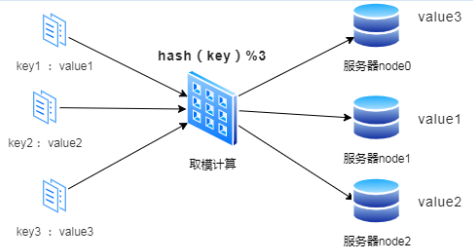
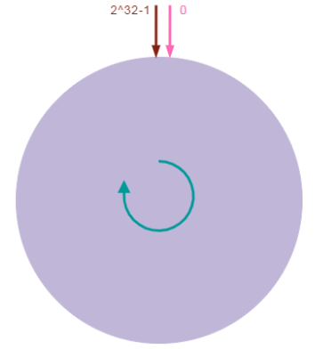
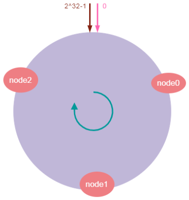
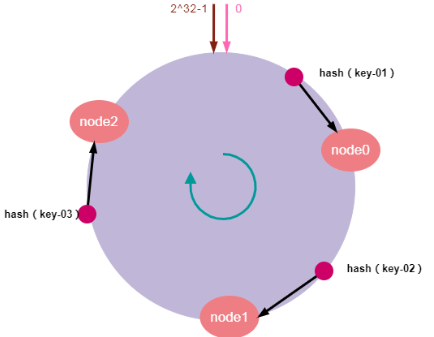
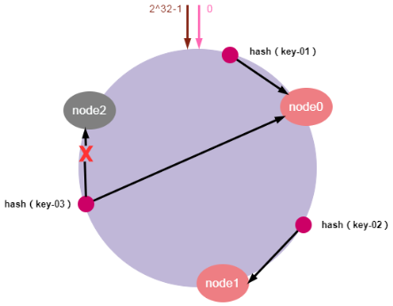
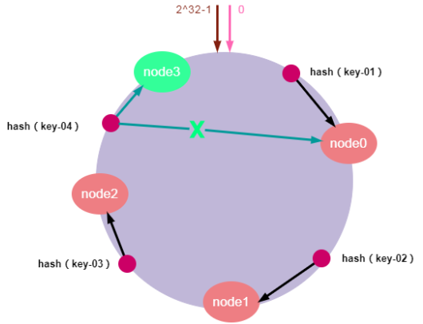
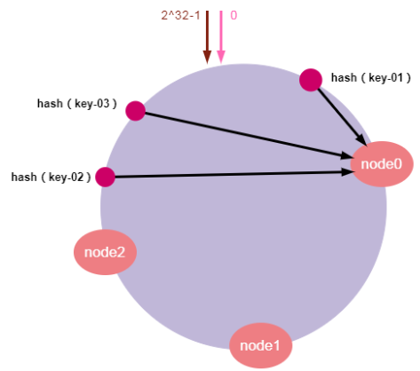
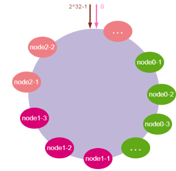
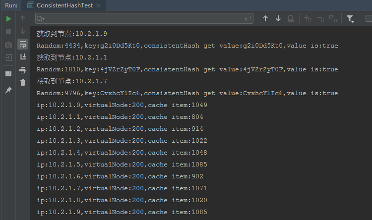

# 一致性哈希算法

## 背景

在具体介绍一致性哈希算法之前，先问一个问题：为什么需要一致性哈希算法？下面我们通过一个案例来回答这个问题。

假设有这么一种场景：我们有三台缓存服务器分别为：node0、node1、node2，有3000万个缓存数据需要存储在这三台服务器组成的集群中，希望可以将这些数据均匀的缓存到三台机器上，你会想到什么方案呢？

我们可能首先想到的方案是：取模算法hash（key）%N，即：对缓存数据的key进行hash运算后取模，N是机器的数量；运算后的结果映射对应集群中的节点。具体如下图所示：



如上图所示，首先对key进行hash计算后的结果对3取模，得到的结果一定是0、1或者2；然后映射对应的服务器node0、node1、node2，最后直接找对应的服务器存取数据即可。

通过取模算法将每个数据请求都均匀的分散到了三个不同的服务器节点上，看起来很完美！但是，在分布式集群系统的负载均衡实现上，这种模型在集群扩容和收缩时却有一定的局限性：因为在生产环境中根据业务量的大小，调整服务器数量是常有的事，而服务器数量N发生变化后hash（key）%N计算的结果也会随之变化！导致整个集群的缓存数据必须重新计算调整，进而导致大量缓存在同一时间失效，造成缓存的雪崩，最终导致整个缓存系统的不可用，这是不能接受的。为了解决优化上述情况，一致性哈希算法应运而生。

## 一致性哈希简介

有些朋友一听到算法就头大，其实大可不必，一致性哈希算法听起来高大上，其实非常简单。接下来开始介绍什么是一致性哈希算法，它解决了什么问题。

### 1. 什么是一致性哈希？

一致性哈希(Consistent Hash)算法是1997年提出，是一种特殊的哈希算法，目的是解决分布式系统的数据分区问题：当分布式集群移除或者添加一个服务器时，必须尽可能小地改变已存在的服务请求与处理请求服务器之间的映射关系。

### 2. 一致性哈希主要解决问题

我们知道，传统的按服务器节点数量取模在集群扩容和收缩时存在一定的局限性。而一致性哈希算法正好解决了简单哈希算法在分布式集群中存在的动态伸缩的问题。降低节点上下线的过程中带来的数据迁移成本，同时节点数量的变化与分片原则对于应用系统来说是无感的，使上层应用更专注于领域内逻辑的编写，使得整个系统架构能够动态伸缩，更加灵活方便。

### 3. 一致性哈希的使用场景

一致性哈希算法是分布式系统中的重要算法，使用场景也非常广泛。主要是是负载均衡、缓存数据分区等场景。

一致性哈希应该是实现负载均衡的首选算法，它的实现比较灵活，既可以在客户端实现，也可以在中间件上实现，比如日常使用较多的缓存中间件memcached 使用的路由算法用的就是一致性哈希算法。

此外，其它的应用场景还有很多：
- RPC框架Dubbo用来选择服务提供者
- 分布式关系数据库分库分表：数据与节点的映射关系
- LVS负载均衡调度器

## 一致性哈希的原理

### 1. 算法原理

前面介绍的取模算法虽然使用简单，但缺陷也很明显，如果服务器中保存有服务请求对应的数据，那么如果重新计算请求的哈希值，会造成缓存的雪崩的问题。这种情况在分布式系统中是非常糟糕的。一个设计良好的分布式系统应该具有良好的单调性，即服务器的添加与移除不会造成大量的哈希重定位，而一致性哈希恰好可以解决这个问题 。

其实，一致性哈希算法本质上也是一种取模算法。只不过前面介绍的取模算法是按服务器数量取模，而一致性哈希算法是对固定值2^32取模，这就使得一致性算法具备良好的单调性：不管集群中有多少个节点，只要key值固定，那所请求的服务器节点也同样是固定的。其算法的工作原理如下：
1. 一致性哈希算法将整个哈希值空间映射成一个虚拟的圆环，整个哈希空间的取值范围为0~2^32-1；
2. 计算各服务器节点的哈希值，并映射到哈希环上；
3. 将服务发来的数据请求使用哈希算法算出对应的哈希值；
4. 将计算的哈希值映射到哈希环上，同时沿圆环顺时针方向查找，遇到的第一台服务器就是所对应的处理请求服务器。
5. 当增加或者删除一台服务器时，受影响的数据仅仅是新添加或删除的服务器到其环空间中前一台的服务器（也就是顺着逆时针方向遇到的第一台服务器）之间的数据，其他都不会受到影响。

综上所述，一致性哈希算法对于节点的增减都只需重定位环空间中的一小部分数据，具有较好的容错性和可扩展性 。

### 2. 深入剖析

说了那么多，可能你还是云里雾里的，那么接下来我们详细剖析一致性哈希的实现原理。

#### 哈希环

首先，一致性哈希算法将整个哈希值空间映射成一个虚拟的圆环。整个哈希空间的取值范围为0~2^32-1，按顺时针方向开始从0~2^32-1排列，最后的节点2^32-1在0开始位置重合，形成一个虚拟的圆环。如下图所示：



#### 服务器映射到哈希环

接下来，将服务器节点映射到哈希环上对应的位置。我们可以对服务器IP地址进行哈希计算，哈希计算后的结果对2^32取模，结果一定是一个0到2^32-1之间的整数。最后将这个整数映射在哈希环上，整数的值就代表了一个服务器节点的在哈希环上的位置。即：hash（服务器ip）% 2^32。下面我们依次将node0、node1、node2三个缓存服务器映射到哈希环上，如下图所示：



#### 对象key映射到服务器

当服务器接收到数据请求时，首先需要计算请求Key的哈希值；然后将计算的哈希值映射到哈希环上的具体位置；接下来，从这个位置沿着哈希环顺时针查找，遇到的第一个节点就是key对应的节点；最后，将请求发送到具体的服务器节点执行数据操作。

假设我们有“key-01：张三”、“key-02：李四”、“key-03：王五”三条缓存数据。经过哈希算法计算后，映射到哈希环上的位置如下图所示：



如上图所示，通过哈希计算后，key-01顺时针寻找将找到node0，key-02顺时针寻找将找到node1，key-03顺时针寻找将找到node2。最后，请求找到的服务器节点执行具体的业务操作。

以上便是一致性哈希算法的工作原理。

## 服务器扩容&缩容

前面介绍了一致性哈希算法的工作原理，那么，一致性哈希算法如何避免服务器动态伸缩的问题的呢？

### 1. 服务器缩容

服务器缩容就是减少集群中服务器节点的数量或是集群中某个节点故障。假设，集群中的某个节点故障，原本映射到该节点的请求，会找到哈希环中的下一个节点，数据也同样被重新分配至下一个节点，其它节点的数据和请求不受任何影响。这样就确保节点发生故障时，集群能保持正常稳定。如下图所示：



如上图所示：节点node2发生故障时，数据key-01和key-02不会受到影响，只有key-03的请求被重定位到node0。在一致性哈希算法中，如果某个节点宕机不可用了，那么受影响的数据仅仅是会寻址到此节点和前一节点之间的数据。其他哈希环上的数据不会受到影响。

### 2. 服务器扩容

服务器扩容就是集群中需要增加一个新的数据节点，假设，由于需要缓存的数据量太大，必须对集群进行扩容增加一个新的数据节点。此时，只需要计算新节点的哈希值并将新的节点加入到哈希环中，然后将哈希环中从上一个节点到新节点的数据映射到新的数据节点即可。其他节点数据不受影响，具体如下图所示：



如上图所示，加入新的node3节点后，key-01、key-02不受影响，只有key-03的寻址被重定位到新节点node3，受影响的数据仅仅是会寻址到新节点和前一节点之间的数据。

通过一致性哈希算法，集群扩容或缩容时，只需要重新定位哈希环空间内的一小部分数据。其他数据保持不变。当节点数越多的时候，使用哈希算法时，需要迁移的数据就越多，使用一致哈希时，需要迁移的数据就越少。所以，一致哈希算法具有较好的容错性和可扩展性。

## 数据倾斜与虚拟节点

### 1. 什么是数据倾斜？

前面说了一致性哈希算法的原理以及扩容缩容的问题。但是，由于哈希计算的随机性，导致一致性哈希算法存在一个致命问题：数据倾斜，，也就是说大多数访问请求都会集中少量几个节点的情况。特别是节点太少情况下，容易因为节点分布不均匀造成数据访问的冷热不均。这就失去了集群和负载均衡的意义。如下图所示：



如上图所示，key-1、key-2、key-3可能被映射到同一个节点node0上。导致node0负载过大，而node1和node2却很空闲的情况。这有可能导致个别服务器数据和请求压力过大和崩溃，进而引起集群的崩溃。

### 2. 如何解决数据倾斜？

为了解决数据倾斜的问题，一致性哈希算法引入了虚拟节点机制，即对每一个物理服务节点映射多个虚拟节点，将这些虚拟节点计算哈希值并映射到哈希环上，当请求找到某个虚拟节点后，将被重新映射到具体的物理节点。虚拟节点越多，哈希环上的节点就越多，数据分布就越均匀，从而避免了数据倾斜的问题。

说起来可能比较复杂，一句话概括起来就是：原有的节点、数据定位的哈希算法不变，只是多了一步虚拟节点到实际节点的映射。具体如下图所示：



如上图所示，我们可以在服务器ip或主机名的后面增加编号来实现，将全部的虚拟节点加入到哈希环中，增加了节点后，数据在哈希环上的分布就相对均匀了。当有访问请求寻址到node0-1这个虚拟节点时，将被重新映射到物理节点node0。

## 一致性Hash算法实现

前面介绍了一致性哈希算法的原理、动态伸缩以及数据倾斜的问题后，下面我们根据上面的讲述，使用Java实现一个简单的一致性哈希算法。

### 1. 数据节点

首先定义一个节点类，实现数据节点的功能，具体代码如下：

```java
public class Node {
    private static final int VIRTUAL_NODE_NO_PER_NODE = 200;
    private final String ip;
    private final List<Integer> virtualNodeHashes = new ArrayList<>(VIRTUAL_NODE_NO_PER_NODE);
    private final Map<Object, Object> cacheMap = new HashMap<>();

    public Node(String ip) {
        Objects.requireNonNull(ip);
        this.ip = ip;
        initVirtualNodes();
    }


    private void initVirtualNodes() {
        String virtualNodeKey;
        for (int i = 1; i <= VIRTUAL_NODE_NO_PER_NODE; i++) {
            virtualNodeKey = ip + "#" + i;
            virtualNodeHashes.add(HashUtils.hashcode(virtualNodeKey));
        }
    }

    public void addCacheItem(Object key, Object value) {
        cacheMap.put(key, value);
    }


    public Object getCacheItem(Object key) {
        return cacheMap.get(key);
    }


    public void removeCacheItem(Object key) {
        cacheMap.remove(key);
    }


    public List<Integer> getVirtualNodeHashes() {
        return virtualNodeHashes;
    }

    public String getIp() {
        return ip;
    }
}
```

### 2. 实现一致性哈希算法

接下来实现核心功能：一致性哈希算法，主要使用java的TreeMap类，实现哈希环和哈希查找的功能。具体代码如下所示：

```java
public class ConsistentHash {
    private final TreeMap<Integer, Node> hashRing = new TreeMap<>();

    public List<Node> nodeList = new ArrayList<>();

    /**
     * 增加节点
     * 每增加一个节点，就会在闭环上增加给定虚拟节点
     * 例如虚拟节点数是2，则每调用此方法一次，增加两个虚拟节点，这两个节点指向同一Node
     * @param ip
     */
    public void addNode(String ip) {
        Objects.requireNonNull(ip);
        Node node = new Node(ip);
        nodeList.add(node);
        for (Integer virtualNodeHash : node.getVirtualNodeHashes()) {
            hashRing.put(virtualNodeHash, node);
            System.out.println("虚拟节点[" + node + "] hash:" + virtualNodeHash + "，被添加");
        }
    }

    /**
     * 移除节点
     * @param node
     */
    public void removeNode(Node node){
        nodeList.remove(node);
    }

    /**
     * 获取缓存数据
     * 先找到对应的虚拟节点，然后映射到物理节点
     * @param key
     * @return
     */
    public Object get(Object key) {
        Node node = findMatchNode(key);
        System.out.println("获取到节点:" + node.getIp());
        return node.getCacheItem(key);
    }

    /**
     * 添加缓存
     * 先找到hash环上的节点，然后在对应的节点上添加数据缓存
     * @param key
     * @param value
     */
    public void put(Object key, Object value) {
        Node node = findMatchNode(key);

        node.addCacheItem(key, value);
    }

    /**
     * 删除缓存数据
     */
    public void evict(Object key) {
        findMatchNode(key).removeCacheItem(key);
    }


    /**
     *  获得一个最近的顺时针节点
     * @param key 为给定键取Hash，取得顺时针方向上最近的一个虚拟节点对应的实际节点
     *      * @return 节点对象
     * @return
     */
    private Node findMatchNode(Object key) {
        Map.Entry<Integer, Node> entry = hashRing.ceilingEntry(HashUtils.hashcode(key));
        if (entry == null) {
            entry = hashRing.firstEntry();
        }
        return entry.getValue();
    }
}
```

如上所示，通过TreeMap的ceilingEntry() 方法，实现顺时针查找下一个的服务器节点的功能。

### 3. 哈希计算方法

哈希计算方法比较常见，网上也有很多计算hash 值的函数。示例代码如下：

```java
public class HashUtils {

    /**
     * FNV1_32_HASH
     *
     * @param obj
     *         object
     * @return hashcode
     */
    public static int hashcode(Object obj) {
        final int p = 16777619;
        int hash = (int) 2166136261L;
        String str = obj.toString();
        for (int i = 0; i < str.length(); i++)
            hash = (hash ^ str.charAt(i)) * p;
        hash += hash << 13;
        hash ^= hash >> 7;
        hash += hash << 3;
        hash ^= hash >> 17;
        hash += hash << 5;

        if (hash < 0)
            hash = Math.abs(hash);
        //System.out.println("hash computer:" + hash);
        return hash;
    }
}
```

### 4. 验证测试

一致性哈希算法实现后，接下来添加一个测试类，验证此算法时候正常。示例代码如下：

```java
public class ConsistentHashTest {
    public static final int NODE_SIZE = 10;
    public static final int STRING_COUNT = 100 * 100;
    private static ConsistentHash consistentHash = new ConsistentHash();
    private static List<String> sList = new ArrayList<>();

    public static void main(String[] args) {
        // 增加节点
        for (int i = 0; i < NODE_SIZE; i++) {
            String ip = new StringBuilder("10.2.1.").append(i)
                    .toString();
            consistentHash.addNode(ip);
        }

        // 生成需要缓存的数据;
        for (int i = 0; i < STRING_COUNT; i++) {
            sList.add(RandomStringUtils.randomAlphanumeric(10));
        }

        // 将数据放入到缓存中。
        for (String s : sList) {
            consistentHash.put(s, s);
        }

        for(int i = 0 ; i < 10 ; i ++) {
            int index = RandomUtils.nextInt(0, STRING_COUNT);
            String key = sList.get(index);
            String cache = (String) consistentHash.get(key);
            System.out.println("Random:"+index+",key:" + key + ",consistentHash get value:" + cache +",value is:" + key.equals(cache));
        }

        // 输出节点及数据分布情况
        for (Node node : consistentHash.nodeList){
            System.out.println(node);
        }

        // 新增一个数据节点
        consistentHash.addNode("10.2.1.110");
        for(int i = 0 ; i < 10 ; i ++) {
            int index = RandomUtils.nextInt(0, STRING_COUNT);
            String key = sList.get(index);
            String cache = (String) consistentHash.get(key);
            System.out.println("Random:"+index+",key:" + key + ",consistentHash get value:" + cache +",value is:" + key.equals(cache));
        }

        // 输出节点及数据分布情况
        for (Node node : consistentHash.nodeList){
            System.out.println(node);
        }
    }
}
```

运行此测试，输出结果如下所示：


