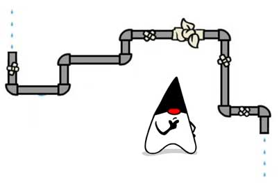

# IO

IO是指Input/Output，即输入和输出。以内存为中心：

- Input指从外部读入数据到内存，例如，把文件从磁盘读取到内存，从网络读取数据到内存等等。
- Output指把数据从内存输出到外部，例如，把数据从内存写入到文件，把数据从内存输出到网络等等。

为什么要把数据读到内存才能处理这些数据？因为代码是在内存中运行的，数据也必须读到内存，最终的表示方式无非是byte数组，字符串等，都必须存放在内存里。

从Java代码来看，输入实际上就是从外部，例如，硬盘上的某个文件，把内容读到内存，并且以Java提供的某种数据类型表示，例如，`byte[]`，`String`，这样，后续代码才能处理这些数据。

因为内存有“易失性”的特点，所以必须把处理后的数据以某种方式输出，例如，写入到文件。Output实际上就是把Java表示的数据格式，例如，`byte[]`，`String`等输出到某个地方。

IO流是一种顺序读写数据的模式，它的特点是单向流动。数据类似自来水一样在水管中流动，所以我们把它称为IO流。



### InputStream / OutputStream
IO流以`byte`（字节）为最小单位，因此也称为_字节流_。例如，我们要从磁盘读入一个文件，包含6个字节，就相当于读入了6个字节的数据：
```sql

╔════════════╗
║   Memory   ║
╚════════════╝
       ▲
       │0x48
       │0x65
       │0x6c
       │0x6c
       │0x6f
       │0x21
 ╔═══════════╗
 ║ Hard Disk ║
 ╚═══════════╝
```
这6个字节是按顺序读入的，所以是输入字节流。

反过来，我们把6个字节从内存写入磁盘文件，就是输出字节流：
```sql

╔════════════╗
║   Memory   ║
╚════════════╝
       │0x21
       │0x6f
       │0x6c
       │0x6c
       │0x65
       │0x48
       ▼
 ╔═══════════╗
 ║ Hard Disk ║
 ╚═══════════╝
```
在Java中，`InputStream`代表输入字节流，`OuputStream`代表输出字节流，这是最基本的两种IO流。

### Reader / Writer

如果我们需要读写的是字符，并且字符不全是单字节表示的ASCII字符，那么，按照`char`来读写显然更方便，这种流称为_字符流_。

Java提供了`Reader`和`Writer`表示字符流，字符流传输的最小数据单位是`char`。

例如，我们把`char[]`数组`Hi你好`这4个字符用`Writer`字符流写入文件，并且使用UTF-8编码，得到的最终文件内容是8个字节，英文字符`H`和`i`各占一个字节，中文字符`你好`各占3个字节：
```sql
0x48
0x69
0xe4bda0
0xe5a5bd
```
反过来，我们用`Reader`读取以UTF-8编码的这8个字节，会从`Reader`中得到`Hi你好`这4个字符。

因此，`Reader`和`Writer`本质上是一个能自动编解码的`InputStream`和`OutputStream`。

使用`Reader`，数据源虽然是字节，但我们读入的数据都是`char`类型的字符，原因是`Reader`内部把读入的`byte`做了解码，转换成了`char`。使用`InputStream`，我们读入的数据和原始二进制数据一模一样，是`byte[]`数组，但是我们可以自己把二进制`byte[]`数组按照某种编码转换为字符串。究竟使用`Reader`还是`InputStream`，要取决于具体的使用场景。如果数据源不是文本，就只能使用`InputStream`，如果数据源是文本，使用Reader更方便一些。`Writer`和`OutputStream`是类似的。

### 同步和异步

同步IO是指，读写IO时代码必须等待数据返回后才继续执行后续代码，它的优点是代码编写简单，缺点是CPU执行效率低。

而异步IO是指，读写IO时仅发出请求，然后立刻执行后续代码，它的优点是CPU执行效率高，缺点是代码编写复杂。

Java标准库的包`java.io`提供了同步IO，而`java.nio`则是异步IO。上面我们讨论的`InputStream`、`OutputStream`、`Reader`和`Writer`都是同步IO的抽象类，对应的具体实现类，以文件为例，有`FileInputStream`、`FileOutputStream`、`FileReader`和`FileWriter`。

本节我们只讨论Java的同步IO，即输入/输出流的IO模型。

### 小结

IO流是一种流式的数据输入/输出模型：

- 二进制数据以`byte`为最小单位在`InputStream/OutputStream`中单向流动；
- 字符数据以`char`为最小单位在`Reader/Writer`中单向流动。

Java标准库的`java.io`包提供了同步IO功能：

- 字节流接口：`InputStream/OutputStream`；
- 字符流接口：`Reader/Writer`。

## File对象

在计算机系统中，文件是非常重要的存储方式。Java的标准库`java.io`提供了`File`对象来操作文件和目录。

要构造一个`File`对象，需要传入文件路径：
```java
import java.io.*;
public class Main {
    public static void main(String[] args) {
        File f = new File("C:\\Windows\\notepad.exe");
        System.out.println(f);
    }
}
```
构造File对象时，既可以传入绝对路径，也可以传入相对路径。绝对路径是以根目录开头的完整路径，例如：
```java
File f = new File("C:\\Windows\\notepad.exe");
```
注意Windows平台使用`\`作为路径分隔符，在Java字符串中需要用`\\`表示一个`\`。Linux平台使用`/`作为路径分隔符：
```java
File f = new File("/usr/bin/javac");
```
传入相对路径时，相对路径前面加上当前目录就是绝对路径：
```java
// 假设当前目录是C:\Docs
File f1 = new File("sub\\javac"); // 绝对路径是C:\Docs\sub\javac
File f3 = new File(".\\sub\\javac"); // 绝对路径是C:\Docs\sub\javac
File f3 = new File("..\\sub\\javac"); // 绝对路径是C:\sub\javac
```
可以用.表示当前目录，`..`表示上级目录。

File对象有3种形式表示的路径，一种是`getPath()`，返回构造方法传入的路径，一种是`getAbsolutePath()`，返回绝对路径，一种是`getCanonicalPath`，它和绝对路径类似，但是返回的是规范路径。

什么是规范路径？我们看以下代码：
```java
import java.io.*;
public class Main {
    public static void main(String[] args) throws IOException {
        File f = new File("..");
        System.out.println(f.getPath());
        System.out.println(f.getAbsolutePath());
        System.out.println(f.getCanonicalPath());
    }
}
```
绝对路径可以表示成`C:\Windows\System32\..\notepad.exe`，而规范路径就是把`.`和`..`转换成标准的绝对路径后的路径：`C:\Windows\notepad.exe`。

因为Windows和Linux的路径分隔符不同，File对象有一个静态变量用于表示当前平台的系统分隔符：
```java
System.out.println(File.separator); // 根据当前平台打印"\"或"/"
```

### 文件和目录

`File`对象既可以表示文件，也可以表示目录。特别要注意的是，构造一个`File`对象，即使传入的文件或目录不存在，代码也不会出错，因为构造一个`File`对象，并不会导致任何磁盘操作。只有当我们调用`File`对象的某些方法的时候，才真正进行磁盘操作。

例如，调用`isFile()`，判断该`File`对象是否是一个已存在的文件，调用`isDirectory()`，判断该`File`对象是否是一个已存在的目录：
```java
import java.io.*;
public class Main {
    public static void main(String[] args) throws IOException {
        File f1 = new File("C:\\Windows");
        File f2 = new File("C:\\Windows\\notepad.exe");
        File f3 = new File("C:\\Windows\\nothing");
        System.out.println(f1.isFile());
        System.out.println(f1.isDirectory());
        System.out.println(f2.isFile());
        System.out.println(f2.isDirectory());
        System.out.println(f3.isFile());
        System.out.println(f3.isDirectory());
    }
}
```
用`File`对象获取到一个文件时，还可以进一步判断文件的权限和大小：

- `boolean canRead()`：是否可读；
- `boolean canWrite()`：是否可写；
- `boolean canExecute()`：是否可执行；
- `long length()`：文件字节大小。

对目录而言，是否可执行表示能否列出它包含的文件和子目录。

### 创建和删除文件

当File对象表示一个文件时，可以通过`createNewFile()`创建一个新文件，用`delete()`删除该文件：
```java
File file = new File("/path/to/file");
if (file.createNewFile()) {
    // 文件创建成功:
    // TODO:
    if (file.delete()) {
        // 删除文件成功:
    }
}
```
有些时候，程序需要读写一些临时文件，File对象提供了`createTempFile()`来创建一个临时文件，以及`deleteOnExit()`在JVM退出时自动删除该文件。
```java
import java.io.*;
public class Main {
    public static void main(String[] args) throws IOException {
        File f = File.createTempFile("tmp-", ".txt"); // 提供临时文件的前缀和后缀
        f.deleteOnExit(); // JVM退出时自动删除
        System.out.println(f.isFile());
        System.out.println(f.getAbsolutePath());
    }
}
```

### 遍历文件和目录

当File对象表示一个目录时，可以使用`list()`和`listFiles()`列出目录下的文件和子目录名。`listFiles()`提供了一系列重载方法，可以过滤不想要的文件和目录：
```java
import java.io.*;
public class Main {
    public static void main(String[] args) throws IOException {
        File f = new File("C:\\Windows");
        File[] fs1 = f.listFiles(); // 列出所有文件和子目录
        printFiles(fs1);
        File[] fs2 = f.listFiles(new FilenameFilter() { // 仅列出.exe文件
            public boolean accept(File dir, String name) {
                return name.endsWith(".exe"); // 返回true表示接受该文件
            }
        });
        printFiles(fs2);
    }

    static void printFiles(File[] files) {
        System.out.println("==========");
        if (files != null) {
            for (File f : files) {
                System.out.println(f);
            }
        }
        System.out.println("==========");
    }
}
```
和文件操作类似，File对象如果表示一个目录，可以通过以下方法创建和删除目录：

- `boolean mkdir()`：创建当前File对象表示的目录；
- `boolean mkdirs()`：创建当前File对象表示的目录，并在必要时将不存在的父目录也创建出来；
- `boolean delete()`：删除当前File对象表示的目录，当前目录必须为空才能删除成功。

### Path

Java标准库还提供了一个`Path`对象，它位于`java.nio.file`包。`Path`对象和`File`对象类似，但操作更加简单：
```java
import java.io.*;
import java.nio.file.*;
public class Main {
    public static void main(String[] args) throws IOException {
        Path p1 = Paths.get(".", "project", "study"); // 构造一个Path对象
        System.out.println(p1);
        Path p2 = p1.toAbsolutePath(); // 转换为绝对路径
        System.out.println(p2);
        Path p3 = p2.normalize(); // 转换为规范路径
        System.out.println(p3);
        File f = p3.toFile(); // 转换为File对象
        System.out.println(f);
        for (Path p : Paths.get("..").toAbsolutePath()) { // 可以直接遍历Path
            System.out.println("  " + p);
        }
    }
}
```
如果需要对目录进行复杂的拼接、遍历等操作，使用`Path`对象更方便。

### 练习

请利用`File`对象列出指定目录下的所有子目录和文件，并按层次打印。

例如，输出：
```bash
Documents/
  word/
    1.docx
    2.docx
    work/
      abc.doc
  ppt/
  other/
```
如果不指定参数，则使用当前目录，如果指定参数，则使用指定目录。

### 小结

Java标准库的`java.io.File`对象表示一个文件或者目录：

- 创建`File`对象本身不涉及IO操作；
- 可以获取路径／绝对路径／规范路径：`getPath()/getAbsolutePath()/getCanonicalPath()`；
- 可以获取目录的文件和子目录：`list()/listFiles()`；
- 可以创建或删除文件和目录。

## InputStream

`InputStream`就是Java标准库提供的最基本的输入流。它位于`java.io`这个包里。`java.io`包提供了所有同步IO的功能。

要特别注意的一点是，`InputStream`并不是一个接口，而是一个抽象类，它是所有输入流的超类。这个抽象类定义的一个最重要的方法就是`int read()`，签名如下：
```java
public abstract int read() throws IOException;
```
这个方法会读取输入流的下一个字节，并返回字节表示的`int`值（0~255）。如果已读到末尾，返回`-1`表示不能继续读取了。

`FileInputStream`是`InputStream`的一个子类。顾名思义，`FileInputStream`就是从文件流中读取数据。下面的代码演示了如何完整地读取一个`FileInputStream`的所有字节：
```java
public void readFile() throws IOException {
    // 创建一个FileInputStream对象:
    InputStream input = new FileInputStream("src/readme.txt");
    for (;;) {
        int n = input.read(); // 反复调用read()方法，直到返回-1
        if (n == -1) {
            break;
        }
        System.out.println(n); // 打印byte的值
    }
    input.close(); // 关闭流
}
```
在计算机中，类似文件、网络端口这些资源，都是由操作系统统一管理的。应用程序在运行的过程中，如果打开了一个文件进行读写，完成后要及时地关闭，以便让操作系统把资源释放掉，否则，应用程序占用的资源会越来越多，不但白白占用内存，还会影响其他应用程序的运行。

`InputStream`和`OutputStream`都是通过`close()`方法来关闭流。关闭流就会释放对应的底层资源。

我们还要注意到在读取或写入IO流的过程中，可能会发生错误，例如，文件不存在导致无法读取，没有写权限导致写入失败，等等，这些底层错误由Java虚拟机自动封装成`IOException`异常并抛出。因此，所有与IO操作相关的代码都必须正确处理`IOException`。

仔细观察上面的代码，会发现一个潜在的问题：如果读取过程中发生了IO错误，`InputStream`就没法正确地关闭，资源也就没法及时释放。

因此，我们需要用`try ... finally`来保证`InputStream`在无论是否发生IO错误的时候都能够正确地关闭：
```java
public void readFile() throws IOException {
    InputStream input = null;
    try {
        input = new FileInputStream("src/readme.txt");
        int n;
        while ((n = input.read()) != -1) { // 利用while同时读取并判断
            System.out.println(n);
        }
    } finally {
        if (input != null) { input.close(); }
    }
}
```
用`try ... finally`来编写上述代码会感觉比较复杂，更好的写法是利用Java 7引入的新的`try(resource)`的语法，只需要编写`try`语句，让编译器自动为我们关闭资源。推荐的写法如下：
```java
public void readFile() throws IOException {
    try (InputStream input = new FileInputStream("src/readme.txt")) {
        int n;
        while ((n = input.read()) != -1) {
            System.out.println(n);
        }
    } // 编译器在此自动为我们写入finally并调用close()
}
```
实际上，编译器并不会特别地为`InputStream`加上自动关闭。编译器只看`try(resource = ...)`中的对象是否实现了`java.lang.AutoCloseable`接口，如果实现了，就自动加上`finally`语句并调用`close()`方法。`InputStream`和`OutputStream`都实现了这个接口，因此，都可以用在`try(resource)`中。

### 缓冲

在读取流的时候，一次读取一个字节并不是最高效的方法。很多流支持一次性读取多个字节到缓冲区，对于文件和网络流来说，利用缓冲区一次性读取多个字节效率往往要高很多。`InputStream`提供了两个重载方法来支持读取多个字节：

- `int read(byte[] b)`：读取若干字节并填充到`byte[]`数组，返回读取的字节数
- `int read(byte[] b, int off, int len)`：指定`byte[]`数组的偏移量和最大填充数

利用上述方法一次读取多个字节时，需要先定义一个`byte[]`数组作为缓冲区，`read()`方法会尽可能多地读取字节到缓冲区， 但不会超过缓冲区的大小。`read()`方法的返回值不再是字节的`int`值，而是返回实际读取了多少个字节。如果返回`-1`，表示没有更多的数据了。

利用缓冲区一次读取多个字节的代码如下：
```java
public void readFile() throws IOException {
    try (InputStream input = new FileInputStream("src/readme.txt")) {
        // 定义1000个字节大小的缓冲区:
        byte[] buffer = new byte[1000];
        int n;
        while ((n = input.read(buffer)) != -1) { // 读取到缓冲区
            System.out.println("read " + n + " bytes.");
        }
    }
}
```

### 阻塞
在调用`InputStream`的`read()`方法读取数据时，我们说`read()`方法是阻塞（Blocking）的。它的意思是，对于下面的代码：
```java
int n;
n = input.read(); // 必须等待read()方法返回才能执行下一行代码
int m = n;
```
执行到第二行代码时，必须等`read()`方法返回后才能继续。因为读取IO流相比执行普通代码，速度会慢很多，因此，无法确定`read()`方法调用到底要花费多长时间。

### InputStream实现类
用`FileInputStream`可以从文件获取输入流，这是`InputStream`常用的一个实现类。此外，`ByteArrayInputStream`可以在内存中模拟一个`InputStream`：
```java
import java.io.*;
public class Main {
    public static void main(String[] args) throws IOException {
        byte[] data = { 72, 101, 108, 108, 111, 33 };
        try (InputStream input = new ByteArrayInputStream(data)) {
            int n;
            while ((n = input.read()) != -1) {
                System.out.println((char)n);
            }
        }
    }
}
```
`ByteArrayInputStream`实际上是把一个`byte[]`数组在内存中变成一个`InputStream`，虽然实际应用不多，但测试的时候，可以用它来构造一个`InputStream`。

举个栗子：我们想从文件中读取所有字节，并转换成`char`然后拼成一个字符串，可以这么写：
```java
public class Main {
    public static void main(String[] args) throws IOException {
        String s;
        try (InputStream input = new FileInputStream("C:\\test\\README.txt")) {
            int n;
            StringBuilder sb = new StringBuilder();
            while ((n = input.read()) != -1) {
                sb.append((char) n);
            }
            s = sb.toString();
        }
        System.out.println(s);
    }
}
```
要测试上面的程序，就真的需要在本地硬盘上放一个真实的文本文件。如果我们把代码稍微改造一下，提取一个`readAsString()`的方法：
```java
public class Main {
    public static void main(String[] args) throws IOException {
        String s;
        try (InputStream input = new FileInputStream("C:\\test\\README.txt")) {
            s = readAsString(input);
        }
        System.out.println(s);
    }

    public static String readAsString(InputStream input) throws IOException {
        int n;
        StringBuilder sb = new StringBuilder();
        while ((n = input.read()) != -1) {
            sb.append((char) n);
        }
        return sb.toString();
    }
}
```
对这个`String readAsString(InputStream input)`方法进行测试就相当简单，因为不一定要传入一个真的`FileInputStream`：
```java
import java.io.*;
public class Main {
    public static void main(String[] args) throws IOException {
        byte[] data = { 72, 101, 108, 108, 111, 33 };
        try (InputStream input = new ByteArrayInputStream(data)) {
            String s = readAsString(input);
            System.out.println(s);
        }
    }

    public static String readAsString(InputStream input) throws IOException {
        int n;
        StringBuilder sb = new StringBuilder();
        while ((n = input.read()) != -1) {
            sb.append((char) n);
        }
        return sb.toString();
    }
}
```
这就是面向抽象编程原则的应用：接受`InputStream`抽象类型，而不是具体的`FileInputStream`类型，从而使得代码可以处理`InputStream`的任意实现类。

### 小结
Java标准库的`java.io.InputStream`定义了所有输入流的超类：

- `FileInputStream`实现了文件流输入；
- `ByteArrayInputStream`在内存中模拟一个字节流输入。

总是使用`try(resource)`来保证`InputStream`正确关闭。

## OutputStream
和`InputStream`相反，`OutputStream`是Java标准库提供的最基本的输出流。

和`InputStream`类似，`OutputStream`也是抽象类，它是所有输出流的超类。这个抽象类定义的一个最重要的方法就是`void write(int b)`，签名如下：
```java
public abstract void write(int b) throws IOException;
```
这个方法会写入一个字节到输出流。要注意的是，虽然传入的是`int`参数，但只会写入一个字节，即只写入`int`最低8位表示字节的部分（相当于`b & 0xff`）。

和`InputStream`类似，`OutputStream`也提供了`close()`方法关闭输出流，以便释放系统资源。要特别注意：`OutputStream`还提供了一个`flush()`方法，它的目的是将缓冲区的内容真正输出到目的地。

为什么要有`flush()`？因为向磁盘、网络写入数据的时候，出于效率的考虑，操作系统并不是输出一个字节就立刻写入到文件或者发送到网络，而是把输出的字节先放到内存的一个缓冲区里（本质上就是一个`byte[]`数组），等到缓冲区写满了，再一次性写入文件或者网络。对于很多IO设备来说，一次写一个字节和一次写1000个字节，花费的时间几乎是完全一样的，所以`OutputStream`有个`flush()`方法，能强制把缓冲区内容输出。

通常情况下，我们不需要调用这个`flush()`方法，因为缓冲区写满了`OutputStream`会自动调用它，并且，在调用`close()`方法关闭`OutputStream`之前，也会自动调用`flush()`方法。

但是，在某些情况下，我们必须手动调用`flush()`方法。举个栗子：

小明正在开发一款在线聊天软件，当用户输入一句话后，就通过`OutputStream`的`write()`方法写入网络流。小明测试的时候发现，发送方输入后，接收方根本收不到任何信息，怎么肥四？

原因就在于写入网络流是先写入内存缓冲区，等缓冲区满了才会一次性发送到网络。如果缓冲区大小是4K，则发送方要敲几千个字符后，操作系统才会把缓冲区的内容发送出去，这个时候，接收方会一次性收到大量消息。

解决办法就是每输入一句话后，立刻调用`flush()`，不管当前缓冲区是否已满，强迫操作系统把缓冲区的内容立刻发送出去。

实际上，`InputStream`也有缓冲区。例如，从`FileInputStream`读取一个字节时，操作系统往往会一次性读取若干字节到缓冲区，并维护一个指针指向未读的缓冲区。然后，每次我们调用`int read()`读取下一个字节时，可以直接返回缓冲区的下一个字节，避免每次读一个字节都导致IO操作。当缓冲区全部读完后继续调用`read()`，则会触发操作系统的下一次读取并再次填满缓冲区。

### FileOutputStream

我们以`FileOutputStream`为例，演示如何将若干个字节写入文件流：
```java
public void writeFile() throws IOException {
    OutputStream output = new FileOutputStream("out/readme.txt");
    output.write(72); // H
    output.write(101); // e
    output.write(108); // l
    output.write(108); // l
    output.write(111); // o
    output.close();
}
```
每次写入一个字节非常麻烦，更常见的方法是一次性写入若干字节。这时，可以用`OutputStream`提供的重载方法`void write(byte[])`来实现：
```java
public void writeFile() throws IOException {
    OutputStream output = new FileOutputStream("out/readme.txt");
    output.write("Hello".getBytes("UTF-8")); // Hello
    output.close();
}
```
和`InputStream`一样，上述代码没有考虑到在发生异常的情况下如何正确地关闭资源。写入过程也会经常发生IO错误，例如，磁盘已满，无权限写入等等。我们需要用`try(resource)`来保证`OutputStream`在无论是否发生IO错误的时候都能够正确地关闭：
```java
public void writeFile() throws IOException {
    try (OutputStream output = new FileOutputStream("out/readme.txt")) {
        output.write("Hello".getBytes("UTF-8")); // Hello
    } // 编译器在此自动为我们写入finally并调用close()
}
```

### 阻塞

和`InputStream`一样，`OutputStream`的`write()`方法也是阻塞的。

### OutputStream实现类

用`FileOutputStream`可以从文件获取输出流，这是`OutputStream`常用的一个实现类。此外，`ByteArrayOutputStream`可以在内存中模拟一个`OutputStream`：
```java
import java.io.*;
public class Main {
    public static void main(String[] args) throws IOException {
        byte[] data;
        try (ByteArrayOutputStream output = new ByteArrayOutputStream()) {
            output.write("Hello ".getBytes("UTF-8"));
            output.write("world!".getBytes("UTF-8"));
            data = output.toByteArray();
        }
        System.out.println(new String(data, "UTF-8"));
    }
}
```
`ByteArrayOutputStream`实际上是把一个`byte[]`数组在内存中变成一个`OutputStream`，虽然实际应用不多，但测试的时候，可以用它来构造一个`OutputStream`。
同时操作多个`AutoCloseable`资源时，在`try(resource) { ... }`语句中可以同时写出多个资源，用`;`隔开。例如，同时读写两个文件：
```java
// 读取input.txt，写入output.txt:
try (InputStream input = new FileInputStream("input.txt");
     OutputStream output = new FileOutputStream("output.txt"))
{
    input.transferTo(output); // transferTo的作用是?
}
```

### 练习

请利用`InputStream`和`OutputStream`，编写一个复制文件的程序，它可以带参数运行：
```bash
java CopyFile.java source.txt copy.txt
```

### 小结

Java标准库的`java.io.OutputStream`定义了所有输出流的超类：

- `FileOutputStream`实现了文件流输出；
- `ByteArrayOutputStream`在内存中模拟一个字节流输出。

某些情况下需要手动调用`OutputStream`的`flush()`方法来强制输出缓冲区。

总是使用`try(resource)`来保证`OutputStream`正确关闭。

## Filter模式

Java的IO标准库提供的`InputStream`根据来源可以包括：

- `FileInputStream`：从文件读取数据，是最终数据源；
- `ServletInputStream`：从HTTP请求读取数据，是最终数据源；
- `Socket.getInputStream()`：从TCP连接读取数据，是最终数据源；
- ...

如果我们要给`FileInputStream`添加缓冲功能，则可以从`FileInputStream`派生一个类：
```java
BufferedFileInputStream extends FileInputStream
```
如果要给`FileInputStream`添加计算签名的功能，类似的，也可以从`FileInputStream`派生一个类：
```java
DigestFileInputStream extends FileInputStream
```
如果要给`FileInputStream`添加加密/解密功能，还是可以从`FileInputStream`派生一个类：
```java
CipherFileInputStream extends FileInputStream
```
如果要给`FileInputStream`添加缓冲和签名的功能，那么我们还需要派生`BufferedDigestFileInputStream`。如果要给`FileInputStream`添加缓冲和加解密的功能，则需要派生`BufferedCipherFileInputStream`。

我们发现，给`FileInputStream`添加3种功能，至少需要3个子类。这3种功能的组合，又需要更多的子类：
```

                          ┌─────────────────┐
                          │ FileInputStream │
                          └─────────────────┘
                                   ▲
             ┌───────────┬─────────┼─────────┬───────────┐
             │           │         │         │           │
┌───────────────────────┐│┌─────────────────┐│┌─────────────────────┐
│BufferedFileInputStream│││DigestInputStream│││CipherFileInputStream│
└───────────────────────┘│└─────────────────┘│└─────────────────────┘
                         │                   │
    ┌─────────────────────────────┐ ┌─────────────────────────────┐
    │BufferedDigestFileInputStream│ │BufferedCipherFileInputStream│
    └─────────────────────────────┘ └─────────────────────────────┘
```
这还只是针对`FileInputStream`设计，如果针对另一种`InputStream`设计，很快会出现子类爆炸的情况。

因此，直接使用继承，为各种`InputStream`附加更多的功能，根本无法控制代码的复杂度，很快就会失控。

为了解决依赖继承会导致子类数量失控的问题，JDK首先将`InputStream`分为两大类：

一类是直接提供数据的基础`InputStream`，例如：

- FileInputStream
- ByteArrayInputStream
- ServletInputStream
- ...

一类是提供额外附加功能的`InputStream`，例如：

- BufferedInputStream
- DigestInputStream
- CipherInputStream
- ...

当我们需要给一个“基础”`InputStream`附加各种功能时，我们先确定这个能提供数据源的`InputStream`，因为我们需要的数据总得来自某个地方，例如，`FileInputStream`，数据来源自文件：
```java
InputStream file = new FileInputStream("test.gz");
```
紧接着，我们希望`FileInputStream`能提供缓冲的功能来提高读取的效率，因此我们用`BufferedInputStream`包装这个`InputStream`，得到的包装类型是`BufferedInputStream`，但它仍然被视为一个`InputStream`：
```java
InputStream buffered = new BufferedInputStream(file);
```
最后，假设该文件已经用gzip压缩了，我们希望直接读取解压缩的内容，就可以再包装一个`GZIPInputStream`：
```java
InputStream gzip = new GZIPInputStream(buffered);
```
无论我们包装多少次，得到的对象始终是`InputStream`，我们直接用`InputStream`来引用它，就可以正常读取：
```

┌─────────────────────────┐
│GZIPInputStream          │
│┌───────────────────────┐│
││BufferedFileInputStream││
││┌─────────────────────┐││
│││   FileInputStream   │││
││└─────────────────────┘││
│└───────────────────────┘│
└─────────────────────────┘
```
上述这种通过一个“基础”组件再叠加各种“附加”功能组件的模式，称之为Filter模式（或者装饰器模式：Decorator）。它可以让我们通过少量的类来实现各种功能的组合：
```

                 ┌─────────────┐
                 │ InputStream │
                 └─────────────┘
                       ▲ ▲
┌────────────────────┐ │ │ ┌─────────────────┐
│  FileInputStream   │─┤ └─│FilterInputStream│
└────────────────────┘ │   └─────────────────┘
┌────────────────────┐ │     ▲ ┌───────────────────┐
│ByteArrayInputStream│─┤     ├─│BufferedInputStream│
└────────────────────┘ │     │ └───────────────────┘
┌────────────────────┐ │     │ ┌───────────────────┐
│ ServletInputStream │─┘     ├─│  DataInputStream  │
└────────────────────┘       │ └───────────────────┘
                             │ ┌───────────────────┐
                             └─│CheckedInputStream │
                               └───────────────────┘
```
类似的，`OutputStream`也是以这种模式来提供各种功能：
```

                  ┌─────────────┐
                  │OutputStream │
                  └─────────────┘
                        ▲ ▲
┌─────────────────────┐ │ │ ┌──────────────────┐
│  FileOutputStream   │─┤ └─│FilterOutputStream│
└─────────────────────┘ │   └──────────────────┘
┌─────────────────────┐ │     ▲ ┌────────────────────┐
│ByteArrayOutputStream│─┤     ├─│BufferedOutputStream│
└─────────────────────┘ │     │ └────────────────────┘
┌─────────────────────┐ │     │ ┌────────────────────┐
│ ServletOutputStream │─┘     ├─│  DataOutputStream  │
└─────────────────────┘       │ └────────────────────┘
                              │ ┌────────────────────┐
                              └─│CheckedOutputStream │
                                └────────────────────┘
```

### 编写FilterInputStream

我们也可以自己编写`FilterInputStream`，以便可以把自己的`FilterInputStream`“叠加”到任何一个`InputStream`中。

下面的例子演示了如何编写一个`CountInputStream`，它的作用是对输入的字节进行计数：
```java
import java.io.*;
public class Main {
    public static void main(String[] args) throws IOException {
        byte[] data = "hello, world!".getBytes("UTF-8");
        try (CountInputStream input = new CountInputStream(new ByteArrayInputStream(data))) {
            int n;
            while ((n = input.read()) != -1) {
                System.out.println((char)n);
            }
            System.out.println("Total read " + input.getBytesRead() + " bytes");
        }
    }
}

class CountInputStream extends FilterInputStream {
    private int count = 0;

    CountInputStream(InputStream in) {
        super(in);
    }

    public int getBytesRead() {
        return this.count;
    }

    public int read() throws IOException {
        int n = in.read();
        if (n != -1) {
            this.count ++;
        }
        return n;
    }

    public int read(byte[] b, int off, int len) throws IOException {
        int n = in.read(b, off, len);
        if (n != -1) {
            this.count += n;
        }
        return n;
    }
}
```
注意到在叠加多个`FilterInputStream`，我们只需要持有最外层的`InputStream`，并且，当最外层的`InputStream`关闭时（在`try(resource)`块的结束处自动关闭），内层的`InputStream`的`close()`方法也会被自动调用，并最终调用到最核心的“基础”`InputStream`，因此不存在资源泄露。

### 小结

Java的IO标准库使用Filter模式为`InputStream`和`OutputStream`增加功能：

- 可以把一个`InputStream`和任意个`FilterInputStream`组合；
- 可以把一个`OutputStream`和任意个`FilterOutputStream`组合。

Filter模式可以在运行期动态增加功能（又称Decorator模式）。

## 操作Zip

`ZipInputStream`是一种`FilterInputStream`，它可以直接读取zip包的内容：
```

┌───────────────────┐
│    InputStream    │
└───────────────────┘
          ▲
          │
┌───────────────────┐
│ FilterInputStream │
└───────────────────┘
          ▲
          │
┌───────────────────┐
│InflaterInputStream│
└───────────────────┘
          ▲
          │
┌───────────────────┐
│  ZipInputStream   │
└───────────────────┘
          ▲
          │
┌───────────────────┐
│  JarInputStream   │
└───────────────────┘
```
另一个`JarInputStream`是从`ZipInputStream`派生，它增加的主要功能是直接读取jar文件里面的`MANIFEST.MF`文件。因为本质上jar包就是zip包，只是额外附加了一些固定的描述文件。

### 读取zip包

我们来看看`ZipInputStream`的基本用法。

我们要创建一个`ZipInputStream`，通常是传入一个`FileInputStream`作为数据源，然后，循环调用`getNextEntry()`，直到返回`null`，表示zip流结束。

一个`ZipEntry`表示一个压缩文件或目录，如果是压缩文件，我们就用`read()`方法不断读取，直到返回`-1`：
```java
try (ZipInputStream zip = new ZipInputStream(new FileInputStream(...))) {
    ZipEntry entry = null;
    while ((entry = zip.getNextEntry()) != null) {
        String name = entry.getName();
        if (!entry.isDirectory()) {
            int n;
            while ((n = zip.read()) != -1) {
                ...
            }
        }
    }
}
```

### 写入zip包

`ZipOutputStream`是一种`FilterOutputStream`，它可以直接写入内容到zip包。我们要先创建一个`ZipOutputStream`，通常是包装一个`FileOutputStream`，然后，每写入一个文件前，先调用`putNextEntry()`，然后用`write()`写入`byte[]`数据，写入完毕后调用`closeEntry()`结束这个文件的打包。
```java
try (ZipOutputStream zip = new ZipOutputStream(new FileOutputStream(...))) {
    File[] files = ...
    for (File file : files) {
        zip.putNextEntry(new ZipEntry(file.getName()));
        zip.write(Files.readAllBytes(file.toPath()));
        zip.closeEntry();
    }
}
```
上面的代码没有考虑文件的目录结构。如果要实现目录层次结构，`new ZipEntry(name)`传入的`name`要用相对路径。

### 小结

`ZipInputStream`可以读取zip格式的流，`ZipOutputStream`可以把多份数据写入zip包；

配合`FileInputStream`和`FileOutputStream`就可以读写zip文件。

## 读取classpath资源

很多Java程序启动的时候，都需要读取配置文件。例如，从一个`.properties`文件中读取配置：
```java
String conf = "C:\\conf\\default.properties";
try (InputStream input = new FileInputStream(conf)) {
    // TODO:
}
```
这段代码要正常执行，必须在C盘创建`conf`目录，然后在目录里创建`default.properties`文件。但是，在Linux系统上，路径和Windows的又不一样。

因此，从磁盘的固定目录读取配置文件，不是一个好的办法。

有没有路径无关的读取文件的方式呢？

我们知道，Java存放`.class`的目录或jar包也可以包含任意其他类型的文件，例如：

- 配置文件，例如`.properties`；
- 图片文件，例如`.jpg`；
- 文本文件，例如`.txt`，`.csv`；
- ……

从classpath读取文件就可以避免不同环境下文件路径不一致的问题：如果我们把`default.properties`文件放到classpath中，就不用关心它的实际存放路径。

在classpath中的资源文件，路径总是以`／`开头，我们先获取当前的`Class`对象，然后调用`getResourceAsStream()`就可以直接从classpath读取任意的资源文件：
```java
try (InputStream input = getClass().getResourceAsStream("/default.properties")) {
    // TODO:
}
```
调用`getResourceAsStream()`需要特别注意的一点是，如果资源文件不存在，它将返回`null`。因此，我们需要检查返回的`InputStream`是否为`null`，如果为`null`，表示资源文件在classpath中没有找到：
```java
try (InputStream input = getClass().getResourceAsStream("/default.properties")) {
    if (input != null) {
        // TODO:
    }
}
```
如果我们把默认的配置放到jar包中，再从外部文件系统读取一个可选的配置文件，就可以做到既有默认的配置文件，又可以让用户自己修改配置：
```java
Properties props = new Properties();
props.load(inputStreamFromClassPath("/default.properties"));
props.load(inputStreamFromFile("./conf.properties"));
```
这样读取配置文件，应用程序启动就更加灵活。

### 小结

把资源存储在classpath中可以避免文件路径依赖；

`Class`对象的`getResourceAsStream()`可以从classpath中读取指定资源；

根据classpath读取资源时，需要检查返回的`InputStream`是否为`null`。

## 序列化

序列化是指把一个Java对象变成二进制内容，本质上就是一个`byte[]`数组。

为什么要把Java对象序列化呢？因为序列化后可以把`byte[]`保存到文件中，或者把`byte[]`通过网络传输到远程，这样，就相当于把Java对象存储到文件或者通过网络传输出去了。

有序列化，就有反序列化，即把一个二进制内容（也就是`byte[]`数组）变回Java对象。有了反序列化，保存到文件中的`byte[]`数组又可以“变回”Java对象，或者从网络上读取`byte[]`并把它“变回”Java对象。

我们来看看如何把一个Java对象序列化。

一个Java对象要能序列化，必须实现一个特殊的`java.io.Serializable`接口，它的定义如下：
```java
public interface Serializable {
}
```
`Serializable`接口没有定义任何方法，它是一个空接口。我们把这样的空接口称为“标记接口”（Marker Interface），实现了标记接口的类仅仅是给自身贴了个“标记”，并没有增加任何方法。

### 序列化

把一个Java对象变为`byte[]`数组，需要使用`ObjectOutputStream`。它负责把一个Java对象写入一个字节流：
```java
import java.io.*;
import java.util.Arrays;
public class Main {
    public static void main(String[] args) throws IOException {
        ByteArrayOutputStream buffer = new ByteArrayOutputStream();
        try (ObjectOutputStream output = new ObjectOutputStream(buffer)) {
            // 写入int:
            output.writeInt(12345);
            // 写入String:
            output.writeUTF("Hello");
            // 写入Object:
            output.writeObject(Double.valueOf(123.456));
        }
        System.out.println(Arrays.toString(buffer.toByteArray()));
    }
}
```
`ObjectOutputStream`既可以写入基本类型，如`int`，`boolean`，也可以写入`String`（以UTF-8编码），还可以写入实现了`Serializable`接口的`Object`。

因为写入`Object`时需要大量的类型信息，所以写入的内容很大。

### 反序列化

和`ObjectOutputStream`相反，`ObjectInputStream`负责从一个字节流读取Java对象：
```java
try (ObjectInputStream input = new ObjectInputStream(...)) {
    int n = input.readInt();
    String s = input.readUTF();
    Double d = (Double) input.readObject();
}
```
除了能读取基本类型和`String`类型外，调用`readObject()`可以直接返回一个`Object`对象。要把它变成一个特定类型，必须强制转型。

`readObject()`可能抛出的异常有：

- `ClassNotFoundException`：没有找到对应的Class；
- `InvalidClassException`：Class不匹配。

对于`ClassNotFoundException`，这种情况常见于一台电脑上的Java程序把一个Java对象，例如，`Person`对象序列化以后，通过网络传给另一台电脑上的另一个Java程序，但是这台电脑的Java程序并没有定义`Person`类，所以无法反序列化。

对于`InvalidClassException`，这种情况常见于序列化的`Person`对象定义了一个`int`类型的`age`字段，但是反序列化时，`Person`类定义的`age`字段被改成了`long`类型，所以导致class不兼容。

为了避免这种class定义变动导致的不兼容，Java的序列化允许class定义一个特殊的`serialVersionUID`静态变量，用于标识Java类的序列化“版本”，通常可以由IDE自动生成。如果增加或修改了字段，可以改变`serialVersionUID`的值，这样就能自动阻止不匹配的class版本：
```java
public class Person implements Serializable {
    private static final long serialVersionUID = 2709425275741743919L;
}
```
要特别注意反序列化的几个重要特点：

反序列化时，由JVM直接构造出Java对象，不调用构造方法，构造方法内部的代码，在反序列化时根本不可能执行。

### 安全性

因为Java的序列化机制可以导致一个实例能直接从`byte[]`数组创建，而不经过构造方法，因此，它存在一定的安全隐患。一个精心构造的`byte[]`数组被反序列化后可以执行特定的Java代码，从而导致严重的安全漏洞。

实际上，Java本身提供的基于对象的序列化和反序列化机制既存在安全性问题，也存在兼容性问题。更好的序列化方法是通过JSON这样的通用数据结构来实现，只输出基本类型（包括String）的内容，而不存储任何与代码相关的信息。

### 小结

可序列化的Java对象必须实现`java.io.Serializable`接口，类似`Serializable`这样的空接口被称为“标记接口”（Marker Interface）；
反序列化时不调用构造方法，可设置`serialVersionUID`作为版本号（非必需）；

Java的序列化机制仅适用于Java，如果需要与其它语言交换数据，必须使用通用的序列化方法，例如JSON。

## Reader

`Reader`是Java的IO库提供的另一个输入流接口。和`InputStream`的区别是，`InputStream`是一个字节流，即以`byte`为单位读取，而`Reader`是一个字符流，即以`char`为单位读取：

| InputStream | Reader |
| --- | --- |
| 字节流，以`byte`为单位 | 字符流，以`char`为单位 |
| 读取字节（-1，0~255）：`int read()` | 读取字符（-1，0~65535）：`int read()` |
| 读到字节数组：`int read(byte[] b)` | 读到字符数组：`int read(char[] c)` |

`java.io.Reader`是所有字符输入流的超类，它最主要的方法是：
```java
public int read() throws IOException;
```
这个方法读取字符流的下一个字符，并返回字符表示的`int`，范围是`0`~`65535`。如果已读到末尾，返回`-1`。

### FileReader

`FileReader`是`Reader`的一个子类，它可以打开文件并获取`Reader`。下面的代码演示了如何完整地读取一个`FileReader`的所有字符：
```java
public void readFile() throws IOException {
    // 创建一个FileReader对象:
    Reader reader = new FileReader("src/readme.txt"); // 字符编码是???
    for (;;) {
        int n = reader.read(); // 反复调用read()方法，直到返回-1
        if (n == -1) {
            break;
        }
        System.out.println((char)n); // 打印char
    }
    reader.close(); // 关闭流
}
```
如果我们读取一个纯ASCII编码的文本文件，上述代码工作是没有问题的。但如果文件中包含中文，就会出现乱码，因为`FileReader`默认的编码与系统相关，例如，Windows系统的默认编码可能是`GBK`，打开一个UTF-8编码的文本文件就会出现乱码。

要避免乱码问题，我们需要在创建`FileReader`时指定编码：
```java
Reader reader = new FileReader("src/readme.txt", StandardCharsets.UTF_8);
```
和`InputStream`类似，`Reader`也是一种资源，需要保证出错的时候也能正确关闭，所以我们需要用`try (resource)`来保证`Reader`在无论有没有IO错误的时候都能够正确地关闭：
```java
try (Reader reader = new FileReader("src/readme.txt", StandardCharsets.UTF_8) {
    // TODO
}
```
`Reader`还提供了一次性读取若干字符并填充到`char[]`数组的方法：
```java
public int read(char[] c) throws IOException
```
它返回实际读入的字符个数，最大不超过`char[]`数组的长度。返回`-1`表示流结束。

利用这个方法，我们可以先设置一个缓冲区，然后，每次尽可能地填充缓冲区：
```java
public void readFile() throws IOException {
    try (Reader reader = new FileReader("src/readme.txt", StandardCharsets.UTF_8)) {
        char[] buffer = new char[1000];
        int n;
        while ((n = reader.read(buffer)) != -1) {
            System.out.println("read " + n + " chars.");
        }
    }
}
```

### CharArrayReader

`CharArrayReader`可以在内存中模拟一个`Reader`，它的作用实际上是把一个`char[]`数组变成一个`Reader`，这和`ByteArrayInputStream`非常类似：
```java
try (Reader reader = new CharArrayReader("Hello".toCharArray())) {
}
```

### StringReader

`StringReader`可以直接把`String`作为数据源，它和`CharArrayReader`几乎一样：
```java
try (Reader reader = new StringReader("Hello")) {
}
```

### InputStreamReader

`Reader`和`InputStream`有什么关系？

除了特殊的`CharArrayReader`和`StringReader`，普通的`Reader`实际上是基于`InputStream`构造的，因为`Reader`需要从`InputStream`中读入字节流（`byte`），然后，根据编码设置，再转换为`char`就可以实现字符流。如果我们查看`FileReader`的源码，它在内部实际上持有一个`FileInputStream`。

既然`Reader`本质上是一个基于`InputStream`的`byte`到`char`的转换器，那么，如果我们已经有一个`InputStream`，想把它转换为`Reader`，是完全可行的。`InputStreamReader`就是这样一个转换器，它可以把任何`InputStream`转换为`Reader`。示例代码如下：
```java
// 持有InputStream:
InputStream input = new FileInputStream("src/readme.txt");
// 变换为Reader:
Reader reader = new InputStreamReader(input, "UTF-8");
```
构造`InputStreamReader`时，我们需要传入`InputStream`，还需要指定编码，就可以得到一个`Reader`对象。上述代码可以通过`try (resource)`更简洁地改写如下：
```java
try (Reader reader = new InputStreamReader(new FileInputStream("src/readme.txt"), "UTF-8")) {
    // TODO:
}
```
上述代码实际上就是`FileReader`的一种实现方式。

使用`try (resource)`结构时，当我们关闭`Reader`时，它会在内部自动调用`InputStream`的`close()`方法，所以，只需要关闭最外层的`Reader`对象即可。

> 使用InputStreamReader，可以把一个InputStream转换成一个Reader。

### 小结

`Reader`定义了所有字符输入流的超类：

- `FileReader`实现了文件字符流输入，使用时需要指定编码；
- `CharArrayReader`和`StringReader`可以在内存中模拟一个字符流输入。

`Reader`是基于`InputStream`构造的：可以通过`InputStreamReader`在指定编码的同时将任何`InputStream`转换为`Reader`。

总是使用`try (resource)`保证`Reader`正确关闭。

## Writer

`Reader`是带编码转换器的`InputStream`，它把`byte`转换为`char`，而`Writer`就是带编码转换器的`OutputStream`，它把`char`转换为`byte`并输出。

`Writer`和`OutputStream`的区别如下：

| OutputStream | Writer |
| --- | --- |
| 字节流，以`byte`为单位 | 字符流，以`char`为单位 |
| 写入字节（0~255）：`void write(int b)` | 写入字符（0~65535）：`void write(int c)` |
| 写入字节数组：`void write(byte[] b)` | 写入字符数组：`void write(char[] c)` |
| 无对应方法 | 写入String：`void write(String s)` |

`Writer`是所有字符输出流的超类，它提供的方法主要有：

- 写入一个字符（0~65535）：`void write(int c)`；
- 写入字符数组的所有字符：`void write(char[] c)`；
- 写入String表示的所有字符：`void write(String s)`。

### FileWriter

`FileWriter`就是向文件中写入字符流的`Writer`。它的使用方法和`FileReader`类似：
```java
try (Writer writer = new FileWriter("readme.txt", StandardCharsets.UTF_8)) {
    writer.write('H'); // 写入单个字符
    writer.write("Hello".toCharArray()); // 写入char[]
    writer.write("Hello"); // 写入String
}
```

### CharArrayWriter

`CharArrayWriter`可以在内存中创建一个`Writer`，它的作用实际上是构造一个缓冲区，可以写入`char`，最后得到写入的`char[]`数组，这和`ByteArrayOutputStream`非常类似：
```java
try (CharArrayWriter writer = new CharArrayWriter()) {
    writer.write(65);
    writer.write(66);
    writer.write(67);
    char[] data = writer.toCharArray(); // { 'A', 'B', 'C' }
}
```

### StringWriter

`StringWriter`也是一个基于内存的`Writer`，它和`CharArrayWriter`类似。实际上，`StringWriter`在内部维护了一个`StringBuffer`，并对外提供了`Writer`接口。

### OutputStreamWriter

除了`CharArrayWriter`和`StringWriter`外，普通的Writer实际上是基于`OutputStream`构造的，它接收`char`，然后在内部自动转换成一个或多个`byte`，并写入`OutputStream`。因此，`OutputStreamWriter`就是一个将任意的`OutputStream`转换为`Writer`的转换器：
```java
try (Writer writer = new OutputStreamWriter(new FileOutputStream("readme.txt"), "UTF-8")) {
    // TODO:
}
```
上述代码实际上就是`FileWriter`的一种实现方式。这和上一节的`InputStreamReader`是一样的。

### 小结

`Writer`定义了所有字符输出流的超类：

- `FileWriter`实现了文件字符流输出；
- `CharArrayWriter`和`StringWriter`在内存中模拟一个字符流输出。

使用`try (resource)`保证`Writer`正确关闭。

`Writer`是基于`OutputStream`构造的，可以通过`OutputStreamWriter`将`OutputStream`转换为`Writer`，转换时需要指定编码。

## PrintStream和PrintWriter

`PrintStream`是一种`FilterOutputStream`，它在`OutputStream`的接口上，额外提供了一些写入各种数据类型的方法：

- 写入`int`：`print(int)`
- 写入`boolean`：`print(boolean)`
- 写入`String`：`print(String)`
- 写入`Object`：`print(Object)`，实际上相当于`print(object.toString())`
- ...

以及对应的一组`println()`方法，它会自动加上换行符。

我们经常使用的`System.out.println()`实际上就是使用`PrintStream`打印各种数据。其中，`System.out`是系统默认提供的`PrintStream`，表示标准输出：
```java
System.out.print(12345); // 输出12345
System.out.print(new Object()); // 输出类似java.lang.Object@3c7a835a
System.out.println("Hello"); // 输出Hello并换行
```
`System.err`是系统默认提供的标准错误输出。

`PrintStream`和`OutputStream`相比，除了添加了一组`print()/println()`方法，可以打印各种数据类型，比较方便外，它还有一个额外的优点，就是不会抛出`IOException`，这样我们在编写代码的时候，就不必捕获`IOException`。

### PrintWriter

`PrintStream`最终输出的总是byte数据，而`PrintWriter`则是扩展了`Writer`接口，它的`print()/println()`方法最终输出的是`char`数据。两者的使用方法几乎是一模一样的：
```java
import java.io.*;
public class Main {
    public static void main(String[] args)     {
        StringWriter buffer = new StringWriter();
        try (PrintWriter pw = new PrintWriter(buffer)) {
            pw.println("Hello");
            pw.println(12345);
            pw.println(true);
        }
        System.out.println(buffer.toString());
    }
}
```

### 小结

`PrintStream`是一种能接收各种数据类型的输出，打印数据时比较方便：

- `System.out`是标准输出；
- `System.err`是标准错误输出。

`PrintWriter`是基于`Writer`的输出。

## 使用Files

从Java 7开始，提供了`Files`这个工具类，能极大地方便我们读写文件。

虽然`Files`是`java.nio`包里面的类，但他俩封装了很多读写文件的简单方法，例如，我们要把一个文件的全部内容读取为一个`byte[]`，可以这么写：
```java
byte[] data = Files.readAllBytes(Path.of("/path/to/file.txt"));
```
如果是文本文件，可以把一个文件的全部内容读取为`String`：
```java
// 默认使用UTF-8编码读取:
String content1 = Files.readString(Path.of("/path/to/file.txt"));
// 可指定编码:
String content2 = Files.readString(Path.of("/path", "to", "file.txt"), StandardCharsets.ISO_8859_1);
// 按行读取并返回每行内容:
List<String> lines = Files.readAllLines(Path.of("/path/to/file.txt"));
```
写入文件也非常方便：
```java
// 写入二进制文件:
byte[] data = ...
Files.write(Path.of("/path/to/file.txt"), data);
// 写入文本并指定编码:
Files.writeString(Path.of("/path/to/file.txt"), "文本内容...", StandardCharsets.ISO_8859_1);
// 按行写入文本:
List<String> lines = ...
Files.write(Path.of("/path/to/file.txt"), lines);
```
此外，`Files`工具类还有`copy()`、`delete()`、`exists()`、`move()`等快捷方法操作文件和目录。

最后需要特别注意的是，`Files`提供的读写方法，受内存限制，只能读写小文件，例如配置文件等，不可一次读入几个G的大文件。读写大型文件仍然要使用文件流，每次只读写一部分文件内容。

### 小结

对于简单的小文件读写操作，可以使用`Files`工具类简化代码。
