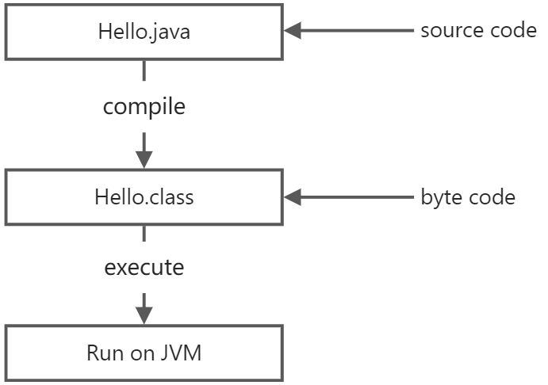

# Java简介

## 安装JDK
因为Java程序必须运行在JVM之上，所以，我们第一件事情就是安装JDK。

搜索JDK 18，确保从[Oracle的官网](https://www.oracle.com/java/technologies/javase-downloads.html)下载最新的稳定版JDK：
```html
Java SE 18 
Java SE 18 is the latest release for the Java SE Platform 
Documentation                  	 Oracle JDK 
Installation Instructions        JDK Download 
Release Notes                    ════════════ 
Oracle License                   Documentation Download 
```
找到Java SE 18的下载链接`JDK Download`，下载安装即可。

### 设置环境变量
安装完JDK后，需要设置一个`JAVA_HOME`的环境变量，它指向JDK的安装目录。在Windows下，它是安装目录，类似：

`C:\Program Files\Java\jdk-18 `

在Mac下，它在`~/.bash_profile`或`~/.zprofile`里，它是：

`export JAVA_HOME=`/usr/libexec/java_home -v 18``

然后，把JAVA_HOME的bin目录附加到系统环境变量PATH上。在Windows下，它长这样：

`Path=%JAVA_HOME%\bin;<现有的其他路径> `

在Mac下，它在`~/.bash_profile`或`~/.zprofile`里，长这样：

`export PATH=$JAVA_HOME/bin:$PATH `

把`JAVA_HOME`的`bin`目录添加到`PATH`中是为了在任意文件夹下都可以运行`java`。打开命令提示符窗口，输入命令`java -version`，如果一切正常，你会看到如下输出：
```bash
Microsoft Windows [Version 10.0.0]                      
(c) 2015 Microsoft Corporation. All rights reserved.
C:\> java -version
java version "18" ...
Java(TM) SE Runtime Environment
Java HotSpot(TM) 64-Bit Server VM 
C:\> 
```
如果你看到的版本号不是`18`，而是`15`、`1.8`之类，说明系统存在多个JDK，且默认JDK不是JDK 18，需要把JDK 18提到`PATH`前面。

如果你得到一个错误输出：
```bash
Microsoft Windows [Version 10.0.0]
(c) 2015 Microsoft Corporation. All rights reserved. 
C:\> java -version
'java' is not recognized as an internal or external command, operable program or batch file.  
```
这是因为系统无法找到Java虚拟机的程序`java.exe`，需要检查JAVA_HOME和PATH的配置。

可以参考[如何设置或更改PATH系统变量](https://www.java.com/zh_CN/download/help/path.xml)。

### JDK

细心的童鞋还可以在`JAVA_HOME`的`bin`目录下找到很多可执行文件：

- java：这个可执行程序其实就是JVM，运行Java程序，就是启动JVM，然后让JVM执行指定的编译后的代码；
- javac：这是Java的编译器，它用于把Java源码文件（以`.java`后缀结尾）编译为Java字节码文件（以`.class`后缀结尾）；
- jar：用于把一组`.class`文件打包成一个`.jar`文件，便于发布；
- javadoc：用于从Java源码中自动提取注释并生成文档；
- jdb：Java调试器，用于开发阶段的运行调试。

## 第一个Java程序
我们来编写第一个Java程序。

打开文本编辑器，输入以下代码：
```java
public class Hello {
    public static void main(String[] args) {
        System.out.println("Hello, world!");
    }
} 
```
在一个Java程序中，你总能找到一个类似：
```java
public class Hello {
    ...
}
```
的定义，这个定义被称为class（类），这里的类名是`Hello`，大小写敏感，`class`用来定义一个类，`public`表示这个类是公开的，`public`、`class`都是Java的关键字，必须小写，`Hello`是类的名字，按照习惯，首字母`H`要大写。而花括号`{}`中间则是类的定义。

注意到类的定义中，我们定义了一个名为`main`的方法：
```java
public static void main(String[] args) {
    ...
}
```
方法是可执行的代码块，一个方法除了方法名main，还有用()括起来的方法参数，这里的`main`方法有一个参数，参数类型是`String[]`，参数名是`args`，`public`、`static`用来修饰方法，这里表示它是一个公开的静态方法，`void`是方法的返回类型，而花括号`{}`中间的就是方法的代码。

方法的代码每一行用`;`结束，这里只有一行代码，就是：
```java
 System.out.println("Hello, world!"); 
```
它用来打印一个字符串到屏幕上。

Java规定，某个类定义的`public static void main(String[] args)`是Java程序的固定入口方法，因此，Java程序总是从`main`方法开始执行。

注意到Java源码的缩进不是必须的，但是用缩进后，格式好看，很容易看出代码块的开始和结束，缩进一般是4个空格或者一个tab。

最后，当我们把代码保存为文件时，文件名必须是`Hello.java`，而且文件名也要注意大小写，因为要和我们定义的类名`Hello`完全保持一致。

### 如何运行Java程序
Java源码本质上是一个文本文件，我们需要先用`javac`把`Hello.java`编译成字节码文件`Hello.class`，然后，用`java`命令执行这个字节码文件：



因此，可执行文件`javac`是编译器，而可执行文件`java`就是虚拟机。

第一步，在保存`Hello.java`的目录下执行命令`javac Hello.java`：
```bash
$ javac Hello.java 
```
如果源代码无误，上述命令不会有任何输出，而当前目录下会产生一个`Hello.class`文件：
```bash
$ javac Hello.java 
```
第二步，执行`Hello.class`，使用命令`java Hello`：
```bash
$ java Hello Hello, world! 
```
注意：给虚拟机传递的参数`Hello`是我们定义的类名，虚拟机自动查找对应的class文件并执行。

有一些童鞋可能知道，直接运行`java Hello.java`也是可以的：
```bash
$ java Hello.java
Hello, world! 
```
这是Java 11新增的一个功能，它可以直接运行一个单文件源码！

需要注意的是，在实际项目中，单个不依赖第三方库的Java源码是非常罕见的，所以，绝大多数情况下，我们无法直接运行一个Java源码文件，原因是它需要依赖其他的库。

### 小结

一个Java源码只能定义一个`public`类型的class，并且class名称和文件名要完全一致；

使用`javac`可以将`.java`源码编译成`.class`字节码；

使用`java`可以运行一个已编译的Java程序，参数是类名。
