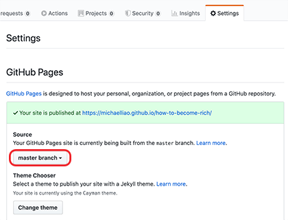
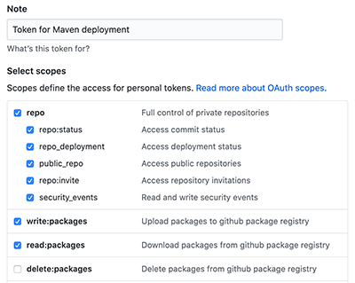
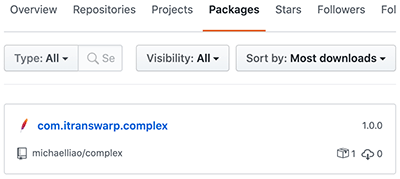

# Maven基础

## Maven介绍

在了解Maven之前，我们先来看看一个Java项目需要的东西。首先，我们需要确定引入哪些依赖包。例如，如果我们需要用到[commons logging](https://commons.apache.org/proper/commons-logging/)，我们就必须把commons logging的jar包放入classpath。如果我们还需要[log4j](https://logging.apache.org/log4j/)，就需要把log4j相关的jar包都放到classpath中。这些就是依赖包的管理。

其次，我们要确定项目的目录结构。例如，`src`目录存放Java源码，`resources`目录存放配置文件，`bin`目录存放编译生成的`.class`文件。
此外，我们还需要配置环境，例如JDK的版本，编译打包的流程，当前代码的版本号。

最后，除了使用Eclipse这样的IDE进行编译外，我们还必须能通过命令行工具进行编译，才能够让项目在一个独立的服务器上编译、测试、部署。

这些工作难度不大，但是非常琐碎且耗时。如果每一个项目都自己搞一套配置，肯定会一团糟。我们需要的是一个标准化的Java项目管理和构建工具。

Maven就是是专门为Java项目打造的管理和构建工具，它的主要功能有：

- 提供了一套标准化的项目结构；
- 提供了一套标准化的构建流程（编译，测试，打包，发布……）；
- 提供了一套依赖管理机制。

### Maven项目结构

一个使用Maven管理的普通的Java项目，它的目录结构默认如下：
```

a-maven-project
├── pom.xml
├── src
│   ├── main
│   │   ├── java
│   │   └── resources
│   └── test
│       ├── java
│       └── resources
└── target
```
项目的根目录`a-maven-project`是项目名，它有一个项目描述文件`pom.xml`，存放Java源码的目录是`src/main/java`，存放资源文件的目录是`src/main/resources`，存放测试源码的目录是`src/test/java`，存放测试资源的目录是`src/test/resources`，最后，所有编译、打包生成的文件都放在`target`目录里。这些就是一个Maven项目的标准目录结构。

所有的目录结构都是约定好的标准结构，我们千万不要随意修改目录结构。使用标准结构不需要做任何配置，Maven就可以正常使用。

我们再来看最关键的一个项目描述文件`pom.xml`，它的内容长得像下面：
```xml
<project ...>
    <modelVersion>4.0.0</modelVersion>
    <groupId>com.itranswarp.learnjava</groupId>
    <artifactId>hello</artifactId>
    <version>1.0</version>
    <packaging>jar</packaging>
    <properties>
        ...
    </properties>
    <dependencies>
        <dependency>
            <groupId>commons-logging</groupId>
            <artifactId>commons-logging</artifactId>
            <version>1.2</version>
        </dependency>
    </dependencies>
</project>
```
其中，`groupId`类似于Java的包名，通常是公司或组织名称，`artifactId`类似于Java的类名，通常是项目名称，再加上`version`，一个Maven工程就是由`groupId`，`artifactId`和`version`作为唯一标识。我们在引用其他第三方库的时候，也是通过这3个变量确定。例如，依赖`commons-logging`：
```xml
<dependency>
    <groupId>commons-logging</groupId>
    <artifactId>commons-logging</artifactId>
    <version>1.2</version>
</dependency>
```
使用`<dependency>`声明一个依赖后，Maven就会自动下载这个依赖包并把它放到classpath中。

### 安装Maven

要安装Maven，可以从[Maven官网](https://maven.apache.org/)下载最新的Maven 3.6.x，然后在本地解压，设置几个环境变量：
```bash
M2_HOME=/path/to/maven-3.6.x
PATH=$PATH:$M2_HOME/bin
```
Windows可以把`%M2_HOME%\bin`添加到系统Path变量中。

然后，打开命令行窗口，输入`mvn -version`，应该看到Maven的版本信息：
```

┌────────────────────────────────────────────────────────┐
│Command Prompt                                    - □ x │
├────────────────────────────────────────────────────────┤
│Microsoft Windows [Version 10.0.0]                      │
│(c) 2015 Microsoft Corporation. All rights reserved.    │
│                                                        │
│C:\> mvn -version                                       │
│Apache Maven 3.6.0 (97c98ec64a1fdfee7767ce5ffb20918...) │
│Maven home: C:\Users\liaoxuefeng\maven                  │
│Java version: ...                                       │
│...                                                     │
│C:\> _                                                  │
│                                                        │
│                                                        │
└────────────────────────────────────────────────────────┘
```
如果提示命令未找到，说明系统PATH路径有误，需要修复后再运行。

### 小结

Maven是一个Java项目的管理和构建工具：

- Maven使用`pom.xml`定义项目内容，并使用预设的目录结构；
- 在Maven中声明一个依赖项可以自动下载并导入classpath；
- Maven使用`groupId`，`artifactId`和`version`唯一定位一个依赖。

## 依赖管理
如果我们的项目依赖第三方的jar包，例如commons logging，那么问题来了：commons logging发布的jar包在哪下载？

如果我们还希望依赖log4j，那么使用log4j需要哪些jar包？

类似的依赖还包括：JUnit，JavaMail，MySQL驱动等等，一个可行的方法是通过搜索引擎搜索到项目的官网，然后手动下载zip包，解压，放入classpath。但是，这个过程非常繁琐。

Maven解决了依赖管理问题。例如，我们的项目依赖`abc`这个jar包，而`abc`又依赖`xyz`这个jar包：
```

┌──────────────┐
│Sample Project│
└──────────────┘
        │
        ▼
┌──────────────┐
│     abc      │
└──────────────┘
        │
        ▼
┌──────────────┐
│     xyz      │
└──────────────┘
```
当我们声明了`abc`的依赖时，Maven自动把`abc`和`xyz`都加入了我们的项目依赖，不需要我们自己去研究`abc`是否需要依赖`xyz`。

因此，Maven的第一个作用就是解决依赖管理。我们声明了自己的项目需要`abc`，Maven会自动导入`abc`的jar包，再判断出`abc`需要`xyz`，又会自动导入`xyz`的jar包，这样，最终我们的项目会依赖`abc`和`xyz`两个jar包。

我们来看一个复杂依赖示例：
```xml
<dependency>
    <groupId>org.springframework.boot</groupId>
    <artifactId>spring-boot-starter-web</artifactId>
    <version>1.4.2.RELEASE</version>
</dependency>
```
当我们声明一个`spring-boot-starter-web`依赖时，Maven会自动解析并判断最终需要大概二三十个其他依赖：
```

spring-boot-starter-web
  spring-boot-starter
    spring-boot
    sprint-boot-autoconfigure
    spring-boot-starter-logging
      logback-classic
        logback-core
        slf4j-api
      jcl-over-slf4j
        slf4j-api
      jul-to-slf4j
        slf4j-api
      log4j-over-slf4j
        slf4j-api
    spring-core
    snakeyaml
  spring-boot-starter-tomcat
    tomcat-embed-core
    tomcat-embed-el
    tomcat-embed-websocket
      tomcat-embed-core
  jackson-databind
  ...
```
如果我们自己去手动管理这些依赖是非常费时费力的，而且出错的概率很大。

### 依赖关系

Maven定义了几种依赖关系，分别是`compile`、`test`、`runtime`和`provided`：

| **scope** | **说明** | **示例** |
| --- | --- | --- |
| compile | 编译时需要用到该jar包（默认） | commons-logging |
| test | 编译Test时需要用到该jar包 | junit |
| runtime | 编译时不需要，但运行时需要用到 | mysql |
| provided | 编译时需要用到，但运行时由JDK或某个服务器提供 | servlet-api |

其中，默认的`compile`是最常用的，Maven会把这种类型的依赖直接放入classpath。

`test`依赖表示仅在测试时使用，正常运行时并不需要。最常用的`test`依赖就是JUnit：
```xml
<dependency>
    <groupId>org.junit.jupiter</groupId>
    <artifactId>junit-jupiter-api</artifactId>
    <version>5.3.2</version>
    <scope>test</scope>
</dependency>
```
`runtime`依赖表示编译时不需要，但运行时需要。最典型的`runtime`依赖是JDBC驱动，例如MySQL驱动：
```xml
<dependency>
    <groupId>mysql</groupId>
    <artifactId>mysql-connector-java</artifactId>
    <version>5.1.48</version>
    <scope>runtime</scope>
</dependency>
```
`provided`依赖表示编译时需要，但运行时不需要。最典型的`provided`依赖是Servlet API，编译的时候需要，但是运行时，Servlet服务器内置了相关的jar，所以运行期不需要：
```xml
<dependency>
    <groupId>javax.servlet</groupId>
    <artifactId>javax.servlet-api</artifactId>
    <version>4.0.0</version>
    <scope>provided</scope>
</dependency>
```
最后一个问题是，Maven如何知道从何处下载所需的依赖？也就是相关的jar包？答案是Maven维护了一个中央仓库（[repo1.maven.org](https://repo1.maven.org/)），所有第三方库将自身的jar以及相关信息上传至中央仓库，Maven就可以从中央仓库把所需依赖下载到本地。

Maven并不会每次都从中央仓库下载jar包。一个jar包一旦被下载过，就会被Maven自动缓存在本地目录（用户主目录的`.m2`目录），所以，除了第一次编译时因为下载需要时间会比较慢，后续过程因为有本地缓存，并不会重复下载相同的jar包。

### 唯一ID

对于某个依赖，Maven只需要3个变量即可唯一确定某个jar包：

- groupId：属于组织的名称，类似Java的包名；
- artifactId：该jar包自身的名称，类似Java的类名；
- version：该jar包的版本。

通过上述3个变量，即可唯一确定某个jar包。Maven通过对jar包进行PGP签名确保任何一个jar包一经发布就无法修改。修改已发布jar包的唯一方法是发布一个新版本。

因此，某个jar包一旦被Maven下载过，即可永久地安全缓存在本地。

注：只有以`-SNAPSHOT`结尾的版本号会被Maven视为开发版本，开发版本每次都会重复下载，这种SNAPSHOT版本只能用于内部私有的Maven repo，公开发布的版本不允许出现SNAPSHOT。

### Maven镜像

除了可以从Maven的中央仓库下载外，还可以从Maven的镜像仓库下载。如果访问Maven的中央仓库非常慢，我们可以选择一个速度较快的Maven的镜像仓库。Maven镜像仓库定期从中央仓库同步：
```

           slow    ┌───────────────────┐
    ┌─────────────>│Maven Central Repo.│
    │              └───────────────────┘
    │                        │
    │                        │sync
    │                        ▼
┌───────┐  fast    ┌───────────────────┐
│ User  │─────────>│Maven Mirror Repo. │
└───────┘          └───────────────────┘
```
中国区用户可以使用阿里云提供的Maven镜像仓库。使用Maven镜像仓库需要一个配置，在用户主目录下进入`.m2`目录，创建一个`settings.xml`配置文件，内容如下：
```xml
<settings>
    <mirrors>
        <mirror>
            <id>aliyun</id>
            <name>aliyun</name>
            <mirrorOf>central</mirrorOf>
            <!-- 国内推荐阿里云的Maven镜像 -->
            <url>https://maven.aliyun.com/repository/central</url>
        </mirror>
    </mirrors>
</settings>
```
配置镜像仓库后，Maven的下载速度就会非常快。

### 搜索第三方组件

最后一个问题：如果我们要引用一个第三方组件，比如`okhttp`，如何确切地获得它的`groupId`、`artifactId`和`version`？方法是通过[search.maven.org](https://search.maven.org/)搜索关键字，找到对应的组件后，直接复制：


### 命令行编译

在命令中，进入到`pom.xml`所在目录，输入以下命令：
```bash
$ mvn clean package
```
如果一切顺利，即可在`target`目录下获得编译后自动打包的jar。

### 在IDE中使用Maven

几乎所有的IDE都内置了对Maven的支持。在Eclipse中，可以直接创建或导入Maven项目。如果导入后的Maven项目有错误，可以尝试选择项目后点击右键，选择Maven - Update Project...更新：


### 小结

Maven通过解析依赖关系确定项目所需的jar包，常用的4种`scope`有：`compile`（默认），`test`，`runtime`和`provided`；

Maven从中央仓库下载所需的jar包并缓存在本地；

可以通过镜像仓库加速下载。

## 构建流程

### 构建流程

Maven不但有标准化的项目结构，而且还有一套标准化的构建流程，可以自动化实现编译，打包，发布，等等。

### Lifecycle和Phase

使用Maven时，我们首先要了解什么是Maven的生命周期（lifecycle）。

Maven的生命周期由一系列阶段（phase）构成，以内置的生命周期`default`为例，它包含以下phase：

- validate
- initialize
- generate-sources
- process-sources
- generate-resources
- process-resources
- compile
- process-classes
- generate-test-sources
- process-test-sources
- generate-test-resources
- process-test-resources
- test-compile
- process-test-classes
- test
- prepare-package
- package
- pre-integration-test
- integration-test
- post-integration-test
- verify
- install
- deploy

如果我们运行`mvn package`，Maven就会执行`default`生命周期，它会从开始一直运行到`package`这个phase为止：

- validate
- ...
- package

如果我们运行`mvn compile`，Maven也会执行`default`生命周期，但这次它只会运行到`compile`，即以下几个phase：

- validate
- ...
- compile

Maven另一个常用的生命周期是`clean`，它会执行3个phase：

- pre-clean
- clean （注意这个clean不是lifecycle而是phase）
- post-clean

所以，我们使用`mvn`这个命令时，后面的参数是phase，Maven自动根据生命周期运行到指定的phase。

更复杂的例子是指定多个phase，例如，运行`mvn clean package`，Maven先执行`clean`生命周期并运行到`clean`这个phase，然后执行`default`生命周期并运行到`package`这个phase，实际执行的phase如下：

- pre-clean
- clean （注意这个clean是phase）
- validate
- ...
- package

在实际开发过程中，经常使用的命令有：

`mvn clean`：清理所有生成的class和jar；

`mvn clean compile`：先清理，再执行到`compile`；

`mvn clean test`：先清理，再执行到`test`，因为执行`test`前必须执行compile，所以这里不必指定compile；

`mvn clean package`：先清理，再执行到`package`。

大多数phase在执行过程中，因为我们通常没有在`pom.xml`中配置相关的设置，所以这些phase什么事情都不做。

经常用到的phase其实只有几个：

- clean：清理
- compile：编译
- test：运行测试
- package：打包

### Goal

执行一个phase又会触发一个或多个goal：

| **执行的Phase** | **对应执行的Goal** |
| --- | --- |
| compile | compiler:compile |
| test | compiler:testCompile
surefire:test |

goal的命名总是`abc:xyz`这种形式。

看到这里，相信大家对lifecycle、phase和goal已经明白了吧？


其实我们类比一下就明白了：

- lifecycle相当于Java的package，它包含一个或多个phase；
- phase相当于Java的class，它包含一个或多个goal；
- goal相当于class的method，它其实才是真正干活的。

大多数情况，我们只要指定phase，就默认执行这些phase默认绑定的goal，只有少数情况，我们可以直接指定运行一个goal，例如，启动Tomcat服务器：
```bash
mvn tomcat:run
```

### 小结

Maven通过lifecycle、phase和goal来提供标准的构建流程。

最常用的构建命令是指定phase，然后让Maven执行到指定的phase：

- mvn clean
- mvn clean compile
- mvn clean test
- mvn clean package

通常情况，我们总是执行phase默认绑定的goal，因此不必指定goal。

## 使用插件

我们在前面介绍了Maven的lifecycle，phase和goal：使用Maven构建项目就是执行lifecycle，执行到指定的phase为止。每个phase会执行自己默认的一个或多个goal。goal是最小任务单元。

我们以`compile`这个phase为例，如果执行：
```bash
mvn compile
```
Maven将执行`compile`这个phase，这个phase会调用`compiler`插件执行关联的`compiler:compile`这个goal。

实际上，执行每个phase，都是通过某个插件（plugin）来执行的，Maven本身其实并不知道如何执行`compile`，它只是负责找到对应的`compiler`插件，然后执行默认的`compiler:compile`这个goal来完成编译。

所以，使用Maven，实际上就是配置好需要使用的插件，然后通过phase调用它们。

Maven已经内置了一些常用的标准插件：

| **插件名称** | **对应执行的phase** |
| --- | --- |
| clean | clean |
| compiler | compile |
| surefire | test |
| jar | package |

如果标准插件无法满足需求，我们还可以使用自定义插件。使用自定义插件的时候，需要声明。例如，使用`maven-shade-plugin`可以创建一个可执行的jar，要使用这个插件，需要在`pom.xml`中声明它：
```xml
<project>
    ...
	<build>
		<plugins>
			<plugin>
				<groupId>org.apache.maven.plugins</groupId>
				<artifactId>maven-shade-plugin</artifactId>
                <version>3.2.1</version>
				<executions>
					<execution>
						<phase>package</phase>
						<goals>
							<goal>shade</goal>
						</goals>
						<configuration>
                            ...
						</configuration>
					</execution>
				</executions>
			</plugin>
		</plugins>
	</build>
</project>
```
自定义插件往往需要一些配置，例如，`maven-shade-plugin`需要指定Java程序的入口，它的配置是：
```xml
<configuration>
    <transformers>
        <transformer implementation="org.apache.maven.plugins.shade.resource.ManifestResourceTransformer">
            <mainClass>com.itranswarp.learnjava.Main</mainClass>
        </transformer>
    </transformers>
</configuration>
```
注意，Maven自带的标准插件例如`compiler`是无需声明的，只有引入其它的插件才需要声明。

下面列举了一些常用的插件：

- maven-shade-plugin：打包所有依赖包并生成可执行jar；
- cobertura-maven-plugin：生成单元测试覆盖率报告；
- findbugs-maven-plugin：对Java源码进行静态分析以找出潜在问题。

### 小结

Maven通过自定义插件可以执行项目构建时需要的额外功能，使用自定义插件必须在pom.xml中声明插件及配置；

插件会在某个phase被执行时执行；

插件的配置和用法需参考插件的官方文档。

## 模块管理

在软件开发中，把一个大项目分拆为多个模块是降低软件复杂度的有效方法：
```

                        ┌ ─ ─ ─ ─ ─ ─ ┐
                          ┌─────────┐
                        │ │Module A │ │
                          └─────────┘
┌──────────────┐ split  │ ┌─────────┐ │
│Single Project│───────>  │Module B │
└──────────────┘        │ └─────────┘ │
                          ┌─────────┐
                        │ │Module C │ │
                          └─────────┘
                        └ ─ ─ ─ ─ ─ ─ ┘
```
对于Maven工程来说，原来是一个大项目：
```

single-project
├── pom.xml
└── src
```
现在可以分拆成3个模块：
```

mutiple-project
├── module-a
│   ├── pom.xml
│   └── src
├── module-b
│   ├── pom.xml
│   └── src
└── module-c
    ├── pom.xml
    └── src
```
Maven可以有效地管理多个模块，我们只需要把每个模块当作一个独立的Maven项目，它们有各自独立的`pom.xml`。例如，模块A的`pom.xml`：
```xml
<project xmlns="http://maven.apache.org/POM/4.0.0"
    xmlns:xsi="http://www.w3.org/2001/XMLSchema-instance"
    xsi:schemaLocation="http://maven.apache.org/POM/4.0.0 http://maven.apache.org/xsd/maven-4.0.0.xsd">
    <modelVersion>4.0.0</modelVersion>

    <groupId>com.itranswarp.learnjava</groupId>
    <artifactId>module-a</artifactId>
    <version>1.0</version>
    <packaging>jar</packaging>

    <name>module-a</name>

    <properties>
        <project.build.sourceEncoding>UTF-8</project.build.sourceEncoding>
        <project.reporting.outputEncoding>UTF-8</project.reporting.outputEncoding>
        <maven.compiler.source>11</maven.compiler.source>
        <maven.compiler.target>11</maven.compiler.target>
        <java.version>11</java.version>
    </properties>

    <dependencies>
        <dependency>
            <groupId>org.slf4j</groupId>
            <artifactId>slf4j-api</artifactId>
            <version>1.7.28</version>
        </dependency>
        <dependency>
            <groupId>ch.qos.logback</groupId>
            <artifactId>logback-classic</artifactId>
            <version>1.2.3</version>
            <scope>runtime</scope>
        </dependency>
        <dependency>
            <groupId>org.junit.jupiter</groupId>
            <artifactId>junit-jupiter-engine</artifactId>
            <version>5.5.2</version>
            <scope>test</scope>
        </dependency>
    </dependencies>
</project>
```
模块B的`pom.xml`：
```xml
<project xmlns="http://maven.apache.org/POM/4.0.0"
    xmlns:xsi="http://www.w3.org/2001/XMLSchema-instance"
    xsi:schemaLocation="http://maven.apache.org/POM/4.0.0 http://maven.apache.org/xsd/maven-4.0.0.xsd">
    <modelVersion>4.0.0</modelVersion>

    <groupId>com.itranswarp.learnjava</groupId>
    <artifactId>module-b</artifactId>
    <version>1.0</version>
    <packaging>jar</packaging>

    <name>module-b</name>

    <properties>
        <project.build.sourceEncoding>UTF-8</project.build.sourceEncoding>
        <project.reporting.outputEncoding>UTF-8</project.reporting.outputEncoding>
        <maven.compiler.source>11</maven.compiler.source>
        <maven.compiler.target>11</maven.compiler.target>
        <java.version>11</java.version>
    </properties>

    <dependencies>
        <dependency>
            <groupId>org.slf4j</groupId>
            <artifactId>slf4j-api</artifactId>
            <version>1.7.28</version>
        </dependency>
        <dependency>
            <groupId>ch.qos.logback</groupId>
            <artifactId>logback-classic</artifactId>
            <version>1.2.3</version>
            <scope>runtime</scope>
        </dependency>
        <dependency>
            <groupId>org.junit.jupiter</groupId>
            <artifactId>junit-jupiter-engine</artifactId>
            <version>5.5.2</version>
            <scope>test</scope>
        </dependency>
    </dependencies>
</project>
```
可以看出来，模块A和模块B的`pom.xml`高度相似，因此，我们可以提取出共同部分作为`parent`：
```xml
<project xmlns="http://maven.apache.org/POM/4.0.0"
    xmlns:xsi="http://www.w3.org/2001/XMLSchema-instance"
    xsi:schemaLocation="http://maven.apache.org/POM/4.0.0 http://maven.apache.org/xsd/maven-4.0.0.xsd">
    <modelVersion>4.0.0</modelVersion>

    <groupId>com.itranswarp.learnjava</groupId>
    <artifactId>parent</artifactId>
    <version>1.0</version>
    <packaging>pom</packaging>

    <name>parent</name>

    <properties>
        <project.build.sourceEncoding>UTF-8</project.build.sourceEncoding>
        <project.reporting.outputEncoding>UTF-8</project.reporting.outputEncoding>
        <maven.compiler.source>11</maven.compiler.source>
        <maven.compiler.target>11</maven.compiler.target>
        <java.version>11</java.version>
    </properties>

    <dependencies>
        <dependency>
            <groupId>org.slf4j</groupId>
            <artifactId>slf4j-api</artifactId>
            <version>1.7.28</version>
        </dependency>
        <dependency>
            <groupId>ch.qos.logback</groupId>
            <artifactId>logback-classic</artifactId>
            <version>1.2.3</version>
            <scope>runtime</scope>
        </dependency>
        <dependency>
            <groupId>org.junit.jupiter</groupId>
            <artifactId>junit-jupiter-engine</artifactId>
            <version>5.5.2</version>
            <scope>test</scope>
        </dependency>
    </dependencies>
</project>
```
注意到parent的`<packaging>`是`pom`而不是`jar`，因为`parent`本身不含任何Java代码。编写`parent`的`pom.xml`只是为了在各个模块中减少重复的配置。现在我们的整个工程结构如下：
```

multiple-project
├── pom.xml
├── parent
│   └── pom.xml
├── module-a
│   ├── pom.xml
│   └── src
├── module-b
│   ├── pom.xml
│   └── src
└── module-c
    ├── pom.xml
    └── src
```
这样模块A就可以简化为：
```xml
<project xmlns="http://maven.apache.org/POM/4.0.0"
    xmlns:xsi="http://www.w3.org/2001/XMLSchema-instance"
    xsi:schemaLocation="http://maven.apache.org/POM/4.0.0 http://maven.apache.org/xsd/maven-4.0.0.xsd">
    <modelVersion>4.0.0</modelVersion>

    <parent>
        <groupId>com.itranswarp.learnjava</groupId>
        <artifactId>parent</artifactId>
        <version>1.0</version>
        <relativePath>../parent/pom.xml</relativePath>
    </parent>

    <artifactId>module-a</artifactId>
    <packaging>jar</packaging>
    <name>module-a</name>
</project>
```
模块B、模块C都可以直接从`parent`继承，大幅简化了`pom.xml`的编写。

如果模块A依赖模块B，则模块A需要模块B的jar包才能正常编译，我们需要在模块A中引入模块B：
```xml
    ...
    <dependencies>
        <dependency>
            <groupId>com.itranswarp.learnjava</groupId>
            <artifactId>module-b</artifactId>
            <version>1.0</version>
        </dependency>
    </dependencies>
```
最后，在编译的时候，需要在根目录创建一个`pom.xml`统一编译：
```xml
<project xmlns="http://maven.apache.org/POM/4.0.0"
    xmlns:xsi="http://www.w3.org/2001/XMLSchema-instance"
    xsi:schemaLocation="http://maven.apache.org/POM/4.0.0 http://maven.apache.org/maven-v4_0_0.xsd">

    <modelVersion>4.0.0</modelVersion>
    <groupId>com.itranswarp.learnjava</groupId>
    <artifactId>build</artifactId>
    <version>1.0</version>
    <packaging>pom</packaging>
    <name>build</name>

    <modules>
        <module>parent</module>
        <module>module-a</module>
        <module>module-b</module>
        <module>module-c</module>
    </modules>
</project>
```
这样，在根目录执行`mvn clean package`时，Maven根据根目录的`pom.xml`找到包括`parent`在内的共4个`<module>`，一次性全部编译。

### 中央仓库

其实我们使用的大多数第三方模块都是这个用法，例如，我们使用commons logging、log4j这些第三方模块，就是第三方模块的开发者自己把编译好的jar包发布到Maven的中央仓库中。

### 私有仓库

私有仓库是指公司内部如果不希望把源码和jar包放到公网上，那么可以搭建私有仓库。私有仓库总是在公司内部使用，它只需要在本地的`~/.m2/settings.xml`中配置好，使用方式和中央仓位没有任何区别。

### 本地仓库

本地仓库是指把本地开发的项目“发布”在本地，这样其他项目可以通过本地仓库引用它。但是我们不推荐把自己的模块安装到Maven的本地仓库，因为每次修改某个模块的源码，都需要重新安装，非常容易出现版本不一致的情况。更好的方法是使用模块化编译，在编译的时候，告诉Maven几个模块之间存在依赖关系，需要一块编译，Maven就会自动按依赖顺序编译这些模块。

### 小结

Maven支持模块化管理，可以把一个大项目拆成几个模块：

- 可以通过继承在parent的`pom.xml`统一定义重复配置；
- 可以通过`<modules>`编译多个模块。

## 使用mvnw

我们使用Maven时，基本上只会用到`mvn`这一个命令。有些童鞋可能听说过`mvnw`，这个是啥？

`mvnw`是Maven Wrapper的缩写。因为我们安装Maven时，默认情况下，系统所有项目都会使用全局安装的这个Maven版本。但是，对于某些项目来说，它可能必须使用某个特定的Maven版本，这个时候，就可以使用Maven Wrapper，它可以负责给这个特定的项目安装指定版本的Maven，而其他项目不受影响。

简单地说，Maven Wrapper就是给一个项目提供一个独立的，指定版本的Maven给它使用。

### 安装Maven Wrapper

安装Maven Wrapper最简单的方式是在项目的根目录（即`pom.xml`所在的目录）下运行安装命令：
```bash
mvn -N io.takari:maven:0.7.6:wrapper
```
它会自动使用最新版本的Maven。注意`0.7.6`是Maven Wrapper的版本。最新的Maven Wrapper版本可以去[官方网站](https://github.com/takari/maven-wrapper)查看。
如果要指定使用的Maven版本，使用下面的安装命令指定版本，例如`3.3.3`：
```bash
mvn -N io.takari:maven:0.7.6:wrapper -Dmaven=3.3.3
```
安装后，查看项目结构：
```

my-project
├── .mvn
│   └── wrapper
│       ├── MavenWrapperDownloader.java
│       ├── maven-wrapper.jar
│       └── maven-wrapper.properties
├── mvnw
├── mvnw.cmd
├── pom.xml
└── src
    ├── main
    │   ├── java
    │   └── resources
    └── test
        ├── java
        └── resources
```
发现多了`mvnw`、`mvnw.cmd`和`.mvn`目录，我们只需要把`mvn`命令改成`mvnw`就可以使用跟项目关联的Maven。例如：
```bash
mvnw clean package
```
在Linux或macOS下运行时需要加上`./`：
```bash
./mvnw clean package
```
Maven Wrapper的另一个作用是把项目的`mvnw`、`mvnw.cmd`和`.mvn`提交到版本库中，可以使所有开发人员使用统一的Maven版本。

### 小结

使用Maven Wrapper，可以为一个项目指定特定的Maven版本。

## 发布Artifact

当我们使用`commons-logging`这些第三方开源库的时候，我们实际上是通过Maven自动下载它的jar包，并根据其`pom.xml`解析依赖，自动把相关依赖包都下载后加入到classpath。

那么问题来了：当我们自己写了一个牛逼的开源库时，非常希望别人也能使用，总不能直接放个jar包的链接让别人下载吧？

如果我们把自己的开源库放到Maven的repo中，那么，别人只需按标准引用`groupId:artifactId:version`，即可自动下载jar包以及相关依赖。因此，本节我们介绍如何发布一个库到Maven的repo中。

把自己的库发布到Maven的repo中有好几种方法，我们介绍3种最常用的方法。

### 以静态文件发布

如果我们观察一个中央仓库的Artifact结构，例如[Commons Math](https://commons.apache.org/proper/commons-math/)，它的groupId是`org.apache.commons`，artifactId是`commons-math3`，以版本`3.6.1`为例，发布在中央仓库的文件夹路径就是[https://repo1.maven.org/maven2/org/apache/commons/commons-math3/3.6.1/](https://repo1.maven.org/maven2/org/apache/commons/commons-math3/3.6.1/)，在此文件夹下，`commons-math3-3.6.1.jar`就是发布的jar包，`commons-math3-3.6.1.pom`就是它的`pom.xml`描述文件，`commons-math3-3.6.1-sources.jar`是源代码，`commons-math3-3.6.1-javadoc.jar`是文档。其它以`.asc`、`.md5`、`.sha1`结尾的文件分别是GPG签名、MD5摘要和SHA-1摘要。

我们只要按照这种目录结构组织文件，它就是一个有效的Maven仓库。

我们以广受好评的开源项目[how-to-become-rich](https://github.com/michaelliao/how-to-become-rich)为例，先创建Maven工程目录结构如下：
```

how-to-become-rich
├── maven-repo        <-- Maven本地文件仓库
├── pom.xml           <-- 项目文件
├── src
│   ├── main
│   │   ├── java      <-- 源码目录
│   │   └── resources <-- 资源目录
│   └── test
│       ├── java      <-- 测试源码目录
│       └── resources <-- 测试资源目录
└── target            <-- 编译输出目录
```
在`pom.xml`中添加如下内容：
```xml
<project ...>
    ...
    <distributionManagement>
        <repository>
            <id>local-repo-release</id>
            <name>GitHub Release</name>
            <url>file://${project.basedir}/maven-repo</url>
        </repository>
    </distributionManagement>

    <build>
        <plugins>
            <plugin>
                <artifactId>maven-source-plugin</artifactId>
                <executions>
                    <execution>
                        <id>attach-sources</id>
                        <phase>package</phase>
                        <goals>
                            <goal>jar-no-fork</goal>
                        </goals>
                    </execution>
                </executions>
            </plugin>
            <plugin>
                <artifactId>maven-javadoc-plugin</artifactId>
                <executions>
                    <execution>
                        <id>attach-javadocs</id>
                        <phase>package</phase>
                        <goals>
                            <goal>jar</goal>
                        </goals>
                    </execution>
                </executions>
            </plugin>
        </plugins>
    </build>
</project>
```
注意到`<distributionManagement>`，它指示了发布的软件包的位置，这里的`<url>`是项目根目录下的`maven-repo`目录，在`<build>`中定义的两个插件`maven-source-plugin`和`maven-javadoc-plugin`分别用来创建源码和javadoc，如果不想发布源码，可以把对应的插件去掉。

我们直接在项目根目录下运行Maven命令`mvn clean package deploy`，如果一切顺利，我们就可以在`maven-repo`目录下找到部署后的所有文件如下：
```

maven-repo
└── com
    └── itranswarp
        └── rich
            └── how-to-become-rich
                ├── 1.0.0
                │   ├── how-to-become-rich-1.0.0-javadoc.jar
                │   ├── how-to-become-rich-1.0.0-javadoc.jar.md5
                │   ├── how-to-become-rich-1.0.0-javadoc.jar.sha1
                │   ├── how-to-become-rich-1.0.0-sources.jar
                │   ├── how-to-become-rich-1.0.0-sources.jar.md5
                │   ├── how-to-become-rich-1.0.0-sources.jar.sha1
                │   ├── how-to-become-rich-1.0.0.jar
                │   ├── how-to-become-rich-1.0.0.jar.md5
                │   ├── how-to-become-rich-1.0.0.jar.sha1
                │   ├── how-to-become-rich-1.0.0.pom
                │   ├── how-to-become-rich-1.0.0.pom.md5
                │   └── how-to-become-rich-1.0.0.pom.sha1
                ├── maven-metadata.xml
                ├── maven-metadata.xml.md5
                └── maven-metadata.xml.sha1
```
最后一步，是把这个工程推到GitHub上，并选择`Settings-GitHub Pages`，选择`master branch`启用Pages服务：



这样，把全部内容推送至GitHub后，即可作为静态网站访问Maven的repo，它的地址是[https://michaelliao.github.io/how-to-become-rich/maven-repo/](https://michaelliao.github.io/how-to-become-rich/maven-repo/)。版本`1.0.0`对应的jar包地址是：
```
https://michaelliao.github.io/how-to-become-rich/maven-repo/com/itranswarp/rich/how-to-become-rich/1.0.0/how-to-become-rich-1.0.0.jar
```
现在，如果其他人希望引用这个Maven包，我们可以告知如下依赖即可：
```xml
<dependency>
    <groupId>com.itranswarp.rich</groupId>
    <artifactId>how-to-become-rich</artifactId>
    <version>1.0.0</version>
</dependency>
```
但是，除了正常导入依赖外，对方还需要再添加一个`<repository>`的声明，即使用方完整的`pom.xml`如下：
```xml
<project xmlns="http://maven.apache.org/POM/4.0.0"
    xmlns:xsi="http://www.w3.org/2001/XMLSchema-instance"
    xsi:schemaLocation="http://maven.apache.org/POM/4.0.0 http://maven.apache.org/xsd/maven-4.0.0.xsd">
    <modelVersion>4.0.0</modelVersion>

    <groupId>example</groupId>
    <artifactId>how-to-become-rich-usage</artifactId>
    <version>1.0-SNAPSHOT</version>
    <packaging>jar</packaging>

    <properties>
        <maven.compiler.source>11</maven.compiler.source>
        <maven.compiler.target>11</maven.compiler.target>
        <java.version>11</java.version>
    </properties>

    <repositories>
        <repository>
            <id>github-rich-repo</id>
            <name>The Maven Repository on Github</name>
            <url>https://michaelliao.github.io/how-to-become-rich/maven-repo/</url>
        </repository>
    </repositories>

    <dependencies>
        <dependency>
            <groupId>com.itranswarp.rich</groupId>
            <artifactId>how-to-become-rich</artifactId>
            <version>1.0.0</version>
        </dependency>
    </dependencies>
</project>
```
在`<repository>`中，我们必须声明发布的Maven的repo地址，其中`<id>`和`<name>`可以任意填写，`<url>`填入GitHub Pages提供的地址+`/maven-repo/`后缀。现在，即可正常引用这个库并编写代码如下：
```java
Millionaire millionaire = new Millionaire();
System.out.println(millionaire.howToBecomeRich());
```
有的童鞋会问，为什么使用`commons-logging`等第三方库时，并不需要声明repo地址？这是因为这些库都是发布到Maven中央仓库的，发布到中央仓库后，不需要告诉Maven仓库地址，因为它知道中央仓库的地址默认是[https://repo1.maven.org/maven2/](https://repo1.maven.org/maven2/)，也可以通过`~/.m2/settings.xml`指定一个代理仓库地址以替代中央仓库来提高速度（参考[依赖管理](https://www.liaoxuefeng.com/wiki/1252599548343744/1309301178105890)的Maven镜像）。

因为GitHub Pages并不会把我们发布的Maven包同步到中央仓库，所以自然使用方必须手动添加一个我们提供的仓库地址。

此外，通过GitHub Pages发布Maven repo时需要注意一点，即不要改动已发布的版本。因为Maven的仓库是不允许修改任何版本的，对一个库进行修改的唯一方法是发布一个新版本。但是通过静态文件的方式发布repo，实际上我们是可以修改jar文件的，但最好遵守规范，不要修改已发布版本。

### 通过Nexus发布到中央仓库

有的童鞋会问，能不能把自己的开源库发布到Maven的中央仓库，这样用户就不需要声明repo地址，可以直接引用，显得更专业。

当然可以，但我们不能直接发布到Maven中央仓库，而是通过曲线救国的方式，发布到[central.sonatype.org](https://central.sonatype.org/)，它会定期自动同步到Maven的中央仓库。[Nexus](https://www.sonatype.com/nexus-repository-oss)是一个支持Maven仓库的软件，由Sonatype开发，有免费版和专业版两个版本，很多大公司内部都使用Nexus作为自己的私有Maven仓库，而这个[central.sonatype.org](https://central.sonatype.org/)相当于面向开源的一个Nexus公共服务。

所以，第一步是在[central.sonatype.org](https://central.sonatype.org/)上注册一个账号，注册链接非常隐蔽，可以自己先找找，找半小时没找到点这里查看攻略。

如果注册顺利并审核通过，会得到一个登录账号，然后，通过[这个页面](https://central.sonatype.org/pages/apache-maven.html)一步一步操作就可以成功地将自己的Artifact发布到Nexus上，再耐心等待几个小时后，你的Artifact就会出现在Maven的中央仓库中。

这里简单提一下发布重点与难点：

- 必须正确创建GPG签名，Linux和Mac下推荐使用gnupg2；
- 必须在`~/.m2/settings.xml`中配置好登录用户名和口令，以及GPG口令：
```xml
<settings ...>
    ...
    <servers>
        <server>
            <id>ossrh</id>
            <username>OSSRH-USERNAME</username>
            <password>OSSRH-PASSWORD</password>
        </server>
    </servers>
    <profiles>
        <profile>
            <id>ossrh</id>
            <activation>
                <activeByDefault>true</activeByDefault>
            </activation>
            <properties>
                <gpg.executable>gpg2</gpg.executable>
                <gpg.passphrase>GPG-PASSWORD</gpg.passphrase>
            </properties>
        </profile>
    </profiles>
</settings>
```
在待发布的Artifact的`pom.xml`中添加OSS的Maven repo地址，以及`maven-jar-plugin`、`maven-source-plugin`、`maven-javadoc-plugin`、`maven-gpg-plugin`、`nexus-staging-maven-plugin`：
```xml
<project ...>
    ...
    <distributionManagement>
        <snapshotRepository>
            <id>ossrh</id>
            <url>https://oss.sonatype.org/content/repositories/snapshots</url>
        </snapshotRepository>

        <repository>
            <id>ossrh</id>
            <name>Nexus Release Repository</name>
            <url>http://oss.sonatype.org/service/local/staging/deploy/maven2/</url>
        </repository>
    </distributionManagement>

    <build>
        <plugins>
            <plugin>
                <groupId>org.apache.maven.plugins</groupId>
                <artifactId>maven-jar-plugin</artifactId>
                <executions>
                    <execution>
                        <goals>
                            <goal>jar</goal>
                            <goal>test-jar</goal>
                        </goals>
                    </execution>
                </executions>
            </plugin>
            <plugin>
                <groupId>org.apache.maven.plugins</groupId>
                <artifactId>maven-source-plugin</artifactId>
                <executions>
                    <execution>
                        <id>attach-sources</id>
                        <goals>
                            <goal>jar-no-fork</goal>
                        </goals>
                    </execution>
                </executions>
            </plugin>
            <plugin>
                <groupId>org.apache.maven.plugins</groupId>
                <artifactId>maven-javadoc-plugin</artifactId>
                <executions>
                    <execution>
                        <id>attach-javadocs</id>
                        <goals>
                            <goal>jar</goal>
                        </goals>
                        <configuration>
                            <additionalOption>
                                <additionalOption>-Xdoclint:none</additionalOption>
                            </additionalOption>
                        </configuration>
                    </execution>
                </executions>
            </plugin>
            <plugin>
                <groupId>org.apache.maven.plugins</groupId>
                <artifactId>maven-gpg-plugin</artifactId>
                <executions>
                    <execution>
                        <id>sign-artifacts</id>
                        <phase>verify</phase>
                        <goals>
                            <goal>sign</goal>
                        </goals>
                    </execution>
                </executions>
            </plugin>
            <plugin>
                <groupId>org.sonatype.plugins</groupId>
                <artifactId>nexus-staging-maven-plugin</artifactId>
                <version>1.6.3</version>
                <extensions>true</extensions>
                <configuration>
                    <serverId>ossrh</serverId>
                    <nexusUrl>https://oss.sonatype.org/</nexusUrl>
                    <autoReleaseAfterClose>true</autoReleaseAfterClose>
                </configuration>
            </plugin>
        </plugins>
    </build>
</project>
```
最后执行命令`mvn clean package deploy`即可发布至[central.sonatype.org](https://central.sonatype.org/)。

此方法前期需要复杂的申请账号和项目的流程，后期需要安装调试GPG，但只要跑通流程，后续发布都只需要一行命令。

### 发布到私有仓库

通过`nexus-staging-maven-plugin`除了可以发布到[central.sonatype.org](https://central.sonatype.org/)外，也可以发布到私有仓库，例如，公司内部自己搭建的Nexus服务器。

如果没有私有Nexus服务器，还可以发布到[GitHub Packages](https://github.com/features/packages)。GitHub Packages是GitHub提供的仓库服务，支持Maven、NPM、Docker等。使用GitHub Packages时，无论是发布Artifact，还是引用已发布的Artifact，都需要明确的授权Token，因此，GitHub Packages只能作为私有仓库使用。

在发布前，我们必须首先登录后在用户的`Settings-Developer settings-Personal access tokens`中创建两个Token，一个用于发布，一个用于使用。发布Artifact的Token必须有`repo`、`write:packages`和`read:packages`权限：



使用Artifact的Token只需要`read:packages`权限。

在发布端，把GitHub的用户名和发布Token写入`~/.m2/settings.xml`配置中：
```xml
<settings ...>
    ...
    <servers>
        <server>
            <id>github-release</id>
            <username>GITHUB-USERNAME</username>
            <password>f052...c21f</password>
        </server>
    </servers>
</settings>
```
然后，在需要发布的Artifact的`pom.xml`中，添加一个`<repository>`声明：
```xml
<project ...>
    ...
    <distributionManagement>
        <repository>
            <id>github-release</id>
            <name>GitHub Release</name>
            <url>https://maven.pkg.github.com/michaelliao/complex</url>
        </repository>
    </distributionManagement>
</project>
```
注意到`<id>`和`~/.m2/settings.xml`配置中的`<id>`要保持一致，因为发布时Maven根据id找到用于登录的用户名和Token，才能成功上传文件到GitHub。我们直接通过命令`mvn clean package deploy`部署，成功后，在GitHub用户页面可以看到该Artifact：



完整的配置请参考[complex](https://github.com/michaelliao/complex/)项目，这是一个非常简单的支持复数运算的库。
使用该Artifact时，因为GitHub的Package只能作为私有仓库使用，所以除了在使用方的`pom.xml`中声明`<repository>`外：
```xml
<project ...>
    ...
    <repositories>
        <repository>
            <id>github-release</id>
            <name>GitHub Release</name>
            <url>https://maven.pkg.github.com/michaelliao/complex</url>
        </repository>
    </repositories>

    <dependencies>
        <dependency>
            <groupId>com.itranswarp</groupId>
            <artifactId>complex</artifactId>
            <version>1.0.0</version>
        </dependency>
    </dependencies>
    ...
</project>
```
还需要把有读权限的Token配置到`~/.m2/settings.xml`文件中。

### 练习

使用maven-deploy-plugin把Artifact发布到本地。

### 小结

使用Maven发布一个Artifact时：

- 可以发布到本地，然后推送到远程Git库，由静态服务器提供基于网页的repo服务，使用方必须声明repo地址；
- 可以发布到[central.sonatype.org](https://central.sonatype.org/)，并自动同步到Maven中央仓库，需要前期申请账号以及本地配置；
- 可以发布到GitHub Packages作为私有仓库使用，必须提供Token以及正确的权限才能发布和使用。
