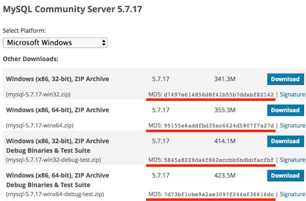

# 加密与安全

在计算机系统中，什么是加密与安全呢？

我们举个栗子：假设Bob要给Alice发一封邮件，在邮件传送的过程中，黑客可能会窃取到邮件的内容，所以需要防窃听。黑客还可能会篡改邮件的内容，Alice必须有能力识别出邮件有没有被篡改。最后，黑客可能假冒Bob给Alice发邮件，Alice必须有能力识别出伪造的邮件。

所以，应对潜在的安全威胁，需要做到三防：

- 防窃听
- 防篡改
- 防伪造


计算机加密技术就是为了实现上述目标，而现代计算机密码学理论是建立在严格的数学理论基础上的，密码学已经逐渐发展成一门科学。对于绝大多数开发者来说，设计一个安全的加密算法非常困难，验证一个加密算法是否安全更加困难，当前被认为安全的加密算法仅仅是迄今为止尚未被攻破。因此，要编写安全的计算机程序，我们要做到：

- 不要自己设计山寨的加密算法；
- 不要自己实现已有的加密算法；
- 不要自己修改已有的加密算法。

本章我们会介绍最常用的加密算法，以及如何通过Java代码实现。

## 编码算法

要学习编码算法，我们先来看一看什么是编码。

ASCII码就是一种编码，字母`A`的编码是十六进制的`0x41`，字母`B`是`0x42`，以此类推：

| **字母** | **ASCII编码** |
| --- | --- |
| A | 0x41 |
| B | 0x42 |
| C | 0x43 |
| D | 0x44 |
| … | … |

因为ASCII编码最多只能有127个字符，要想对更多的文字进行编码，就需要用Unicode。而中文的中使用Unicode编码就是`0x4e2d`，使用UTF-8则需要3个字节编码：

| **汉字** | **Unicode编码** | **UTF-8编码** |
| --- | --- | --- |
| 中 | 0x4e2d | 0xe4b8ad |
| 文 | 0x6587 | 0xe69687 |
| 编 | 0x7f16 | 0xe7bc96 |
| 码 | 0x7801 | 0xe7a081 |
| … | … | … |

因此，最简单的编码是直接给每个字符指定一个若干字节表示的整数，复杂一点的编码就需要根据一个已有的编码推算出来。

比如UTF-8编码，它是一种不定长编码，但可以从给定字符的Unicode编码推算出来。

### URL编码

URL编码是浏览器发送数据给服务器时使用的编码，它通常附加在URL的参数部分，例如：

[https://www.baidu.com/s?wd=%E4%B8%AD%E6%96%87](https://www.baidu.com/s?wd=%E4%B8%AD%E6%96%87)

之所以需要URL编码，是因为出于兼容性考虑，很多服务器只识别ASCII字符。但如果URL中包含中文、日文这些非ASCII字符怎么办？不要紧，URL编码有一套规则：

- 如果字符是`A`~`Z`，`a`~`z`，`0`~`9`以及`-`、`_`、`.`、`*`，则保持不变；
- 如果是其他字符，先转换为UTF-8编码，然后对每个字节以`%XX`表示。

例如：字符`中`的UTF-8编码是`0xe4b8ad`，因此，它的URL编码是`%E4%B8%AD`。URL编码总是大写。

Java标准库提供了一个`URLEncoder`类来对任意字符串进行URL编码：
```java
import java.net.URLEncoder;
import java.nio.charset.StandardCharsets;
public class Main {
    public static void main(String[] args) {
        String encoded = URLEncoder.encode("中文!", StandardCharsets.UTF_8);
        System.out.println(encoded);
    }
}
```
上述代码的运行结果是`%E4%B8%AD%E6%96%87%21`，中的URL编码是`%E4%B8%AD`，文的URL编码是`%E6%96%87`，`!`虽然是ASCII字符，也要对其编码为`%21`。

和标准的URL编码稍有不同，URLEncoder把空格字符编码成`+`，而现在的URL编码标准要求空格被编码为`%20`，不过，服务器都可以处理这两种情况。

如果服务器收到URL编码的字符串，就可以对其进行解码，还原成原始字符串。Java标准库的`URLDecoder`就可以解码：
```java
import java.net.URLDecoder;
import java.nio.charset.StandardCharsets;
public class Main {
    public static void main(String[] args) {
        String decoded = URLDecoder.decode("%E4%B8%AD%E6%96%87%21", StandardCharsets.UTF_8);
        System.out.println(decoded);
    }
}
```
要特别注意：URL编码是编码算法，不是加密算法。URL编码的目的是把任意文本数据编码为`%`前缀表示的文本，编码后的文本仅包含`A`~`Z`，`a`~`z`，`0`~`9`，`-`，`_`，`.`，`*`和`%`，便于浏览器和服务器处理。

### Base64编码

URL编码是对字符进行编码，表示成`%xx`的形式，而Base64编码是对二进制数据进行编码，表示成文本格式。

Base64编码可以把任意长度的二进制数据变为纯文本，且只包含`A`~`Z`、`a`~`z`、`0`~`9`、`+`、`/`、`=`这些字符。它的原理是把3字节的二进制数据按6bit一组，用4个int整数表示，然后查表，把int整数用索引对应到字符，得到编码后的字符串。

举个例子：3个byte数据分别是`e4`、`b8`、`ad`，按6bit分组得到`39`、`0b`、`22`和`2d`：
```java

┌───────────────┬───────────────┬───────────────┐
│      e4       │      b8       │      ad       │
└───────────────┴───────────────┴───────────────┘
┌─┬─┬─┬─┬─┬─┬─┬─┬─┬─┬─┬─┬─┬─┬─┬─┬─┬─┬─┬─┬─┬─┬─┬─┐
│1│1│1│0│0│1│0│0│1│0│1│1│1│0│0│0│1│0│1│0│1│1│0│1│
└─┴─┴─┴─┴─┴─┴─┴─┴─┴─┴─┴─┴─┴─┴─┴─┴─┴─┴─┴─┴─┴─┴─┴─┘
┌───────────┬───────────┬───────────┬───────────┐
│    39     │    0b     │    22     │    2d     │
└───────────┴───────────┴───────────┴───────────┘
```
因为6位整数的范围总是`0`~`63`，所以，能用64个字符表示：字符`A`~`Z`对应索引`0`~`25`，字符`a`~`z`对应索引`26`~`51`，字符`0`~`9`对应索引`52`~`61`，最后两个索引`62`、`63`分别用字符`+`和`/`表示。

在Java中，二进制数据就是`byte[]`数组。Java标准库提供了`Base64`来对`byte[]`数组进行编解码：
```java
import java.util.*;
public class Main {
    public static void main(String[] args) {
        byte[] input = new byte[] { (byte) 0xe4, (byte) 0xb8, (byte) 0xad };
        String b64encoded = Base64.getEncoder().encodeToString(input);
        System.out.println(b64encoded);
    }
}
```
编码后得到`5Lit`4个字符。要对`Base64`解码，仍然用`Base64`这个类：
```java
import java.util.*;
public class Main {
    public static void main(String[] args) {
        byte[] output = Base64.getDecoder().decode("5Lit");
        System.out.println(Arrays.toString(output)); // [-28, -72, -83]
    }
}
```
有的童鞋会问：如果输入的`byte[]`数组长度不是3的整数倍肿么办？这种情况下，需要对输入的末尾补一个或两个`0x00`，编码后，在结尾加一个=表示补充了1个`0x00`，加两个=表示补充了2个`0x00`，解码的时候，去掉末尾补充的一个或两个`0x00`即可。

实际上，因为编码后的长度加上=总是4的倍数，所以即使不加=也可以计算出原始输入的`byte[]`。Base64编码的时候可以用`withoutPadding()`去掉`=`，解码出来的结果是一样的：
```java
import java.util.*;
public class Main {
    public static void main(String[] args) {
        byte[] input = new byte[] { (byte) 0xe4, (byte) 0xb8, (byte) 0xad, 0x21 };
        String b64encoded = Base64.getEncoder().encodeToString(input);
        String b64encoded2 = Base64.getEncoder().withoutPadding().encodeToString(input);
        System.out.println(b64encoded);
        System.out.println(b64encoded2);
        byte[] output = Base64.getDecoder().decode(b64encoded2);
        System.out.println(Arrays.toString(output));
    }
}
```
因为标准的Base64编码会出现`+`、`/`和`=`，所以不适合把Base64编码后的字符串放到URL中。一种针对URL的Base64编码可以在URL中使用的Base64编码，它仅仅是把`+`变成`-`，`/`变成`_`：
```java
import java.util.*;
public class Main {
    public static void main(String[] args) {
        byte[] input = new byte[] { 0x01, 0x02, 0x7f, 0x00 };
        String b64encoded = Base64.getUrlEncoder().encodeToString(input);
        System.out.println(b64encoded);
        byte[] output = Base64.getUrlDecoder().decode(b64encoded);
        System.out.println(Arrays.toString(output));
    }
}
```
Base64编码的目的是把二进制数据变成文本格式，这样在很多文本中就可以处理二进制数据。例如，电子邮件协议就是文本协议，如果要在电子邮件中添加一个二进制文件，就可以用Base64编码，然后以文本的形式传送。

Base64编码的缺点是传输效率会降低，因为它把原始数据的长度增加了1/3。

和URL编码一样，Base64编码是一种编码算法，不是加密算法。

如果把Base64的64个字符编码表换成32个、48个或者58个，就可以使用Base32编码，Base48编码和Base58编码。字符越少，编码的效率就会越低。

### 小结

URL编码和Base64编码都是编码算法，它们不是加密算法；

URL编码的目的是把任意文本数据编码为%前缀表示的文本，便于浏览器和服务器处理；

Base64编码的目的是把任意二进制数据编码为文本，但编码后数据量会增加1/3。

## 哈希算法

哈希算法（Hash）又称摘要算法（Digest），它的作用是：对任意一组输入数据进行计算，得到一个固定长度的输出摘要。

哈希算法最重要的特点就是：

- 相同的输入一定得到相同的输出；
- 不同的输入大概率得到不同的输出。

哈希算法的目的就是为了验证原始数据是否被篡改。

Java字符串的`hashCode()`就是一个哈希算法，它的输入是任意字符串，输出是固定的4字节`int`整数：
```java
"hello".hashCode(); // 0x5e918d2
"hello, java".hashCode(); // 0x7a9d88e8
"hello, bob".hashCode(); // 0xa0dbae2f
```
两个相同的字符串永远会计算出相同的`hashCode`，否则基于`hashCode`定位的`HashMap`就无法正常工作。这也是为什么当我们自定义一个class时，覆写`equals()`方法时我们必须正确覆写`hashCode()`方法。

### 哈希碰撞

哈希碰撞是指，两个不同的输入得到了相同的输出：
```java
"AaAaAa".hashCode(); // 0x7460e8c0
"BBAaBB".hashCode(); // 0x7460e8c0
```
有童鞋会问：碰撞能不能避免？答案是不能。碰撞是一定会出现的，因为输出的字节长度是固定的，`String`的`hashCode()`输出是4字节整数，最多只有4294967296种输出，但输入的数据长度是不固定的，有无数种输入。所以，哈希算法是把一个无限的输入集合映射到一个有限的输出集合，必然会产生碰撞。

碰撞不可怕，我们担心的不是碰撞，而是碰撞的概率，因为碰撞概率的高低关系到哈希算法的安全性。一个安全的哈希算法必须满足：

- 碰撞概率低；
- 不能猜测输出。

不能猜测输出是指，输入的任意一个bit的变化会造成输出完全不同，这样就很难从输出反推输入（只能依靠暴力穷举）。假设一种哈希算法有如下规律：
```java
hashA("java001") = "123456"
hashA("java002") = "123457"
hashA("java003") = "123458"
```
那么很容易从输出`123459`反推输入，这种哈希算法就不安全。安全的哈希算法从输出是看不出任何规律的：
```java
hashB("java001") = "123456"
hashB("java002") = "580271"
hashB("java003") = ???
```
常用的哈希算法有：

| 算法 | 输出长度（位） | 输出长度（字节） |
| --- | --- | --- |
| MD5 | 128 bits | 16 bytes |
| SHA-1 | 160 bits | 20 bytes |
| RipeMD-160 | 160 bits | 20 bytes |
| SHA-256 | 256 bits | 32 bytes |
| SHA-512 | 512 bits | 64 bytes |

根据碰撞概率，哈希算法的输出长度越长，就越难产生碰撞，也就越安全。

Java标准库提供了常用的哈希算法，并且有一套统一的接口。我们以MD5算法为例，看看如何对输入计算哈希：
```java
import java.math.BigInteger;
import java.security.MessageDigest;
public class Main {
    public static void main(String[] args) throws Exception {
        // 创建一个MessageDigest实例:
        MessageDigest md = MessageDigest.getInstance("MD5");
        // 反复调用update输入数据:
        md.update("Hello".getBytes("UTF-8"));
        md.update("World".getBytes("UTF-8"));
        byte[] result = md.digest(); // 16 bytes: 68e109f0f40ca72a15e05cc22786f8e6
        System.out.println(new BigInteger(1, result).toString(16));
    }
}
```
使用`MessageDigest`时，我们首先根据哈希算法获取一个`MessageDigest`实例，然后，反复调用`update(byte[])`输入数据。当输入结束后，调用`digest()`方法获得byte[]数组表示的摘要，最后，把它转换为十六进制的字符串。

运行上述代码，可以得到输入`HelloWorld`的MD5是`68e109f0f40ca72a15e05cc22786f8e6`。

### 哈希算法的用途

因为相同的输入永远会得到相同的输出，因此，如果输入被修改了，得到的输出就会不同。

我们在网站上下载软件的时候，经常看到下载页显示的哈希：



如何判断下载到本地的软件是原始的、未经篡改的文件？我们只需要自己计算一下本地文件的哈希值，再与官网公开的哈希值对比，如果相同，说明文件下载正确，否则，说明文件已被篡改。

哈希算法的另一个重要用途是存储用户口令。如果直接将用户的原始口令存放到数据库中，会产生极大的安全风险：

- 数据库管理员能够看到用户明文口令；
- 数据库数据一旦泄漏，黑客即可获取用户明文口令。

不存储用户的原始口令，那么如何对用户进行认证？

方法是存储用户口令的哈希，例如，MD5。

在用户输入原始口令后，系统计算用户输入的原始口令的MD5并与数据库存储的MD5对比，如果一致，说明口令正确，否则，口令错误。

因此，数据库存储用户名和口令的表内容应该像下面这样：

| **username** | **password** |
| --- | --- |
| bob | f30aa7a662c728b7407c54ae6bfd27d1 |
| alice | 25d55ad283aa400af464c76d713c07ad |
| tim | bed128365216c019988915ed3add75fb |

这样一来，数据库管理员看不到用户的原始口令。即使数据库泄漏，黑客也无法拿到用户的原始口令。想要拿到用户的原始口令，必须用暴力穷举的方法，一个口令一个口令地试，直到某个口令计算的MD5恰好等于指定值。

使用哈希口令时，还要注意防止彩虹表攻击。

什么是彩虹表呢？上面讲到了，如果只拿到MD5，从MD5反推明文口令，只能使用暴力穷举的方法。

然而黑客并不笨，暴力穷举会消耗大量的算力和时间。但是，如果有一个预先计算好的常用口令和它们的MD5的对照表：

| **常用口令** | **MD5** |
| --- | --- |
| hello123 | f30aa7a662c728b7407c54ae6bfd27d1 |
| 12345678 | 25d55ad283aa400af464c76d713c07ad |
| passw0rd | bed128365216c019988915ed3add75fb |
| 19700101 | 570da6d5277a646f6552b8832012f5dc |
| … | … |
| 20201231 | 6879c0ae9117b50074ce0a0d4c843060 |

这个表就是彩虹表。如果用户使用了常用口令，黑客从MD5一下就能反查到原始口令：

bob的MD5：`f30aa7a662c728b7407c54ae6bfd27d1`，原始口令：`hello123`；

alice的MD5：`25d55ad283aa400af464c76d713c07ad`，原始口令：`12345678`；

tim的MD5：`bed128365216c019988915ed3add75fb`，原始口令：`passw0rd`。

这就是为什么不要使用常用密码，以及不要使用生日作为密码的原因。

即使用户使用了常用口令，我们也可以采取措施来抵御彩虹表攻击，方法是对每个口令额外添加随机数，这个方法称之为加盐（salt）：
```java
digest = md5(salt+inputPassword)
```
经过加盐处理的数据库表，内容如下：

| **username** | **salt** | **password** |
| --- | --- | --- |
| bob | H1r0a | a5022319ff4c56955e22a74abcc2c210 |
| alice | 7$p2w | e5de688c99e961ed6e560b972dab8b6a |
| tim | z5Sk9 | 1eee304b92dc0d105904e7ab58fd2f64 |

加盐的目的在于使黑客的彩虹表失效，即使用户使用常用口令，也无法从MD5反推原始口令。

### SHA-1
SHA-1也是一种哈希算法，它的输出是160 bits，即20字节。SHA-1是由美国国家安全局开发的，SHA算法实际上是一个系列，包括SHA-0（已废弃）、SHA-1、SHA-256、SHA-512等。

在Java中使用SHA-1，和MD5完全一样，只需要把算法名称改为`"SHA-1"`：
```java
import java.math.BigInteger;
import java.security.MessageDigest;
public class Main {
    public static void main(String[] args) throws Exception {
        // 创建一个MessageDigest实例:
        MessageDigest md = MessageDigest.getInstance("SHA-1");
        // 反复调用update输入数据:
        md.update("Hello".getBytes("UTF-8"));
        md.update("World".getBytes("UTF-8"));
        byte[] result = md.digest(); // 20 bytes: db8ac1c259eb89d4a131b253bacfca5f319d54f2
        System.out.println(new BigInteger(1, result).toString(16));
    }
}
```
类似的，计算SHA-256，我们需要传入名称`"SHA-256"`，计算SHA-512，我们需要传入名称`"SHA-512"`。Java标准库支持的所有哈希算法可以在[这里](https://docs.oracle.com/en/java/javase/14/docs/specs/security/standard-names.html#messagedigest-algorithms)查到。

> 注意：MD5因为输出长度较短，短时间内破解是可能的，目前已经不推荐使用。

### 小结

哈希算法可用于验证数据完整性，具有防篡改检测的功能；

常用的哈希算法有MD5、SHA-1等；

用哈希存储口令时要考虑彩虹表攻击。

## BouncyCastle

我们知道，Java标准库提供了一系列常用的哈希算法。

但如果我们要用的某种算法，Java标准库没有提供怎么办？

方法一：自己写一个，难度很大；

方法二：找一个现成的第三方库，直接使用。

[BouncyCastle](https://www.bouncycastle.org/)就是一个提供了很多哈希算法和加密算法的第三方库。它提供了Java标准库没有的一些算法，例如，RipeMD160哈希算法。

我们来看一下如何使用BouncyCastle这个第三方提供的算法。

首先，我们必须把BouncyCastle提供的jar包放到classpath中。这个jar包就是`bcprov-jdk18on-xxx.jar`，可以从[官方网站](https://www.bouncycastle.org/latest_releases.html)下载。

Java标准库的`java.security`包提供了一种标准机制，允许第三方提供商无缝接入。我们要使用BouncyCastle提供的RipeMD160算法，需要先把BouncyCastle注册一下：
```java
public class Main {
    public static void main(String[] args) throws Exception {
        // 注册BouncyCastle:
        Security.addProvider(new BouncyCastleProvider());
        // 按名称正常调用:
        MessageDigest md = MessageDigest.getInstance("RipeMD160");
        md.update("HelloWorld".getBytes("UTF-8"));
        byte[] result = md.digest();
        System.out.println(new BigInteger(1, result).toString(16));
    }
}
```
其中，注册BouncyCastle是通过下面的语句实现的：
```java
Security.addProvider(new BouncyCastleProvider());
```
注册只需要在启动时进行一次，后续就可以使用BouncyCastle提供的所有哈希算法和加密算法。

### 小结

BouncyCastle是一个开源的第三方算法提供商；

BouncyCastle提供了很多Java标准库没有提供的哈希算法和加密算法；

使用第三方算法前需要通过`Security.addProvider()`注册。

## Hmac算法

在前面讲到哈希算法时，我们说，存储用户的哈希口令时，要加盐存储，目的就在于抵御彩虹表攻击。

我们回顾一下哈希算法：
```java
digest = hash(input)
```
正是因为相同的输入会产生相同的输出，我们加盐的目的就在于，使得输入有所变化：
```java
digest = hash(salt + input)
```
这个salt可以看作是一个额外的“认证码”，同样的输入，不同的认证码，会产生不同的输出。因此，要验证输出的哈希，必须同时提供“认证码”。

Hmac算法就是一种基于密钥的消息认证码算法，它的全称是Hash-based Message Authentication Code，是一种更安全的消息摘要算法。

Hmac算法总是和某种哈希算法配合起来用的。例如，我们使用MD5算法，对应的就是HmacMD5算法，它相当于“加盐”的MD5：
```java
HmacMD5 ≈ md5(secure_random_key, input)
```
因此，HmacMD5可以看作带有一个安全的key的MD5。使用HmacMD5而不是用MD5加salt，有如下好处：

- HmacMD5使用的key长度是64字节，更安全；
- Hmac是标准算法，同样适用于SHA-1等其他哈希算法；
- Hmac输出和原有的哈希算法长度一致。

可见，Hmac本质上就是把key混入摘要的算法。验证此哈希时，除了原始的输入数据，还要提供key。

为了保证安全，我们不会自己指定key，而是通过Java标准库的KeyGenerator生成一个安全的随机的key。下面是使用HmacMD5的代码：
```java
import java.math.BigInteger;
import javax.crypto.*;
public class Main {
    public static void main(String[] args) throws Exception {
        KeyGenerator keyGen = KeyGenerator.getInstance("HmacMD5");
        SecretKey key = keyGen.generateKey();
        // 打印随机生成的key:
        byte[] skey = key.getEncoded();
        System.out.println(new BigInteger(1, skey).toString(16));
        Mac mac = Mac.getInstance("HmacMD5");
        mac.init(key);
        mac.update("HelloWorld".getBytes("UTF-8"));
        byte[] result = mac.doFinal();
        System.out.println(new BigInteger(1, result).toString(16));
    }
}
```
和MD5相比，使用HmacMD5的步骤是：

1. 通过名称`HmacMD5`获取`KeyGenerator`实例；
2. 通过`KeyGenerator`创建一个`SecretKey`实例；
3. 通过名称`HmacMD5`获取`Mac`实例；
4. 用`SecretKey`初始化`Mac`实例；
5. 对`Mac`实例反复调用`update(byte[])`输入数据；
6. 调用`Mac`实例的`doFinal()`获取最终的哈希值。

我们可以用Hmac算法取代原有的自定义的加盐算法，因此，存储用户名和口令的数据库结构如下：

| **username** | **secret_key (64 bytes)** | **password** |
| --- | --- | --- |
| bob | a8c06e05f92e...5e16 | 7e0387872a57c85ef6dddbaa12f376de |
| alice | e6a343693985...f4be | c1f929ac2552642b302e739bc0cdbaac |
| tim | f27a973dfdc0...6003 | af57651c3a8a73303515804d4af43790 |

有了Hmac计算的哈希和`SecretKey`，我们想要验证怎么办？这时，`SecretKey`不能从`KeyGenerator`生成，而是从一个`byte[]`数组恢复：
```java
import java.util.Arrays;
import javax.crypto.*;
import javax.crypto.spec.*;
public class Main {
    public static void main(String[] args) throws Exception {
        byte[] hkey = new byte[] { 106, 70, -110, 125, 39, -20, 52, 56, 85, 9, -19, -72, 52, -53, 52, -45, -6, 119, -63,
                30, 20, -83, -28, 77, 98, 109, -32, -76, 121, -106, 0, -74, -107, -114, -45, 104, -104, -8, 2, 121, 6,
                97, -18, -13, -63, -30, -125, -103, -80, -46, 113, -14, 68, 32, -46, 101, -116, -104, -81, -108, 122,
                89, -106, -109 };

        SecretKey key = new SecretKeySpec(hkey, "HmacMD5");
        Mac mac = Mac.getInstance("HmacMD5");
        mac.init(key);
        mac.update("HelloWorld".getBytes("UTF-8"));
        byte[] result = mac.doFinal();
        System.out.println(Arrays.toString(result));
        // [126, 59, 37, 63, 73, 90, 111, -96, -77, 15, 82, -74, 122, -55, -67, 54]
    }
}
```
恢复`SecretKey`的语句就是`new SecretKeySpec(hkey, "HmacMD5")`。

### 小结

Hmac算法是一种标准的基于密钥的哈希算法，可以配合MD5、SHA-1等哈希算法，计算的摘要长度和原摘要算法长度相同。

## 对称加密算法

对称加密算法就是传统的用一个密码进行加密和解密。例如，我们常用的WinZIP和WinRAR对压缩包的加密和解密，就是使用对称加密算法：


从程序的角度看，所谓加密，就是这样一个函数，它接收密码和明文，然后输出密文：
```java
secret = encrypt(key, message);
```
而解密则相反，它接收密码和密文，然后输出明文：
```java
plain = decrypt(key, secret);
```
在软件开发中，常用的对称加密算法有：

| **算法** | **密钥长度** | **工作模式** | **填充模式** |
| --- | --- | --- | --- |
| DES | 56/64 | ECB/CBC/PCBC/CTR/... | NoPadding/PKCS5Padding/... |
| AES | 128/192/256 | ECB/CBC/PCBC/CTR/... | NoPadding/PKCS5Padding/PKCS7Padding/... |
| IDEA | 128 | ECB | PKCS5Padding/PKCS7Padding/... |

密钥长度直接决定加密强度，而工作模式和填充模式可以看成是对称加密算法的参数和格式选择。Java标准库提供的算法实现并不包括所有的工作模式和所有填充模式，但是通常我们只需要挑选常用的使用就可以了。

最后注意，DES算法由于密钥过短，可以在短时间内被暴力破解，所以现在已经不安全了。

### 使用AES加密

AES算法是目前应用最广泛的加密算法。我们先用ECB模式加密并解密：
```java
import java.security.*;
import java.util.Base64;

import javax.crypto.*;
import javax.crypto.spec.*;

public class Main {
    public static void main(String[] args) throws Exception {
        // 原文:
        String message = "Hello, world!";
        System.out.println("Message: " + message);
        // 128位密钥 = 16 bytes Key:
        byte[] key = "1234567890abcdef".getBytes("UTF-8");
        // 加密:
        byte[] data = message.getBytes("UTF-8");
        byte[] encrypted = encrypt(key, data);
        System.out.println("Encrypted: " + Base64.getEncoder().encodeToString(encrypted));
        // 解密:
        byte[] decrypted = decrypt(key, encrypted);
        System.out.println("Decrypted: " + new String(decrypted, "UTF-8"));
    }

    // 加密:
    public static byte[] encrypt(byte[] key, byte[] input) throws GeneralSecurityException {
        Cipher cipher = Cipher.getInstance("AES/ECB/PKCS5Padding");
        SecretKey keySpec = new SecretKeySpec(key, "AES");
        cipher.init(Cipher.ENCRYPT_MODE, keySpec);
        return cipher.doFinal(input);
    }

    // 解密:
    public static byte[] decrypt(byte[] key, byte[] input) throws GeneralSecurityException {
        Cipher cipher = Cipher.getInstance("AES/ECB/PKCS5Padding");
        SecretKey keySpec = new SecretKeySpec(key, "AES");
        cipher.init(Cipher.DECRYPT_MODE, keySpec);
        return cipher.doFinal(input);
    }
}
```
Java标准库提供的对称加密接口非常简单，使用时按以下步骤编写代码：

1. 根据算法名称/工作模式/填充模式获取Cipher实例；
2. 根据算法名称初始化一个SecretKey实例，密钥必须是指定长度；
3. 使用SerectKey初始化Cipher实例，并设置加密或解密模式；
4. 传入明文或密文，获得密文或明文。

ECB模式是最简单的AES加密模式，它只需要一个固定长度的密钥，固定的明文会生成固定的密文，这种一对一的加密方式会导致安全性降低，更好的方式是通过CBC模式，它需要一个随机数作为IV参数，这样对于同一份明文，每次生成的密文都不同：
```java
import java.security.*;
import java.util.Base64;
import javax.crypto.*;
import javax.crypto.spec.*;
public class Main {
    public static void main(String[] args) throws Exception {
        // 原文:
        String message = "Hello, world!";
        System.out.println("Message: " + message);
        // 256位密钥 = 32 bytes Key:
        byte[] key = "1234567890abcdef1234567890abcdef".getBytes("UTF-8");
        // 加密:
        byte[] data = message.getBytes("UTF-8");
        byte[] encrypted = encrypt(key, data);
        System.out.println("Encrypted: " + Base64.getEncoder().encodeToString(encrypted));
        // 解密:
        byte[] decrypted = decrypt(key, encrypted);
        System.out.println("Decrypted: " + new String(decrypted, "UTF-8"));
    }

    // 加密:
    public static byte[] encrypt(byte[] key, byte[] input) throws GeneralSecurityException {
        Cipher cipher = Cipher.getInstance("AES/CBC/PKCS5Padding");
        SecretKeySpec keySpec = new SecretKeySpec(key, "AES");
        // CBC模式需要生成一个16 bytes的initialization vector:
        SecureRandom sr = SecureRandom.getInstanceStrong();
        byte[] iv = sr.generateSeed(16);
        IvParameterSpec ivps = new IvParameterSpec(iv);
        cipher.init(Cipher.ENCRYPT_MODE, keySpec, ivps);
        byte[] data = cipher.doFinal(input);
        // IV不需要保密，把IV和密文一起返回:
        return join(iv, data);
    }

    // 解密:
    public static byte[] decrypt(byte[] key, byte[] input) throws GeneralSecurityException {
        // 把input分割成IV和密文:
        byte[] iv = new byte[16];
        byte[] data = new byte[input.length - 16];
        System.arraycopy(input, 0, iv, 0, 16);
        System.arraycopy(input, 16, data, 0, data.length);
        // 解密:
        Cipher cipher = Cipher.getInstance("AES/CBC/PKCS5Padding");
        SecretKeySpec keySpec = new SecretKeySpec(key, "AES");
        IvParameterSpec ivps = new IvParameterSpec(iv);
        cipher.init(Cipher.DECRYPT_MODE, keySpec, ivps);
        return cipher.doFinal(data);
    }

    public static byte[] join(byte[] bs1, byte[] bs2) {
        byte[] r = new byte[bs1.length + bs2.length];
        System.arraycopy(bs1, 0, r, 0, bs1.length);
        System.arraycopy(bs2, 0, r, bs1.length, bs2.length);
        return r;
    }
}
```
在CBC模式下，需要一个随机生成的16字节IV参数，必须使用`SecureRandom`生成。因为多了一个`IvParameterSpec`实例，因此，初始化方法需要调用`Cipher`的一个重载方法并传入`IvParameterSpec`。

观察输出，可以发现每次生成的IV不同，密文也不同。

### 小结

对称加密算法使用同一个密钥进行加密和解密，常用算法有DES、AES和IDEA等；

密钥长度由算法设计决定，AES的密钥长度是128/192/256位；

使用对称加密算法需要指定算法名称、工作模式和填充模式。

## 口令加密算法

上一节我们讲的AES加密，细心的童鞋可能会发现，密钥长度是固定的128/192/256位，而不是我们用WinZip/WinRAR那样，随便输入几位都可以。

这是因为对称加密算法决定了口令必须是固定长度，然后对明文进行分块加密。又因为安全需求，口令长度往往都是128位以上，即至少16个字符。

但是我们平时使用的加密软件，输入6位、8位都可以，难道加密方式不一样？

实际上用户输入的口令并不能直接作为AES的密钥进行加密（除非长度恰好是128/192/256位），并且用户输入的口令一般都有规律，安全性远远不如安全随机数产生的随机口令。因此，用户输入的口令，通常还需要使用PBE算法，采用随机数杂凑计算出真正的密钥，再进行加密。

PBE就是Password Based Encryption的缩写，它的作用如下：
```java
key = generate(userPassword, secureRandomPassword);
```
PBE的作用就是把用户输入的口令和一个安全随机的口令采用杂凑后计算出真正的密钥。以AES密钥为例，我们让用户输入一个口令，然后生成一个随机数，通过PBE算法计算出真正的AES口令，再进行加密，代码如下：
```java
public class Main {
    public static void main(String[] args) throws Exception {
        // 把BouncyCastle作为Provider添加到java.security:
        Security.addProvider(new BouncyCastleProvider());
        // 原文:
        String message = "Hello, world!";
        // 加密口令:
        String password = "hello12345";
        // 16 bytes随机Salt:
        byte[] salt = SecureRandom.getInstanceStrong().generateSeed(16);
        System.out.printf("salt: %032x\n", new BigInteger(1, salt));
        // 加密:
        byte[] data = message.getBytes("UTF-8");
        byte[] encrypted = encrypt(password, salt, data);
        System.out.println("encrypted: " + Base64.getEncoder().encodeToString(encrypted));
        // 解密:
        byte[] decrypted = decrypt(password, salt, encrypted);
        System.out.println("decrypted: " + new String(decrypted, "UTF-8"));
    }

    // 加密:
    public static byte[] encrypt(String password, byte[] salt, byte[] input) throws GeneralSecurityException {
        PBEKeySpec keySpec = new PBEKeySpec(password.toCharArray());
        SecretKeyFactory skeyFactory = SecretKeyFactory.getInstance("PBEwithSHA1and128bitAES-CBC-BC");
        SecretKey skey = skeyFactory.generateSecret(keySpec);
        PBEParameterSpec pbeps = new PBEParameterSpec(salt, 1000);
        Cipher cipher = Cipher.getInstance("PBEwithSHA1and128bitAES-CBC-BC");
        cipher.init(Cipher.ENCRYPT_MODE, skey, pbeps);
        return cipher.doFinal(input);
    }

    // 解密:
    public static byte[] decrypt(String password, byte[] salt, byte[] input) throws GeneralSecurityException {
        PBEKeySpec keySpec = new PBEKeySpec(password.toCharArray());
        SecretKeyFactory skeyFactory = SecretKeyFactory.getInstance("PBEwithSHA1and128bitAES-CBC-BC");
        SecretKey skey = skeyFactory.generateSecret(keySpec);
        PBEParameterSpec pbeps = new PBEParameterSpec(salt, 1000);
        Cipher cipher = Cipher.getInstance("PBEwithSHA1and128bitAES-CBC-BC");
        cipher.init(Cipher.DECRYPT_MODE, skey, pbeps);
        return cipher.doFinal(input);
    }
}
```
使用PBE时，我们还需要引入BouncyCastle，并指定算法是`PBEwithSHA1and128bitAES-CBC-BC`。观察代码，实际上真正的AES密钥是调用`Cipher`的`init()`方法时同时传入`SecretKey`和`PBEParameterSpec`实现的。在创建`PBEParameterSpec`的时候，我们还指定了循环次数`1000`，循环次数越多，暴力破解需要的计算量就越大。

如果我们把salt和循环次数固定，就得到了一个通用的“口令”加密软件。如果我们把随机生成的salt存储在U盘，就得到了一个“口令”加USB Key的加密软件，它的好处在于，即使用户使用了一个非常弱的口令，没有USB Key仍然无法解密，因为USB Key存储的随机数密钥安全性非常高。

### 小结

PBE算法通过用户口令和安全的随机salt计算出Key，然后再进行加密；

Key通过口令和安全的随机salt计算得出，大大提高了安全性；

PBE算法内部使用的仍然是标准对称加密算法（例如AES）。

## 密钥交换算法

对称加密算法解决了数据加密的问题。我们以AES加密为例，在现实世界中，小明要向路人甲发送一个加密文件，他可以先生成一个AES密钥，对文件进行加密，然后把加密文件发送给对方。因为对方要解密，就必须需要小明生成的密钥。

现在问题来了：如何传递密钥？

在不安全的信道上传递加密文件是没有问题的，因为黑客拿到加密文件没有用。但是，如何如何在不安全的信道上安全地传输密钥？

要解决这个问题，密钥交换算法即DH算法：Diffie-Hellman算法应运而生。

DH算法解决了密钥在双方不直接传递密钥的情况下完成密钥交换，这个神奇的交换原理完全由数学理论支持。

我们来看DH算法交换密钥的步骤。假设甲乙双方需要传递密钥，他们之间可以这么做：

1. 甲首选选择一个素数`p`，例如509，底数`g`，任选，例如5，随机数`a`，例如123，然后计算`A=g^a mod p`，结果是215，然后，甲发送`p＝509`，`g=5`，`A=215`给乙；
2. 乙方收到后，也选择一个随机数`b`，例如，456，然后计算`B=g^b mod p`，结果是181，乙再同时计算`s=A^b mod p`，结果是121；
3. 乙把计算的`B=181`发给甲，甲计算`s＝B^a mod p`的余数，计算结果与乙算出的结果一样，都是121。

所以最终双方协商出的密钥`s`是121。注意到这个密钥`s`并没有在网络上传输。而通过网络传输的`p`，`g`，`A`和`B`是无法推算出s的，因为实际算法选择的素数是非常大的。

所以，更确切地说，DH算法是一个密钥协商算法，双方最终协商出一个共同的密钥，而这个密钥不会通过网络传输。

如果我们把`a`看成甲的私钥，`A`看成甲的公钥，`b`看成乙的私钥，`B`看成乙的公钥，DH算法的本质就是双方各自生成自己的私钥和公钥，私钥仅对自己可见，然后交换公钥，并根据自己的私钥和对方的公钥，生成最终的密钥`secretKey`，DH算法通过数学定律保证了双方各自计算出的`secretKey`是相同的。

使用Java实现DH算法的代码如下：
```java
import java.math.BigInteger;
import java.security.*;
import java.security.spec.*;

import javax.crypto.KeyAgreement;
public class Main {
    public static void main(String[] args) {
        // Bob和Alice:
        Person bob = new Person("Bob");
        Person alice = new Person("Alice");

        // 各自生成KeyPair:
        bob.generateKeyPair();
        alice.generateKeyPair();

        // 双方交换各自的PublicKey:
        // Bob根据Alice的PublicKey生成自己的本地密钥:
        bob.generateSecretKey(alice.publicKey.getEncoded());
        // Alice根据Bob的PublicKey生成自己的本地密钥:
        alice.generateSecretKey(bob.publicKey.getEncoded());

        // 检查双方的本地密钥是否相同:
        bob.printKeys();
        alice.printKeys();
        // 双方的SecretKey相同，后续通信将使用SecretKey作为密钥进行AES加解密...
    }
}

class Person {
    public final String name;

    public PublicKey publicKey;
    private PrivateKey privateKey;
    private byte[] secretKey;

    public Person(String name) {
        this.name = name;
    }

    // 生成本地KeyPair:
    public void generateKeyPair() {
        try {
            KeyPairGenerator kpGen = KeyPairGenerator.getInstance("DH");
            kpGen.initialize(512);
            KeyPair kp = kpGen.generateKeyPair();
            this.privateKey = kp.getPrivate();
            this.publicKey = kp.getPublic();
        } catch (GeneralSecurityException e) {
            throw new RuntimeException(e);
        }
    }

    public void generateSecretKey(byte[] receivedPubKeyBytes) {
        try {
            // 从byte[]恢复PublicKey:
            X509EncodedKeySpec keySpec = new X509EncodedKeySpec(receivedPubKeyBytes);
            KeyFactory kf = KeyFactory.getInstance("DH");
            PublicKey receivedPublicKey = kf.generatePublic(keySpec);
            // 生成本地密钥:
            KeyAgreement keyAgreement = KeyAgreement.getInstance("DH");
            keyAgreement.init(this.privateKey); // 自己的PrivateKey
            keyAgreement.doPhase(receivedPublicKey, true); // 对方的PublicKey
            // 生成SecretKey密钥:
            this.secretKey = keyAgreement.generateSecret();
        } catch (GeneralSecurityException e) {
            throw new RuntimeException(e);
        }
    }

    public void printKeys() {
        System.out.printf("Name: %s\n", this.name);
        System.out.printf("Private key: %x\n", new BigInteger(1, this.privateKey.getEncoded()));
        System.out.printf("Public key: %x\n", new BigInteger(1, this.publicKey.getEncoded()));
        System.out.printf("Secret key: %x\n", new BigInteger(1, this.secretKey));
    }
}
```
但是DH算法并未解决中间人攻击，即甲乙双方并不能确保与自己通信的是否真的是对方。消除中间人攻击需要其他方法。

### 小结

DH算法是一种密钥交换协议，通信双方通过不安全的信道协商密钥，然后进行对称加密传输。

DH算法没有解决中间人攻击。

## 非对称加密算法

从DH算法我们可以看到，公钥-私钥组成的密钥对是非常有用的加密方式，因为公钥是可以公开的，而私钥是完全保密的，由此奠定了非对称加密的基础。
非对称加密就是加密和解密使用的不是相同的密钥：只有同一个公钥-私钥对才能正常加解密。

因此，如果小明要加密一个文件发送给小红，他应该首先向小红索取她的公钥，然后，他用小红的公钥加密，把加密文件发送给小红，此文件只能由小红的私钥解开，因为小红的私钥在她自己手里，所以，除了小红，没有任何人能解开此文件。

非对称加密的典型算法就是RSA算法，它是由Ron Rivest，Adi Shamir，Leonard Adleman这三个哥们一起发明的，所以用他们仨的姓的首字母缩写表示。

非对称加密相比对称加密的显著优点在于，对称加密需要协商密钥，而非对称加密可以安全地公开各自的公钥，在N个人之间通信的时候：使用非对称加密只需要N个密钥对，每个人只管理自己的密钥对。而使用对称加密需要则需要`N*(N-1)/2`个密钥，因此每个人需要管理`N-1`个密钥，密钥管理难度大，而且非常容易泄漏。

既然非对称加密这么好，那我们抛弃对称加密，完全使用非对称加密行不行？也不行。因为非对称加密的缺点就是运算速度非常慢，比对称加密要慢很多。

所以，在实际应用的时候，非对称加密总是和对称加密一起使用。假设小明需要给小红需要传输加密文件，他俩首先交换了各自的公钥，然后：

1. 小明生成一个随机的AES口令，然后用小红的公钥通过RSA加密这个口令，并发给小红；
2. 小红用自己的RSA私钥解密得到AES口令；
3. 双方使用这个共享的AES口令用AES加密通信。

可见非对称加密实际上应用在第一步，即加密“AES口令”。这也是我们在浏览器中常用的HTTPS协议的做法，即浏览器和服务器先通过RSA交换AES口令，接下来双方通信实际上采用的是速度较快的AES对称加密，而不是缓慢的RSA非对称加密。

Java标准库提供了RSA算法的实现，示例代码如下：
```java
import java.math.BigInteger;
import java.security.*;
import javax.crypto.Cipher;
public class Main {
    public static void main(String[] args) throws Exception {
        // 明文:
        byte[] plain = "Hello, encrypt use RSA".getBytes("UTF-8");
        // 创建公钥／私钥对:
        Person alice = new Person("Alice");
        // 用Alice的公钥加密:
        byte[] pk = alice.getPublicKey();
        System.out.println(String.format("public key: %x", new BigInteger(1, pk)));
        byte[] encrypted = alice.encrypt(plain);
        System.out.println(String.format("encrypted: %x", new BigInteger(1, encrypted)));
        // 用Alice的私钥解密:
        byte[] sk = alice.getPrivateKey();
        System.out.println(String.format("private key: %x", new BigInteger(1, sk)));
        byte[] decrypted = alice.decrypt(encrypted);
        System.out.println(new String(decrypted, "UTF-8"));
    }
}

class Person {
    String name;
    // 私钥:
    PrivateKey sk;
    // 公钥:
    PublicKey pk;

    public Person(String name) throws GeneralSecurityException {
        this.name = name;
        // 生成公钥／私钥对:
        KeyPairGenerator kpGen = KeyPairGenerator.getInstance("RSA");
        kpGen.initialize(1024);
        KeyPair kp = kpGen.generateKeyPair();
        this.sk = kp.getPrivate();
        this.pk = kp.getPublic();
    }

    // 把私钥导出为字节
    public byte[] getPrivateKey() {
        return this.sk.getEncoded();
    }

    // 把公钥导出为字节
    public byte[] getPublicKey() {
        return this.pk.getEncoded();
    }

    // 用公钥加密:
    public byte[] encrypt(byte[] message) throws GeneralSecurityException {
        Cipher cipher = Cipher.getInstance("RSA");
        cipher.init(Cipher.ENCRYPT_MODE, this.pk);
        return cipher.doFinal(message);
    }

    // 用私钥解密:
    public byte[] decrypt(byte[] input) throws GeneralSecurityException {
        Cipher cipher = Cipher.getInstance("RSA");
        cipher.init(Cipher.DECRYPT_MODE, this.sk);
        return cipher.doFinal(input);
    }
}
```
RSA的公钥和私钥都可以通过`getEncoded()`方法获得以`byte[]`表示的二进制数据，并根据需要保存到文件中。要从`byte[]`数组恢复公钥或私钥，可以这么写：
```java
byte[] pkData = ...
byte[] skData = ...
KeyFactory kf = KeyFactory.getInstance("RSA");
// 恢复公钥:
X509EncodedKeySpec pkSpec = new X509EncodedKeySpec(pkData);
PublicKey pk = kf.generatePublic(pkSpec);
// 恢复私钥:
PKCS8EncodedKeySpec skSpec = new PKCS8EncodedKeySpec(skData);
PrivateKey sk = kf.generatePrivate(skSpec);
```
以RSA算法为例，它的密钥有256/512/1024/2048/4096等不同的长度。长度越长，密码强度越大，当然计算速度也越慢。

如果修改待加密的`byte[]`数据的大小，可以发现，使用512bit的RSA加密时，明文长度不能超过53字节，使用1024bit的RSA加密时，明文长度不能超过117字节，这也是为什么使用RSA的时候，总是配合AES一起使用，即用AES加密任意长度的明文，用RSA加密AES口令。

此外，只使用非对称加密算法不能防止中间人攻击。

### 小结

非对称加密就是加密和解密使用的不是相同的密钥，只有同一个公钥-私钥对才能正常加解密；

只使用非对称加密算法不能防止中间人攻击。

## 签名算法

我们使用非对称加密算法的时候，对于一个公钥-私钥对，通常是用公钥加密，私钥解密。

如果使用私钥加密，公钥解密是否可行呢？实际上是完全可行的。

不过我们再仔细想一想，私钥是保密的，而公钥是公开的，用私钥加密，那相当于所有人都可以用公钥解密。这个加密有什么意义？

这个加密的意义在于，如果小明用自己的私钥加密了一条消息，比如`小明喜欢小红`，然后他公开了加密消息，由于任何人都可以用小明的公钥解密，从而使得任何人都可以确认`小明喜欢小红`这条消息肯定是小明发出的，其他人不能伪造这个消息，小明也不能抵赖这条消息不是自己写的。

因此，私钥加密得到的密文实际上就是数字签名，要验证这个签名是否正确，只能用私钥持有者的公钥进行解密验证。使用数字签名的目的是为了确认某个信息确实是由某个发送方发送的，任何人都不可能伪造消息，并且，发送方也不能抵赖。

在实际应用的时候，签名实际上并不是针对原始消息，而是针对原始消息的哈希进行签名，即：
```java
signature = encrypt(privateKey, sha256(message))
```
对签名进行验证实际上就是用公钥解密：
```java
hash = decrypt(publicKey, signature)
```
然后把解密后的哈希与原始消息的哈希进行对比。

因为用户总是使用自己的私钥进行签名，所以，私钥就相当于用户身份。而公钥用来给外部验证用户身份。

常用数字签名算法有：

- MD5withRSA
- SHA1withRSA
- SHA256withRSA

它们实际上就是指定某种哈希算法进行RSA签名的方式。
```java
import java.math.BigInteger;
import java.nio.charset.StandardCharsets;
import java.security.*;
public class Main {
    public static void main(String[] args) throws GeneralSecurityException {
        // 生成RSA公钥/私钥:
        KeyPairGenerator kpGen = KeyPairGenerator.getInstance("RSA");
        kpGen.initialize(1024);
        KeyPair kp = kpGen.generateKeyPair();
        PrivateKey sk = kp.getPrivate();
        PublicKey pk = kp.getPublic();

        // 待签名的消息:
        byte[] message = "Hello, I am Bob!".getBytes(StandardCharsets.UTF_8);

        // 用私钥签名:
        Signature s = Signature.getInstance("SHA1withRSA");
        s.initSign(sk);
        s.update(message);
        byte[] signed = s.sign();
        System.out.println(String.format("signature: %x", new BigInteger(1, signed)));

        // 用公钥验证:
        Signature v = Signature.getInstance("SHA1withRSA");
        v.initVerify(pk);
        v.update(message);
        boolean valid = v.verify(signed);
        System.out.println("valid? " + valid);
    }
}
```
使用其他公钥，或者验证签名的时候修改原始信息，都无法验证成功。

### DSA签名

除了RSA可以签名外，还可以使用DSA算法进行签名。DSA是Digital Signature Algorithm的缩写，它使用ElGamal数字签名算法。

DSA只能配合SHA使用，常用的算法有：

- SHA1withDSA
- SHA256withDSA
- SHA512withDSA

和RSA数字签名相比，DSA的优点是更快。

### ECDSA签名

椭圆曲线签名算法ECDSA：Elliptic Curve Digital Signature Algorithm也是一种常用的签名算法，它的特点是可以从私钥推出公钥。比特币的签名算法就采用了ECDSA算法，使用标准椭圆曲线secp256k1。BouncyCastle提供了ECDSA的完整实现。

### 小结

数字签名就是用发送方的私钥对原始数据进行签名，只有用发送方公钥才能通过签名验证。

数字签名用于：

- 防止伪造；
- 防止抵赖；
- 检测篡改。

常用的数字签名算法包括：MD5withRSA／SHA1withRSA／SHA256withRSA／SHA1withDSA／SHA256withDSA／SHA512withDSA／ECDSA等。

## 数字证书

我们知道，摘要算法用来确保数据没有被篡改，非对称加密算法可以对数据进行加解密，签名算法可以确保数据完整性和抗否认性，把这些算法集合到一起，并搞一套完善的标准，这就是数字证书。

因此，数字证书就是集合了多种密码学算法，用于实现数据加解密、身份认证、签名等多种功能的一种安全标准。

数字证书可以防止中间人攻击，因为它采用链式签名认证，即通过根证书（Root CA）去签名下一级证书，这样层层签名，直到最终的用户证书。而Root CA证书内置于操作系统中，所以，任何经过CA认证的数字证书都可以对其本身进行校验，确保证书本身不是伪造的。

我们在上网时常用的HTTPS协议就是数字证书的应用。浏览器会自动验证证书的有效性：


要使用数字证书，首先需要创建证书。正常情况下，一个合法的数字证书需要经过CA签名，这需要认证域名并支付一定的费用。开发的时候，我们可以使用自签名的证书，这种证书可以正常开发调试，但不能对外作为服务使用，因为其他客户端并不认可未经CA签名的证书。

注：[腾讯云](https://cloud.tencent.com/)可申请有效期1年的免费SSL证书，[Let's Encrypt](https://letsencrypt.org/)可申请有效期90天的免费SSL证书。

在Java程序中，数字证书存储在一种Java专用的key store文件中，JDK提供了一系列命令来创建和管理key store。我们用下面的命令创建一个key store，并设定口令123456：
```bash
keytool -storepass 123456 -genkeypair -keyalg RSA -keysize 1024 -sigalg SHA1withRSA -validity 3650 -alias mycert -keystore my.keystore -dname "CN=www.sample.com, OU=sample, O=sample, L=BJ, ST=BJ, C=CN"
```
几个主要的参数是：

- keyalg：指定RSA加密算法；
- sigalg：指定SHA1withRSA签名算法；
- validity：指定证书有效期3650天；
- alias：指定证书在程序中引用的名称；
- dname：最重要的`CN=www.sample.com`指定了`Common Name`，如果证书用在HTTPS中，这个名称必须与域名完全一致。

执行上述命令，JDK会在当前目录创建一个`my.keystore`文件，并存储创建成功的一个私钥和一个证书，它的别名是`mycert`。

有了key store存储的证书，我们就可以通过数字证书进行加解密和签名：
```java
import java.io.InputStream;
import java.math.BigInteger;
import java.security.*;
import java.security.cert.*;
import javax.crypto.Cipher;

public class Main {
    public static void main(String[] args) throws Exception {
        byte[] message = "Hello, use X.509 cert!".getBytes("UTF-8");
        // 读取KeyStore:
        KeyStore ks = loadKeyStore("/my.keystore", "123456");
        // 读取私钥:
        PrivateKey privateKey = (PrivateKey) ks.getKey("mycert", "123456".toCharArray());
        // 读取证书:
        X509Certificate certificate = (X509Certificate) ks.getCertificate("mycert");
        // 加密:
        byte[] encrypted = encrypt(certificate, message);
        System.out.println(String.format("encrypted: %x", new BigInteger(1, encrypted)));
        // 解密:
        byte[] decrypted = decrypt(privateKey, encrypted);
        System.out.println("decrypted: " + new String(decrypted, "UTF-8"));
        // 签名:
        byte[] sign = sign(privateKey, certificate, message);
        System.out.println(String.format("signature: %x", new BigInteger(1, sign)));
        // 验证签名:
        boolean verified = verify(certificate, message, sign);
        System.out.println("verify: " + verified);
    }

    static KeyStore loadKeyStore(String keyStoreFile, String password) {
        try (InputStream input = Main.class.getResourceAsStream(keyStoreFile)) {
            if (input == null) {
                throw new RuntimeException("file not found in classpath: " + keyStoreFile);
            }
            KeyStore ks = KeyStore.getInstance(KeyStore.getDefaultType());
            ks.load(input, password.toCharArray());
            return ks;
        } catch (Exception e) {
            throw new RuntimeException(e);
        }
    }

    static byte[] encrypt(X509Certificate certificate, byte[] message) throws GeneralSecurityException {
        Cipher cipher = Cipher.getInstance(certificate.getPublicKey().getAlgorithm());
        cipher.init(Cipher.ENCRYPT_MODE, certificate.getPublicKey());
        return cipher.doFinal(message);
    }

    static byte[] decrypt(PrivateKey privateKey, byte[] data) throws GeneralSecurityException {
        Cipher cipher = Cipher.getInstance(privateKey.getAlgorithm());
        cipher.init(Cipher.DECRYPT_MODE, privateKey);
        return cipher.doFinal(data);
    }

    static byte[] sign(PrivateKey privateKey, X509Certificate certificate, byte[] message)
            throws GeneralSecurityException {
        Signature signature = Signature.getInstance(certificate.getSigAlgName());
        signature.initSign(privateKey);
        signature.update(message);
        return signature.sign();
    }

    static boolean verify(X509Certificate certificate, byte[] message, byte[] sig) throws GeneralSecurityException {
        Signature signature = Signature.getInstance(certificate.getSigAlgName());
        signature.initVerify(certificate);
        signature.update(message);
        return signature.verify(sig);
    }
}
```
在上述代码中，我们从key store直接读取了私钥-公钥对，私钥以`PrivateKey`实例表示，公钥以`X509Certificate`表示，实际上数字证书只包含公钥，因此，读取证书并不需要口令，只有读取私钥才需要。如果部署到Web服务器上，例如Nginx，需要把私钥导出为Private Key格式，把证书导出为X509Certificate格式。

以HTTPS协议为例，浏览器和服务器建立安全连接的步骤如下：

1. 浏览器向服务器发起请求，服务器向浏览器发送自己的数字证书；
2. 浏览器用操作系统内置的Root CA来验证服务器的证书是否有效，如果有效，就使用该证书加密一个随机的AES口令并发送给服务器；
3. 服务器用自己的私钥解密获得AES口令，并在后续通讯中使用AES加密。

上述流程只是一种最常见的单向验证。如果服务器还要验证客户端，那么客户端也需要把自己的证书发送给服务器验证，这种场景常见于网银等。

注意：数字证书存储的是公钥，以及相关的证书链和算法信息。私钥必须严格保密，如果数字证书对应的私钥泄漏，就会造成严重的安全威胁。如果CA证书的私钥泄漏，那么该CA证书签发的所有证书将不可信。数字证书服务商[DigiNotar](https://en.wikipedia.org/wiki/DigiNotar)就发生过私钥泄漏导致公司破产的事故。

### 小结

数字证书就是集合了多种密码学算法，用于实现数据加解密、身份认证、签名等多种功能的一种安全标准。

数字证书采用链式签名管理，顶级的Root CA证书已内置在操作系统中。

数字证书存储的是公钥，可以安全公开，而私钥必须严格保密。
