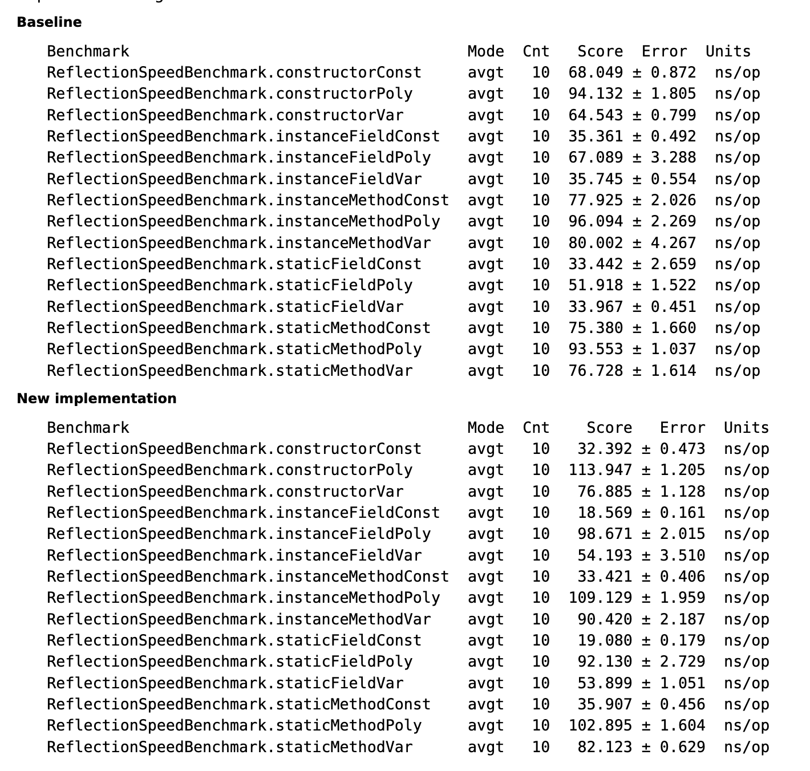

# Java18 新特性

Java 18 在 2022 年 3 月 22 日正式发布，非长期支持版本。

Java 18 带来了 9 个新特性：
- [JEP 400:UTF-8 by Default（默认字符集为 UTF-8）](https://openjdk.java.net/jeps/400)
- [JEP 408:Simple Web Server（简易的 Web 服务器）](https://openjdk.java.net/jeps/408)
- [JEP 413:Code Snippets in Java API Documentation（Java API 文档中的代码片段）](https://openjdk.java.net/jeps/413)
- [JEP 416:Reimplement Core Reflection with Method Handles（使用方法句柄重新实现反射核心）](https://openjdk.java.net/jeps/416)
- [JEP 417:Vector（向量） API（第三次孵化）](https://openjdk.java.net/jeps/417)
- [JEP 418:Internet-Address Resolution（互联网地址解析）SPI](https://openjdk.java.net/jeps/418)
- [JEP 419:Foreign Function & Memory API（外部函数和内存 API）（第二次孵化）](https://openjdk.java.net/jeps/419)
- [JEP 420:Pattern Matching for switch（switch 模式匹配）（第二次预览）](https://openjdk.java.net/jeps/420)
- [JEP 421:Deprecate Finalization for Removal](https://openjdk.java.net/jeps/421)

Java 17 中包含 14 个特性，Java 16 中包含 17 个特性，Java 15 中包含 14 个特性，Java 14 中包含 16 个特性。相比于前面发布的版本来说，Java 18 的新特性少了很多。

这里只对 400、408、413、416、417、418、419 这几个我觉得比较重要的新特性进行详细介绍。

相关阅读：
- [OpenJDK Java 18 文档](https://openjdk.java.net/projects/jdk/18/)
- [IntelliJ IDEA | Java 18 功能支持](https://mp.weixin.qq.com/s/PocFKR9z9u7-YCZHsrA5kQ)

## JEP 400:默认字符集为UTF-8

JDK 终于将 UTF-8 设置为默认字符集。

在 Java 17 及更早版本中，默认字符集是在 Java 虚拟机运行时才确定的，取决于不同的操作系统、区域设置等因素，因此存在潜在的风险。就比如说你在 Mac 上运行正常的一段打印文字到控制台的 Java 程序到了 Windows 上就会出现乱码，如果你不手动更改字符集的话。

## JEP 408:简易的Web服务器

Java 18 之后，你可以使用 `jwebserver` 命令启动一个简易的静态 Web 服务器。

```bash
jwebserver
Binding to loopback by default. For all interfaces use "-b 0.0.0.0" or "-b ::".
Serving /cwd and subdirectories on 127.0.0.1 port 8000
URL: http://127.0.0.1:8000/
```

这个服务器不支持 CGI 和 Servlet，只限于静态文件。

## JEP 413:优化Java API文档中的代码片段

在 Java 18 之前，如果我们想要在 Javadoc 中引入代码片段可以使用 `<pre>{@code ...}</pre>` 。

```java
<pre>{@code
    lines of source code
}</pre>
```

`<pre>{@code ...}</pre>` 这种方式生成的效果比较一般。

在 Java 18 之后，可以通过 `@snippet` 标签来做这件事情。

```java
/**
 * The following code shows how to use {@code Optional.isPresent}:
 * {@snippet :
 * if (v.isPresent()) {
 *     System.out.println("v: " + v.get());
 * }
 * }
 */
```

`@snippet` 这种方式生成的效果更好且使用起来更方便一些。

## JEP 416:使用方法句柄重新实现反射核心

Java 18 改进了 `java.lang.reflect.Method`、`Constructor` 的实现逻辑，使之性能更好，速度更快。这项改动不会改动相关 API ，这意味着开发中不需要改动反射相关代码，就可以体验到性能更好反射。

OpenJDK 官方给出了新老实现的反射性能基准测试结果。



## JEP 417:向量API（第三次孵化）

向量（Vector） API 最初由 [JEP 338](https://openjdk.java.net/jeps/338) 提出，并作为[孵化 API](http://openjdk.java.net/jeps/11)集成到 Java 16 中。第二轮孵化由 [JEP 414](https://openjdk.java.net/jeps/414) 提出并集成到 Java 17 中，第三轮孵化由 [JEP 417](https://openjdk.java.net/jeps/417) 提出并集成到 Java 18 中，第四轮由 [JEP 426](https://openjdk.java.net/jeps/426) 提出并集成到了 Java 19 中。

向量计算由对向量的一系列操作组成。向量 API 用来表达向量计算，该计算可以在运行时可靠地编译为支持的 CPU 架构上的最佳向量指令，从而实现优于等效标量计算的性能。

向量 API 的目标是为用户提供简洁易用且与平台无关的表达范围广泛的向量计算。

这是对数组元素的简单标量计算：

```java
void scalarComputation(float[] a, float[] b, float[] c) {
   for (int i = 0; i < a.length; i++) {
        c[i] = (a[i] * a[i] + b[i] * b[i]) * -1.0f;
   }
}
```

这是使用 Vector API 进行的等效向量计算：

```java
static final VectorSpecies<Float> SPECIES = FloatVector.SPECIES_PREFERRED;

void vectorComputation(float[] a, float[] b, float[] c) {
    int i = 0;
    int upperBound = SPECIES.loopBound(a.length);
    for (; i < upperBound; i += SPECIES.length()) {
        // FloatVector va, vb, vc;
        var va = FloatVector.fromArray(SPECIES, a, i);
        var vb = FloatVector.fromArray(SPECIES, b, i);
        var vc = va.mul(va)
                   .add(vb.mul(vb))
                   .neg();
        vc.intoArray(c, i);
    }
    for (; i < a.length; i++) {
        c[i] = (a[i] * a[i] + b[i] * b[i]) * -1.0f;
    }
}
```

在 JDK 18 中，向量 API 的性能得到了进一步的优化。

## JEP 418:互联网地址解析SPI

Java 18 定义了一个全新的 SPI（service-provider interface），用于主要名称和地址的解析，以便 `java.net.InetAddress` 可以使用平台之外的第三方解析器。

## JEP 419:Foreign Function & Memory API（第二次孵化）

Java 程序可以通过该 API 与 Java 运行时之外的代码和数据进行互操作。通过高效地调用外部函数（即 JVM 之外的代码）和安全地访问外部内存（即不受 JVM 管理的内存），该 API 使 Java 程序能够调用本机库并处理本机数据，而不会像 JNI 那样危险和脆弱。

外部函数和内存 API 在 Java 17 中进行了第一轮孵化，由 [JEP 412](https://openjdk.java.net/jeps/412) 提出。第二轮孵化由[JEP 419](https://openjdk.java.net/jeps/419) 提出并集成到了 Java 18 中，预览由 [JEP 424](https://openjdk.java.net/jeps/424) 提出并集成到了 Java 19 中。

在 [Java19 新特性](./Java19新特性) 中，我有详细介绍到外部函数和内存 API，这里就不再做额外的介绍了。